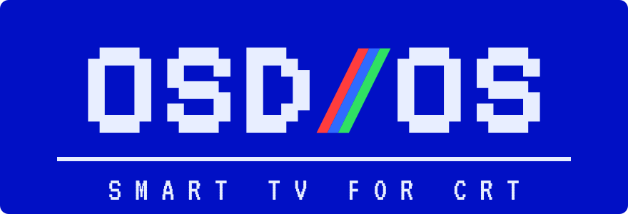
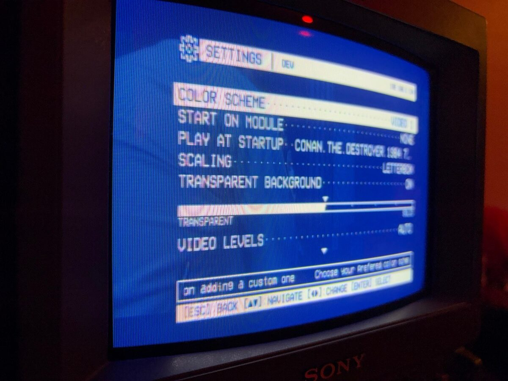
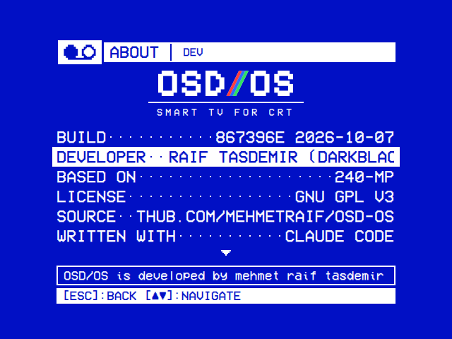

# OSD/OS

**Smart TV for CRT.** OSD/OS is an operating system for the [Raspberry Pi](https://github.com/anthonycaccese/240-MP/wiki/Hardware-Testing) that makes a TV, preferably a CRT, a smart TV with the look of a VCR: flash it to an SD card, plug the Pi into the TV, and it starts straight into OSD/OS, with nothing to log in to and no desktop to start it from. Every screen is drawn like a VCR's on-screen display, in two colours and large type, with menus laid out like a camcorder's. Everything works with the arrows, select and back, on a remote, a keyboard or a gamepad.

It grew out of [240-MP](https://github.com/anthonycaccese/240-MP), a retro VCR style frontend that runs as an app, and OSD/OS runs as one too, on Raspberry Pi OS, Steam OS (and other Linux x86_64 distros) or MacOS (ARM).

Playback experiences are handled via modules to enable new integrations without requiring major changes to the overall frontend. Try to think of each module as a different input on a VHS deck. There are 12 included modules currently: [Local Files](https://github.com/anthonycaccese/240-MP/wiki/Module:-Local-Files), [Plex](https://github.com/anthonycaccese/240-MP/wiki/Module:-Plex), [Jellyfin](https://github.com/anthonycaccese/240-MP/wiki/Module:-Jellyfin), Emby, Netflix, Prime Video, [YouTube](https://github.com/anthonycaccese/240-MP/wiki/Module:-YouTube), Playlists, [NFC Reader](https://github.com/anthonycaccese/240-MP/wiki/Module:-NFC-Reader), [Weather](https://github.com/anthonycaccese/240-MP/wiki/Module:-Weather), [Scripts](https://github.com/anthonycaccese/240-MP/wiki/Module:-Scripts) and a module similar to art/wallpaper modes on modern tvs called [Ambient:Mode](https://github.com/anthonycaccese/240-MP/wiki/Module:-Ambient-Mode).

It's built to work in conjunction with [MPV](https://github.com/anthonycaccese/240-MP/wiki/MPV) which will be installed (or updated) as a dependency during the [install](#install) steps.  Some modules (like YouTube and NFC Reader) have additional dependencies which are covered on their associated wiki pages under the "To Enable" sections.

## An operating system, not an app

240-MP is an app: it is installed on a system that is already set up, Raspberry Pi OS, Steam OS or macOS, and starts once that system has booted its own way, its splash, boot messages and login prompt or desktop included. The **OSD/OS** image ([os/README.md](os/README.md)) is the system itself:

- **It boots into OSD/OS.** No rainbow splash, no boot messages, no login prompt: from the moment the Pi is switched on the screen is OSD/OS's, starting with its own boot screen: the OSD/OS cassette, its reels turning and its tape winding from one onto the other while the system comes up under it, a line per service.
- **No desktop, no window manager, no file manager.** There is no display server (X11 or Wayland) and no compositor: OSD/OS draws straight to the screen through the kernel's display driver, and mpv plays straight to it too ([Nothing between the app and the screen](#nothing-between-the-app-and-the-screen)).
- **Every screen is OSD/OS's own.** The boot screen, the menus, the file browser (Local Files' tree), the on-screen keyboard, the info screens, Settings, Bluetooth pairing, updates, and quitting, restarting or switching off: all of it is drawn by OSD/OS, in its own letters, and worked with a remote. It hands the screen over only to what plays: mpv for a video, and Chromium, full screen with nothing around it, for Netflix and Prime Video, whose players only run in a browser (and to sign in to YouTube), or a script of yours that asks for the screen.
- **No needless background jobs.** The services Raspberry Pi OS keeps, Wi-Fi, Bluetooth, the local network and SSH (when enabled), wait until OSD/OS is on screen and then start one after another. The apt, man-db, e2scrub and dpkg-backup timers that wake the SD card at random times, mid-film included, are gone, as are cron and the Raspberry Pi Connect agent, and cloud-init runs on the first boot only.
- **Films on the card.** The card's free space is a partition of its own, in exFAT, which Windows and macOS open too: copy films onto it from a computer and Local Files plays them.
- **Linux underneath.** The image is Raspberry Pi OS Lite (64-bit), which is based on Debian 13 "trixie", built with Raspberry Pi's own image builder, pi-gen. The kernel, the firmware and the drivers are Raspberry Pi OS's, and OSD/OS adds one stage on top. What the image is made of, and under which licences, is in [os/NOTICE](os/NOTICE).

As an app ([Install](#install)), OSD/OS is the same on screen, on top of whatever the system around it runs.

## Highlights

- **One way to browse.** Local Files, Netflix, Prime Video and YouTube open as a horizontal tree. The folders you open run along a line across the screen, and every folder branches out to a few of its entries. Each starts with **Recently Watched**, **Favorites** and **Search**.
- **Search with the remote**, typed on an on-screen keyboard.
- **Info screens** for films and videos: the story, genre, director, cast and rating. One comes up when the cursor rests on a title (3 seconds by default), or straight away with ►.
- **Options** on any entry, with ►: add it to **Favorites**, have it **Play at Startup**, straight after the boot screen, where it was stopped or from the beginning (Settings → Startup From), without asking, or **Add to Playlist**.
- **Playlists** from several modules at once: Local Files, YouTube, Jellyfin and Emby videos on one list, played in order (on from where it stopped) or shuffled. An **online** playlist plays each video from where it lives. An **offline** one downloads every video to the device once, whatever lists it is on (on the OSD/OS image, into the card's OSD-OS partition), and plays without the network.
- **Transparent Background.** Back from a video returns to the menus while the video keeps playing behind them, like a deck's menu over the tape, and the first row of the main menu takes it back to full screen. A Local Files or YouTube video first opens a menu of its own over the picture: its module's settings for it, Favorites, Browse, and Close Video. A slider from TRANSPARENT to SOLID sets how much of it shows through: at SOLID none, while it plays on, sound and all. Select on the setting turns it off. It needs libmpv (`libmpv2` on Raspberry Pi OS, part of Homebrew's mpv on macOS).
- **Bluetooth** in Settings: search for a keyboard, gamepad or remote and pair it from the couch. A keyboard's pairing code comes up on screen, to type on it.
- **A mouse pointer** (a mouse, or a keyboard's touchpad) that shows while the mouse moves and hides again after 5 seconds (Settings → Mouse Pointer).
- **OSD Background** in Settings: the color scheme's background all over (Full), none, the menus on black like a deck's on-screen display (Off), or a framed window of it behind the menus, black around it (Window). Over a video behind the menus, a window lies over the picture, which shows whole around it.
- **A tape loading** while a video starts: VHS noise in the theme's colours and a dubbing deck's display, with where the video is and, once known, how long it is. Settings → Loading Effect turns the noise off.
- **Hint Bar** and **Help Line** in Settings: the key hints at the foot of every screen and the line about the selected row under a menu, each on or off once the keys are second nature.
- **About** in Settings: what OSD/OS is, who makes it, what it is made of and under which license, with the license's text to read on the device.
- **The logo** in a corner of the picture while a video plays, like a channel's: Settings → Channel Logo picks the corner, all four, or none. It is on the About page and on the boot screen's cassette too.
- **Scaling** for 16:9 pictures on a 4:3 screen: Letterbox, 14:9, Pan & Scan or Anamorphic. Set it for every module, or for one module in its own settings.
- **Netflix and Prime Video** catalogues from TMDB in the same tree. A title plays in the service's own player.
- **The OSD/OS image**, a Raspberry Pi OS Lite image that boots straight into OSD/OS and shows a VHS boot screen while its services come up.

## How it works

### Nothing between the app and the screen

On a desktop, OSD/OS and mpv are windows. They hand their frames to a compositor (labwc on Raspberry Pi OS), and the compositor holds the screen. A kiosk setup replaces the desktop with one full-screen window, but Xorg or cage still sits in between.

The OSD/OS image has no display server at all. OSD/OS draws through Qt's EGLFS platform straight to the kernel's KMS/DRM driver, the way Kodi does on LibreELEC. Only one program draws at a time (it holds the *DRM master*), so there are no windows to manage. `DisplayHandoff` gives the screen to whatever takes over and takes it back when that exits:

- mpv (`--vo=drm`) when a video plays
- a takeover script from the Scripts module
- Chromium, in `cage`, for Netflix and Prime Video, and for signing in to YouTube

With **Transparent Background**, mpv runs inside OSD/OS instead, as libmpv. OSD/OS then keeps the screen the whole time, draws the video as part of its own picture and lays its menus over it.

### On screen first at boot

A manual install starts OSD/OS last, once every service is up. The OSD/OS image turns that around: OSD/OS starts as soon as systemd reaches `basic.target`. Wi-Fi, Bluetooth, the local network and SSH (when enabled) wait for its first frame, then start one after another. The boot screen follows them until the network is online. The details are in [os/README.md](os/README.md).

### Inside the app

- At startup the shell (`AppCore`) finds the modules from their `modules/*/manifest.json`. Each module is a set of QML views, plus a C++ backend when it needs one.
- Keyboards, remotes and gamepads (through SDL2) all arrive as the same key events, so every screen works with the arrows, select and back.
- Playback goes through `MpvController`. mpv plays full screen on its own, or inside the app with Transparent Background.
- Settings are kept in `config.json`.

[ARCHITECTURE.md](ARCHITECTURE.md) has the rest.

## Screens

Every screen is the app itself, running at 640×480. The film entries are sample data.

<table>
<tr><th width="50%">Boot screen</th><th width="50%">Main menu</th></tr>
<tr><td></td><td></td></tr>
<tr><td>On the OSD/OS image, the OSD/OS cassette winds its tape from reel to reel while the services start, <code>[ OK ]</code> once each is up.</td><td>The modules, like the inputs on a deck.</td></tr>
</table>

<table>
<tr><th width="50%">File browser</th><th width="50%">Transparent Background</th></tr>
<tr><td></td><td></td></tr>
<tr><td>Local Files' tree: the open folders run along the line through the middle, and the one under the cursor branches out to what is in it.</td><td>Back from a video, the menus lie over it while it plays on. The first row takes it back to full screen.</td></tr>
</table>

<table>
<tr><th width="50%">Settings</th><th width="50%">About</th></tr>
<tr><td></td><td></td></tr>
<tr><td>Laid out like a camcorder's menu, each line's detail in the help line under it.</td><td>What OSD/OS is, who makes it, what it is made of and under which license.</td></tr>
</table>

Every other screen, from each module to the player's menus, playlists, the tape loading and Bluetooth pairing, is in the **[screen tour](docs/TOUR.md)**.

## Modules

### Ambient:Mode ([Wiki](https://github.com/anthonycaccese/240-MP/wiki/Module:-Ambient-Mode))
- Supported video file types: `"mp4", "mkv", "avi", "mov", "m4v", "webm", "wmv", "flv", "f4v", "mpg", "mpeg", "vob"`
- Playlist support for audio tracks using `m3u` and `m3u8` files
- Mix video with a different audio track
- Loops forever until you stop it

### Emby Module ([Wiki](https://github.com/anthonycaccese/240-MP/wiki/Module:-Emby))
- Supported library types: `movies, tvshows, homevideos, boxsets`
- Username / password authentication, or Emby Connect (emby.media cloud account, with server picker)
- Select specific libraries to display
- Continue Watching, Next Up and Resume Playback
- Autoplay next episode in a season (optional, off by default)
- Intro/Credit skip using the server's chapter markers (when detected)
- Collections support
- Select preferred audio/subtitle track before playback and switch tracks during playback
- Full library browsing by letter
- Show/Season browsing
- Video quality selection: Direct Playback (Default) or Transcode options

### Jellyfin ([Wiki](https://github.com/anthonycaccese/240-MP/wiki/Module:-Jellyfin))
- Supported library types: `movies, tvshows, homevideos, boxsets`
- "Quick Connect" authentication
- Select specific libraries to display
- Continue Watching, Next Up and Resume Playback
- Autoplay next episode in a season (optional, off by default)
- Collections support
- Select preferred audio/subtitle track before playback and switch tracks during playback
- Full library browsing by letter
- Show/Season browsing
- Video quality selection: Direct Playback (Default) or Transcode options

### Local Files ([Wiki](https://github.com/anthonycaccese/240-MP/wiki/Module:-Local-Files))
- Supported file types: `"mp4", "mkv", "avi", "mov", "m4v", "webm", "wmv", "flv", "f4v", "mpg", "mpeg", "vob"`
- On the OSD/OS image, films go on the SD card itself: its **OSD-OS** partition opens on Windows and macOS like a USB stick, and Local Files opens it ([os/README.md](os/README.md#films-on-the-card))
- Playlist support using `m3u` and `m3u8` files
- Folder browsing as a horizontal tree: the open folders run along a line across the screen, every folder in the current one branches off to a few of its own entries, and the folder under the cursor branches once more
- **Recently Watched**, **Favorites** and **Search** lead the tree: what you played last, what you marked (right on a file, then **Add to Favorites**), and file and folder names anywhere in the media folder, typed on an on-screen keyboard
- Loop playback
- Shuffle playback
- Playback history
- Switch audio/subtitle tracks during playback
- Back during a video opens its menu: subtitles, looping and Scaling, then Favorites, Play at Startup, Browse Local Files and Close Video. With Transparent Background it lies over the picture, which plays on: looping and Scaling change as it plays, and the subtitles reload it from where it is when you go back to it. Without, the video stops for the menu and starts again from where it was when you go back to it, with the settings as you left them

### Netflix and Prime Video
- Browse what the service carries in your country in the same tree as Local Files: **Recently Watched** and **Favorites** first, then **Search** (on an on-screen keyboard), **Movies** and **Series** by Popular and by genre, a page of titles at a time with **More…** at the end
- Select on a title plays it straight away in the service's own web player, full screen. It opens at the title's own page on the service where [Wikidata](https://www.wikidata.org) knows it (by its TMDB or IMDb id), and at the service's search for it otherwise. **Netflix Home** / **Prime Video Home** opens the service as it is. OSD/OS comes back when the player closes, with the tree as you left it
- The catalogue comes from [TMDB](https://www.themoviedb.org)'s API, which needs a free API key: put it (a v3 key or a v4 read access token) on the first line of `tmdb_api_key.txt` in the data folder. Each module's settings set the country and the language of the titles
- Neither service has an API for a front end like this one, and their streams are DRM-protected, so playback is the official site in Chromium with Widevine, not an OSD/OS view: use it with a keyboard (arrow keys move between titles) or a mouse
- A title's info screen (story, genre, director or creator, cast, rating) comes up when the cursor has rested on it for 3 seconds, or at once with right; Settings → **Info Screen** sets the seconds, or **Key** for right only, or **Off**
- Right on the info screen (or on the title, with the info screen off) offers its options: **Add to Favorites** or **Remove from Favorites**
- Come back by holding back (`[ESC]` / `[B]`) for two seconds, or by closing the browser (`Ctrl+W`)
- **Sign in** in its settings opens the service's sign-in page full screen, to sign in with a keyboard before you browse (a title you open asks too, while you aren't). Each keeps its sign-in between visits; **Sign out** forgets it
- Needs `chromium`, `libwidevinecdm0` and, without a desktop, `cage` and `wtype` (on Raspberry Pi OS: `sudo apt install chromium libwidevinecdm0 cage wtype`); the OSD/OS image has them. With `wtype`, holding back closes the browser the way `Ctrl+W` does, which keeps a sign-in made moments before: Chromium saves new cookies only every half minute, and stopping it outright loses them
- Off by default; enable them in Settings
- This product uses the TMDB API but is not endorsed or certified by TMDB. Which service carries a title where comes from [JustWatch](https://www.justwatch.com), through TMDB

### NFC Reader ([Wiki](https://github.com/anthonycaccese/240-MP/wiki/Module:-NFC-Reader))
- Start video playback via NFC cards
  - Supports the mapping of video paths, YouTube URLs and content from a Plex library
- Reader support:
  - `PN532 USB` — recommended. Needs no drivers or daemon on any platform, so it also works on immutable distros like SteamOS
  - `ACS ACR122U` and other PC/SC contactless readers — needs `pcscd` (see `scripts/setup-nfc-reader.sh`)
- Readers are detected automatically; no configuration needed
- Maps cards to videos via per-card text files in a `nfc_tags` data directory
- Tapping an unknown card auto-creates a stub tag file for it

### Playlists
- Lists of videos from Local Files, YouTube, Jellyfin and Emby together, played as one: **In Order**, carrying on from where the list stopped (it asks), or **Shuffle**, in a new order each time. **Play from Here** on a video starts there. mpv's display has ◄ ► for the previous and next video
- **Online** playlists play each video from where it lives: a file from Local Files, a YouTube video as the YouTube module plays it (its Advanced settings, through yt-dlp), a Jellyfin or Emby item streamed from its server
- **Offline** playlists play only what is on the device: Local Files' files as they are, and a copy of every other video, downloaded in the background into a **Playlists** folder in Local Files' folder (the **Download Folder** setting can name another). On OSD/OS image that is the card's OSD-OS partition. A video is downloaded once, whatever lists it is on, and deleted once no offline list has it
- YouTube videos download with yt-dlp in the YouTube module's resolution, codec and audio language (ffmpeg puts a video above 360p back together; the OSD/OS image has it). Jellyfin and Emby items download as their original file, where the server lets the user download (a user without the right shows **Not Allowed**)
- Add videos from inside the module (**Add Videos**: a tree of Local Files, YouTube, Jellyfin and Emby, with their libraries, shows and seasons), from a video's options in Local Files and YouTube (►, **Add to Playlist**), or with ► on **PLAY** on a Jellyfin or Emby item's page. A list can also be started from there (**New Online Playlist**, **New Offline Playlist**)
- Back during a video opens its menu: subtitles, looping and Scaling, then Browse Playlists and Close Video. With Transparent Background, the list plays on behind the menus and the main menu's first row takes it back
- Netflix and Prime Video play in the service's own player, so they can't go on a playlist

### Plex ([Wiki](https://github.com/anthonycaccese/240-MP/wiki/Module:-Plex))
- Supported library types: `Movies, TV Shows, Other Videos`
- Server switching
- User profile switching and auto sign in
- Select specific libraries to display
- Continue Watching and Resume
- Autoplay next episode in a season (optional, off by default)
- Write an NFC card for any movie, episode, season or show from its detail screen to use with the NFC Reader module
- Hub, Playlist, Collection and Category support
- Folder browsing — walk a library by its on-disk folder structure
- Movie editions
- Select preferred audio/subtitle track before playback and switch tracks during playback
- Full library browsing by letter
- Show/Season browsing
- Video quality selection: Direct Playback (Default) or Transcode options

### Scripts ([Wiki](https://github.com/anthonycaccese/240-MP/wiki/Module:-Scripts))
- Run your own `.sh` scripts from a folder, so OSD/OS can launch anything else on the machine (FieldStation42, RetroArch, `yt-dlp -U`, updates)
- Two run modes per script, set in its `.txt` file:
    - `console` — OSD/OS stays on screen and shows the script's output
    - `takeover` — the script gets the whole display, and OSD/OS returns when it exits
- A `.txt` file beside each script sets its display name and options; one is created for you automatically the first time a script is seen
- Mark a script as a favorite to put it on the main menu alongside the other modules (press play/pause on it in the list)
- Optionally auto-run one script when OSD/OS starts
- Off by default; enable it in Settings and point it at your scripts folder

### Weather ([Wiki](https://github.com/anthonycaccese/240-MP/wiki/Module:-Weather))
- Inspired by [WeatherStar 3000+](https://github.com/netbymatt/ws3kp) by netbymatt
- Integrates with Open-Meteo to provide weather forecasts for worldwide locations
- Integrates with NWS to provide current conditions for US locations
- For your main location it displays Current Conditions and Extended (3-day forecast)
- Can display forecast data for 6 additional locations
- Supports background music, US/Metric Units and 12-hour/24-hour time display

### YouTube ([Wiki](https://github.com/anthonycaccese/240-MP/wiki/Module:-YouTube))
- List content from YouTube RSS feeds and playback via mpv + yt-dl (no account needed)
- Browse it all in the same tree as Local Files: **Recently Watched**, **Favorites**, **Search**, **Subscriptions**, **Channels**, **Playlists** and **Watch Later**
- Search YouTube on an on-screen keyboard (through yt-dlp), twenty matches at a time with **More…** at the end
- View Subscriptions: Browse the latest videos from your configured channels as a reverse chronological list
- Browse videos by Channel, and by Playlist
- A video's info screen (channel, date, length, views, description), like the streaming catalogues'; right on it (or, with the info screen off, on the video) offers its options: add it to **Favorites**, or save it to a local **Watch Later** list
- **Recently Watched** is your local watch history
- Resume Playback
- **Advanced** in its settings holds the details:
    - **Playback Resolution**: 240p to 2160p. 480p, the default, suits a CRT and a Pi.
    - **Video Codec**: H.264 first, which a Pi decodes in hardware, or **Any** for whatever looks best (VP9 or AV1, needed above 1080p).
    - **Max Frame Rate**: Any, or 30 where a video also has 60.
    - **Scaling**.
    - **Audio Language**: the original track, or a dub where a video has one.
    - **Subtitles** in a **Subtitle Language**: Off, On, or With Auto for YouTube's automatic captions too.
    - **Playback Speed**: 0.75x to 2x.
    - **Resume Playback**, and whether to **Display Shorts** (on by default).
- Back during a video opens its menu: the Advanced settings for it, then Favorites, Play at Startup, Watch Later, Browse YouTube and Close Video. With Transparent Background it lies over the picture, which plays on: speed and Scaling change as it plays, and the others reload it from where it is when you go back to it. Without, the video stops for the menu and starts again from where it was when you go back to it, with the settings as you left them
- **Sign in** in its settings, if you want to, opens Google's sign-in page full screen in Chromium, to sign in with a keyboard. yt-dlp then searches and plays as that account, which YouTube asks for fewer bot checks and lets play age-restricted videos. **Sign out** forgets it
    - YouTube can block an account used through yt-dlp, as [yt-dlp's wiki](https://github.com/yt-dlp/yt-dlp/wiki/Extractors#youtube) warns, so sign in with a spare one
    - Needs Chromium, with `cage` and `wtype` without a desktop (see Netflix and Prime Video), or Google Chrome on a Mac
- Needs yt-dlp, and Deno for full YouTube support ([BUILDING.md](BUILDING.md)). The [OSD/OS](os/README.md) image comes with both and keeps yt-dlp up to date

## Install
- [On a Raspberry Pi](INSTALL.md#on-a-raspberry-pi)
- [On macOS (ARM)](INSTALL.md#on-macos-arm)
- [On SteamOS / Linux x86_64](INSTALL.md#on-steamos--linux-x86_64)

## Hardware Testing
- [Raspberry Pi 3B](https://github.com/anthonycaccese/240-MP/wiki/Hardware-Testing#raspberry-pi-3b)
- [Raspberry Pi 3B+](https://github.com/anthonycaccese/240-MP/wiki/Hardware-Testing#raspberry-pi-3b-1)
- [Raspberry Pi 4B](https://github.com/anthonycaccese/240-MP/wiki/Hardware-Testing#raspberry-pi-4b)
- [Raspberry Pi 5](https://github.com/anthonycaccese/240-MP/wiki/Hardware-Testing#raspberry-pi-5)
- [Steam Deck](https://github.com/anthonycaccese/240-MP/wiki/Hardware-Testing#steam-deck)

## FAQs

- Why didn't you use Kodi/LibreELEC/OSMC?
    - I've used all of those distros and they are all excellent but I also like making things and wanted something simpler without as many options.  Something that felt like a VCR from my youth.
- Should I use OSD/OS instead of Kodi/LibreELEC/OSMC?
    - I would recommend thinking about it like this...
    - All of those distros are amazing, feature rich, work across a ton of devices and have awesome supportive teams behind them.
    - I on the other hand am just one person making nostalgic things for my own niche use cases.
    - If those use cases match with what you're looking for, then OSD/OS is a bunch of fun and I'd be happy for you to try it.
    - Otherwise, the well known distros are spectacular and you should likely open those doors instead.
- Will this work on other Raspberry Pi models? (like the 5, 2 zero, etc...)
    - I've tested on the 4b, 3b+ and 3b. Other users have confimred the 5 works well too and all the details on what we've confimred can be found here: https://github.com/anthonycaccese/240-MP/wiki/Hardware-Testing
    - If its not on that list then the short answer is "we don't know but please feel free try and let us know if it works"
- Where does the name "OSD/OS" come from?
    - OSD is the on-screen display: the menu a VCR or a TV draws over the picture, which is all this app ever shows. OS because on a Raspberry Pi it can be the whole system ([os/README.md](os/README.md)).
    - It started as 240-MP. 240 had a double meaning referring to the longest [VHS tape length](https://en.wikipedia.org/wiki/VHS#Tape_lengths) and love for [CRT TVs](https://consolemods.org/wiki/CRT:What_is_240p%3F) as a display type, and MP a double meaning of "Media Player" and a play on the "SP/LP/EP/SLP" terminology that was used to refer to the recording quality for VHS recordings. OSD/OS takes over what 240-MP set up: on its first start it moves 240-MP's data folder, with its settings, lists and NFC cards, over to its own; the installer replaces a 240-MP install; and scripts and launch settings under the old names (`MP240_…`) still work.
- Does it output at 240p resolution?
    - The UI scales based on the OS config and output cables you are using.
    - For example: the output resolution for the menu and video playback when using it on a CRT with the configs I use is 480i/576i
- Does OSD/OS support RGB out instead of composite?
    - Installed on your own Raspberry Pi OS, OSD/OS is just an app on top of an already configured Operating System. If you are able to configure that OS to output over RGB then OSD/OS will simply scale and display to that output when it boots up as well.
    - If you have a combination of RGB out + OS configuration that works well then please add a comment here with your set up details: https://github.com/anthonycaccese/240-MP/discussions/44
- Does OSD/OS work over HDMI on a modern television too?
    - Yes! The UI was built to scale on modern televisions over HDMI as well.
    - Please make sure you use the config.txt I provide for HDMI and it will output at the proper resolution for a modern tv.
- Does OSD/OS support bluetooth keyboards/remotes/controllers?
    - Yes. On Linux (a Raspberry Pi included) pair them in Settings → Bluetooth: SEARCH, then select the device. A keyboard shows a code on screen to type on it. Once paired, a device comes back by itself after a restart, and OSD/OS sees it as it would a USB one.
    - On a Mac, pair them in the Mac's own Bluetooth settings.

## Credits & Acknowledgments

Settings → About lists these credits on the device.

- OSD/OS is developed by mehmet raif tasdemir (darkBLACK), [github.com/mehmetraif](https://github.com/mehmetraif).
- It is a modified version of [240-MP](https://github.com/anthonycaccese/240-MP) by Anthony Caccese and its contributors: the app it all started from.
- OSD/OS's changes to 240-MP were written with [Claude Code](https://www.anthropic.com/claude-code), Anthropic's coding agent.
- The OSD/OS logo, the channel logo over the picture and the boot screen's cassette were made with [ChatGPT](https://chatgpt.com), OpenAI's assistant.
- 240-MP was made the same way. In Anthony's words, from its README: "Because this is a hobby project (and a fairly niche use case), I am using [Claude Code](https://www.anthropic.com/product/claude-code) to build a large part of the backend C++ code and structure the modules. If you have concerns with that, I am glad to talk through it. Also, please feel free to fork this repo, update any aspects and tailor things to your own use case; that's why the source is fully open and available."
- The `VCR OSD Mono` font was created by Riciery Santos Leal (a.k.a. mrmanet) https://www.dafont.com/vcr-osd-mono.font
- The `Unifont` font (used as a fallback for characters that VCR OSD Mono does not cover) is GNU Unifont by Roman Czyborra, Paul Hardy, et al., licensed under the SIL Open Font License v1.1. https://unifoundry.com/unifont/ — license text: [assets/fonts/LICENSE-unifont.txt](assets/fonts/LICENSE-unifont.txt)
- Thank you to Plex, Jellyfin, Emby and Open-Meteo for providing open and free apis to enable building modules for each, and to [TMDB](https://www.themoviedb.org), [JustWatch](https://www.justwatch.com) and [Wikidata](https://www.wikidata.org) for the catalogues behind Netflix and Prime Video. This product uses the TMDB API but is not endorsed or certified by TMDB. Weather data by [Open-Meteo.com](https://open-meteo.com), under [CC BY 4.0](https://creativecommons.org/licenses/by/4.0/).
- Thank you to [the MPV team](https://mpv.io/) for a simple, extensible and cross platform media player, and to [Qt](https://www.qt.io), [SDL](https://www.libsdl.org), [FFmpeg](https://ffmpeg.org), [yt-dlp](https://github.com/yt-dlp/yt-dlp), [Deno](https://deno.com) and [Chromium](https://www.chromium.org), which OSD/OS stands on.
- Thank you to [Raspberry Pi](https://www.raspberrypi.com) for the boards, and for Raspberry Pi OS and [pi-gen](https://github.com/RPi-Distro/pi-gen), which the OSD/OS image is built with, and to [Debian](https://www.debian.org), which Raspberry Pi OS is based on. What the image carries, under which licences, is in [os/NOTICE](os/NOTICE).
- And from 240-MP's README, Anthony's thanks to the [Raspberry Pi Foundation](https://www.raspberrypi.org/) "for helping me fill a drawer with SBCs to tinker with and inspire fun ideas like this project ❤️"

## License

OSD/OS is free software under the GNU General Public License v3.0. See [LICENSE](LICENSE) for the full text; every build carries it next to the app, and Settings → About → License shows it on the device, with the notice.

OSD/OS is a modified version of [240-MP](https://github.com/anthonycaccese/240-MP), Copyright (C) 2026 Anthony Caccese and the 240-MP contributors. The modifications, from 2026 on, are Copyright (C) 2026 mehmet raif tasdemir (darkBLACK). The whole stays under GPL-3.0.

You are free to use, study, and modify this code. If you distribute a modified version, you must also distribute it under GPL-3.0 and make the source available.

The OSD/OS image carries Raspberry Pi OS Lite and the software OSD/OS needs alongside it, each under its own licence: [os/NOTICE](os/NOTICE) lists them, and the image has it as `/usr/share/doc/osdos/NOTICE`.

Raspberry Pi is a trademark of Raspberry Pi Ltd, and Debian a registered trademark of Software in the Public Interest, Inc. Netflix, Prime Video, YouTube, Plex, Jellyfin and Emby are their owners' trademarks, named for the services the modules reach. OSD/OS is not affiliated with or endorsed by any of them.

## 240-MP

OSD/OS grew out of [240-MP](https://github.com/anthonycaccese/240-MP), Anthony Caccese's VCR-style frontend for CRTs. Its own pictures show where it started, before the menus above:

- Photos of 240-MP on a CRT: [the picture that headed its README](https://github.com/user-attachments/assets/73c3e46f-a74a-4d96-9c4f-ae30f28378be), [module selection](https://github.com/user-attachments/assets/9472d55a-4617-4a7f-80c4-32aa28494048), [an item's page](https://github.com/user-attachments/assets/4f7d8230-860a-4ace-9370-9f59f43289c0), [the resume option](https://github.com/user-attachments/assets/490e9ebd-fab2-4fd1-9959-35ebb619eff0), [playback](https://github.com/user-attachments/assets/a3c768c7-6ede-4cdf-9d03-90aee7b8cdfb) and [settings](https://github.com/user-attachments/assets/0fd48977-8776-4334-b34e-d12256f23b97).
- Its video overview, on YouTube: https://youtu.be/r-gylGDoELY
