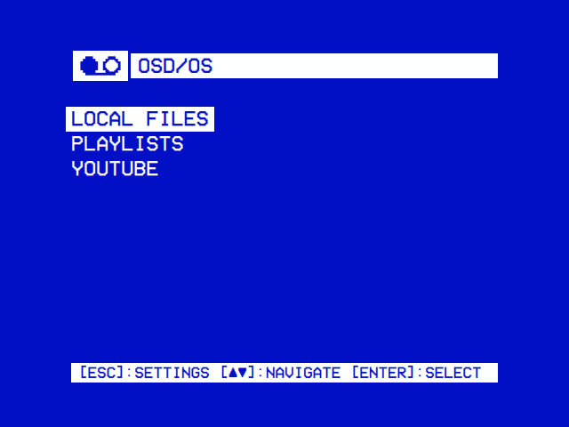

# OSD/OS

**Smart TV for CRT.** OSD/OS makes a TV, preferably a CRT, a smart TV with the look of a VCR. Flash it to an SD card, plug the Raspberry Pi into the TV, and it starts straight into OSD/OS: nothing to log in to, no desktop. Every screen is drawn like a VCR's on-screen display, in two colors and large type, and works with the arrows, select and back on a remote, a keyboard or a gamepad.

Out of the box it is plain on purpose, as above: two colors, and nothing moving but the cursor. If you want more, a theme changes the whole look at once, with effects, transitions between windows and music of its own, from a tube's curved glass to Matrix rain and a fire under the window. Eight come with it:

<table>
<tr>
<td width="25%"></td>
<td width="25%"></td>
<td width="25%"></td>
<td width="25%"></td>
</tr>
<tr><td align="center">Trinitron</td><td align="center">Matrix</td><td align="center">Inferno</td><td align="center">Demoscene</td></tr>
<tr>
<td></td>
<td></td>
<td></td>
<td></td>
</tr>
<tr><td align="center">Late Show</td><td align="center">Green Screen</td><td align="center">Arcade</td><td align="center">Winter</td></tr>
</table>

## What it does

- **Your videos in one place**: films on the SD card or a USB drive, Plex, Jellyfin, Emby, YouTube, Netflix and Prime Video, each a module, like the inputs on a deck.
- **One way to browse**: a horizontal tree that starts with Recently Watched, Favorites and Search, typed on an on-screen keyboard.
- **Playlists** across modules, streamed, or downloaded to play without the network.
- **Transparent Background**: back from a video, the menus lie over it while it plays on.
- **Themes**, the whole look at once: the colors, the skin, effects like the ones above and the menu music. Eight come with it, and a new one is a folder.
- **Made for old TVs**: composite, SCART RGB or HDMI from Settings, 16:9 films fitted to 4:3, a channel logo in the corner, and a tape loading while a video starts.
- **And more**: a fireplace on a loop (Ambient:Mode), a 90s weather channel, NFC cards that play a film when they touch the reader, and anything a shell script can start.

The [feature list](https://github.com/mehmetraif/OSD-OS/wiki/Features) has the rest.

## Get it

- **The OSD/OS image**, the whole system for a Raspberry Pi: download `OSD-OS-<version>-raspberry-pi.img.xz` from the [latest release](https://github.com/mehmetraif/OSD-OS/releases/latest) and [flash it](os/README.md#flashing). OSD/OS is on screen from the moment the Pi is switched on, and films go on the card's own partition.
- **As an app** on [Raspberry Pi OS](INSTALL.md#on-a-raspberry-pi), [macOS (ARM)](INSTALL.md#on-macos-arm) or [SteamOS and other Linux x86_64](INSTALL.md#on-steamos--linux-x86_64).

Tested on a Raspberry Pi 4 and a Raspberry Pi 5 (8 GB). On another board? Tell us how it went in an [issue](https://github.com/mehmetraif/OSD-OS/issues).

## Learn more

- **[The wiki](https://github.com/mehmetraif/OSD-OS/wiki)**, all of it in detail: [installing](https://github.com/mehmetraif/OSD-OS/wiki/Installation) and [using it](https://github.com/mehmetraif/OSD-OS/wiki/Using-OSD-OS), [every setting](https://github.com/mehmetraif/OSD-OS/wiki/Settings), [the OSD/OS image](https://github.com/mehmetraif/OSD-OS/wiki/The-OSD-OS-Image), the [display](https://github.com/mehmetraif/OSD-OS/wiki/Display-Output) and [audio](https://github.com/mehmetraif/OSD-OS/wiki/Audio-Output) outputs, the [modules](https://github.com/mehmetraif/OSD-OS/wiki/Modules), [themes](https://github.com/mehmetraif/OSD-OS/wiki/Themes), [effects](https://github.com/mehmetraif/OSD-OS/wiki/Effects), [menu music](https://github.com/mehmetraif/OSD-OS/wiki/Menu-Music) and [skins](https://github.com/mehmetraif/OSD-OS/wiki/Skins), [troubleshooting](https://github.com/mehmetraif/OSD-OS/wiki/Troubleshooting) and the [FAQ](https://github.com/mehmetraif/OSD-OS/wiki/FAQ).
- **[The screen tour](docs/TOUR.md)**: every screen, module by module.
- **For developers**: [how it works](https://github.com/mehmetraif/OSD-OS/wiki/How-It-Works), [writing a module](https://github.com/mehmetraif/OSD-OS/wiki/Writing-a-Module), [building](BUILDING.md), [architecture](ARCHITECTURE.md) and [contributing](CONTRIBUTING.md).

## Credits and license

OSD/OS is developed by mehmet raif tasdemir (darkBLACK). It is a modified version of [240-MP](https://github.com/anthonycaccese/240-MP) by Anthony Caccese and its contributors, the app it all started from. Its changes were written with [Claude Code](https://www.anthropic.com/claude-code), and its logos and the boot screen's cassette were made with [ChatGPT](https://chatgpt.com). Everyone else it stands on is in the [credits](https://github.com/mehmetraif/OSD-OS/wiki/Credits), and in Settings → About on the device.

OSD/OS is free software under the [GNU General Public License v3.0](LICENSE). 240-MP is Copyright (C) 2026 Anthony Caccese and the 240-MP contributors; the modifications, from 2026 on, are Copyright (C) 2026 mehmet raif tasdemir (darkBLACK). The OSD/OS image's other software, each under its own licence, is listed in [os/NOTICE](os/NOTICE). Raspberry Pi, Netflix, Prime Video, YouTube, Plex, Jellyfin and Emby are their owners' trademarks; OSD/OS is not affiliated with or endorsed by any of them.
