# 240-MP

240-MP is a retro VCR style frontend to play content on [Raspberry Pi](https://github.com/anthonycaccese/240-MP/wiki/Hardware-Testing) (preferably hooked up to a CRT TV), Steam OS (and other Linux x86_64 distros) or MacOS (ARM). Every screen is drawn like a VCR's on-screen display, in two colours and large type, with menus laid out like a camcorder's. Everything works with the arrows, select and back, on a remote, a keyboard or a gamepad.

Playback experiences are handled via modules to enable new integrations without requiring major changes to the overall frontend. Try to think of each module as a different input on a VHS deck. There are 11 included modules currently: [Local Files](https://github.com/anthonycaccese/240-MP/wiki/Module:-Local-Files), [Plex](https://github.com/anthonycaccese/240-MP/wiki/Module:-Plex), [Jellyfin](https://github.com/anthonycaccese/240-MP/wiki/Module:-Jellyfin), Emby, Netflix, Prime Video, [YouTube](https://github.com/anthonycaccese/240-MP/wiki/Module:-YouTube), [NFC Reader](https://github.com/anthonycaccese/240-MP/wiki/Module:-NFC-Reader), [Weather](https://github.com/anthonycaccese/240-MP/wiki/Module:-Weather), [Scripts](https://github.com/anthonycaccese/240-MP/wiki/Module:-Scripts) and a module similar to art/wallpaper modes on modern tvs called [Ambient:Mode](https://github.com/anthonycaccese/240-MP/wiki/Module:-Ambient-Mode).

It's built to work in conjunction with [MPV](https://github.com/anthonycaccese/240-MP/wiki/MPV) which will be installed (or updated) as a dependency during the [install](#install) steps.  Some modules (like YouTube and NFC Reader) have additional dependencies which are covered on their associated wiki pages under the "To Enable" sections.

On a Raspberry Pi, 240-MP can also be the whole system. The **240-MP OS** image ([os/README.md](os/README.md)) boots straight into it, with no desktop, display server or window manager in between.

## Highlights

- **One way to browse.** Local Files, Netflix, Prime Video and YouTube open as a horizontal tree. The folders you open run along a line across the screen, and every folder branches out to a few of its entries. Each starts with **Recently Watched**, **Favorites** and **Search**.
- **Search with the remote**, typed on an on-screen keyboard.
- **Info screens** for films and videos: the story, genre, director, cast and rating. One comes up when the cursor rests on a title (3 seconds by default), or straight away with ►.
- **Options** on any entry, with ►: add it to **Favorites**, or have it **Play at Startup**, straight after the boot screen.
- **Transparent Background.** Back from a video returns to the menus while the video keeps playing behind them, like a deck's menu over the tape. A slider from TRANSPARENT to SOLID sets how much of it shows through. It needs libmpv (`libmpv2` on Raspberry Pi OS, part of Homebrew's mpv on macOS).
- **Scaling** for 16:9 pictures on a 4:3 screen: Letterbox, 14:9, Pan & Scan or Anamorphic. Set it for every module, or for one module in its own settings.
- **Netflix and Prime Video** catalogues from TMDB in the same tree. A title plays in the service's own player.
- **240-MP OS**, a Raspberry Pi OS Lite image that boots straight into 240-MP and shows a VHS boot screen while its services come up.

## How it works

### Nothing between the app and the screen

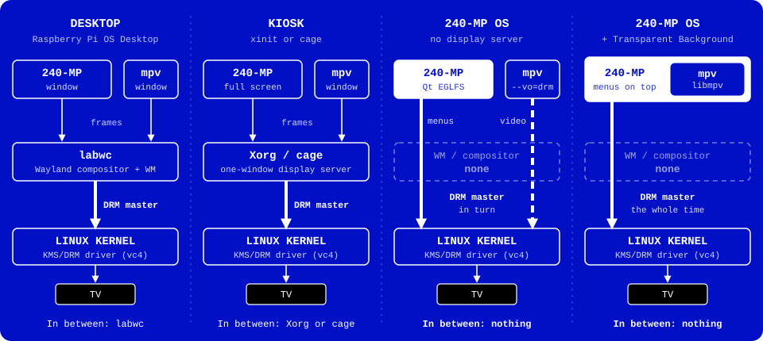

On a desktop, 240-MP and mpv are windows. They hand their frames to a compositor (labwc on Raspberry Pi OS), and the compositor holds the screen. A kiosk setup replaces the desktop with one full-screen window, but Xorg or cage still sits in between.

240-MP OS has no display server at all. 240-MP draws through Qt's EGLFS platform straight to the kernel's KMS/DRM driver, the way Kodi does on LibreELEC. Only one program draws at a time (it holds the *DRM master*), so there are no windows to manage. `DisplayHandoff` gives the screen to whatever takes over and takes it back when that exits:

- mpv (`--vo=drm`) when a video plays
- a takeover script from the Scripts module
- Chromium, in `cage`, for Netflix and Prime Video, and for signing in to YouTube

With **Transparent Background**, mpv runs inside 240-MP instead, as libmpv. 240-MP then keeps the screen the whole time, draws the video as part of its own picture and lays its menus over it.

### On screen first at boot

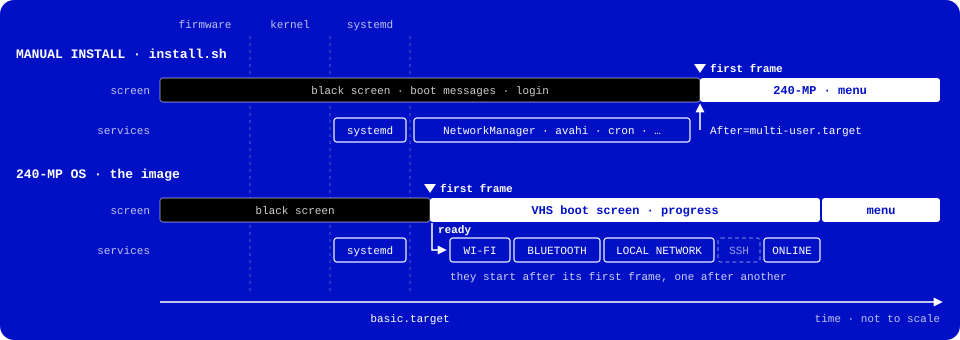

A manual install starts 240-MP last, once every service is up. 240-MP OS turns that around: 240-MP starts as soon as systemd reaches `basic.target`. Wi-Fi, Bluetooth, the local network and SSH (when enabled) wait for its first frame, then start one after another. The boot screen follows them until the network is online. The details are in [os/README.md](os/README.md).

### Inside the app

- At startup the shell (`AppCore`) finds the modules from their `modules/*/manifest.json`. Each module is a set of QML views, plus a C++ backend when it needs one.
- Keyboards, remotes and gamepads (through SDL2) all arrive as the same key events, so every screen works with the arrows, select and back.
- Playback goes through `MpvController`. mpv plays full screen on its own, or inside the app with Transparent Background.
- Settings are kept in `config.json`.

[ARCHITECTURE.md](ARCHITECTURE.md) has the rest.

## Tour

Every screen below is the app itself, running at 640×480. The film and YouTube entries are sample data; the weather is real.

### Starting and stopping

<table>
<tr><th width="33%">Boot screen</th><th width="33%">Main menu</th><th width="33%">Quit</th></tr>
<tr><td>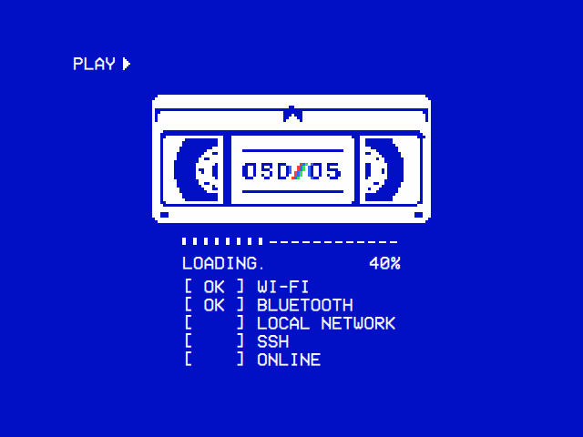</td><td>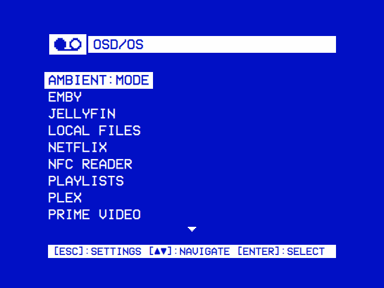</td><td>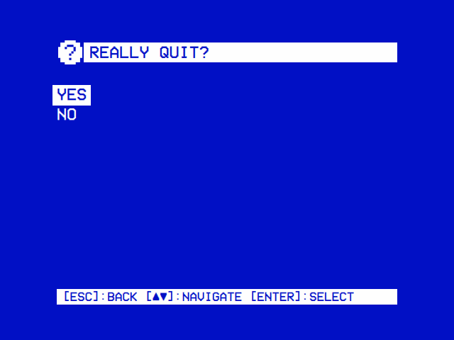</td></tr>
<tr><td>On 240-MP OS, a cassette winds its tape from reel to reel while the services start, <code>[ OK ]</code> once each is up. It closes by itself when the last one has settled.</td><td>The modules, like the inputs on a deck. Select opens one; back opens Settings.</td><td>Settings → Quit. When 240-MP starts with the system, it offers Power Off or Exit to Terminal instead.</td></tr>
</table>

### Local Files

<table>
<tr><th width="50%">Recently Watched</th><th width="50%">Favorites</th></tr>
<tr><td>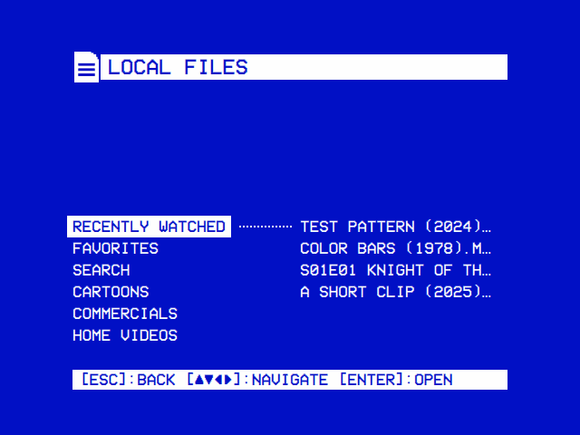</td><td>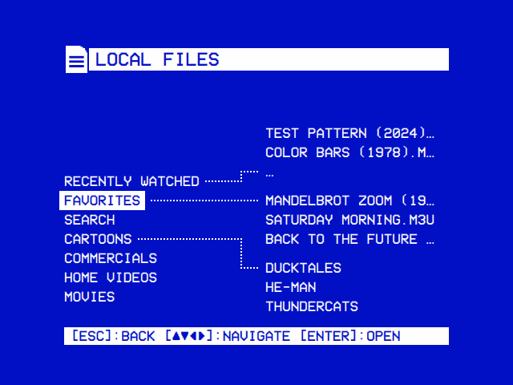</td></tr>
<tr><td>The tree opens on what you played last, then Favorites, Search and your folders. The entry under the cursor branches out to its first few items.</td><td>Files, folders and playlists you marked from their options.</td></tr>
</table>

<table>
<tr><th width="50%">Folders</th><th width="50%">Search</th></tr>
<tr><td>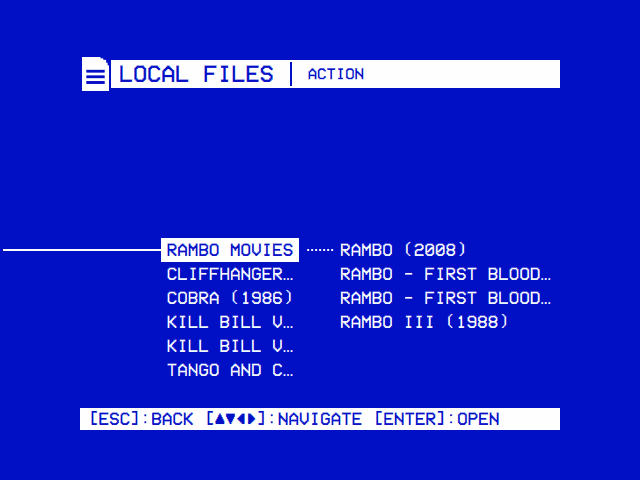</td><td>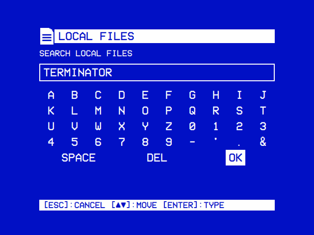</td></tr>
<tr><td>The open folders run along the line through the middle. The folder under the cursor branches out once more: TV Shows › Twin Peaks › its seasons › their episodes.</td><td>An on-screen keyboard: the arrows move, select types.</td></tr>
</table>

<table>
<tr><th width="50%">Search results</th><th width="50%">Options</th></tr>
<tr><td>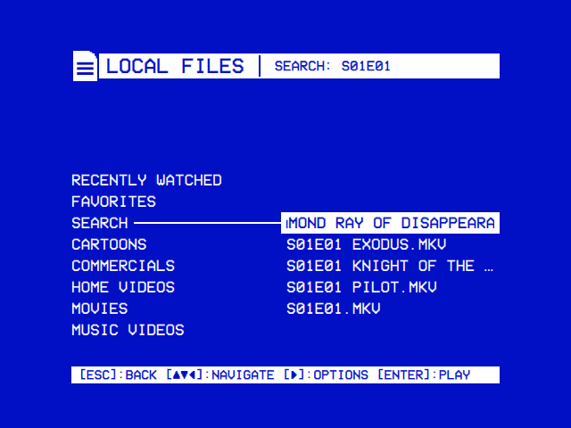</td><td>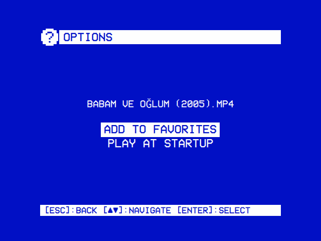</td></tr>
<tr><td>Names that match anywhere under the media folder.</td><td>► on any entry: Add to Favorites (or Remove), and Play at Startup.</td></tr>
</table>

### Playing

<table>
<tr><th width="50%">Resume</th><th width="50%">Playback menu</th></tr>
<tr><td>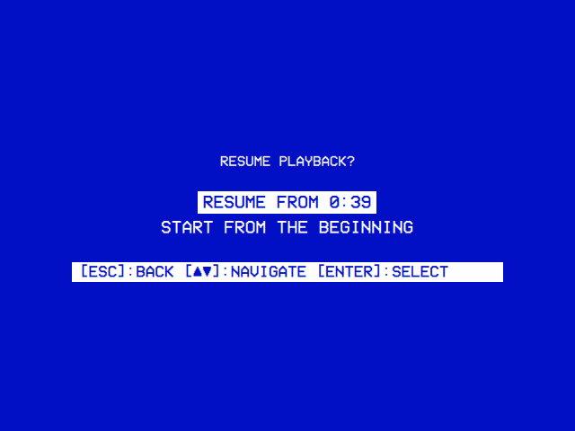</td><td>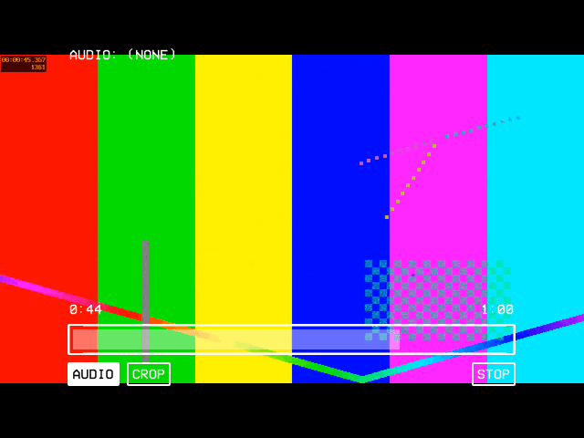</td></tr>
<tr><td>Pick up where you left off, or start from the beginning.</td><td>▲ or ▼ during playback opens the deck's menu: the position bar, audio and subtitle tracks, crop and stop.</td></tr>
</table>

<table>
<tr><th width="50%">Back to the menus</th><th width="50%">Main menu</th></tr>
<tr><td>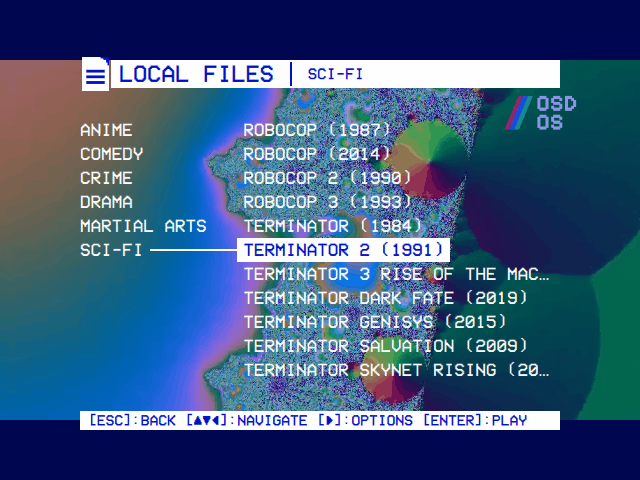</td><td>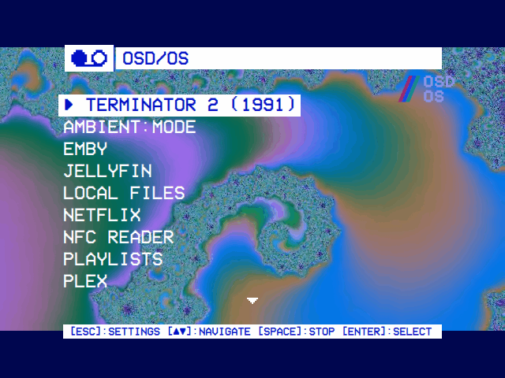</td></tr>
<tr><td>With Transparent Background, back returns to the menus and the video plays on behind them, here at 40% solid. Choose it again to watch it full screen from where it is.</td><td>Play/pause on the main menu stops it (<code>[SPACE]:STOP</code>). Playing anything else replaces it.</td></tr>
</table>

### Netflix, Prime Video and YouTube

<table>
<tr><th width="50%">Netflix</th><th width="50%">Movies › Popular</th></tr>
<tr><td>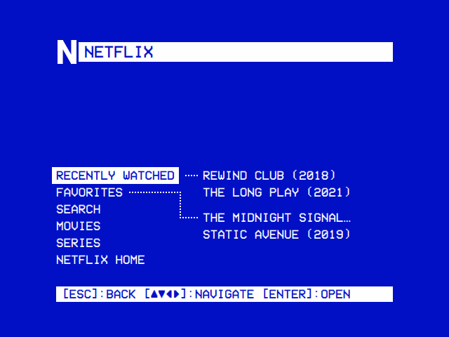</td><td>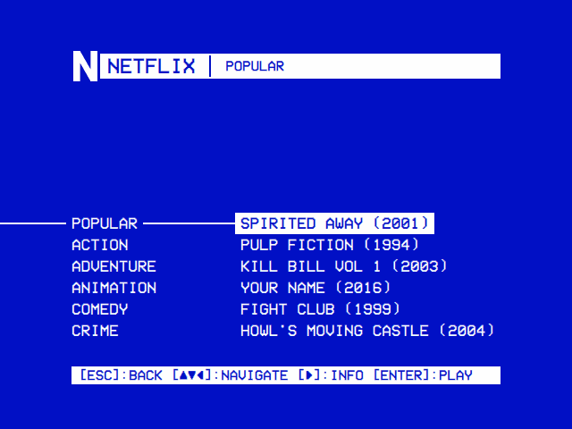</td></tr>
<tr><td>Recently Watched, Favorites, Search, then Movies and Series, and the service's own home page.</td><td>Popular, then each genre, a page of titles at a time.</td></tr>
</table>

<table>
<tr><th width="50%">Info screen</th><th width="50%">Playing on Netflix</th></tr>
<tr><td>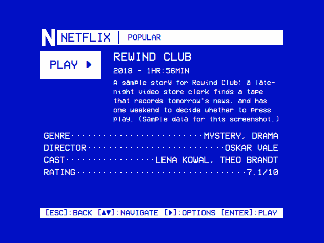</td><td>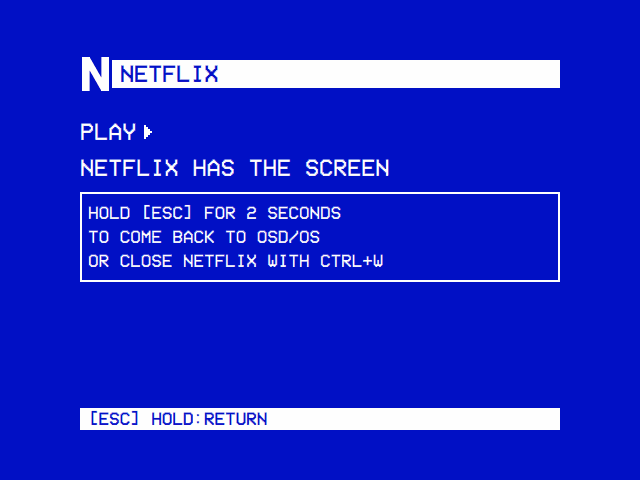</td></tr>
<tr><td>Story, genre, director, cast and rating, from TMDB. Select plays the title; ► offers its options.</td><td>The service's own player, in Chromium, has the screen. Hold back for two seconds to come back.</td></tr>
</table>

<table>
<tr><th width="50%">Prime Video</th><th width="50%">YouTube</th></tr>
<tr><td>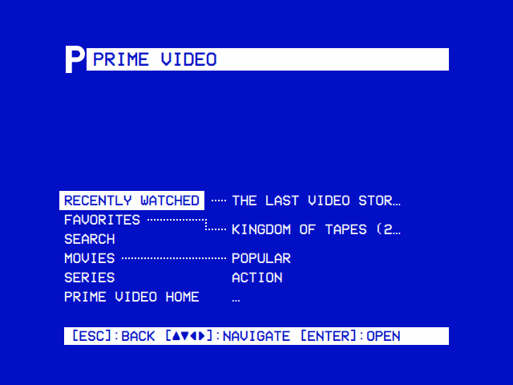</td><td>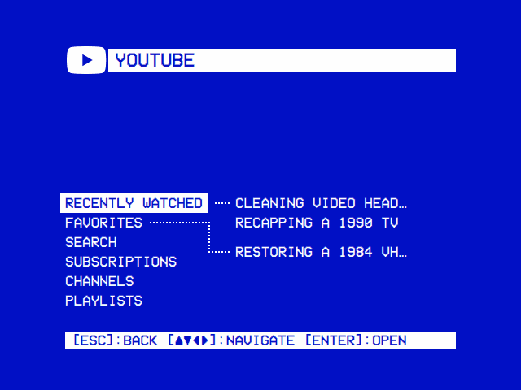</td></tr>
<tr><td>The same tree, for Prime Video.</td><td>Recently Watched, Favorites, Search, Subscriptions, Channels, Playlists and Watch Later.</td></tr>
</table>

<table>
<tr><th width="50%">Subscriptions</th><th width="50%">A video's info screen</th></tr>
<tr><td>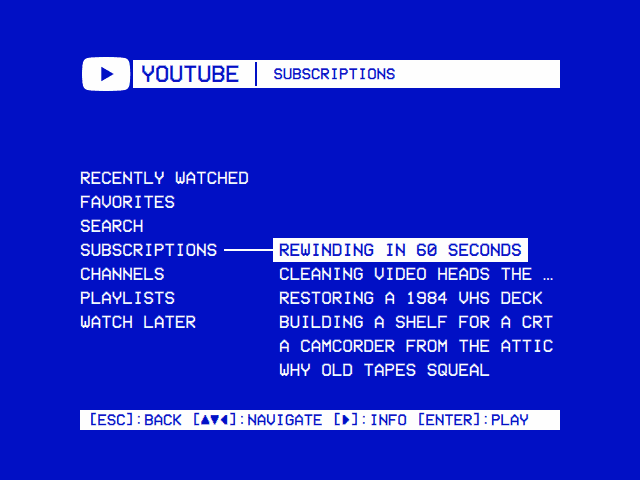</td><td>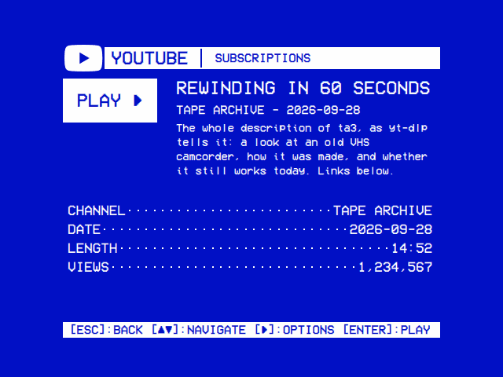</td></tr>
<tr><td>The latest videos from your channels, newest first.</td><td>Channel, date, length, views and description.</td></tr>
</table>

### Plex, Jellyfin and Emby

<table>
<tr><th width="33%">Plex</th><th width="33%">Jellyfin</th><th width="33%">Emby</th></tr>
<tr><td>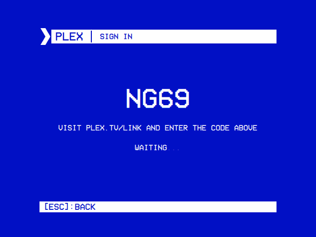</td><td>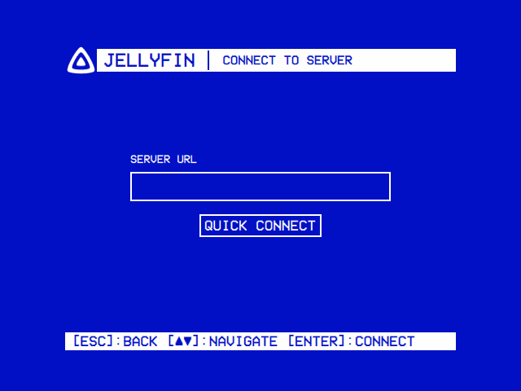</td><td>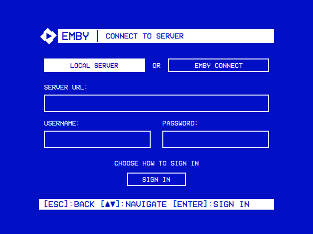</td></tr>
<tr><td>Sign in with a code at plex.tv/link.</td><td>Connect to a server with Quick Connect.</td><td>A server on your network, or Emby Connect.</td></tr>
</table>

Once signed in, each opens on the server's Continue Watching and its libraries. See [Modules](#modules) for everything they do.

### Weather, Ambient:Mode, NFC Reader and Scripts

<table>
<tr><th width="50%">Weather</th><th width="50%">Extended forecast</th></tr>
<tr><td>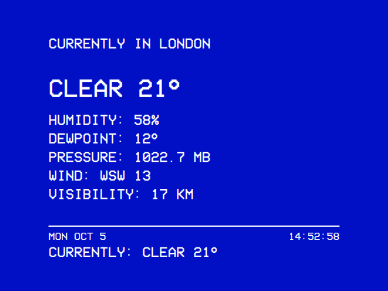</td><td>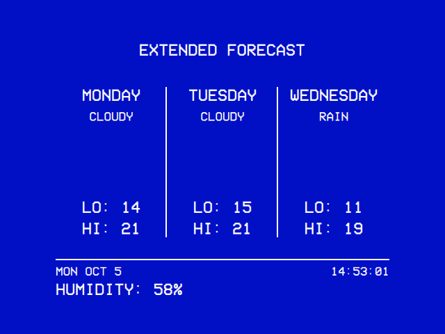</td></tr>
<tr><td>In the style of WeatherStar 3000+: current conditions…</td><td>…the extended forecast and an almanac, in turn.</td></tr>
</table>

<table>
<tr><th width="50%">Ambient:Mode</th><th width="50%">NFC Reader</th></tr>
<tr><td>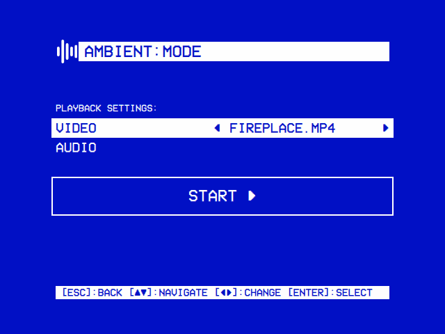</td><td>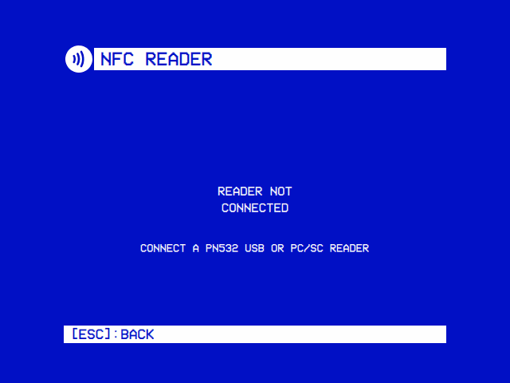</td></tr>
<tr><td>A video, with music of your choice, on a loop.</td><td>Tap a card to play the video it is mapped to.</td></tr>
</table>

<table>
<tr><th width="50%">Scripts</th><th width="50%">A console script</th></tr>
<tr><td>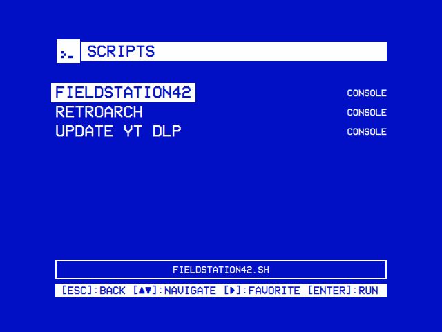</td><td>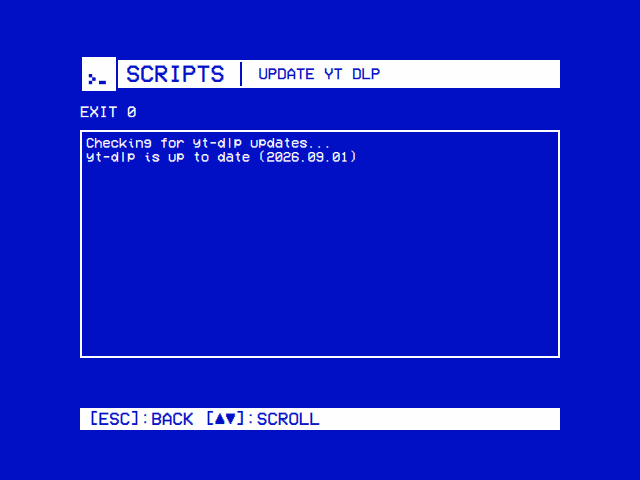</td></tr>
<tr><td>Your own shell scripts. ► puts one on the main menu.</td><td>A console script shows its output. A takeover script gets the whole screen until it exits.</td></tr>
</table>

### Settings

<table>
<tr><th width="50%">Settings</th><th width="50%">Modules</th></tr>
<tr><td>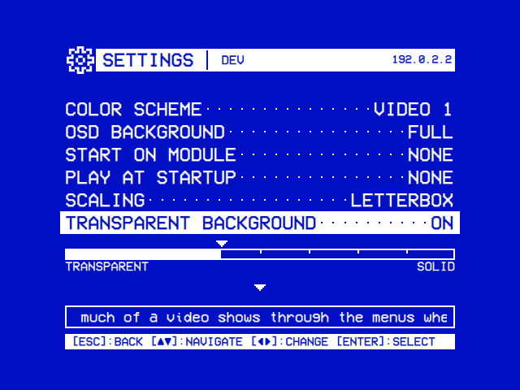</td><td>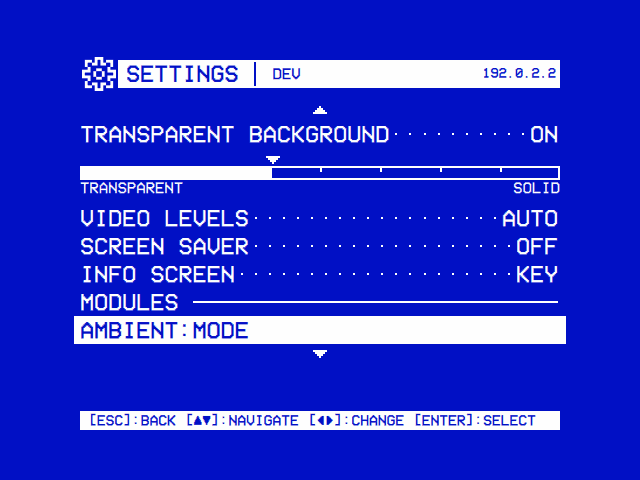</td></tr>
<tr><td>Laid out like a camcorder's menu. Transparent Background is a slider, the deck's tape bar, from TRANSPARENT to SOLID.</td><td>Each module is turned on and set up from here.</td></tr>
</table>

<table>
<tr><th width="50%">A module's settings</th><th width="50%">Picking a folder</th></tr>
<tr><td>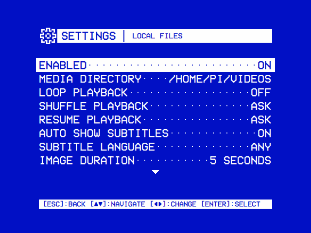</td><td>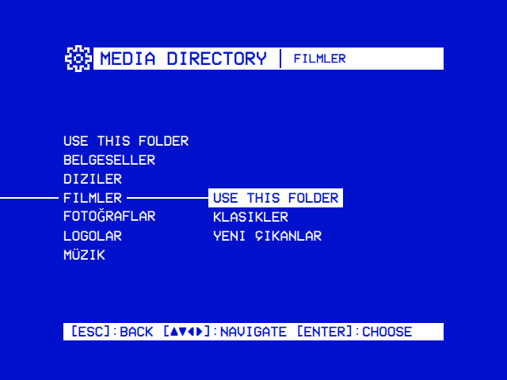</td></tr>
<tr><td>Local Files: its folder, looping, shuffle, resume, subtitles, and its own Scaling.</td><td>Folders are picked by browsing to them.</td></tr>
</table>

<table>
<tr><th width="50%">Controls</th><th width="50%">Update</th></tr>
<tr><td>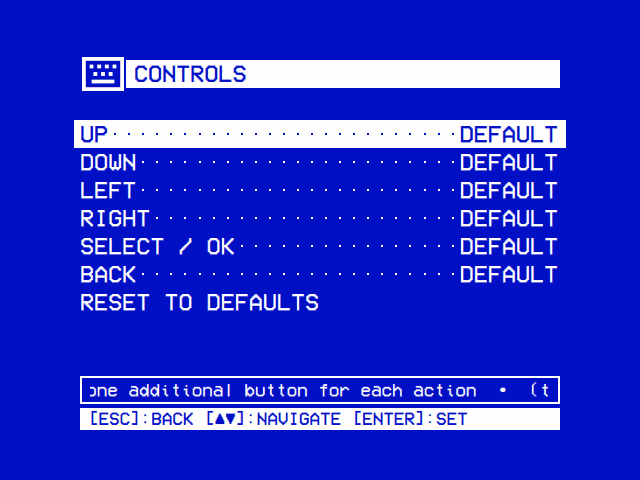</td><td>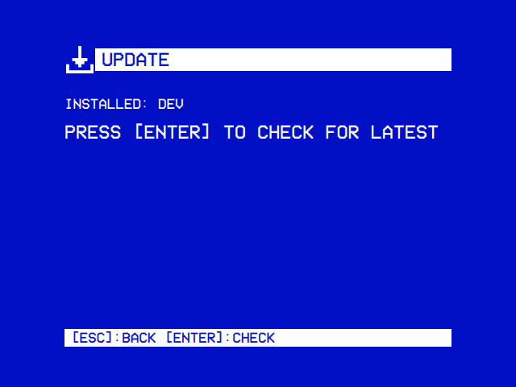</td></tr>
<tr><td>One more button for each action, from any keyboard, remote or gamepad.</td><td>Checks for a newer release and installs it.</td></tr>
</table>

## Video Overview

Watch on YouTube: https://youtu.be/r-gylGDoELY

## Photos

Photos of an earlier version, before the menus above, on a CRT.

| Module Selection | Item Detail |
| --- | --- |
|  |  |

| Resume Option | Playback | Settings |
| --- | --- | --- |
|  |  |  |

## Modules

### Ambient:Mode ([Wiki](https://github.com/anthonycaccese/240-MP/wiki/Module:-Ambient-Mode))
- Supported video file types: `"mp4", "mkv", "avi", "mov", "m4v", "webm", "wmv", "flv", "f4v", "mpg", "mpeg", "vob"`
- Playlist support for audio tracks using `m3u` and `m3u8` files
- Mix video with a different audio track
- Loops forever until you stop it

### Emby Module ([Wiki](https://github.com/anthonycaccese/240-MP/wiki/Module:-Emby))
- Supported library types: `movies, tvshows, homevideos, boxsets`
- Username / password authentication, or Emby Connect (emby.media cloud account, with server picker)
- Select specific libraries to display
- Continue Watching, Next Up and Resume Playback
- Autoplay next episode in a season (optional, off by default)
- Intro/Credit skip using the server's chapter markers (when detected)
- Collections support
- Select preferred audio/subtitle track before playback and switch tracks during playback
- Full library browsing by letter
- Show/Season browsing
- Video quality selection: Direct Playback (Default) or Transcode options

### Jellyfin ([Wiki](https://github.com/anthonycaccese/240-MP/wiki/Module:-Jellyfin))
- Supported library types: `movies, tvshows, homevideos, boxsets`
- "Quick Connect" authentication
- Select specific libraries to display
- Continue Watching, Next Up and Resume Playback
- Autoplay next episode in a season (optional, off by default)
- Collections support
- Select preferred audio/subtitle track before playback and switch tracks during playback
- Full library browsing by letter
- Show/Season browsing
- Video quality selection: Direct Playback (Default) or Transcode options

### Local Files ([Wiki](https://github.com/anthonycaccese/240-MP/wiki/Module:-Local-Files))
- Supported file types: `"mp4", "mkv", "avi", "mov", "m4v", "webm", "wmv", "flv", "f4v", "mpg", "mpeg", "vob"`
- On 240-MP OS, films go on the SD card itself: its **240-MP** partition opens on Windows and macOS like a USB stick, and Local Files opens it ([os/README.md](os/README.md#films-on-the-card))
- Playlist support using `m3u` and `m3u8` files
- Folder browsing as a horizontal tree: the open folders run along a line across the screen, every folder in the current one branches off to a few of its own entries, and the folder under the cursor branches once more
- **Recently Watched**, **Favorites** and **Search** lead the tree: what you played last, what you marked (right on a file, then **Add to Favorites**), and file and folder names anywhere in the media folder, typed on an on-screen keyboard
- Loop playback
- Shuffle playback
- Playback history
- Switch audio/subtitle tracks during playback

### Netflix and Prime Video
- Browse what the service carries in your country in the same tree as Local Files: **Recently Watched** and **Favorites** first, then **Search** (on an on-screen keyboard), **Movies** and **Series** by Popular and by genre, a page of titles at a time with **More…** at the end
- Select on a title plays it straight away in the service's own web player, full screen. It opens at the title's own page on the service where [Wikidata](https://www.wikidata.org) knows it (by its TMDB or IMDb id), and at the service's search for it otherwise. **Netflix Home** / **Prime Video Home** opens the service as it is. 240-MP comes back when the player closes, with the tree as you left it
- The catalogue comes from [TMDB](https://www.themoviedb.org)'s API, which needs a free API key: put it (a v3 key or a v4 read access token) on the first line of `tmdb_api_key.txt` in the data folder. Each module's settings set the country and the language of the titles
- Neither service has an API for a front end like this one, and their streams are DRM-protected, so playback is the official site in Chromium with Widevine, not a 240-MP view: use it with a keyboard (arrow keys move between titles) or a mouse
- A title's info screen (story, genre, director or creator, cast, rating) comes up when the cursor has rested on it for 3 seconds, or at once with right; Settings → **Info Screen** sets the seconds, or **Key** for right only, or **Off**
- Right on the info screen (or on the title, with the info screen off) offers its options: **Add to Favorites** or **Remove from Favorites**
- Come back by holding back (`[ESC]` / `[B]`) for two seconds, or by closing the browser (`Ctrl+W`)
- **Sign in** in its settings opens the service's sign-in page full screen, to sign in with a keyboard before you browse (a title you open asks too, while you aren't). Each keeps its sign-in between visits; **Sign out** forgets it
- Needs `chromium`, `libwidevinecdm0` and, without a desktop, `cage` and `wtype` (on Raspberry Pi OS: `sudo apt install chromium libwidevinecdm0 cage wtype`); the 240-MP OS image has them. With `wtype`, holding back closes the browser the way `Ctrl+W` does, which keeps a sign-in made moments before: Chromium saves new cookies only every half minute, and stopping it outright loses them
- Off by default; enable them in Settings
- This product uses the TMDB API but is not endorsed or certified by TMDB. Which service carries a title where comes from [JustWatch](https://www.justwatch.com), through TMDB

### NFC Reader ([Wiki](https://github.com/anthonycaccese/240-MP/wiki/Module:-NFC-Reader))
- Start video playback via NFC cards
  - Supports the mapping of video paths, YouTube URLs and content from a Plex library
- Reader support:
  - `PN532 USB` — recommended. Needs no drivers or daemon on any platform, so it also works on immutable distros like SteamOS
  - `ACS ACR122U` and other PC/SC contactless readers — needs `pcscd` (see `scripts/setup-nfc-reader.sh`)
- Readers are detected automatically; no configuration needed
- Maps cards to videos via per-card text files in a `nfc_tags` data directory
- Tapping an unknown card auto-creates a stub tag file for it

### Plex ([Wiki](https://github.com/anthonycaccese/240-MP/wiki/Module:-Plex))
- Supported library types: `Movies, TV Shows, Other Videos`
- Server switching
- User profile switching and auto sign in
- Select specific libraries to display
- Continue Watching and Resume
- Autoplay next episode in a season (optional, off by default)
- Write an NFC card for any movie, episode, season or show from its detail screen to use with the NFC Reader module
- Hub, Playlist, Collection and Category support
- Folder browsing — walk a library by its on-disk folder structure
- Movie editions
- Select preferred audio/subtitle track before playback and switch tracks during playback
- Full library browsing by letter
- Show/Season browsing
- Video quality selection: Direct Playback (Default) or Transcode options

### Scripts ([Wiki](https://github.com/anthonycaccese/240-MP/wiki/Module:-Scripts))
- Run your own `.sh` scripts from a folder, so 240-MP can launch anything else on the machine (FieldStation42, RetroArch, `yt-dlp -U`, updates)
- Two run modes per script, set in its `.txt` file:
    - `console` — 240-MP stays on screen and shows the script's output
    - `takeover` — the script gets the whole display, and 240-MP returns when it exits
- A `.txt` file beside each script sets its display name and options; one is created for you automatically the first time a script is seen
- Mark a script as a favorite to put it on the main menu alongside the other modules (press play/pause on it in the list)
- Optionally auto-run one script when 240-MP starts
- Off by default; enable it in Settings and point it at your scripts folder

### Weather ([Wiki](https://github.com/anthonycaccese/240-MP/wiki/Module:-Weather))
- Inspired by [WeatherStar 3000+](https://github.com/netbymatt/ws3kp) by netbymatt
- Integrates with Open-Meteo to provide weather forecasts for worldwide locations
- Integrates with NWS to provide current conditions for US locations
- For your main location it displays Current Conditions and Extended (3-day forecast)
- Can display forecast data for 6 additional locations
- Supports background music, US/Metric Units and 12-hour/24-hour time display

### YouTube ([Wiki](https://github.com/anthonycaccese/240-MP/wiki/Module:-YouTube))
- List content from YouTube RSS feeds and playback via mpv + yt-dl (no account needed)
- Browse it all in the same tree as Local Files: **Recently Watched**, **Favorites**, **Search**, **Subscriptions**, **Channels**, **Playlists** and **Watch Later**
- Search YouTube on an on-screen keyboard (through yt-dlp), twenty matches at a time with **More…** at the end
- View Subscriptions: Browse the latest videos from your configured channels as a reverse chronological list
- Browse videos by Channel, and by Playlist
- A video's info screen (channel, date, length, views, description), like the streaming catalogues'; right on it (or, with the info screen off, on the video) offers its options: add it to **Favorites**, or save it to a local **Watch Later** list
- **Recently Watched** is your local watch history
- Resume Playback
- **Advanced** in its settings holds the details:
    - **Playback Resolution**: 240p to 2160p. 480p, the default, suits a CRT and a Pi.
    - **Video Codec**: H.264 first, which a Pi decodes in hardware, or **Any** for whatever looks best (VP9 or AV1, needed above 1080p).
    - **Max Frame Rate**: Any, or 30 where a video also has 60.
    - **Scaling**.
    - **Audio Language**: the original track, or a dub where a video has one.
    - **Subtitles** in a **Subtitle Language**: Off, On, or With Auto for YouTube's automatic captions too.
    - **Playback Speed**: 0.75x to 2x.
    - **Resume Playback**, and whether to **Display Shorts** (on by default).
- **Sign in** in its settings, if you want to, opens Google's sign-in page full screen in Chromium, to sign in with a keyboard. yt-dlp then searches and plays as that account, which YouTube asks for fewer bot checks and lets play age-restricted videos. **Sign out** forgets it
    - YouTube can block an account used through yt-dlp, as [yt-dlp's wiki](https://github.com/yt-dlp/yt-dlp/wiki/Extractors#youtube) warns, so sign in with a spare one
    - Needs Chromium, with `cage` and `wtype` without a desktop (see Netflix and Prime Video), or Google Chrome on a Mac

## Install
- [On a Raspberry Pi](INSTALL.md#on-a-raspberry-pi)
- [On macOS (ARM)](INSTALL.md#on-macos-arm)
- [On SteamOS / Linux x86_64](INSTALL.md#on-steamos--linux-x86_64)

## Hardware Testing
- [Raspberry Pi 3B](https://github.com/anthonycaccese/240-MP/wiki/Hardware-Testing#raspberry-pi-3b)
- [Raspberry Pi 3B+](https://github.com/anthonycaccese/240-MP/wiki/Hardware-Testing#raspberry-pi-3b-1)
- [Raspberry Pi 4B](https://github.com/anthonycaccese/240-MP/wiki/Hardware-Testing#raspberry-pi-4b)
- [Raspberry Pi 5](https://github.com/anthonycaccese/240-MP/wiki/Hardware-Testing#raspberry-pi-5)
- [Steam Deck](https://github.com/anthonycaccese/240-MP/wiki/Hardware-Testing#steam-deck)

## FAQs

- Why didn't you use Kodi/LibreELEC/OSMC?
    - I've used all of those distros and they are all excellent but I also like making things and wanted something simpler without as many options.  Something that felt like a VCR from my youth.
- Should I use 240-MP instead of Kodi/LibreELEC/OSMC?
    - I would recommend thinking about it like this...
    - All of those distros are amazing, feature rich, work across a ton of devices and have awesome supportive teams behind them.
    - I on the other hand am just one person making nostalgic things for my own niche use cases.
    - If those use cases match with what you're looking for, then 240-MP is a bunch of fun and I'd be happy for you to try it.
    - Otherwise, the well known distros are spectacular and you should likely open those doors instead.
- Will this work on other Raspberry Pi models? (like the 5, 2 zero, etc...)
    - I've tested on the 4b, 3b+ and 3b. Other users have confimred the 5 works well too and all the details on what we've confimred can be found here: https://github.com/anthonycaccese/240-MP/wiki/Hardware-Testing
    - If its not on that list then the short answer is "we don't know but please feel free try and let us know if it works"
- Where does the name "240-MP" come from?
    - 240 has a double meaning referring to the longest [VHS tape length](https://en.wikipedia.org/wiki/VHS#Tape_lengths) and love for [CRT TVs](https://consolemods.org/wiki/CRT:What_is_240p%3F) as a display type.
    - MP also has a double meaning of "Media Player" and a play on the "SP/LP/EP/SLP" terminology that was used to refer to the recording quality for VHS recordings.
- Does the 240 in the name mean that it outputs at 240p resolution?
    - The UI scales based on the OS config and output cables you are using.
    - For example: the output resolution for the menu and video playback when using it on a CRT with the configs I use is 480i/576i
- Does 240-MP support RGB out instead of composite?
    - 240-MP is just an app that runs on top of an already configured Operating System. If you are able to configure your OS on the Raspberry Pi to output over RGB then 240-MP will simply scale and display to that output when it boots up as well.
    - If you have a combination of RGB out + OS configuration that works well then please add a comment here with your set up details: https://github.com/anthonycaccese/240-MP/discussions/44
- Does 240-MP work over HDMI on a modern television too?
    - Yes! The UI was built to scale on modern televisions over HDMI as well.
    - Please make sure you use the config.txt I provide for HDMI and it will output at the proper resolution for a modern tv.
- Does 240-MP support bluetooth keyboards/remotes/controllers?
    - 240-MP is just an app that runs on top of an already configured Operating System. If your OS has a way to configure and set up bluetooh controllers then 240-MP will simply see them as controllers when it boots up.

## Credits & Acknowledgments

- The `VCR OSD Mono` font was created by Riciery Santos Leal (a.k.a. mrmanet) https://www.dafont.com/vcr-osd-mono.font
- The `Unifont` font (used as a fallback for characters that VCR OSD Mono does not cover) is GNU Unifont by Roman Czyborra, Paul Hardy, et al., licensed under the SIL Open Font License v1.1. https://unifoundry.com/unifont/ — license text: [assets/fonts/LICENSE-unifont.txt](assets/fonts/LICENSE-unifont.txt)
- Because this is a hobby project (and a fairly niche use case), I am using [Claude Code](https://www.anthropic.com/product/claude-code) to build a large part of the backend C++ code and structure the modules.  If you have concerns with that, I am glad to talk through it.  Also, please feel free to fork this repo, update any aspects and tailor things to your own use case; that's why the source is fully open and available.
- Thank you to Plex, Jellyfin, Emby and Open-Meteo for providing open and free apis to enable building modules for each.
- Thank you to [the MPV team](https://mpv.io/) for a simple, extensible and cross platform media player
- And thank you to the [Raspberry Pi Foundation](https://www.raspberrypi.org/) for helping me fill a drawer with SBCs to tinker with and inspire fun ideas like this project ❤️

## License

This project is licensed under the GNU General Public License v3.0. See [LICENSE](LICENSE) for the full text.

You are free to use, study, and modify this code. If you distribute a modified version, you must also distribute it under GPL-3.0 and make the source available.
