# The OSD/OS screen tour

Every screen of OSD/OS, module by module. The [wiki](https://github.com/mehmetraif/OSD-OS/wiki) tells what each does.

Every screen below is the app itself, running at 640×480. The film and YouTube entries are sample data; the weather is real.

### Starting and stopping

<table>
<tr><th width="33%">Boot screen</th><th width="33%">Main menu</th><th width="33%">Quit</th></tr>
<tr><td></td><td></td><td></td></tr>
<tr><td>On the OSD/OS image, the OSD/OS cassette winds its tape from reel to reel while the services start, <code>[ OK ]</code> once each is up. It closes by itself when the last one has settled.</td><td>The modules, like the inputs on a deck. Select opens one; back opens Settings.</td><td>Settings → Quit. When OSD/OS starts with the system, it offers Power Off, Restart or Exit to Terminal instead.</td></tr>
</table>

### Local Files

<table>
<tr><th width="50%">Recently Watched</th><th width="50%">Favorites</th></tr>
<tr><td></td><td></td></tr>
<tr><td>The tree opens on what you played last, then Favorites, Search and your folders. The entry under the cursor branches out to its contents in full; the other folders' branches are faint.</td><td>Files and playlists you marked from their options.</td></tr>
</table>

<table>
<tr><th width="50%">Folders</th><th width="50%">Search</th></tr>
<tr><td></td><td></td></tr>
<tr><td>The open folders run along the line through the middle. The folder under the cursor branches out once more: Action › Rambo Movies › its films.</td><td>An on-screen keyboard: the arrows move, select types.</td></tr>
</table>

<table>
<tr><th width="50%">Search results</th><th width="50%">Options</th></tr>
<tr><td></td><td></td></tr>
<tr><td>Names that match anywhere under the media folder and on the USB drives plugged in.</td><td>► on a file: Add to Favorites (or Remove), Play at Startup, and Add to Playlist.</td></tr>
</table>

### Playing

<table>
<tr><th width="33%">Resume</th><th width="33%">Loading</th><th width="33%">Deck menu</th></tr>
<tr><td></td><td>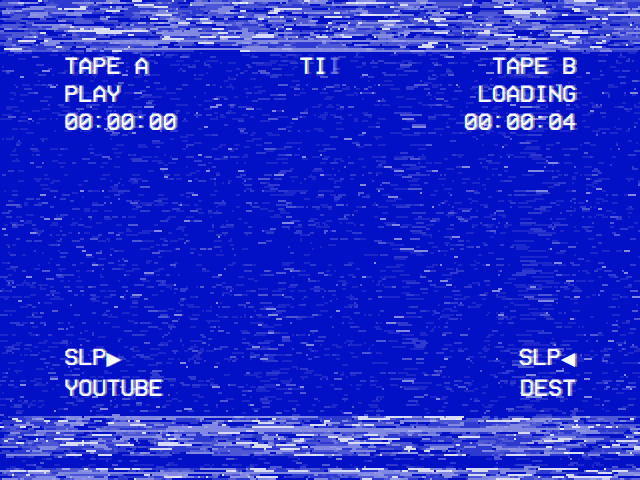</td><td></td></tr>
<tr><td>Pick up where you left off, or start from the beginning.</td><td>While a video starts, a tape loads: live VHS noise in the theme's colours, the tracking band rolling through, and a dubbing deck's display, TAPE A at where the video is and TAPE B LOADING with its length once known. Settings → Loading Effect turns the noise off, and Loading Screen Colors keeps it white on blue whatever the theme.</td><td>▲ or ▼ during playback opens the deck's menu: the position bar, audio and subtitle tracks, crop (the four Scalings in turn) and stop.</td></tr>
</table>

<table>
<tr><th width="33%">The video's menu</th><th width="33%">Back to the menus</th><th width="33%">Main menu</th></tr>
<tr><td>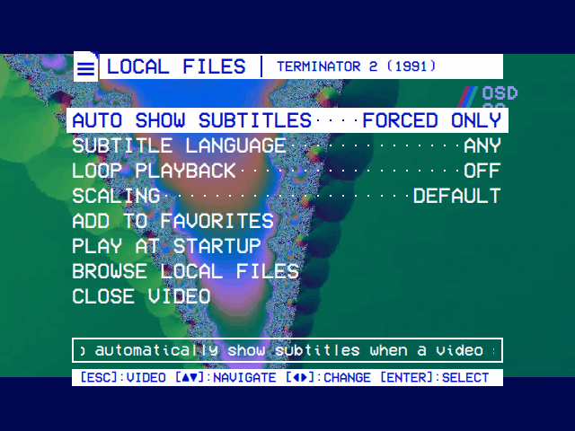</td><td></td><td></td></tr>
<tr><td>With Transparent Background, back during a Local Files, YouTube or Playlists video opens its menu over the picture, which plays on, here at 40% solid. ◄ ► change its module's settings for it, at once or as you go back to it. Close Video goes to the main menu; back, to the video.</td><td>Browse in that menu, or back from any other module's video, returns to the module's menus, the video playing on behind them. Choose it again to watch it full screen from where it is.</td><td>For a Local Files, YouTube or Playlists video, the main menu leads with it, the cursor on it: select takes it back to full screen where it is. Play/pause stops it (<code>[SPACE]:STOP</code>), and playing anything else replaces it.</td></tr>
</table>

### Netflix, Prime Video and YouTube

<table>
<tr><th width="50%">Netflix</th><th width="50%">Movies › Popular</th></tr>
<tr><td></td><td></td></tr>
<tr><td>Recently Watched, Favorites, Search, then Movies and Series, and the service's own home page.</td><td>Popular, then each genre, a page of titles at a time.</td></tr>
</table>

<table>
<tr><th width="50%">Info screen</th><th width="50%">Playing on Netflix</th></tr>
<tr><td></td><td></td></tr>
<tr><td>Story, genre, director, cast and rating, from TMDB. Select plays the title; ► offers its options.</td><td>The service's own player, in Chromium, has the screen. Hold back for two seconds to come back.</td></tr>
</table>

<table>
<tr><th width="50%">Prime Video</th><th width="50%">YouTube</th></tr>
<tr><td></td><td></td></tr>
<tr><td>The same tree, for Prime Video.</td><td>Recently Watched, Favorites, Search, Subscriptions, Channels, Playlists and Watch Later.</td></tr>
</table>

<table>
<tr><th width="50%">Subscriptions</th><th width="50%">A video's info screen</th></tr>
<tr><td></td><td></td></tr>
<tr><td>The latest videos from your channels, newest first.</td><td>Channel, date, length, views and description.</td></tr>
</table>

### Plex, Jellyfin and Emby

<table>
<tr><th width="33%">Plex</th><th width="33%">Jellyfin</th><th width="33%">Emby</th></tr>
<tr><td></td><td></td><td></td></tr>
<tr><td>Sign in with a code at plex.tv/link.</td><td>Connect to a server with Quick Connect.</td><td>A server on your network, or Emby Connect.</td></tr>
</table>

Once signed in, each opens on the server's Continue Watching and its libraries. See [Modules](https://github.com/mehmetraif/OSD-OS/wiki/Modules) for everything they do.

### Playlists

<table>
<tr><th width="50%">Playlists</th><th width="50%">An offline playlist</th></tr>
<tr><td>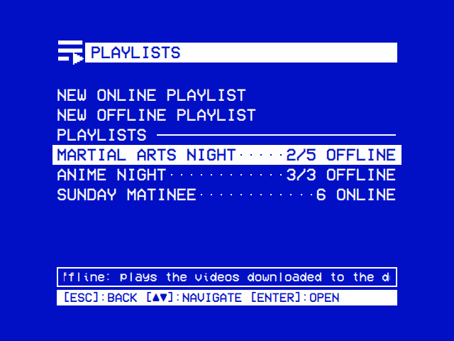</td><td>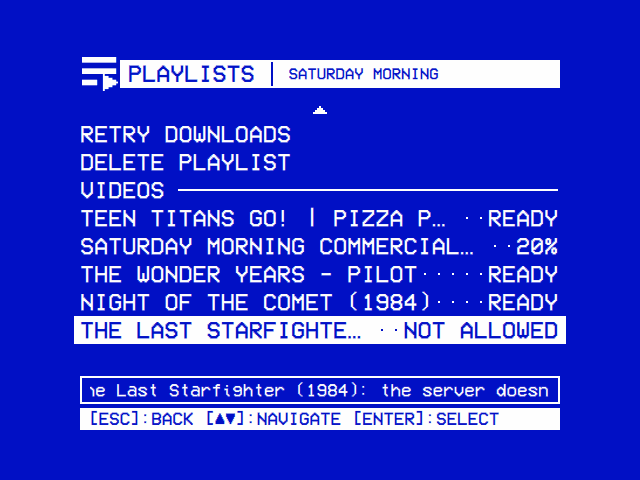</td></tr>
<tr><td>Online playlists play each video from where it lives; offline ones, from the device, with how many of their videos are on it.</td><td>Each video downloads once, in the background: ready, under way, or why not (a server that doesn't let you download it).</td></tr>
</table>

<table>
<tr><th width="50%">Adding videos</th><th width="50%">Add to Playlist</th></tr>
<tr><td>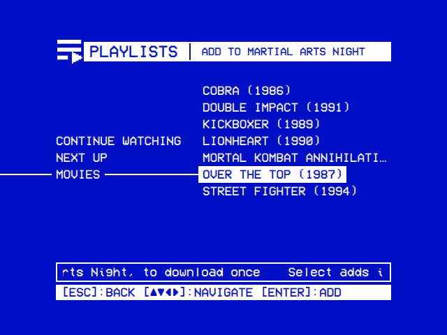</td><td>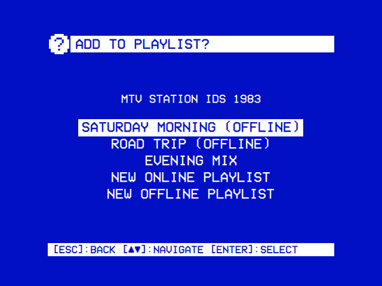</td></tr>
<tr><td>Local Files, YouTube, Jellyfin and Emby in one tree, down to a show's episodes. Select adds a video and stays, for the next.</td><td>From a module itself: a video's options (►), or ► on PLAY in Jellyfin and Emby.</td></tr>
</table>

### Weather, Ambient:Mode, NFC Reader and Scripts

<table>
<tr><th width="50%">Weather</th><th width="50%">Extended forecast</th></tr>
<tr><td></td><td></td></tr>
<tr><td>In the style of WeatherStar 3000+: current conditions…</td><td>…the extended forecast and an almanac, in turn.</td></tr>
</table>

<table>
<tr><th width="50%">Ambient:Mode</th><th width="50%">NFC Reader</th></tr>
<tr><td></td><td></td></tr>
<tr><td>A video, with music of your choice, on a loop.</td><td>Tap a card to play the video it is mapped to.</td></tr>
</table>

<table>
<tr><th width="50%">Scripts</th><th width="50%">A console script</th></tr>
<tr><td></td><td></td></tr>
<tr><td>Your own shell scripts. ► puts one on the main menu.</td><td>A console script shows its output. A takeover script gets the whole screen until it exits.</td></tr>
</table>

### Settings

<table>
<tr><th width="50%">Settings</th><th width="50%">Modules</th></tr>
<tr><td></td><td></td></tr>
<tr><td>Laid out like a camcorder's menu, the look at its top: Theme, then each of its parts (the color scheme, the skin, the effects, the transition and the menu music), each the theme's, Off or one of your own. Further down, Transparent Background is a slider, the deck's tape bar, from TRANSPARENT to SOLID; Hint Bar takes the key hints off the foot of every screen, Help Line the box under the menu; Channel Logo puts OSD/OS's logo in a corner of the picture while a video plays.</td><td>Each module is turned on and set up from here.</td></tr>
</table>

<table>
<tr><th width="50%">OSD Background: Window</th><th width="50%">OSD Background: Off</th></tr>
<tr><td>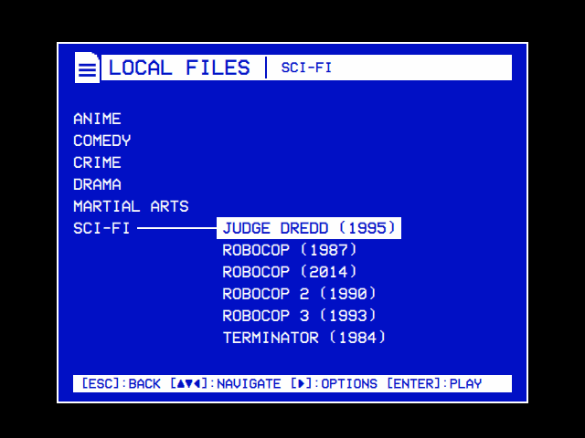</td><td>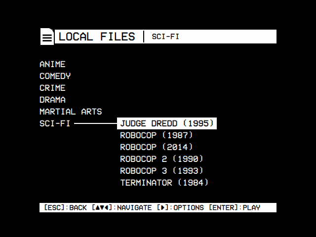</td></tr>
<tr><td>The menus in a framed window of the color scheme's background, black around it. Over a video behind the menus, the picture shows whole around the window.</td><td>No background: the menus on black, like a deck's on-screen display with nothing playing, in the scheme's lighter color.</td></tr>
</table>

<table>
<tr><th width="50%">A module's settings</th><th width="50%">Picking a folder</th></tr>
<tr><td></td><td></td></tr>
<tr><td>Local Files: its folder, looping, shuffle, resume, subtitles, and its own Scaling.</td><td>Folders are picked on the same tree Local Files is browsed with, from home, the drives and the root down: USE THIS FOLDER picks the one open, Default Folder the module's own.</td></tr>
</table>

<table>
<tr><th width="50%">Bluetooth</th><th width="50%">Pairing a keyboard</th></tr>
<tr><td>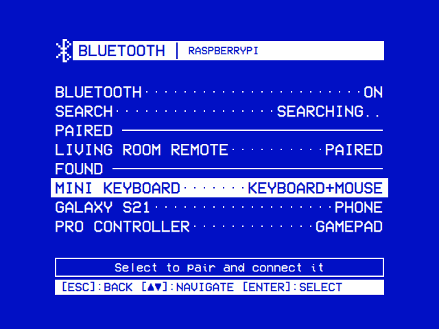</td><td>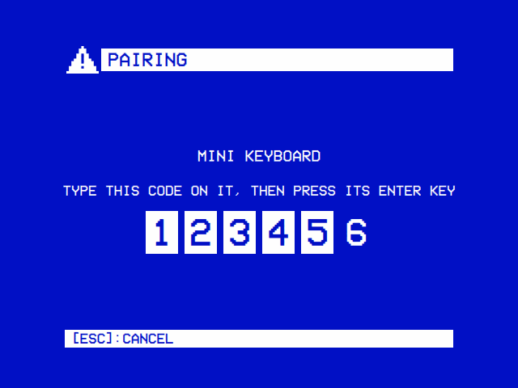</td></tr>
<tr><td>Search finds what is in pairing mode nearby for a minute, keyboards, gamepads and the like. Select pairs one and connects it, and it comes back by itself after a restart. Select on a paired one connects, disconnects or forgets it.</td><td>A keyboard is paired by typing the code it asks for, then its Enter. The digits light up as they are typed.</td></tr>
</table>

<table>
<tr><th width="50%">Controls</th><th width="50%">Update</th></tr>
<tr><td></td><td></td></tr>
<tr><td>One more button for each action, from any keyboard or remote (a gamepad's buttons go in <code>input.cfg</code>).</td><td>Checks for a newer release and installs it.</td></tr>
</table>

<table>
<tr><th width="50%">About</th><th width="50%">The license</th></tr>
<tr><td></td><td>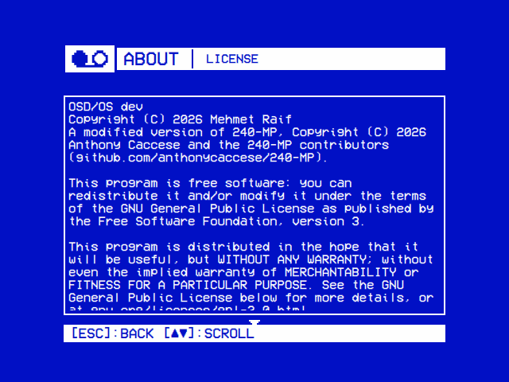</td></tr>
<tr><td>What OSD/OS is, who makes it, what it is made of and under which license, each line's detail in the help line.</td><td>Behind the LICENSE line: the notice, then the GNU GPL's text, a page at a time.</td></tr>
</table>

<table>
<tr><th width="50%">Channel Logo</th><th width="50%">Under the menus</th></tr>
<tr><td>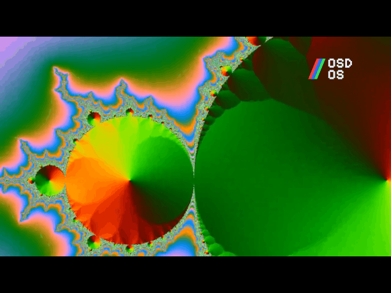</td><td>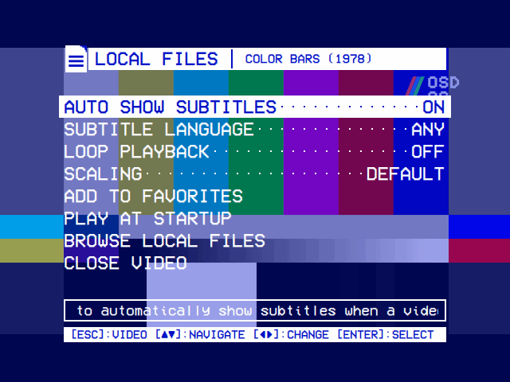</td></tr>
<tr><td>OSD/OS's logo in a corner of the picture while a video plays, the way a channel's sits in a broadcast. Settings → Channel Logo picks the corner, all four, or none.</td><td>It is in the picture itself, so with Transparent Background the menus lie over it.</td></tr>
</table>

<table>
<tr><th width="50%">Logo Image</th><th width="50%">Picking the picture</th></tr>
<tr><td>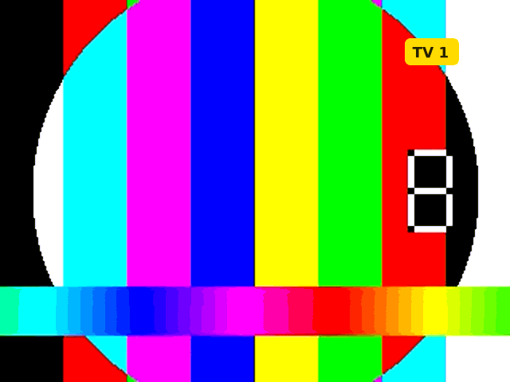</td><td>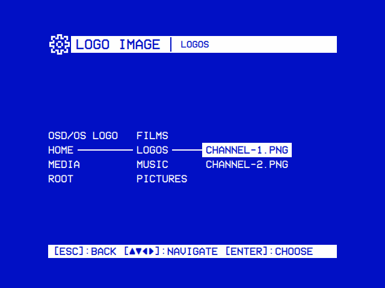</td></tr>
<tr><td>Settings → Logo Image puts a picture of your own there instead, as tall as OSD/OS's logo.</td><td>Picked on the same file browser: select on a picture, or OSD/OS Logo at the top to go back to it.</td></tr>
</table>

### Themes

Settings → Theme sets the whole look at once: the color scheme, the skin, the effects and the menu music. Each part has its row under Theme, to change, and all but the color scheme to turn off. None of it ever lies over a video: the effects and the music rest while one plays, loads or has its menu open.

<table>
<tr><th width="50%">Trinitron</th><th width="50%">Late Show</th></tr>
<tr><td>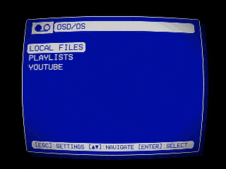</td><td>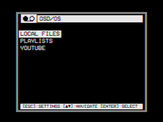</td></tr>
<tr><td>Video 1 in Rounded windows on a tube's curved face: scanlines, glow and darker corners, drawn by the GPU over the whole screen (CRT). Windows turn over like a cube.</td><td>Late Night's white on black in DOS windows, with a tape's color bleed and noise (VHS) and text flickering like a neon sign. Windows fade.</td></tr>
</table>

<table>
<tr><th width="50%">Green Screen</th><th width="50%">Matrix</th></tr>
<tr><td>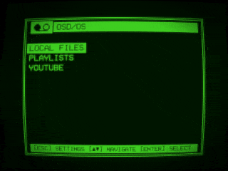</td><td>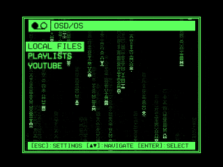</td></tr>
<tr><td>A phosphor green of its own, DOS windows, a glowing tube and glowing text. Windows come in on a wave from a corner.</td><td>Green on black: Matrix rain behind the menus, glowing text, and lightning crackling out of the selected line. Windows ripple.</td></tr>
</table>

<table>
<tr><th width="50%">Inferno</th><th width="50%">Arcade</th></tr>
<tr><td>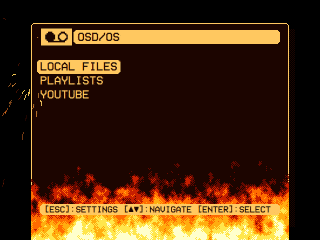</td><td>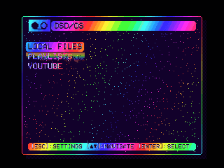</td></tr>
<tr><td>Amber on brown: pixel flames burning up from the window's foot, inside its frame, and a welder's sparks bursting from the selected line's corners.</td><td>Synthwave's colors: a starfield, text running through the rainbow, and a pixel rainbow dripping from under the selected line.</td></tr>
</table>

<table>
<tr><th width="50%">Winter</th><th width="50%">Demoscene</th></tr>
<tr><td>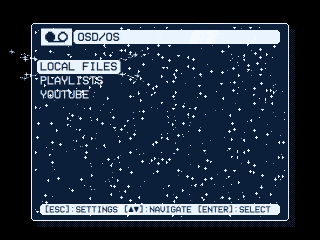</td><td>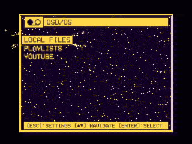</td></tr>
<tr><td>Ice on night blue: snow falling, a glint sweeping across the text, and sparkles flying off the selected line. Windows spread from a drop.</td><td>Gold on purple: a starfield, glowing text and sparkles, windows turning left like a demo's cube, and a tracker's XM for its music.</td></tr>
</table>

<table>
<tr><th width="50%">Skin: DOS, Window Frame: Shadow</th><th width="50%">Skin: Rounded</th></tr>
<tr><td>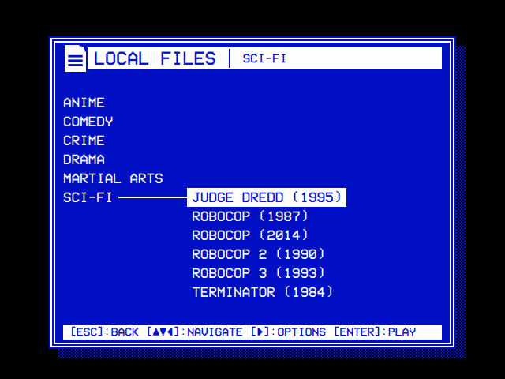</td><td>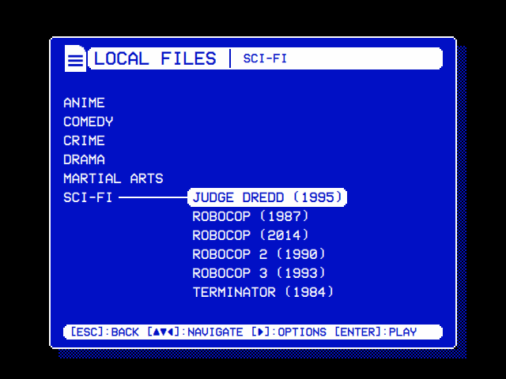</td></tr>
<tr><td>A skin dresses the window, apart from the color scheme: DOS gives it a double line. Window Frame, offered with OSD Background's Window, adds a DOS window's shadow, a half tone of the window's color (over a video, it darkens the picture), or takes the frame away.</td><td>Rounded rounds the window's corners and the ends of its bars and of the selected line. A skin gives the shapes, and can draw icons of its own; the color scheme still gives the colors.</td></tr>
</table>
