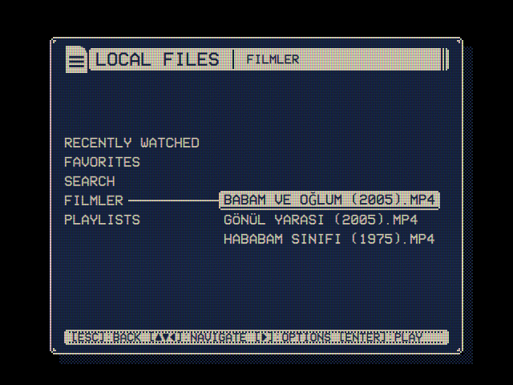

# Skin template

A skin to copy and make your own. A skin dresses the window: it gives the shapes of its frame, the title bar, the hint bar and the selected line, and can draw icons of its own in place of OSD/OS's, all in the color scheme's colors. This one dresses all four parts and draws an icon, and between them it uses every option of `skin.json`, so each can be seen at work and changed. A [theme](../theme-template/) names a skin, or brings one of its own, with its colors, effects and music.



| File | What it is |
|---|---|
| `skin.json` | The skin: its name, a picture for each part, and its icons |
| `window.png`, `titlebar.png`, `hintbar.png`, `selection.png` | The pictures, a few pixels each |
| `logo.png` | An icon: a television, in place of OSD/OS's logo |
| `make-pictures.py` | Draws the pictures again from the drawings in it (Python 3, nothing to install) |

## Make it yours

1. **Copy this folder** into the `skins` folder of OSD/OS's data folder, under a name of your own:
   - Linux and the OSD/OS image: `~/.local/share/OSD-OS/skins/<name>/`
   - macOS: `~/Library/Application Support/OSD-OS/skins/<name>/`

   The folder's name is what Settings saves. A folder named like one of OSD/OS's own (`dos`, `rounded`) is used in its place. A skin made before skins had their name, a `theme.json` of these parts in the data folder's `themes`, is read as a skin too.
2. **Name it.** `"name"` in `skin.json` is what Settings → Skin shows: 28 characters at most, else the folder's name is shown.
3. **Draw it**, either way:
   - in `make-pictures.py`: change the drawings and run `python3 make-pictures.py`, which writes the PNGs beside it. In a drawing `#` is light, `o` dark and `.` clear.
   - in any pixel editor, in white, black and transparent.
4. **Pick it** in Settings → Skin. A new folder is listed the next time Settings opens. The window's frame shows with OSD Background set to Window and Window Frame On or Shadow.

To see a picture you changed in a skin already in use, restart OSD/OS: a picture already shown stays in memory.

## skin.json

```json
{
    "name": "Template",
    "window":    { "image": "window.png", "border": 4 },
    "titleBar":  { "image": "titlebar.png", "border": [2, 2, 5, 2] },
    "hintBar":   { "image": "hintbar.png", "border": 3, "tile": "repeat" },
    "selection": { "image": "selection.png", "border": 3 },
    "icons":     { "logo": "logo.png" }
}
```

| Key | The part |
|---|---|
| `name` | What Settings shows |
| `window` | The frame of OSD Background's window, drawn over the whole window, its middle filling it |
| `titleBar` | The bar at the top of every screen, behind the title |
| `hintBar` | The bar at the foot, behind the keys' hints |
| `selection` | The selected line: menus, the file tree's cursor, a question's answers |
| `icons` | Icons of its own, below |

Every part is optional. A part left out, or whose picture can't be used, is drawn as OSD/OS draws it without a skin. A part is a picture's file name (`"hintBar": "hintbar.png"`, stretched whole), or:

| Key | |
|---|---|
| `image` | The picture: a PNG, GIF or BMP in the skin's folder |
| `border` | How many of its pixels at each edge are its frame: one number for all four sides, or `[left, top, right, bottom]`. Without it the picture is stretched whole |
| `tile` | How the edges and the middle fill the part: `stretch` (the default) stretches them, `repeat` repeats their pattern (the hint bar's dotted line), `round` repeats it scaled so that a whole number fits |

## Icons

`icons` draws icons of the skin's own in place of OSD/OS's, by name: a module's by its folder's name (`"youtube"`, `"local_files"`, `"plex"`), the main menu's `"logo"`, any other by its file's name without the extension (`"settings"`). Each is a picture in the skin's folder: a PNG, SVG, GIF, BMP or JPEG. An icon is drawn as OSD/OS draws its own, in the title bar's color, from its shape alone (where it is opaque), trimmed of the clear margin round it and scaled to the logo's height: about 17 art pixels at 480 lines. A drawing of pixels that size stays sharp, its pixels square.

## The pictures

**Three kinds of pixel.** A skin gives only shapes: OSD/OS draws it in the color scheme's two colors, so the same skin goes with every scheme. A picture has three kinds of pixel:

- **light** (white): the scheme's color
- **dark** (black): the scheme's background
- **clear** (transparent): nothing. What is behind shows through: around the window, the black, or a video playing behind the menus.

A pixel at least half opaque is light when it is at least half bright, else dark. Any other pixel is clear. A drawing in other colors works too, but white, black and transparent show what you will get.

**Art pixels.** Each pixel of a picture is an art pixel, a pixel of a 240-line picture, drawn as a square of screen pixels without smoothing: 2×2 at 480 lines, 4×4 at 1080. The bars are only a few art pixels tall: at 480 lines, the hint bar 9 to 11, a selected line 12 in the trees and 14 in Settings, and the title bar 14. A `border` of 2 to 4 at the top and the bottom leaves room for the text.

**Nine slices.** `border` cuts a picture into nine. The four corners are drawn as they are, the four edges stretch (or repeat) between them, and the middle fills the rest. Here is the window's 9×9 picture with its `"border": 4`, cut apart:

```
..##  #  ##..     the top corners, and between them the top edge,
.#oo  o  oo#.     one column wide, stretched along the window
#o##  o  ##o#
#o#o  o  o#o#

#ooo  o  ooo#     the left and right edges, one row tall, and the middle

#o#o  o  o#o#
#o##  o  ##o#     the bottom corners and edge
.#oo  o  oo#.
..##  #  ##..
```

The corners keep their brackets and their clipped tips wherever the window's corners are, and the one-pixel edges and middle become the window's sides and ground.

**What goes where.**

- **The window's frame** is drawn over the whole window, so its middle is the window's ground. Draw the middle dark for the scheme's background, as the template does, or clear for a window to see through. What the corners leave clear shows what is around the window.
- **The title bar, the hint bar and the selected line** have their text written over them in the dark color. Keep their middles light.

## When something is wrong

The log says which skin was read, `[AppCore] skin <folder>: <path>`, and what in it couldn't be used. On the OSD/OS image it is `journalctl -u osdos`; elsewhere see [Debugging & logs](../../BUILDING.md#debugging--logs).

- **A picture that isn't usable**, that is, not a PNG, GIF or BMP in the skin's folder: that part is drawn as OSD/OS draws it. A path or a link out of the folder is refused. An icon's name is letters, digits, `-` and `_`, in any case; one with anything else is left out.
- **A `border` that isn't a number or four of them**: the picture is stretched whole.
- **A `skin.json` that isn't JSON**: the skin isn't listed in Settings (in a folder named like one of OSD/OS's own skins, that one is listed in its place).
