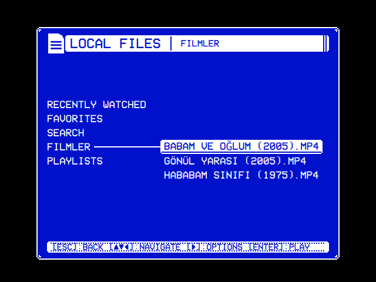

# Theme template

A theme to copy and make your own. A theme is the whole look in one folder: the colors, the [skin](../skin-template/) that dresses the window, the effects (on the text, behind the menus, round the selected line, over the screen, between windows) and the menu music. This one brings every part, each of its own, so each can be seen at work and changed. One shows only once you change it: a theme's own screen shader (here `tube.frag.qsb`) takes the place of OSD/OS's, which is what draws the text effects, so the Shimmer and Glow it sets show without that shader, or with one that draws them too ([Shaders](https://github.com/mehmetraif/OSD-OS/wiki/Shaders#keeping-the-text-effects) shows how).



| File | What it is |
|---|---|
| `theme.json` | The theme: its name, colors, skin, effects and music |
| `window.png`, `titlebar.png`, `hintbar.png`, `selection.png`, `logo.png` | Its skin's pictures and its icon, the [skin template](../skin-template/)'s (draw your own there) |
| `plasma.frag` | Its background effect's shader: a plasma drifting behind the menus, dithered |
| `tube.frag` | Its screen effect's shader: phosphor stripes, a hum bar rolling down the picture, and scanlines |
| `plasma.frag.qsb`, `tube.frag.qsb` | The shaders compiled, which is what OSD/OS reads |
| `tune.mid` | Its menu music, a MIDI file: notes only, played with a SoundFont |

## Make it yours

1. **Copy this folder** into the `themes` folder of OSD/OS's data folder, under a name of your own:
   - Linux and the OSD/OS image: `~/.local/share/OSD-OS/themes/<name>/`
   - macOS: `~/Library/Application Support/OSD-OS/themes/<name>/`

   The folder's name is what Settings saves. A folder named like one of OSD/OS's own (`trinitron`, `matrix`, `demoscene`…) is used in its place.
2. **Name it.** `"name"` in `theme.json` is what Settings → Theme shows: 28 characters at most, else the folder's name is shown.
3. **Change what you like**, or take a part out: a part the theme leaves out is drawn without it (no effect, OSD/OS's own window, no music; the colors Video 1's).
4. **Pick it** in Settings → Theme. A new folder is listed the next time Settings opens. Picking a theme sets every part to it (each row below Theme says THEME); a row changed after that keeps your choice, or Off, until the next theme is picked. The window's frame shows with OSD Background set to Window.

To see a picture or a shader you changed in a theme already in use, restart OSD/OS: one already shown stays in memory.

## theme.json

```json
{
    "name": "Template",
    "colors": { "primary": "#F2E6C9", "surface": "#1B2A4A" },
    "skin": {
        "window":    { "image": "window.png", "border": 4 },
        "titleBar":  { "image": "titlebar.png", "border": [2, 2, 5, 2] },
        "hintBar":   { "image": "hintbar.png", "border": 3, "tile": "repeat" },
        "selection": { "image": "selection.png", "border": 3 },
        "icons":     { "logo": "logo.png" }
    },
    "effects": {
        "text":       { "shimmer": 0.6, "glow": 0.4 },
        "background": { "shader": "plasma.frag.qsb" },
        "selector":   "Sparkles",
        "screen":     { "shader": "tube.frag.qsb", "animate": true, "scanlines": 0.4 },
        "transition": "Drop"
    },
    "music": "tune.mid"
}
```

| Key | |
|---|---|
| `name` | What Settings shows |
| `colors` | A color scheme's name, as Settings → Color Scheme lists it (`"Video 1"`, `"Late Night"`), or two colors of its own, each `#rrggbb`: `primary`, the text, the lines and the selection, and `surface`, the background. OSD/OS draws in those two only, like a deck's on-screen display |
| `skin` | A skin's name, its folder's (`"dos"`, `"rounded"`, or one in the data folder's `skins`), or a skin of its own: its parts as in a `skin.json` (see the [skin template](../skin-template/)), its pictures in the theme's folder |
| `effects` | Any of `text`, `background`, `selector`, `screen` and `transition`, below |
| `music` | The menu music: a file in the theme's folder, below |

### Effects

Each is a name OSD/OS has (as Settings lists it), `"Off"`, or, for some, one of its own.

| Key | Names | Of its own |
|---|---|---|
| `text` | `Rainbow`, `Shimmer`, `Glow`, `Flicker`: what the text, the lines and the bars do | Any of `rainbow`, `shimmer`, `glow`, `flicker`, each 0 (none) to 1 |
| `background` | `Matrix`, `Fire`, `Stars`, `Snow`: what goes on behind the menus, in the window | A shader (`"shader"`, below), and `"area": "foot"` to draw it from the window's top down to the screen's foot, rising into the window from below; the window inside its frame without, as every effect of OSD/OS's own is |
| `selector` | `Sparkles`, `Welding`, `Lightning`, `Rainbow`, `Snow`: what goes on round the selected line | None |
| `screen` | `Scanlines`, `CRT`, `VHS`: a tube's or a tape's look over the whole screen | Any of `scanlines`, `curvature`, `glow`, `bleed`, `noise`, `vignette`, each 0 to 1, driving OSD/OS's own shader; or a shader, with `"animate": true` if it moves |
| `transition` | `Fade`, `Cube` (a way at random each time), `Ripple`, `Wave`, `Drop`: how one window gives way to the next | None |

CRT is `{ "scanlines": 0.35, "curvature": 0.6, "glow": 0.35, "vignette": 0.5 }`, and Green Screen's screen `{ "scanlines": 0.6, "glow": 0.6, "curvature": 0.3, "vignette": 0.5 }`.

**Never over a video.** Every effect and the music rest while a video plays (in the window, behind the menus or in mpv's own), loads, has its menu open, or a player's screen is up, and a window changes without its transition into or out of a player. A video is shown as it is.

### Music

`music` is a file in the theme's folder, played over and over under the menus:

- **A recording:** MP3, WAV, OGG, Opus, FLAC, M4A or AAC, played by mpv as it is.
- **A tracker's module:** XM, MOD, S3M or IT, played by mpv through ffmpeg's libopenmpt, or made into a WAV by openmpt123 where mpv can't play it. The [Demoscene](../../assets/themes/demoscene/) theme's is one.
- **A MIDI file**, as the template's: FluidSynth plays it into a WAV once (kept in the cache folder) with a SoundFont: one beside it of the same name (`tune.sf2` beside `tune.mid`, a theme's own), else the first in the data folder's `soundfonts`, else the system's General MIDI one. The OSD/OS image comes with FluidSynth and a small SoundFont; elsewhere install FluidSynth and one (`sudo apt install fluidsynth fluid-soundfont-gm`, `brew install fluid-synth` and a `.sf2` in the data folder's `soundfonts`).

The music stops at once whenever anything else is about to play sound, and plays again from the start once back in the menus. Settings → Music Volume sets how loud.

## A shader of its own

A shader is a small program the GPU runs once for every pixel it draws, each time the screen is drawn. It is written in GLSL for Qt's shader tools (`#version 440`), reads `qt_TexCoord0`, the point it runs for (0 to 1 across and down), and writes `fragColor`. Its uniforms are a block at binding 0 that starts with `mat4 qt_Matrix` and `float qt_Opacity`, in that order, as every one must; after them come any of the names below, in any order: only those it uses.

**A screen effect's** (`tube.frag`) draws the whole screen: OSD/OS draws it into a picture and gives it to the shader as `source`, a `sampler2D` at binding 1, and the shader says what color each point gets.

| Name | Type | |
|---|---|---|
| `resolution` | `vec2` | The screen, in its pixels |
| `px` | `float` | Screen pixels to an art pixel, a pixel of a 240-line picture: 2 at 480 lines, 4 at 1080 |
| `time` | `float` | Seconds, counting up while `animate` is `true`, or while another effect moves |
| `scanlines`, `curvature`, `glow`, `bleed`, `noise`, `vignette` | `float` | The effect's numbers, 0 when left out |
| `rainbow`, `shimmer`, `flicker`, `inkGlow` | `float` | The text effect's numbers (`inkGlow` is its `glow`) |
| `ink`, `paper` | `vec4` | The colors, `primary` and `surface` |

**A background effect's** (`plasma.frag`) draws only itself, at an art pixel a pixel, scaled up without smoothing; what it leaves clear shows the window's ground. Its color is premultiplied: `vec4(color * alpha, alpha)`.

| Name | Type | |
|---|---|---|
| `size` | `vec2` | The area it draws, in art pixels |
| `origin` | `vec2` | Where that area is on the screen, in art pixels. Add it to the point (`floor(qt_TexCoord0 * size) + origin`) so a dialog's ground, drawn apart, shows the same picture as the window's beside it |
| `time` | `float` | Seconds, always counting |
| `ink`, `paper` | `vec4` | The colors |

**Compile it** after every change, into the `.qsb` that `theme.json` names, for every graphics API Qt draws with (OpenGL and OpenGL ES on the Pi, Metal on a Mac):

```sh
qsb --glsl "100 es,120,150" --hlsl 50 --msl 12 -o plasma.frag.qsb plasma.frag
```

`qsb` comes with Qt Shader Tools: `sudo apt install qt6-shader-baker` on Debian and Raspberry Pi OS (it is `/usr/lib/qt6/bin/qsb`), or in the `bin` folder of a Qt from Qt's installer. Use the Qt OSD/OS runs on or an older one: a newer Qt's `.qsb` may not load in an older Qt. The template's are compiled with Qt 6.4, the oldest the releases are built with.

**Keep it light.** It runs for every pixel each time the screen is drawn: two million at 1080p, a sixth of that at a CRT's 480 lines. A background's runs on art pixels, a quarter of the screen's at 480 lines.

## When something is wrong

The log says which theme was read, `[AppCore] theme <folder>: <path>`, and what in it couldn't be used. On the OSD/OS image it is `journalctl -u osdos`; elsewhere see [Debugging & logs](../../BUILDING.md#debugging--logs).

- **Colors that aren't two `#rrggbb`** are drawn as Video 1.
- **A file that isn't in the theme's folder** (a path or a link out of it) is refused: a picture's part is drawn as OSD/OS draws it, an effect without its shader, and no music.
- **A shader that won't load**, one not compiled with `qsb`, or by a newer Qt: the log says `[Effect] … can't be used`. A screen effect's numbers then drive OSD/OS's own shader; a background goes without. One compiled without the variant your Qt draws with (OpenGL ES on a Pi) isn't caught that way: Qt logs that it found no shader code, and the effect draws nothing, so a screen shader leaves the screen blank. Compile with the `qsb` line in `tube.frag`. A shader that loads but leaves the screen unreadable: take its `.qsb` out of the theme's folder, or the folder out of `themes`, and restart OSD/OS.
- **No music**: the log says why (`[MenuMusic] …`): a MIDI file without FluidSynth or a SoundFont, a module neither mpv nor openmpt123 can play, a file mpv can't play.
- **A `theme.json` that isn't JSON**: the theme isn't listed in Settings (in a folder named like one of OSD/OS's own themes, that one is listed in its place).
- **No Text, Background or Screen Effect in Settings**: the build has no Qt Shader Tools (see [BUILDING.md](../../BUILDING.md)), or Qt draws without a GPU. The theme's colors, skin, selector effect, transitions (but Ripple, Wave and Drop) and music work all the same.
