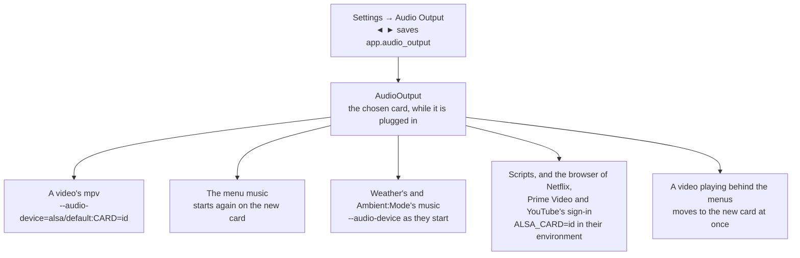

# Audio Output

Settings → **Audio Output** picks the sound card OSD/OS plays through: a Raspberry Pi's AV jack, one of its HDMI ports, or a USB sound card. This page covers where the setting is offered, how the cards are found and named, what each Pi has, how the choice reaches mpv, the menu music and everything else that plays, what happens when a chosen card is unplugged, where the choice is saved, volume, getting the sound to a CRT, and what to do when there is no sound.

## Where it is, and when

**Settings → Audio Output** is in Settings' Application section, under Display Output. Its help line reads: *Which sound card plays: the AV jack, HDMI or a USB sound card, from the moment it is chosen. [AUTO] The Pi's own default. [UNPLUGGED] Chosen but not plugged in: sound goes as on Auto until it is back.*

It is offered on Linux where the players talk to ALSA, the kernel's sound system, directly ([`src/audio/AudioOutput.cpp`](https://github.com/mehmetraif/OSD-OS/blob/main/src/audio/AudioOutput.cpp)):

- `/proc/asound/cards` exists, and
- no sound server sits in between: no PipeWire or PulseAudio socket in `$XDG_RUNTIME_DIR` (`pipewire-0`, `pulse/native`), and no `PULSE_SERVER` set.

That is the OSD/OS image, and Raspberry Pi OS Lite with OSD/OS installed. On a desktop (Raspberry Pi OS with its desktop, SteamOS, most Linux desktops) PipeWire or PulseAudio picks the card for what plays through it, so the row would do nothing and isn't shown: choose the output in the desktop's own sound settings. On macOS, use the Mac's sound settings.

## The cards and their names

OSD/OS reads ALSA's list of cards, `/proc/asound/cards`, and keeps those that can play: a card with a playback device (a `pcm*p` folder in `/proc/asound/card<N>/`). A webcam's microphone, say, isn't one. The list has two lines a card:

```text
 0 [Headphones     ]: bcm2835_headpho - bcm2835 Headphones
                      bcm2835 Headphones
```

The word in brackets is the card's **id** (`Headphones`), and after the dash comes its **short name** (`bcm2835 Headphones`). Settings names each card:

| The card | ALSA has it as | In Settings |
|---|---|---|
| A Pi's analog output, the AV jack | id `Headphones`, short name `bcm2835 Headphones` | **AV Jack** |
| A Pi's HDMI under full KMS (Pi 5) | ids `vc4hdmi0`, `vc4hdmi1` | **HDMI 0**, **HDMI 1** |
| A Pi's HDMI under the firmware's fake KMS (Pi 3, Pi 4 on the image) | short names `bcm2835 HDMI 1`, `bcm2835 HDMI 2` | **HDMI 0**, **HDMI 1** |
| Only one HDMI card | | **HDMI** |
| Any other card, a USB sound card say | its short name, the product's | that name, for example **USB Audio Device** |
| Two cards of one name | | the name with its id after it: **USB Audio Device (Device_1)** |

HDMI cards are numbered after the board's own ports, `HDMI0` and `HDMI1` as printed on a Pi 4 or a Pi 5, whichever driver names them. A Bluetooth speaker isn't an ALSA card, so it isn't listed.

The row offers, with ◄ ►: **Auto**, then each card that is there now, in ALSA's order, then a chosen card that isn't plugged in, marked **(Unplugged)**.

## What each Pi has

| Pi | AV Jack | HDMI | USB sound card |
|---|---|---|---|
| Pi 3 | ✓ (picture and sound on one jack) | one port: **HDMI** | ✓ |
| Pi 4 | ✓ (picture and sound on one jack) | two ports: **HDMI 0**, **HDMI 1** | ✓ |
| Pi 5 | none | two ports: **HDMI 0**, **HDMI 1** | ✓ |

- **A Pi 4 on composite** sends the picture and the sound out of the same AV jack: choose **AV Jack**. While composite or SCART RGB is the display output, a Pi 4's HDMI is off, and so is its HDMI sound ([Display Output](https://github.com/mehmetraif/OSD-OS/wiki/Display-Output)).
- **A Pi 5 has no AV jack and no analog sound at all.** On HDMI, the sound goes with the picture. On a CRT (composite from its TV pads, or SCART RGB), a USB sound card gives the TV its sound.
- **HDMI to a modern TV** carries the sound: choose the HDMI port the TV is on.

## What happens when you choose

The choice is saved and used at once. ALSA's own default (`/etc/asound.conf`) is left as it is: OSD/OS tells each player the card as it starts.



- **A video** is played by mpv started with `--audio-device=alsa/default:CARD=<id>`. That is ALSA's `default` device on that card: the card's own where ALSA has one (a USB card's mixes what plays at once; the Pi's HDMI under full KMS wants its samples framed as IEC958, which this does), else the card's first device, converting.
- **The menu music** stops and starts again, after a moment, on the new card. Since Settings is a menu, you hear the change straight away when menu music is on.
- **Weather's music and Ambient:Mode's music** play through the card chosen when they start.
- **Anything else OSD/OS starts** (a script, Chromium for Netflix, Prime Video or YouTube's sign-in) gets `ALSA_CARD=<id>` in its environment, which ALSA's `default` device follows.
- **A video playing behind the menus** (Transparent Background) moves to the new card as it plays: OSD/OS sets mpv's `audio-device` property, `auto` for Auto. An mpv process can't be playing while Settings is up; the next one starts with the card.
- **OSD/OS's own environment isn't touched.** Each player is told; nothing else changes.

From the code, every mpv OSD/OS starts takes these options:

```cpp
QString AudioOutput::mpvDevice() {
    const QString id = card();
    // ALSA's default device on that card: the card's own where ALSA has one
    // (a USB card's mixes what plays at once, the Pi's HDMI wants its
    // samples framed as IEC958), else the card's first device, converting.
    return id.isEmpty() ? QString() : QStringLiteral("alsa/default:CARD=%1").arg(id);
}

QStringList AudioOutput::mpvArgs() {
    const QString device = mpvDevice();
    if (device.isEmpty())
        return {};
    return { QStringLiteral("--audio-device=%1").arg(device) };
}
```

### Auto

**Auto** puts nothing on mpv's command line and nothing in anyone's environment: sound goes wherever it would without OSD/OS. That is ALSA's `default` device, which is the first card ALSA found unless you set it otherwise, and it is not always the card you are plugged into. Two places set it outside OSD/OS, and they apply only on Auto: a card chosen in Settings wins over both.

- **For every program**, `/etc/asound.conf`, with the card's id:

  ```text
  defaults.pcm.card "Headphones"
  defaults.ctl.card "Headphones"
  ```

- **For mpv only**, `~/.config/mpv/mpv.conf` of the user OSD/OS runs as (on the image, `/home/pi/.config/mpv/mpv.conf`):

  ```ini
  audio-device=alsa/default:CARD=Headphones
  ```

  `mpv --audio-device=help` lists the devices mpv accepts. mpv.conf is read by an mpv process, not by a video played inside OSD/OS with Transparent Background, and not by the menu music, which starts mpv with `--no-config`. This is the precedence of mpv's options at work ([Playback and mpv](https://github.com/mehmetraif/OSD-OS/wiki/Playback-and-mpv)): what OSD/OS puts on the command line wins over mpv.conf.

### A card that is unplugged

A chosen card that isn't plugged in stays chosen. While it is gone, the row shows it as **<name> (Unplugged)**, and sound goes as on Auto. The card is looked up again each time something starts to play, so once it is plugged back in, the next video, the next start of the menu music, the next script uses it again, until another card is chosen. The log says which way it went at start and at each change:

```text
[AudioOutput] Sound through Headphones
[AudioOutput] Sound through ALSA's default card, Device being unplugged
```

## Where it is saved

`app.audio_output` in `config.json` ([Configuration files](https://github.com/mehmetraif/OSD-OS/wiki/Configuration-Files)): `""` for Auto, else the card's id and its name when it was chosen, so the row can name it while it is unplugged.

| Setting | Values | Default | What it does | Config key |
|---|---|---|---|---|
| Audio Output | Auto, then each card there is (AV Jack, HDMI, HDMI 0, HDMI 1, a USB card's name), and a chosen card that is gone, marked (Unplugged) | Auto | The sound card every player plays through | `app.audio_output` |

```json
{
  "app": {
    "audio_output": { "card": "Headphones", "name": "AV Jack" }
  }
}
```

For a Pi 5's first HDMI port it would be `{ "card": "vc4hdmi0", "name": "HDMI 0" }`. Edited by hand, with OSD/OS stopped, it applies at its next start.

## Volume

OSD/OS has no system volume setting. There are three volumes, each its own:

| What | Changed with | Saved |
|---|---|---|
| **The menu music** | Settings → **Music Volume**, a slider from QUIET to LOUD in steps of 10, offered while Menu Music isn't Off. It changes as the slider moves | `app.menu_music_volume`, 0 to 100, 60 when unset |
| **A video** | A keyboard's or remote's volume keys (volume up, volume down, mute) while it plays: steps of 5, with a VOLUME bar, MUTE while muted ([Controls](https://github.com/mehmetraif/OSD-OS/wiki/Controls)) | No. Each video starts afresh at mpv's own volume (100), or at `volume=` in mpv.conf for an mpv process |
| **The sound card itself** | `alsamixer`, or `amixer`, from a shell | `sudo alsactl store` keeps it across reboots |

The volume keys go to mpv, never to the menus, and hold to repeat. With Transparent Background they also reach a video playing behind the menus. They don't change the menu music, nor Weather's or Ambient:Mode's music, which play at mpv's own volume. [Menu music](https://github.com/mehmetraif/OSD-OS/wiki/Menu-Music) has more on it.

## Getting the sound to a CRT

| Pi and picture | Sound from | To the TV |
|---|---|---|
| Pi 3 or 4, composite | The AV jack (Settings: **AV Jack**) | The same 4-pole cable as the picture: tip left, ring 1 right, ring 2 ground. To SCART: pins 6 (left), 2 (right), 4 (ground) |
| Pi 4, SCART RGB | The AV jack, whose pins are inside the Pi, clear of the GPIO pins | SCART pins 6, 2 and 4 |
| Pi 5, composite or SCART RGB | A USB sound card (its name in Settings) | Its line out to SCART pins 6, 2 and 4, or to the TV's audio inputs |
| Any Pi, HDMI | The HDMI port the TV is on (**HDMI**, **HDMI 0** or **HDMI 1**) | The HDMI cable |

[Display Output → The cables](https://github.com/mehmetraif/OSD-OS/wiki/Display-Output#the-cables) has the whole SCART plug.

## When there is no sound

1. **Choose the card.** In Settings → Audio Output, choose the card you are plugged into rather than Auto. On Auto the sound goes to ALSA's first card, which may not be that one.
2. **See what ALSA has.** From a shell (Exit to Terminal, or SSH; `alsa-utils` is on the image):

   ```sh
   aplay -l                  # the cards that play, and their devices
   cat /proc/asound/cards    # the same, with each card's id in brackets
   ```

3. **Try the card on its own**, from Exit to Terminal (OSD/OS isn't running then, so nothing else holds the card), with its id from the list:

   ```sh
   speaker-test -D default:CARD=Headphones -c 2 -t wav -l 1
   ```

   It says "Front Left" and "Front Right". Silence here means the card, the cable or the TV, not OSD/OS.
4. **Quiet on the AV jack?** Raise the card's own level, and keep it ([INSTALL.md](https://github.com/mehmetraif/OSD-OS/blob/main/INSTALL.md)):

   ```sh
   amixer sset PCM 100%
   sudo alsactl store
   ```

   `amixer` changes the default card; `amixer -c Headphones sset PCM 100%` names the AV jack's. `alsamixer` does the same with a picture of the levels: F6 picks the card.
5. **Read what OSD/OS did.**

   ```sh
   journalctl -b -u osdos | grep AudioOutput
   ```

   `Sound through <id>` is the card in use; `ALSA's default card` means Auto, or a chosen card that is unplugged. mpv's own log, `/tmp/osdos-mpv.log`, says why a video's sound couldn't open.
6. **Check the other end.** The TV's input and volume; the right HDMI port of two; on SCART, pins 6 and 2 with ground on 4.

| What you see | Why, and what to do |
|---|---|
| No Audio Output row | A sound server is running (a desktop), or it isn't Linux. Choose the output in the system's sound settings |
| A Pi 4 on composite, sound only on HDMI or nowhere | Choose **AV Jack**: Auto may be on an HDMI card, which composite turns off |
| A Pi 5 on a CRT, no sound | It has no analog sound: plug in a USB sound card and choose it |
| HDMI 0 and HDMI 1, one silent | The TV is on the other port. Pick by the port's label on the board |
| The card shows **(Unplugged)** | It isn't plugged in, or ALSA doesn't see it (`aplay -l`). Sound goes as on Auto until it is back |
| Sound in the menus but not in a video, or the other way round | A video's mpv and the menu music both take the card from Settings; on Auto, an `audio-device=` in mpv.conf applies to videos only. Check mpv.conf, and `/tmp/osdos-mpv.log` |

## See also

- [Display Output](https://github.com/mehmetraif/OSD-OS/wiki/Display-Output): the picture, and the SCART plug
- [Menu music](https://github.com/mehmetraif/OSD-OS/wiki/Menu-Music): what plays under the menus, and its volume
- [Playback and mpv](https://github.com/mehmetraif/OSD-OS/wiki/Playback-and-mpv): mpv's options and mpv.conf
- [Settings](https://github.com/mehmetraif/OSD-OS/wiki/Settings): every row
- [Configuration files](https://github.com/mehmetraif/OSD-OS/wiki/Configuration-Files): config.json
- [The OSD/OS image](https://github.com/mehmetraif/OSD-OS/wiki/The-OSD-OS-Image)
- [Troubleshooting](https://github.com/mehmetraif/OSD-OS/wiki/Troubleshooting)
