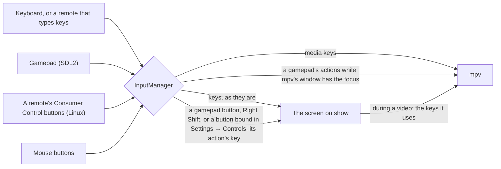

# Controls

Every way to drive OSD/OS: a keyboard, a remote, a gamepad, a mouse. This page lists what each key and button does, on the menus and during a video; how gamepads and remotes reach OSD/OS; how to give an action one more button in Settings → Controls, or remap a gamepad in `input.cfg`; the hints at the foot of the screen; and pairing Bluetooth devices in Settings → Bluetooth.


## The actions

All of OSD/OS works with a handful of actions. Every screen reads them as key presses, so a keyboard, a remote and a gamepad all do the same thing.

| Action | Keyboard | Gamepad (by default) | Remote | What it does |
|---|---|---|---|---|
| **Up**, **Down** | ▲ ▼ | D-pad, left stick | Its arrows | Move through a list. During a video: open the deck's menu |
| **Left**, **Right** | ◄ ► | D-pad, left stick, LB / RB (the shoulder buttons) | Its arrows | Change a setting. In a tree: up a level, open a folder. During a video: jump back and forward |
| **► on an entry** | ► | D-pad right, RB | Its right arrow | A video's options, or its info screen |
| **Select** | Enter | A (the bottom face button) | OK | Open, play, choose. During a video: pause |
| **Back** | Esc, Backspace or Right Shift | B (the right face button), or Back (the small Back / Select / View / Share button) | Back, when it sends Esc, Backspace or the Back key | One step back. On the main menu: Settings. During a video: leave it, or open its menu |
| **Hold back** (2 seconds) | Esc (not Backspace) | B or Back | Back, when it sends Esc or the Back key | Closes Netflix's, Prime Video's or YouTube's sign-in browser and returns to OSD/OS |
| **Play/pause** | Space | Start | Its Play/Pause key only pauses: a media key goes straight to mpv | Pause a video. On the main menu: stop the video playing behind the menus. In Netflix's, Prime Video's or YouTube's tree: open the info screen |
| **Info** | I | | Its Info key | Open a title's info screen (Netflix, Prime Video, YouTube) |

Apart from typing, Ctrl+Q and the media keys, only these keys do anything in OSD/OS's own screens; a key a screen doesn't use does nothing there. If a remote's button sends none of them, give it an action in [Settings → Controls](https://github.com/mehmetraif/OSD-OS/wiki/Controls#settings--controls-one-more-button-per-action).

## The keyboard

| Key | What it does |
|---|---|
| ▲ ▼ ◄ ► | The arrows |
| Enter | Select. The keypad's Enter selects in the trees, the dialogs and during a video, but not on every screen (not on the main menu or in Settings): use the main one |
| Esc | Back. Held for 2 seconds while Netflix, Prime Video or YouTube's sign-in has the screen, it closes the browser |
| Backspace | Back, except on the on-screen keyboard, where it deletes the last letter, and in a browser OSD/OS opened, where it is the browser's |
| Right Shift | Back, so a keyboard works one-handed. While a text field has the focus (typing a server's address, say) it is Shift again, to type `:` or `@` |
| Space | Play/pause |
| I | A title's info screen, in Netflix, Prime Video and YouTube |
| Letters, digits, punctuation | On the on-screen keyboard, they type straight in (the box jumps to OK, so Enter then finishes) |
| Ctrl+Q (⌘Q on a Mac) | Quits OSD/OS at once, from most screens, without asking. Started with the system (the OSD/OS image, or `install.sh`'s service), that switches the Pi off, as Settings → Quit → Power Off does |
| Ctrl+W | In Netflix, Prime Video or YouTube's sign-in, closes the browser |
| Media keys | Go to mpv: [During playback](https://github.com/mehmetraif/OSD-OS/wiki/Controls#during-playback) |

The keys go to whichever window has the keyboard. On the Raspberry Pi (and with [Transparent Background](https://github.com/mehmetraif/OSD-OS/wiki/Using-OSD-OS#transparent-background) everywhere), OSD/OS keeps it and passes the keys a video needs on to mpv. On a Mac or a Linux desktop, a video played by mpv as a program of its own has its own window, which has the keyboard while it plays: OSD/OS's keys work there as below, and so do mpv's own keys. Right Shift doesn't work in a video there, as mpv can't take a lone Shift as a key.

## During playback


| Key | The deck's menu closed | The deck's menu open |
|---|---|---|
| ▲ or ▼ | Opens the deck's menu, on its buttons | ▲ goes to the position bar, ▼ to the buttons |
| ◄ ► | Jump 5 seconds back or forward (mpv's own keys) | On the position bar: jump 10 seconds. On the buttons: move between them |
| Select | Pause / play | Press the button: SKIP, AUDIO, SUBTITLE, CROP, the playlist's < and >, STOP |
| Play/pause | Pause / play | Pause / play |
| Back | Leave the video, or open its menu ([Back during a video](https://github.com/mehmetraif/OSD-OS/wiki/Using-OSD-OS#back-during-a-video)) | Close the deck's menu |

The deck's menu also closes by itself after 5 seconds without a key. A gamepad's buttons do the same as the keys they stand for.

**Media keys**, on a keyboard or a remote that sends them as keys, always go to mpv. They do nothing while no video plays (one playing behind the menus counts):

| Media key | What it does |
|---|---|
| Volume Up, Volume Down | The volume, 5% a press (held, it carries on), with a VOLUME bar on screen |
| Mute | Mutes or unmutes; the bar reads MUTE |
| Play/Pause, Play, Pause | Pause / play |
| Stop | Ends the video |
| Fast Forward | Jumps 30 seconds forward, and shows the deck's menu with the new place |
| Rewind | Jumps 10 seconds back, and shows the deck's menu |
| Next, Previous | The next or previous chapter, and shows the deck's menu |

## Gamepads

OSD/OS reads gamepads through SDL2's game controller support, which knows most pads (Xbox, PlayStation, 8BitDo, Nintendo-style and the many pads that copy them) and gives all of them the same layout. A gamepad can be plugged in or switched on at any time, and a Bluetooth one works once it is paired ([below](https://github.com/mehmetraif/OSD-OS/wiki/Controls#bluetooth)).

### The default buttons

Buttons are named by **where they are**, on an Xbox pad's layout: `a` is always the bottom face button (south), `b` the right one (east), `x` the left one (west), `y` the top one (north), whatever is printed on them. So the same button selects on an Xbox pad, an 8BitDo and a PlayStation pad, where it is labelled A, B or ✕.

| Button or stick | Action |
|---|---|
| D-pad | Up, Down, Left, Right |
| Left stick | Up, Down, Left, Right (it acts once pushed past half-way, and lets go below about a third) |
| South face button (`a`) | Select |
| East face button (`b`) | Back |
| Back / Select / View / Share (`back`) | Back |
| Start / Options / Menu (`start`) | Play/pause |
| LB, RB (`leftshoulder`, `rightshoulder`) | Left, Right: during a video, jump back and forward |

The west and north face buttons, the right stick, the triggers and the Guide button do nothing until you give them an action in `input.cfg`. A direction held on the D-pad or the stick repeats, after 0.4 seconds and then every 0.1 seconds, as a keyboard's arrow does.

### How a gamepad becomes key presses

Each button becomes an action, and each action the key it stands for: Up, Down, Left and Right the arrows, Select Enter, Back Esc, Play/pause Space. OSD/OS hands that key to the screen on show, exactly as if it had been pressed on a keyboard, so every screen works with a gamepad without knowing one is there. When mpv's own window has the focus (a video on a Mac), the action goes straight to mpv instead, as the key mpv knows it by.



A few things it takes care of:

- **The Steam Deck, and Steam.** With Steam running, Steam Input shows a "Steam Virtual Gamepad" beside the pads it mirrors, and each press would arrive twice, the second half a second late. While that virtual gamepad is there, OSD/OS listens to it alone.
- **One press, once.** A press of an action already held is dropped, so a pad seen twice can't double every move.
- **Unplugged mid-press**, nothing is left held or repeating.
- **On a manual install run by hand**, reading a gamepad needs your user in the `input` group: `sudo usermod -aG input $USER`, then reboot. The autostart service and the OSD/OS image give it that access already.

### Remapping a gamepad: input.cfg

Settings → Controls takes keys and remote buttons, not gamepad buttons. A gamepad is remapped in a text file, `input.cfg`, in the data folder (`~/.local/share/OSD-OS/input.cfg` on Linux and the Pi, `~/Library/Application Support/OSD-OS/input.cfg` on a Mac). You only write what you want to change: everything else keeps its default. OSD/OS reads it again as soon as it is saved, so you can try changes without restarting.

```text
# input.cfg: OSD/OS's gamepad buttons. One binding per line: <input> <action>
x              play_pause     # the west face button pauses too
y              back           # and the north one goes back
righty-        up             # the right stick moves, as the left one does
righty+        down
rightx-        left
rightx+        right
rightshoulder  none           # RB no longer moves right
label south    B              # a pad printed like a Switch's that says it is an Xbox one:
label east     A              # the hints show what is printed on its buttons
```

- **A binding** is `<input> <action>`. The actions are `up`, `down`, `left`, `right`, `select`, `back`, `play_pause`, and `none`, which takes a button's action away.
- **Buttons** take SDL's names: `a`, `b`, `x`, `y`, `back`, `guide`, `start`, `leftstick`, `rightstick`, `leftshoulder`, `rightshoulder`, `dpup`, `dpdown`, `dpleft`, `dpright`, `misc1`, `paddle1` to `paddle4`, `touchpad`; or their long forms (`SDL_CONTROLLER_BUTTON_A`); or the positions `south`, `east`, `west` and `north`.
- **Sticks and triggers** take a direction after their name: `leftx-` (left), `leftx+` (right), `lefty-` (up), `lefty+` (down), the same for `rightx` and `righty`, and `lefttrigger+` and `righttrigger+` (or `triggerleft+`, `triggerright+`). A line binds that one direction.
- **`label <button> <text>`** sets what the hints at the foot of the screen call a button. OSD/OS already shows what is printed on the pad touched last, by the type the pad reports (a Nintendo pad has B at the bottom; a PlayStation pad shows X, O, SQ and TR). A pad that reports the wrong type, as many Nintendo-style pads in X-input mode do, gets the right names with `label` lines.
- Upper or lower case doesn't matter (a label's text keeps its own). `#` starts a comment. A line OSD/OS can't read is skipped, with a warning in the log naming its line number.

**A pad SDL doesn't know** at all can be taught with the community's [gamecontrollerdb.txt](https://github.com/mdqinc/SDL_GameControllerDB): put the file in the data folder, beside `input.cfg`. It is read as OSD/OS starts, so restart it after adding the file.

## Remotes

- **Remotes that type keys.** Most USB remotes, and the 2.4 GHz ones with a USB dongle, present themselves as a keyboard: their arrows, OK and Back arrive as keys, and work as the keyboard's do. Bluetooth remotes are paired in [Settings → Bluetooth](https://github.com/mehmetraif/OSD-OS/wiki/Controls#bluetooth) and then work the same way. What a button sends depends on the remote: if one does nothing, give it an action in Settings → Controls.
- **Consumer Control buttons.** Some remotes send their extra buttons (Home, Back, Menu, the colored buttons, zoom, the media buttons) from a second device of their own, named "Consumer Control", beside the keyboard one. Without a desktop, as on the Pi, those buttons never reach OSD/OS as keys. So on Linux OSD/OS reads that device itself, and its buttons do something only once you give them an action in Settings → Controls. It looks for one as it starts, and takes the first it finds: plug the remote's dongle in before OSD/OS starts (on the image, before switching the Pi on).
- **Air mice.** Some remotes are a mouse, their OK a left click. Give the click an action in Settings → Controls (Select, say).
- **Media keys** (volume, play/pause, stop, skipping) that a remote sends as keys go to mpv, as a keyboard's do ([During playback](https://github.com/mehmetraif/OSD-OS/wiki/Controls#during-playback)).

### HDMI-CEC

OSD/OS has no HDMI-CEC support: a TV's own remote, passed on over HDMI, doesn't drive it. Use a USB, 2.4 GHz or Bluetooth remote, a keyboard or a gamepad.

## Settings → Controls: one more button per action

Settings → **Controls** gives each of six actions one more button, from a keyboard, a remote or a mouse: a remote's OK that sends a key OSD/OS doesn't use, say, or its Home button for Back. The action's own key keeps working beside it, so a bad choice can never lock you out of the menus.

| Row | What it does |
|---|---|
| **Up**, **Down**, **Left**, **Right**, **Select / OK**, **Back** | Each reads `DEFAULT`, or `DEFAULT + ` the extra button's name. Select opens **New button**: press the button to give that action |
| **Reset to Defaults** | Takes every extra button away |

- On the **New button** screen ("Press a new button for [Select / OK]"), the next key, remote button or mouse button you press is the action's. Esc, Backspace, or a Back key that arrives as a key, cancel instead (and so does Right Shift, which stands for back), so those can't be chosen; a gamepad's back buttons cancel too.
- **One button, one action**: a button given to an action is taken off any other.
- **What can be chosen:** any keyboard key, a remote's Consumer Control buttons (Linux), and a mouse's buttons. **Not** a gamepad's buttons (remap those in [input.cfg](https://github.com/mehmetraif/OSD-OS/wiki/Controls#remapping-a-gamepad-inputcfg)), and **not Play/pause**, which has no row here.
- An extra *key* doesn't act while a text field has the focus, so typing still types; nor while Netflix, Prime Video or YouTube's sign-in has the screen.
- A Consumer Control or mouse button given a direction repeats while held, after 0.4 seconds and then every 0.1 seconds, as a held arrow does. The hints at the foot of the screen still name the actions' own keys.

**How it is saved.** In `config.json`, under `app.remote_keymap`, a number per action; `0` (or nothing) means no extra button. The number says which button:

| Button | Saved as | Example | Shown as |
|---|---|---|---|
| A key (from a keyboard, or a remote that types keys) | Qt's code for the key | the Menu key: `16777301` | `MENU` |
| A Consumer Control button (Linux) | 33554432 (`0x02000000`) + the Linux key code | its Back button, `KEY_BACK` 158: `33554590` | `BACK` |
| A mouse button | 50331648 (`0x03000000`) + Qt's code for the button | the left click, 1: `50331649` | `MOUSE: LEFT CLICK` |

For example, an air mouse remote whose OK is a left click and whose Back button comes from a Consumer Control device:

```json
{
  "app": {
    "remote_keymap": {
      "up": 0,
      "down": 0,
      "left": 0,
      "right": 0,
      "select": 50331649,
      "back": 33554590
    }
  }
}
```

The screen saves these as you choose, and OSD/OS takes them up at once. A change made to `config.json` by hand is read as OSD/OS starts: edit it while OSD/OS isn't running ([Configuration files](https://github.com/mehmetraif/OSD-OS/wiki/Configuration-Files)).

| Setting | Values | Default | What it does | Config key |
|---|---|---|---|---|
| Controls → Up, Down, Left, Right, Select / OK, Back | DEFAULT, or DEFAULT + a button | DEFAULT | One more button for that action | `app.remote_keymap.up`, `.down`, `.left`, `.right`, `.select`, `.back` |

## The hints at the foot of the screen

The bar at the foot of every screen names the keys that work there (`[ESC]:BACK [▲▼]:NAVIGATE [◄►]:CHANGE [ENTER]:SELECT`), and follows the last thing you pressed: a key on a keyboard (or a remote that types keys) puts the keyboard's names there, a gamepad button the gamepad's. The arrows keep their arrows on both.

| Hint | Keyboard | Xbox-style pad | Nintendo pad | PlayStation pad |
|---|---|---|---|---|
| Back | `[ESC]` | `[B]` | `[A]` | `[O]` |
| Select | `[ENTER]` | `[A]` | `[B]` | `[X]` |
| Play/pause | `[SPACE]` | `[START]` | `[START]` | `[START]` |
| Navigate | `[▲▼]` | `[▲▼]` | `[▲▼]` | `[▲▼]` |
| The trees' arrows | `[▲▼◄►]` | `[▲▼◄►]` | `[▲▼◄►]` | `[▲▼◄►]` |
| Change | `[◄►]` | `[◄►]` | `[◄►]` | `[◄►]` |
| Options or info | `[►]` | `[►]` | `[►]` | `[►]` |

A gamepad's names come from the pad touched last, by the type it reports, and from `input.cfg`: the hint for an action names the first button bound to it, in SDL's order (`a`, `b`, `x`, `y`, `back`, `guide`, `start`, …: so `x play_pause` makes the play/pause hint `[X]`, but `y back` leaves the back hint `[B]`), and a `label` line renames a button. An action with no gamepad button keeps the keyboard's name. Settings → **Hint Bar** takes the bar away (`app.hint_bar`: `Off`); the keys work as they always do.

## Bluetooth

<table>
<tr><th width="50%">Bluetooth</th><th width="50%">Pairing a keyboard</th></tr>
<tr><td></td><td></td></tr>
<tr><td>Search finds what is in pairing mode nearby for a minute, keyboards, gamepads and the like. Select pairs one and connects it, and it comes back by itself after a restart. Select on a paired one connects, disconnects or forgets it.</td><td>A keyboard is paired by typing the code it asks for, then its Enter. The digits light up as they are typed.</td></tr>
</table>

Settings → **Bluetooth** pairs a Bluetooth keyboard, gamepad or remote from the couch. It talks to BlueZ, Linux's Bluetooth service, so it is there on Linux (the Raspberry Pi included); on a Mac, pair devices in macOS's own Bluetooth settings. The title bar names the Bluetooth adapter.

| Line | What it does |
|---|---|
| **Bluetooth** · On / Off | Select, ◄ or ► switch Bluetooth on or off |
| **Details** | Only when Bluetooth wouldn't switch on: what the system says about it ([below](https://github.com/mehmetraif/OSD-OS/wiki/Controls#when-bluetooth-wont-switch-on)) |
| **Search** | Select looks for devices for a minute (`SEARCHING…`); select again stops |
| **Paired** | The devices paired already, each with `CONNECTED` or `PAIRED` |
| **Found** | What the search has found, in the order it answered, each with what it says it is: `KEYBOARD`, `MOUSE`, `KEYBOARD+MOUSE`, `GAMEPAD`, `REMOTE`, `TABLET`, `AUDIO`, `PHONE`, `COMPUTER`, or `NEW` |

The help line says what the selected line is for, or how the last thing you did went.

### Pairing

1. Put the device in pairing mode (its manual says how), close to the Pi.
2. Select **Search**. Devices appear under **Found** as they answer; one that hasn't said its name yet is left out until it does.
3. Select the device. The search stops, and the line reads `PAIRING…`, then `CONNECTING…`.
4. What happens next depends on the device:
   - **A keyboard** asks for a code: **Pairing** comes up over the list, with the device's name, "Type this code on it, then press its Enter key", and the code, a box per digit. Type it on the keyboard you are pairing, then its Enter; on a keyboard that reports the digits as they are typed, each box goes solid. An older keyboard gets a PIN to type the same way.
   - **A phone** shows a code of its own, and OSD/OS asks "Does it show this code?": answer **Yes** or **No** (▲ ▼, then select).
   - **A gamepad, a mouse or a remote** has nothing to show, and pairs without a question.
   - Back, on the code, gives the pairing up.
5. Once paired, OSD/OS marks the device as trusted and connects it. A trusted device comes back by itself after a restart, a keyboard at its first key press, with nothing to do here. A paired gamepad is a gamepad like any other to OSD/OS, a keyboard or remote a keyboard.

Select on a **paired** device offers **Connect** (or **Disconnect**, when it is connected) and **Forget**, which unpairs it. Leaving the page stops a search and gives up a pairing, as nothing would show its code any more.

When something goes wrong, the help line says what, in a few words:

| Message | Means |
|---|---|
| `pairing failed, was the code typed right?` | The code typed didn't match |
| `pairing took too long` | Nothing came back within the two minutes pairing allows |
| `pairing canceled`, `pairing declined` | Back was pressed, or the device said no |
| `no answer, is it on, close by and in pairing mode?` | The device didn't answer |
| `it has gone out of reach` | The device went away |
| `Bluetooth is off` | Switch it on first (Search does) |
| `Couldn't turn Bluetooth on: rfkill blocks it` | A software switch keeps the radio off ([below](https://github.com/mehmetraif/OSD-OS/wiki/Controls#when-bluetooth-wont-switch-on)) |

### Who may use Bluetooth

OSD/OS talks to BlueZ as the user it runs as, which BlueZ lets in through the `bluetooth` group: the OSD/OS image and `install.sh` put that user in it. On a system you set up yourself, `sudo usermod -aG bluetooth $USER` (then log in again). Settings → Bluetooth needs Qt D-Bus at build time (`qt6-base-dev` has it); a build without it has no Bluetooth line.

### On the OSD/OS image

- **BlueZ starts after OSD/OS.** The image starts Bluetooth once OSD/OS is on screen, its line on the boot screen (`[ OK ] BLUETOOTH`). Settings → Bluetooth waits for it to be up rather than starting it early.
- **rfkill never blocks it.** Raspberry Pi OS starts every radio blocked (`rfkill.default_state=0`), so that Wi-Fi stays off until its country is set, and then unblocks Bluetooth only on the adapters pi-gen knows by device path. The Pi 4 this was found on wasn't one of them: its adapter stayed blocked, and BlueZ couldn't switch it on. The image runs `rfkill unblock bluetooth` as the Bluetooth service starts, so OSD/OS's switch is the only one.

### When Bluetooth won't switch on

Switching on is tried a second time two seconds later, as the Bluetooth service may still be setting the adapter up. If it fails again, the help line says why, and a **Details** line appears: select it for what the system says, ready to photograph and send with a bug report. It shows the adapter as BlueZ has it (its address, and whether it is powered), rfkill's switches for Bluetooth (soft and hard, blocked or not), and the last 20 different lines about Bluetooth in this boot's system log (those mentioning `bluetooth`, `hci`, `rfkill`, `bthelper`, `bcm` or `brcm`), each once, with how many times it came (`(x3)`). ▲ ▼ scroll it; back or select closes it.

An adapter rfkill blocks isn't tried again: BlueZ only answers "Failed" for one. From a shell on the Pi you can look for yourself:

```sh
rfkill list bluetooth
journalctl -b -u bluetooth
bluetoothctl show
```

## The mouse

A mouse, or a keyboard's touchpad, shows OSD/OS's own pointer while it moves, drawn in the screen's pixels and colors, and the pointer goes again once the mouse has been still for a few seconds. Moving it also counts as being there: it wakes the screen saver (not with Mouse Pointer Off). The menus still go by keys, though: a click selects nothing. To make a mouse button do something, give it an action in [Settings → Controls](https://github.com/mehmetraif/OSD-OS/wiki/Controls#settings--controls-one-more-button-per-action), where it shows as `MOUSE: LEFT CLICK`, `MOUSE: RIGHT CLICK`, `MOUSE: MIDDLE CLICK`, `MOUSE: BACK` or `MOUSE: FORWARD`. A button given an action works whatever Mouse Pointer is set to, and every press of it is that action and nothing else.

| Setting | Values | Default | What it does | Config key |
|---|---|---|---|---|
| Mouse Pointer | Off, 2 sec, 5 sec, 10 sec, 30 sec, Always | 5 sec | How long the pointer stays after the mouse stops. **Off**: never shown. **Always**: it stays | `app.mouse_pointer` (`off`, `2`, `5`, `10`, `30`, `always`) |

## Other inputs

An NFC reader is an input of its own: tapping a card plays the video it is mapped to ([NFC Reader](https://github.com/mehmetraif/OSD-OS/wiki/NFC-Reader)). A script that takes over the screen owns the keys until it exits, and back does nothing in OSD/OS meanwhile ([Scripts](https://github.com/mehmetraif/OSD-OS/wiki/Scripts)).

## See also

- [Using OSD/OS](https://github.com/mehmetraif/OSD-OS/wiki/Using-OSD-OS): what the actions do on each screen
- [Settings](https://github.com/mehmetraif/OSD-OS/wiki/Settings): every row of Settings
- [Configuration files](https://github.com/mehmetraif/OSD-OS/wiki/Configuration-Files): `config.json`, `input.cfg` and the data folder
- [Playback and mpv](https://github.com/mehmetraif/OSD-OS/wiki/Playback-and-mpv): how a video plays, and mpv's keys and scripts
- [Troubleshooting](https://github.com/mehmetraif/OSD-OS/wiki/Troubleshooting): when a device isn't seen
- [How it works](https://github.com/mehmetraif/OSD-OS/wiki/How-It-Works): the input path inside the app
