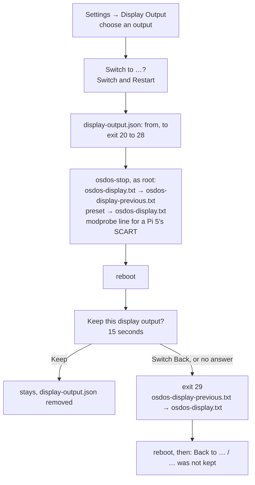
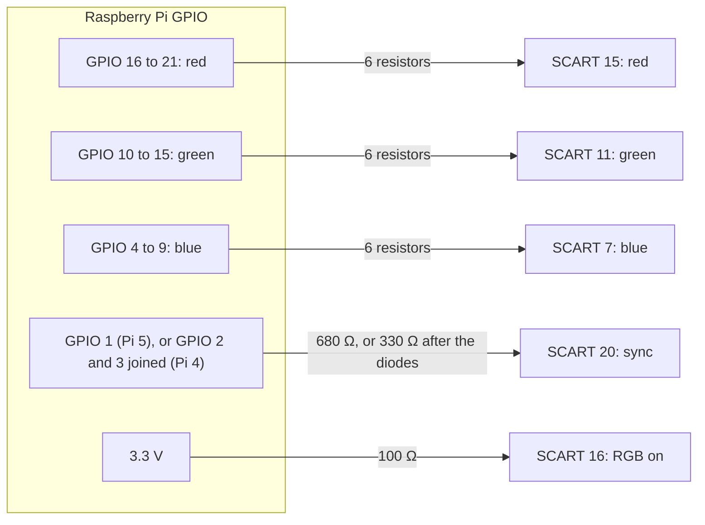

# Display Output

Settings → **Display Output**, on the OSD/OS image, switches where the picture goes: HDMI, composite, or RGB for SCART through a cable on the GPIO pins, among the outputs your Raspberry Pi has. This page covers how OSD/OS knows which Pi it runs on, every output each model offers, exactly what each one writes to the boot partition, the switch and its keep-or-go-back question, the cables, overscan and the safe area, setting the output by hand (on the image and on an app install), and what to do about a black screen.

## Where it is, and when

**Settings → Display Output** is in Settings' Application section, its value the output in force (`HDMI`, `Composite PAL`, …). Its help line reads: *Where the picture goes, among the outputs this Pi has: a change restarts OSD/OS, and the new output stays only when you keep it on its screen, else the old one comes back in 15 seconds.*

The row is there only when all of this holds ([`src/display/DisplayOutput.cpp`](https://github.com/mehmetraif/OSD-OS/blob/main/src/display/DisplayOutput.cpp)):

1. `/boot/firmware/osdos-display.txt` exists, as on the OSD/OS image, with the presets beside it.
2. OSD/OS was started by its service (`OSDOS_AUTOSTART` set), whose stop helper writes the presets as root.
3. The launcher is level 3 or later (`OSDOS_LAUNCHER_API`), so the stop helper knows how.
4. The Pi has more than one output to choose from.

So it isn't offered on macOS, SteamOS or desktop Linux, on Raspberry Pi OS with the app installed (unless you add the presets, see [On an app install](https://github.com/mehmetraif/OSD-OS/wiki/Display-Output#on-an-app-install)), when `osdos` is started by hand from a shell, or on a board OSD/OS doesn't know.

| Setting | Values | Default | What it does | Config key |
|---|---|---|---|---|
| Display Output | The outputs this Pi has ([What each Pi offers](https://github.com/mehmetraif/OSD-OS/wiki/Display-Output#what-each-pi-offers)); **Custom** when the file in force matches none | HDMI (the image's build setting `OSDOS_DISPLAY`) | Where the picture goes. A change restarts the Pi, and stays only when kept | None: the choice is the file `/boot/firmware/osdos-display.txt`, not a key in `config.json` |

## How OSD/OS knows which Pi it is

[`src/util/Board`](https://github.com/mehmetraif/OSD-OS/blob/main/src/util/Board.cpp) reads the model from the device tree, once: `/proc/device-tree/model`, for example `Raspberry Pi 4 Model B Rev 1.5`. The family comes from how the name starts:

```cpp
Family family() {
    const QString m = model();
    if (m.startsWith(QLatin1String("Raspberry Pi 5")))
        return Family::Pi5;
    if (m.startsWith(QLatin1String("Raspberry Pi 4")))
        return Family::Pi4;
    if (m.startsWith(QLatin1String("Raspberry Pi 3")))
        return Family::Pi3;
    return Family::Other;
}
```

| The model starts with | Family | Notes |
|---|---|---|
| `Raspberry Pi 3` | Pi 3 | 3 B, 3 B+, 3 A+ |
| `Raspberry Pi 4` | Pi 4 | The Pi 400 too, as a keyboard model |
| `Raspberry Pi 5` | Pi 5 | The Pi 500 too, as a keyboard model |
| anything else | none | Compute Modules, Zero 2 W and others: no Display Output row |

A keyboard model (`Raspberry Pi 400`, `Raspberry Pi 500`) has no composite output of its own: no AV jack, no TV pads. To see what your Pi says, run `cat /proc/device-tree/model`; the Display Output chooser shows it too, under its title. `OSDOS_BOARD_MODEL` stands in for the model, for tests.

The same family picks mpv's decoding flags ([Playback and mpv](https://github.com/mehmetraif/OSD-OS/wiki/Playback-and-mpv)).

## What each Pi offers

The menu lists, in this order, the presets that are on the boot partition and that the board has:

| In the menu | Preset (`osdos-display-<id>.txt`) | Pi 3 | Pi 4 | Pi 400 | Pi 5 | Pi 500 |
|---|---|---|---|---|---|---|
| HDMI | `hdmi` | ✓ | ✓ | ✓ | ✓ | ✓ |
| Composite NTSC | `crt-ntsc` | AV jack | AV jack | | TV pads | |
| Composite PAL | `crt-pal` | AV jack | AV jack | | TV pads | |
| GPIO Composite NTSC | `crt-gpio-ntsc` | | | | ✓ | ✓ |
| GPIO Composite PAL | `crt-gpio-pal` | | | | ✓ | ✓ |
| SCART RGB NTSC | `scart-rgb-ntsc` (480i) | | ✓ | ✓ | ✓ | ✓ |
| SCART RGB PAL | `scart-rgb-pal` (576i) | | ✓ | ✓ | ✓ | ✓ |
| SCART RGB 240p | `scart-rgb-240p` | | ✓ | ✓ | | |
| SCART RGB 288p | `scart-rgb-288p` | | ✓ | ✓ | | |

That is `boardHas()` in `DisplayOutput.cpp`:

```cpp
if (id == QLatin1String("hdmi"))
    return pi3 || pi4 || pi5;
// A Pi 5's composite on GPIO 4-11 (vec-gpio-pi5).
if (id.startsWith(QLatin1String("crt-gpio-")))
    return pi5;
// The AV jack (Pi 3, Pi 4), the TV pads (Pi 5); none on a keyboard model.
if (id.startsWith(QLatin1String("crt-")))
    return (pi3 || pi4 || pi5) && !board::isKeyboard();
// RGB on the GPIO pins (DPI): 480i and 576i on both, and on the Pi 4,
// whose interlace is the firmware's, 240p and 288p should it not hold.
if (id == QLatin1String("scart-rgb-ntsc") || id == QLatin1String("scart-rgb-pal"))
    return pi4 || pi5;
if (id.startsWith(QLatin1String("scart-rgb-")))
    return pi4;
```

**What has been tried.** [os/README.md](https://github.com/mehmetraif/OSD-OS/blob/main/os/README.md#display-output-hdmi-composite-or-scart) says only the Pi 4's HDMI and composite had been tested on hardware when it was written. The other outputs are starting points, with the keep-or-go-back question to fall back on. If one works for you, or needs a change, say so in an [issue](https://github.com/mehmetraif/OSD-OS/issues).

**One output, or two.**

- **A Pi 4 has one output on at a time.** Its composite turns HDMI off, as Raspberry Pi's firmware does with `enable_tvout=1`, and so does its RGB.
- **A Pi 5 may keep HDMI on beside a CRT.** Its composite and RGB presets name the output OSD/OS and its videos use, so the picture goes there whatever else is on ([The Pi 5's output](https://github.com/mehmetraif/OSD-OS/wiki/Display-Output#the-pi-5s-output)).

## Switching

1. Open **Settings → Display Output** and press select. A chooser opens: **Display Output**, with the Pi's model and **Now: <output>** under it. The arrows move, select chooses, back closes it.
2. Choose another output. OSD/OS asks **Switch to <output>?**, *OSD/OS restarts on it. Keep it there, or in 15 seconds it comes back to <output now>*, with **Switch and Restart** and **Cancel**.
3. **Switch and Restart**: OSD/OS notes the switch in `display-output.json` in its data folder (`{ "from": "<label now>", "to": "<preset id>" }`) and exits with that output's code.
4. As root, the service's stop helper `osdos-stop` keeps the preset in force as `osdos-display-previous.txt`, copies the chosen preset over `osdos-display.txt`, writes or removes `/etc/modprobe.d/osdos-display.conf` (a Pi 5's SCART sync), flushes it all to the card, and reboots.
5. The firmware reads its display settings only as the Pi powers on: `config.txt` includes `osdos-display.txt`, so the Pi starts on the new output.
6. On it, OSD/OS asks whether to keep it.



The codes, in `DisplayOutput.cpp`'s `kPresets` and `osdos-stop`'s `DISPLAY_PRESETS`, in the same order:

| Exit code | Preset |
|---|---|
| 20 | `hdmi` |
| 21 | `crt-ntsc` |
| 22 | `crt-pal` |
| 23 | `crt-gpio-ntsc` |
| 24 | `crt-gpio-pal` |
| 25 | `scart-rgb-ntsc` |
| 26 | `scart-rgb-pal` |
| 27 | `scart-rgb-240p` |
| 28 | `scart-rgb-288p` |
| 29 | `previous`: the output before, to go back |

The service lists them all in `SuccessExitStatus`, so systemd counts them as no failure and doesn't start OSD/OS again on the way down. Just before it exits, OSD/OS logs a line like `[DisplayOutput] hdmi -> crt-pal: exit 22 for osdos-stop` (`journalctl -b -1 -u osdos | grep DisplayOutput` shows it, where the journal keeps the boot before).

## Keep or go back

On the new output, before anything else and over the boot screen, OSD/OS asks **Keep this display output?**, with the new output's name and *Back to <old output> in 15 sec*, counting down ([`views/DisplayKeep.qml`](https://github.com/mehmetraif/OSD-OS/blob/main/views/DisplayKeep.qml)):

- **Keep** (select): the output stays. `display-output.json` is removed.
- **Switch Back**, or no answer within **15 seconds**: OSD/OS exits with 29, `osdos-stop` copies `osdos-display-previous.txt` back over `osdos-display.txt`, and the Pi reboots on the old output. A screen that shows nothing, or a TV that can't show that standard, so puts itself right.
- **Back does nothing** here, on purpose: on a screen that shows nothing, a key pressed at random must not keep it. ▲ ▼ move between the two answers.
- Until it is answered, the startup module waits, and so does a favourite set to Play at Startup. The menu music waits too.

After a switch back, the old output says so once: **Back to <old output>**, *<new output> was not kept*. If the Pi came back on the same output, as when a preset was missing and nothing was written, it says **Still on <output>**, *The display output couldn't be switched to <output>*. Select or back closes it.

## The base config.txt

The image's [`config.txt`](https://github.com/mehmetraif/OSD-OS/blob/main/os/stage-osdos/03-boot/files/config.txt) holds what doesn't change with the output, and includes `osdos-display.txt` for what does:

```ini
# --- Global ---
auto_initramfs=1
disable_splash=1
disable_overscan=1
dtparam=audio=on
arm_64bit=1
# No pause before loading the kernel (the firmware waits a second by default).
boot_delay=0

include osdos-display.txt

# --- Pi 3B ---
[pi3]

# Drivers & Video
dtoverlay=vc4-fkms-v3d,cma-256

# Overclocking
over_voltage=4
arm_freq=1300
core_freq=450
sdram_freq=500

# --- Pi 3B+ ---
[pi3+]

# Drivers & Video
dtoverlay=vc4-fkms-v3d,cma-256

# Overclocking
over_voltage=2
arm_freq=1500
core_freq=500
sdram_freq=500

# --- Pi 4B ---
[pi4]

# Drivers & Video
dtoverlay=vc4-fkms-v3d,cma-256
dtoverlay=rpivid-v4l2

# Overclocking
over_voltage=2
arm_freq=1750
gpu_freq=600

# --- Pi 5 ---
# Its video overlay depends on the output, so it is set in osdos-display.txt.

# --- Global ---
[all]
```

(The file also starts with a comment listing the presets.) A Pi 3 and a Pi 4 run the firmware's display driver, *fake KMS* (`vc4-fkms-v3d`); the Pi 4 adds its HEVC decoder (`rpivid-v4l2`). A Pi 5 runs full KMS (`vc4-kms-v3d`), with the options its output needs, from the preset. The per-model lines, overclocking included, are the ones [INSTALL.md](https://github.com/mehmetraif/OSD-OS/blob/main/INSTALL.md) documents. Every preset ends with `[all]`, so the lines after the `include` apply as written.

## The outputs, preset by preset

The presets are [`os/stage-osdos/03-boot/files/osdos-display-*.txt`](https://github.com/mehmetraif/OSD-OS/tree/main/os/stage-osdos/03-boot/files), installed beside `config.txt`. `osdos-display.txt` is a byte-for-byte copy of one of them; the row reads **Custom** when it matches none, as after an edit by hand.

Two comment lines matter to OSD/OS, not to the firmware. On a Pi 5, the launcher reads `# osdos-output:` (the kind of output) and `# osdos-mode:` (its mode) to pick the screen OSD/OS and mpv draw on.

### HDMI

```ini
# HDMI to a modern TV, its resolution detected. Chosen in Settings → Display
# Output, or copied over osdos-display.txt (config.txt says how).
display_auto_detect=1
hdmi_force_hotplug=1

[pi5]
dtoverlay=vc4-kms-v3d

[all]
```

The image's default (`OSDOS_DISPLAY=hdmi`). The TV's resolution is detected; `hdmi_force_hotplug=1` drives HDMI even when the Pi doesn't see the TV, so a TV switched on after the Pi still gets a picture.

### Composite: the AV jack, or a Pi 5's TV pads

NTSC, 480 lines, 4:3:

```ini
# Composite to a CRT, NTSC, 4:3: the AV jack of a Pi 3 or 4, the TV pads (J7)
# of a Pi 5. Chosen in Settings → Display Output, or copied over
# osdos-display.txt (config.txt says how).
# A Pi 5 may keep HDMI on beside it: OSD/OS takes this output, in this mode,
# whose lines make it NTSC there:
# osdos-output: Composite
# osdos-mode: 720x480
enable_tvout=1
sdtv_mode=0
sdtv_aspect=1

[pi5]
dtoverlay=vc4-kms-v3d,cma-512,composite=1

[all]
```

PAL, 576 lines, 4:3: the same with `sdtv_mode=2` and `# osdos-mode: 720x576`.

| Line | What it does |
|---|---|
| `enable_tvout=1` | Turns composite on (a Pi 4 has it off unless asked). On a Pi 4 it turns HDMI off |
| `sdtv_mode=0` / `2` | NTSC / PAL |
| `sdtv_aspect=1` | 4:3 |
| `[pi5]` `dtoverlay=vc4-kms-v3d,cma-512,composite=1` | A Pi 5's full KMS driver, with a 512 MB memory pool for the display and video (CMA), and its composite encoder on |
| `# osdos-output: Composite`, `# osdos-mode: 720x480` | On a Pi 5, the screen and mode OSD/OS and mpv take. Its composite takes PAL or NTSC from the mode's lines: 480 is NTSC, 576 PAL |

On a Pi 3 or 4 the AV jack carries the picture and the sound. A Pi 5 has no AV jack: its composite comes out of two pads on the board, and its sound from HDMI or a USB sound card ([The cables](https://github.com/mehmetraif/OSD-OS/wiki/Display-Output#the-cables), [Audio Output](https://github.com/mehmetraif/OSD-OS/wiki/Audio-Output)). Either way the menus and the videos go out at 480i or 576i.

### GPIO composite (Pi 5)

```ini
# Composite to a CRT, NTSC, 4:3, from a Pi 5's GPIO pins: an 8-bit code on
# GPIO 4-11 that a DAC turns into the picture (os/README.md). Chosen in
# Settings → Display Output, or copied over osdos-display.txt (config.txt
# says how).
# A Pi 5 may keep HDMI on beside it: OSD/OS takes this output, in this mode,
# whose lines make it NTSC there:
# osdos-output: Composite
# osdos-mode: 720x480

[pi5]
dtoverlay=vc4-kms-v3d,cma-512,composite=1
dtoverlay=vec-gpio-pi5

[all]
```

PAL is the same with `720x576`. `vec-gpio-pi5` sends the composite encoder's output to GPIO 4 (the lowest bit) to 11 as an 8-bit code, for a digital-to-analog converter you build to turn into the picture. The TV pads are the simpler way to a composite picture.

### SCART RGB on a Pi 4: the firmware's DPI

RGB comes out of the GPIO pins as the Pi's parallel display interface (DPI), in the layout of the VGA666 board, to a resistor DAC: GPIO 4 to 21 carry the colours, GPIO 2 and 3 the vertical and horizontal sync. On a Pi 4 it is the firmware's, and the only output while it is on.

480i (NTSC timing):

```ini
# RGB to a CRT through SCART, NTSC timing (480i), from the GPIO pins: GPIO
# 4-21 carry the colours to a resistor DAC (the VGA666's layout), GPIO 2 and 3
# the vertical and horizontal sync (os/README.md has the cable). Chosen in
# Settings → Display Output, or copied over osdos-display.txt (config.txt says
# how).
# A Pi 5 keeps HDMI on beside it: OSD/OS takes this output. Its composite
# sync, for SCART, is on GPIO 1 (/etc/modprobe.d/osdos-display.conf).
# osdos-output: DPI

# The Pi 4's DPI is its firmware's, the only output, its syncs negative as a
# TV's (dpi_timings' 2nd and 7th numbers): should the picture roll, try 1.
[pi4]
dtoverlay=vga666
enable_dpi_lcd=1
display_default_lcd=1
hdmi_ignore_hotplug=1
dpi_group=2
dpi_mode=87
dpi_timings=720 0 16 62 60 480 0 9 6 30 0 0 0 30 1 13500000 1

[pi5]
dtoverlay=vc4-kms-v3d,cma-512
dtoverlay=vc4-kms-dpi-generic,clock-frequency=13500000
dtparam=hactive=720,hfp=16,hsync=62,hbp=60
dtparam=vactive=480,vfp=6,vsync=6,vbp=33
dtparam=hsync-invert,vsync-invert,interlaced

[all]
```

| Line | What it does |
|---|---|
| `dtoverlay=vga666` | The VGA666 board's pins: 6 bits a colour on GPIO 4 to 21, syncs on GPIO 2 and 3 |
| `enable_dpi_lcd=1`, `display_default_lcd=1` | DPI on, and the default display |
| `hdmi_ignore_hotplug=1` | HDMI stays off, even with a TV plugged in |
| `dpi_group=2`, `dpi_mode=87` | A mode of its own, from `dpi_timings` |
| `dpi_timings=…` | The mode, field by field below |

The Pi 4's four timings, each in its own preset (the 240p and 288p presets have only a `[pi4]` part):

| Preset | `dpi_timings` |
|---|---|
| `scart-rgb-ntsc` (480i) | `720 0 16 62 60 480 0 9 6 30 0 0 0 30 1 13500000 1` |
| `scart-rgb-pal` (576i) | `720 0 12 64 68 576 0 5 5 39 0 0 0 25 1 13500000 1` |
| `scart-rgb-240p` | `720 0 16 62 60 240 0 4 3 15 0 0 0 60 0 13500000 1` |
| `scart-rgb-288p` | `720 0 12 64 68 288 0 3 3 18 0 0 0 50 0 13500000 1` |

`dpi_timings` is the firmware's: 17 numbers.

| # | Field | 480i | 576i | 240p | 288p |
|---|---|---|---|---|---|
| 1 | Active pixels across | 720 | 720 | 720 | 720 |
| 2 | **Horizontal sync polarity** | 0 | 0 | 0 | 0 |
| 3 | Horizontal front porch | 16 | 12 | 16 | 12 |
| 4 | Horizontal sync pulse | 62 | 64 | 62 | 64 |
| 5 | Horizontal back porch | 60 | 68 | 60 | 68 |
| 6 | Active lines | 480 | 576 | 240 | 288 |
| 7 | **Vertical sync polarity** | 0 | 0 | 0 | 0 |
| 8 | Vertical front porch | 9 | 5 | 4 | 3 |
| 9 | Vertical sync pulse | 6 | 5 | 3 | 3 |
| 10 | Vertical back porch | 30 | 39 | 15 | 18 |
| 11, 12 | Vertical sync offsets | 0 0 | 0 0 | 0 0 | 0 0 |
| 13 | Pixel repetition | 0 | 0 | 0 | 0 |
| 14 | Frame rate | 30 | 25 | 60 | 50 |
| 15 | Interlaced | 1 | 1 | 0 | 0 |
| 16 | Pixel clock, Hz | 13500000 | 13500000 | 13500000 | 13500000 |
| 17 | Aspect ratio | 1 | 1 | 1 | 1 |

The syncs are negative, as a TV's. **Should the picture roll**, change the 2nd and 7th numbers from `0` to `1`.

240p and 288p are progressive: the menus then have half the lines. They are there should the Pi 4's 480i or 576i not hold on your TV.

### SCART RGB on a Pi 5: the kernel's DPI

On a Pi 5 the same presets use the kernel's generic DPI overlay (`vc4-kms-dpi-generic`), with 480i and 576i as Raspberry Pi added them in 2025. The 576i part of `osdos-display-scart-rgb-pal.txt`:

```ini
[pi5]
dtoverlay=vc4-kms-v3d,cma-512
dtoverlay=vc4-kms-dpi-generic,clock-frequency=13500000
dtparam=hactive=720,hfp=12,hsync=64,hbp=68
dtparam=vactive=576,vfp=5,vsync=5,vbp=39
dtparam=hsync-invert,vsync-invert,interlaced

[all]
```

SCART wants one composite sync, not two. On a Pi 5 the DPI driver makes it on **GPIO 1**, when its module is loaded with `force_csync=1`. The switch writes that line, and the image writes it when it is built on such a preset:

```text
# /etc/modprobe.d/osdos-display.conf
options drm_rp1_dpi force_csync=1
```

It is written for any preset with `# osdos-output: DPI` in it (the two SCART RGB presets) and removed for any other. It matters only on a Pi 5, whose DPI driver it is for. A Pi 5 keeps HDMI on beside its RGB, and OSD/OS takes the DPI output.

### The Pi 5's output

On a Pi 5 the launcher (`/usr/local/bin/osdos`, from `scripts/install.sh`) reads the preset's two comment lines and looks for that kind of connector, `/sys/class/drm/card*-Composite-*` or `card*-DPI-*`. When it finds one it:

- points Qt's EGLFS at that card, with that output as the primary one, in the preset's mode when the connector lists it. It writes this to `osdos-kms.json` in `$XDG_RUNTIME_DIR` (else `/tmp`) and sets `QT_QPA_EGLFS_KMS_CONFIG`. For composite NTSC on `card1`, for example:

  ```json
  { "device": "/dev/dri/card1", "outputs": [ { "name": "Composite1", "primary": true, "mode": "720x480" } ] }
  ```

- exports `OSDOS_DRM_DEVICE`, `OSDOS_DRM_CONNECTOR` and `OSDOS_DRM_MODE`, which OSD/OS passes to mpv as `--drm-device=/dev/dri/card1 --drm-connector=Composite-1 --drm-mode=720x480`, so the videos play on the same screen, in the same standard.

Without such a connector it falls back to the first card with a connected display, as on any other Pi. On a Pi 5 the GPU's render-only node often takes the first card number, which is why the launcher looks rather than assumes. A Pi 4 has one output on at a time and is left as it was. Netflix and Prime Video's browser picks a screen of its own.

### The other presets, whole

The presets above that this page shows only by what differs, exactly as they are on the boot partition:

<details>
<summary>osdos-display-crt-pal.txt, osdos-display-crt-gpio-pal.txt, osdos-display-scart-rgb-pal.txt, osdos-display-scart-rgb-240p.txt, osdos-display-scart-rgb-288p.txt</summary>

`osdos-display-crt-pal.txt`:

```ini
# Composite to a CRT, PAL, 4:3: the AV jack of a Pi 3 or 4, the TV pads (J7)
# of a Pi 5. Chosen in Settings → Display Output, or copied over
# osdos-display.txt (config.txt says how).
# A Pi 5 may keep HDMI on beside it: OSD/OS takes this output, in this mode,
# whose lines make it PAL there:
# osdos-output: Composite
# osdos-mode: 720x576
enable_tvout=1
sdtv_mode=2
sdtv_aspect=1

[pi5]
dtoverlay=vc4-kms-v3d,cma-512,composite=1

[all]
```

`osdos-display-crt-gpio-pal.txt`:

```ini
# Composite to a CRT, PAL, 4:3, from a Pi 5's GPIO pins: an 8-bit code on
# GPIO 4-11 that a DAC turns into the picture (os/README.md). Chosen in
# Settings → Display Output, or copied over osdos-display.txt (config.txt
# says how).
# A Pi 5 may keep HDMI on beside it: OSD/OS takes this output, in this mode,
# whose lines make it PAL there:
# osdos-output: Composite
# osdos-mode: 720x576

[pi5]
dtoverlay=vc4-kms-v3d,cma-512,composite=1
dtoverlay=vec-gpio-pi5

[all]
```

`osdos-display-scart-rgb-pal.txt`:

```ini
# RGB to a CRT through SCART, PAL timing (576i), from the GPIO pins: GPIO 4-21
# carry the colours to a resistor DAC (the VGA666's layout), GPIO 2 and 3 the
# vertical and horizontal sync (os/README.md has the cable). Chosen in
# Settings → Display Output, or copied over osdos-display.txt (config.txt says
# how).
# A Pi 5 keeps HDMI on beside it: OSD/OS takes this output. Its composite
# sync, for SCART, is on GPIO 1 (/etc/modprobe.d/osdos-display.conf).
# osdos-output: DPI

# The Pi 4's DPI is its firmware's, the only output, its syncs negative as a
# TV's (dpi_timings' 2nd and 7th numbers): should the picture roll, try 1.
[pi4]
dtoverlay=vga666
enable_dpi_lcd=1
display_default_lcd=1
hdmi_ignore_hotplug=1
dpi_group=2
dpi_mode=87
dpi_timings=720 0 12 64 68 576 0 5 5 39 0 0 0 25 1 13500000 1

[pi5]
dtoverlay=vc4-kms-v3d,cma-512
dtoverlay=vc4-kms-dpi-generic,clock-frequency=13500000
dtparam=hactive=720,hfp=12,hsync=64,hbp=68
dtparam=vactive=576,vfp=5,vsync=5,vbp=39
dtparam=hsync-invert,vsync-invert,interlaced

[all]
```

`osdos-display-scart-rgb-240p.txt`:

```ini
# RGB to a CRT through SCART, NTSC timing (240p), from a Pi 4's GPIO pins,
# should its 480i not hold: GPIO 4-21 carry the colours to a resistor DAC (the
# VGA666's layout), GPIO 2 and 3 the vertical and horizontal sync
# (os/README.md has the cable). Chosen in Settings → Display Output, or copied
# over osdos-display.txt (config.txt says how).

# The Pi 4's DPI is its firmware's, the only output, its syncs negative as a
# TV's (dpi_timings' 2nd and 7th numbers): should the picture roll, try 1.
[pi4]
dtoverlay=vga666
enable_dpi_lcd=1
display_default_lcd=1
hdmi_ignore_hotplug=1
dpi_group=2
dpi_mode=87
dpi_timings=720 0 16 62 60 240 0 4 3 15 0 0 0 60 0 13500000 1

[all]
```

`osdos-display-scart-rgb-288p.txt`:

```ini
# RGB to a CRT through SCART, PAL timing (288p), from a Pi 4's GPIO pins,
# should its 576i not hold: GPIO 4-21 carry the colours to a resistor DAC (the
# VGA666's layout), GPIO 2 and 3 the vertical and horizontal sync
# (os/README.md has the cable). Chosen in Settings → Display Output, or copied
# over osdos-display.txt (config.txt says how).

# The Pi 4's DPI is its firmware's, the only output, its syncs negative as a
# TV's (dpi_timings' 2nd and 7th numbers): should the picture roll, try 1.
[pi4]
dtoverlay=vga666
enable_dpi_lcd=1
display_default_lcd=1
hdmi_ignore_hotplug=1
dpi_group=2
dpi_mode=87
dpi_timings=720 0 12 64 68 288 0 3 3 18 0 0 0 50 0 13500000 1

[all]
```

</details>

## What the switch writes

| File | On | Written |
|---|---|---|
| `/boot/firmware/osdos-display.txt` | the boot partition (bootfs) | The chosen preset, copied whole (through `osdos-display.txt.new`, renamed over it) |
| `/boot/firmware/osdos-display-previous.txt` | the boot partition | The preset that was in force, for going back |
| `/etc/modprobe.d/osdos-display.conf` | the system's partition | `options drm_rp1_dpi force_csync=1` for a SCART RGB preset, else removed |
| `~/.local/share/OSD-OS/display-output.json` | the data folder | `{ "from", "to" }` while a switch waits to be kept, `{ "reverted" }` after a switch back; removed once answered |

**`cmdline.txt` is never touched by a switch.** The image's build makes it quiet once, and that is all:

```text
console=serial0,115200 console=tty3 root=PARTUUID=xxxxxxxx-02 rootfstype=ext4 fsck.repair=yes rootwait resize quiet loglevel=3 logo.nologo vt.global_cursor_default=0 consoleblank=0
```

`xxxxxxxx` is the image's own partition id, and `resize` goes after the first boot ([The OSD/OS image → The boot](https://github.com/mehmetraif/OSD-OS/wiki/The-OSD-OS-Image#the-boot-osdos-first)). No preset sets a `video=` mode on the kernel's command line.

## The cables

> GPIO pins carry 3.3 V and take nothing more. SCART's 5 V and 12 V must never reach them.

### Composite from a Pi 4's AV jack

A Pi 4 (and a Pi 3) carries the picture and the sound on its AV jack, a 4-pole 3.5 mm plug as camcorder cables have. Wired this way to SCART:

| AV jack | Signal | SCART pin |
|---|---|---|
| Tip | Left audio | 6 (audio in, left) |
| Ring 1 | Right audio | 2 (audio in, right) |
| Ring 2 | Ground | 4 (audio ground), 17 (video ground), 21 (shield) |
| Sleeve | Composite video | 20 (video in) |

The same plug to a TV's three RCA (phono) inputs is a camcorder cable. Camcorder cables are not all wired alike: check yours against the table.

### Composite from a Pi 5's TV pads

A Pi 5 has no AV jack. Its composite comes from the two pads by HDMI 1 (J7): the picture and ground. Solder on wires or a pin header, the picture to SCART pin 20 and ground to pin 17. A Pi 5 has no analog sound either: a USB sound card gives SCART pins 6 and 2 their sound (ground on 4), chosen in [Audio Output](https://github.com/mehmetraif/OSD-OS/wiki/Audio-Output).

### GPIO composite (Pi 5)

`vec-gpio-pi5` puts the composite signal on GPIO 4 (the lowest bit) to 11 as an 8-bit code. It needs a digital-to-analog converter of your own between the pins and the TV. The TV pads are simpler.

### SCART RGB on the GPIO pins (Pi 4, Pi 5)

In the layout of the VGA666 board, which the presets use:

| GPIO (header pin) | Signal | SCART pin |
|---|---|---|
| 16 to 21 (36, 11, 12, 35, 38, 40) | Red, 6 bits, GPIO 21 the highest | 15 (red), ground 13 |
| 10 to 15 (19, 23, 32, 33, 8, 10) | Green, 6 bits, GPIO 15 the highest | 11 (green), ground 9 |
| 4 to 9 (7, 29, 31, 26, 24, 21) | Blue, 6 bits, GPIO 9 the highest | 7 (blue), ground 5 |
| 1 (28), Pi 5 | Composite sync | 20, through 680 Ω; ground 17 |
| 2 and 3 (3, 5), Pi 4 | Vertical and horizontal sync, negative | Joined into one composite sync for pin 20, see below |
| 3.3 V (1) | RGB on | 16 (blanking), through 100 Ω (or 5 V, header pin 2, through 180 Ω); ground 18 |
| GND (6, 9, …) | Ground | 4, 5, 9, 13, 17, 18, 21 |

**The resistor DAC.** Each colour's six pins meet at its SCART pin, each through a resistor, as on the VGA666: about 0.7 V into the TV's 75 Ω. Pin by pin:

| Bit | Resistor: the VGA666's (E96) | Red: GPIO (pin) | Green: GPIO (pin) | Blue: GPIO (pin) |
|---|---|---|---|---|
| highest | 510 Ω (549 Ω) | 21 (40) | 15 (10) | 9 (21) |
| | 1 kΩ (1.1 kΩ) | 20 (38) | 14 (8) | 8 (24) |
| | 2 kΩ (2.21 kΩ) | 19 (35) | 13 (33) | 7 (26) |
| | 3.9 kΩ (4.42 kΩ) | 18 (12) | 12 (32) | 6 (31) |
| | 8.2 kΩ (8.87 kΩ) | 17 (11) | 11 (23) | 5 (29) |
| lowest | 16 kΩ (17.8 kΩ) | 16 (36) | 10 (19) | 4 (7) |
| to SCART | | pin 15, ground 13 | pin 11, ground 9 | pin 7, ground 5 |

The VGA666's values (510 Ω to 16 kΩ) are close enough; the E96 values halve each step exactly. 1 % resistors are close enough for 6 bits.

**The sync on a Pi 4.** The Pi 4's firmware gives two negative syncs, on GPIO 2 and 3. SCART wants one, negative too. Two ways to join them:

- **Two diodes**, their cathodes to GPIO 2 and 3, their anodes joined and pulled up to 3.3 V by 470 Ω, then 330 Ω to SCART pin 20.
- **A 74HC86**, powered from 3.3 V (at 5 V it can't read the GPIO's 3.3 V), as XNOR: GPIO 2 XOR GPIO 3 in one gate, through a second gate with its other input at 3.3 V, then 680 Ω to pin 20.

**The rest of the SCART plug.**

- **Sound**: from a Pi 4's AV jack (tip, ring 1, ring 2 as above; its pins are inside the Pi, clear of the GPIO pins) or a USB sound card (a Pi 5 has no jack), to pins 6, 2 and 4. [Audio Output](https://github.com/mehmetraif/OSD-OS/wiki/Audio-Output) picks which plays.
- **Pin 8** at 9.5 to 12 V, from a 12 V supply through 1 kΩ, switches most TVs to the SCART input, in 4:3. Without it, choose the input with the TV's remote.
- **Pin 16**, the blanking line ("RGB on" in the table), tells the TV to take the picture from the RGB pins.



## Overscan and the safe area

A CRT draws its picture a little larger than its glass, so the edges hide under the bezel: overscan. Every TV hides a different amount. The image sets `disable_overscan=1`, so the firmware adds no black borders of its own and OSD/OS gets the whole mode. OSD/OS then keeps everything that matters well inside the edges, the way TV graphics keep to a title-safe area:

- **Everything is sized from the screen**, never in fixed pixels: `root.sw` and `root.sh` are the screen's width and height, and `root.px`, one pixel of a 240-line picture (`sh / 240`), is the unit the pixel-drawn pieces are built on. The same layout fits 480i, 576i and 1080p.
- **The content box**, where every view lays out its content, runs from 74 to 566 across and 57 to 430 down at 640×480: about 11.6 % in from each side and 11.9 % from the top, ending 10.4 % above the bottom. The title bar starts 12.5 % in from the top and the left, and every hint bar ends 10.4 % above the bottom.
- **The channel logo** mpv draws on a video stands 10 % of the picture in from its corner, inside a CRT's safe area.
- **A video** fills the whole screen, as a broadcast does, and its edges go under the bezel like one.

From [`Main.qml`](https://github.com/mehmetraif/OSD-OS/blob/main/Main.qml):

```qml
readonly property real sw: width
readonly property real sh: height
// One pixel of a 240-line picture, in screen pixels: the unit the
// pixel-drawn OSD elements (Components/Osd*, PixelIcon) are built on.
readonly property int px: Math.max(1, Math.floor(sh / 240))

// The area the views lay their content out in: the title bar's logo to
// the hint bar (74 to 566 across and 57 to 430 down, of 640×480).
readonly property rect contentBox: Qt.rect(sw * 0.115625, sh * 0.11875, sw * 0.76875, sh * 0.7770833)
```

A module of your own should do the same: [Writing a module](https://github.com/mehmetraif/OSD-OS/wiki/Writing-a-Module).

**A picture a little squeezed or stretched.** mpv assumes square pixels, and a CRT's aren't quite. [INSTALL.md](https://github.com/mehmetraif/OSD-OS/blob/main/INSTALL.md) suggests telling mpv the pixel shape in `~/.config/mpv/mpv.conf` (on the image, `/home/pi/.config/mpv/mpv.conf`):

```ini
monitorpixelaspect=0.888889
```

Tune the value against a 4:3 test pattern played from Local Files. A Pi 5 on composite sometimes reports a narrower raster (704×432 instead of 720×480), which the same line can make up for. mpv.conf applies to videos played by an mpv process, not to those played inside OSD/OS with Transparent Background ([Playback and mpv](https://github.com/mehmetraif/OSD-OS/wiki/Playback-and-mpv)).

## Doing it by hand

### On the image, from a computer

The way to put right a card that shows nothing, or to pick the output before the first boot:

1. Put the card in a computer and open the **bootfs** drive.
2. Copy the preset you want over `osdos-display.txt`: for PAL composite, copy `osdos-display-crt-pal.txt` and name the copy `osdos-display.txt`.
3. Put the card back in the Pi.

A switch made this way asks nothing: there is no `display-output.json` saying a switch waits. Two more things to know:

- **A Pi 5's SCART RGB** also needs its composite sync line, in `/etc/modprobe.d/osdos-display.conf`, on the system's partition, which Windows and macOS can't write. Choose the output in Settings instead, or, from a shell on the Pi:

  ```sh
  echo "options drm_rp1_dpi force_csync=1" | sudo tee /etc/modprobe.d/osdos-display.conf
  ```

- **A preset you change yourself** works as any other, and Settings shows it as **Custom**. To try other timings, edit `osdos-display.txt` and keep the original presets as they are; going back is copying one over it again.

### On an app install

On Raspberry Pi OS with OSD/OS installed as an app, the output is whatever `config.txt` says, set before the first boot. [INSTALL.md](https://github.com/mehmetraif/OSD-OS/blob/main/INSTALL.md) gives two. For composite on a CRT (NTSC; for PAL, `sdtv_mode=2`):

```ini
# --- Global ---
auto_initramfs=1
disable_splash=1
disable_overscan=1
dtparam=audio=on

# Composite
enable_tvout=1
sdtv_mode=0      # 0 = NTSC, 2 = PAL
sdtv_aspect=1    # 1 = 4:3

# --- Pi 3B ---
[pi3]

# Drivers & Video
dtoverlay=vc4-fkms-v3d,cma-256

# Overclocking
over_voltage=4
arm_freq=1300
core_freq=450
sdram_freq=500

# --- Pi 3B+ ---
[pi3+]

# Drivers & Video
dtoverlay=vc4-fkms-v3d,cma-256

# Overclocking
over_voltage=2
arm_freq=1500
core_freq=500
sdram_freq=500

# --- Pi 4B ---
[pi4]

# Drivers & Video
dtoverlay=vc4-fkms-v3d,cma-256
dtoverlay=rpivid-v4l2

# Overclocking
over_voltage=2
arm_freq=1750
gpu_freq=600

# --- Pi 5 ---
[pi5]

# Drivers & Video
dtoverlay=vc4-kms-v3d,cma-512,composite=1

# --- Global ---
[all]
```

For HDMI on a modern TV:

```ini
# --- Global ---
auto_initramfs=1
disable_splash=1
disable_overscan=1

# HDMI
display_auto_detect=1
hdmi_force_hotplug=1

# --- Pi 3B ---
[pi3]

# Drivers & Video
dtoverlay=vc4-fkms-v3d,cma-256

# Overclocking
over_voltage=4
arm_freq=1300
core_freq=450
sdram_freq=500

# --- Pi 3B+ ---
[pi3+]

# Drivers & Video
dtoverlay=vc4-fkms-v3d,cma-256

# Overclocking
over_voltage=2
arm_freq=1500
core_freq=500
sdram_freq=500

# --- Pi 4B ---
[pi4]

# Drivers & Video
dtoverlay=vc4-fkms-v3d,cma-256
dtoverlay=rpivid-v4l2

# Overclocking
over_voltage=2
arm_freq=1750
gpu_freq=600

# --- Pi 5 ---
[pi5]

# Drivers & Video
dtoverlay=vc4-kms-v3d

# --- Global ---
[all]
```

They are close to the image's `config.txt` with its `crt-ntsc` or `hdmi` preset written into the same file.

**Settings → Display Output on an app install.** The setting needs only what the image puts on the boot partition. An install made with `install.sh` and its autostart service already has the rest: the stop helper that writes the presets, and the launcher at level 3 (an install from before the setting existed needs `install.sh` run again once). Keep the old `config.txt`, then fetch the image's into place, starting on HDMI:

```sh
base=https://raw.githubusercontent.com/mehmetraif/OSD-OS/main/os/stage-osdos/03-boot/files
sudo cp /boot/firmware/config.txt /boot/firmware/config.txt.before-osdos
for f in config.txt osdos-display-hdmi.txt osdos-display-crt-ntsc.txt osdos-display-crt-pal.txt \
         osdos-display-crt-gpio-ntsc.txt osdos-display-crt-gpio-pal.txt \
         osdos-display-scart-rgb-ntsc.txt osdos-display-scart-rgb-pal.txt \
         osdos-display-scart-rgb-240p.txt osdos-display-scart-rgb-288p.txt; do
    sudo curl -fsSL -o "/boot/firmware/$f" "$base/$f"
done
sudo cp /boot/firmware/osdos-display-hdmi.txt /boot/firmware/osdos-display.txt
sudo reboot
```

After the reboot Settings offers Display Output, as on the image. To undo it, copy `config.txt.before-osdos` back over `config.txt`.

## Troubleshooting a black screen

**Right after a switch, wait.** 15 seconds after OSD/OS has started on the new output, it goes back to the old one by itself and reboots again. With two reboots, that takes a while.

| What you see | What to do |
|---|---|
| Nothing on a composite or SCART TV after the switch, and the old output came back | The TV didn't show it. Check the TV's input (AV, SCART, the right one of two) and the cable, then the standard: a TV made for PAL may not take NTSC, and the other way round. Try the other one |
| Nothing at all, not even after the 15 seconds | Take the card to a computer and copy `osdos-display-hdmi.txt` (or the output you know works) over `osdos-display.txt` on **bootfs** ([On the image, from a computer](https://github.com/mehmetraif/OSD-OS/wiki/Display-Output#on-the-image-from-a-computer)) |
| HDMI went dark on a Pi 4 after choosing composite or SCART RGB | As it should: a Pi 4 has one output on at a time. Plug in the CRT |
| A Pi 5's picture still on HDMI after choosing composite or RGB | Check the connector exists: `ls /sys/class/drm/` should list a `card*-Composite-*` or `card*-DPI-*`. Without one the launcher falls back to the connected HDMI |
| SCART RGB picture rolls (Pi 4) | Change `dpi_timings`' 2nd and 7th numbers from `0` to `1` in `osdos-display.txt` |
| SCART RGB: no picture, though the colours and the sync are wired | Check pin 16 (blanking, "RGB on"): without it the TV doesn't take RGB |
| A Pi 5's SCART RGB shows nothing, or the picture doesn't hold | Check that `/etc/modprobe.d/osdos-display.conf` has the `force_csync` line: Settings writes it, a preset copied by hand doesn't |
| The TV doesn't switch to SCART by itself | Pin 8 isn't driven; choose the input with the TV's remote |
| The menus run off the edges | Your TV's overscan is unusually large; OSD/OS keeps its content inside a safe area that suits most CRTs ([Overscan and the safe area](https://github.com/mehmetraif/OSD-OS/wiki/Display-Output#overscan-and-the-safe-area)) |
| No Display Output row in Settings | One of [the conditions](https://github.com/mehmetraif/OSD-OS/wiki/Display-Output#where-it-is-and-when) isn't met: not the image, OSD/OS started by hand, an older install's launcher, or a board OSD/OS doesn't know |
| The row reads **Custom** | `osdos-display.txt` matches no preset byte for byte, as after an edit. Choosing a preset puts one back |

**What the Pi sees.** From a shell (Exit to Terminal, or SSH):

```sh
cat /proc/device-tree/model                            # which Pi
cat /boot/firmware/osdos-display.txt                   # the output in force
for c in /sys/class/drm/card*-*/status; do echo "$c: $(cat "$c")"; done   # the connectors
journalctl -b -u osdos | grep -E 'display index|DisplayOutput'           # what Qt drew on
```

At start OSD/OS logs each screen it sees, as `[main] display index 0: "<name>" 720x480 at (0,0)`. `QT_QPA_EGLFS_DEBUG=1` in the service's environment makes Qt say more about the KMS output it took. `sudo systemctl edit osdos` opens a drop-in for it:

```ini
[Service]
Environment=QT_QPA_EGLFS_DEBUG=1
```

Then `sudo systemctl restart osdos`, and read `journalctl -u osdos -b` ([Troubleshooting](https://github.com/mehmetraif/OSD-OS/wiki/Troubleshooting)).

## See also

- [The OSD/OS image](https://github.com/mehmetraif/OSD-OS/wiki/The-OSD-OS-Image): the boot partition, the boot and the stop helper
- [Audio Output](https://github.com/mehmetraif/OSD-OS/wiki/Audio-Output): the sound to go with the picture
- [How it works](https://github.com/mehmetraif/OSD-OS/wiki/How-It-Works): the display path, EGLFS and DRM
- [Playback and mpv](https://github.com/mehmetraif/OSD-OS/wiki/Playback-and-mpv): Scaling, mpv.conf and the decoding flags
- [Settings](https://github.com/mehmetraif/OSD-OS/wiki/Settings)
- [Troubleshooting](https://github.com/mehmetraif/OSD-OS/wiki/Troubleshooting)
- [FAQ](https://github.com/mehmetraif/OSD-OS/wiki/FAQ): 240p, RGB and HDMI
