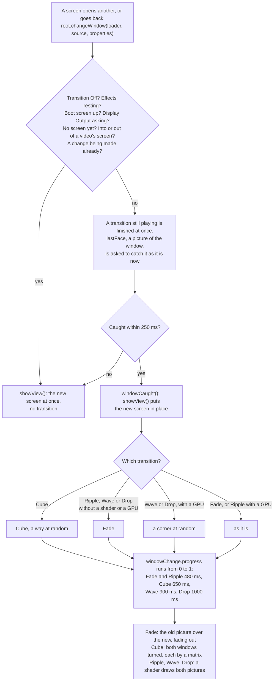

# Effects

OSD/OS has five kinds of effect, each with a row in Settings and a key in a [theme](https://github.com/mehmetraif/OSD-OS/wiki/Themes): what the text does, what goes on behind the menus, what goes on round the selected line, a tube's or a tape's look over the whole screen, and how one window gives way to the next. This page describes every effect and the numbers behind it, how to set each in Settings, in a theme and in `config.json`, how a window change runs, when the effects rest (never over a video), what each needs (a GPU, Qt Shader Tools), and what they cost.

## At a glance

| Kind | Settings row | Choices | Drawn by | Theme key | Config key |
|---|---|---|---|---|---|
| Text | Text Effect | Rainbow, Shimmer, Glow, Flicker | the GPU, in the screen's shader | `effects.text` | `app.text_effect` |
| Background | Background Effect | Matrix, Fire, Stars, Snow | the GPU, a shader of its own | `effects.background` | `app.background_effect` |
| Selector | Selector Effect | Sparkles, Welding, Lightning, Rainbow | the CPU | `effects.selector` | `app.selector_effect` |
| Screen | Screen Effect | Scanlines, CRT, VHS | the GPU, in the screen's shader | `effects.screen` | `app.screen_effect` |
| Transition | Transition | Fade, Cube, Ripple, Wave, Drop | Qt Quick; Ripple, Wave and Drop the GPU | `effects.transition` | `app.transition` |

Every row also offers **Off**, and **THEME** while there is a theme. What the GPU draws is offered only where there is one, and where OSD/OS was built with Qt Shader Tools ([below](#what-needs-a-gpu-and-qt-shader-tools)).

## Setting an effect

### In Settings

Select the row and change it with ◄ ►. **THEME** (saved as `""`) is the theme's effect, **Off** none, and a name that effect, whatever the theme says. Choosing a theme sets every row back to THEME. Without a theme, THEME isn't offered and `""` shows as Off ([Themes](https://github.com/mehmetraif/OSD-OS/wiki/Themes#how-a-theme-is-applied)).

| Setting | Values | Default | What it does | Config key |
|---|---|---|---|---|
| Text Effect | THEME, Off, Rainbow, Shimmer, Glow, Flicker | THEME; without a theme, Off | What the text, the lines and the bars do | `app.text_effect` |
| Background Effect | THEME, Off, Matrix, Fire, Stars, Snow | THEME; without a theme, Off | What goes on behind the menus | `app.background_effect` |
| Selector Effect | THEME, Off, Sparkles, Welding, Lightning, Rainbow | THEME; without a theme, Off | What goes on round the selected line | `app.selector_effect` |
| Screen Effect | THEME, Off, Scanlines, CRT, VHS | THEME; without a theme, Off | A tube's or a tape's look over the whole screen | `app.screen_effect` |
| Transition | THEME, Off, Fade, Cube, Ripple, Wave, Drop | THEME; without a theme, Off | How one window gives way to the next | `app.transition` |

### In a theme

A theme's `effects` takes each effect's name, `"Off"`, or, for the text, the background and the screen, an object of its own: numbers for the text and the screen, a shader for the background or the screen.

```json
{
    "effects": {
        "text":       "Shimmer",
        "background": "Snow",
        "selector":   "Sparkles",
        "screen":     { "scanlines": 0.4, "curvature": 0.5, "vignette": 0.6 },
        "transition": "Drop"
    }
}
```

Names are matched exactly, capitals included (`"CRT"`, not `"crt"`); a name that isn't one is drawn as none. Numbers go from 0 (none) to 1. Every key is in the [theme.json reference](https://github.com/mehmetraif/OSD-OS/wiki/Themes#effects), and a shader of your own in [Shaders](https://github.com/mehmetraif/OSD-OS/wiki/Shaders).

### In config.json

Settings saves each row under `app` in `config.json` ([Configuration files](https://github.com/mehmetraif/OSD-OS/wiki/Configuration-Files)): `""` for THEME, `"Off"`, or the name.

```json
{
    "app": {
        "text_effect": "Glow",
        "background_effect": "Off",
        "selector_effect": "Sparkles",
        "screen_effect": "CRT",
        "transition": "Drop"
    }
}
```

The rows take names only. Numbers of your own (a screen effect with more curve, a weaker glow) are a theme's to give.

## Text effects

What the text, the lines and the bars do: everything drawn in the scheme's two colours, or between them (a letter's soft edge). A picture of another colour, a flame or a spark is left as it is. The text effect is drawn by the screen's shader, in the same pass as the screen effect.

| Name | What it looks like | Its number |
|---|---|---|
| **Rainbow** | The ink runs through the colours of the rainbow: bands slanting across the screen on art pixels, drifting to the right and down, a full turn of the colours every 6.7 seconds, a touch pale (15% white) | `rainbow` 1.0 |
| **Shimmer** | Every three and a half seconds a glint, a slanted white band, sweeps across the screen from left to right, lighting the ink it passes | `shimmer` 1.0 |
| **Glow** | A halo of the ink round the text and the lines: where there is more ink an art pixel and a half away than here, its light spills over | `glow` 0.8 |
| **Flicker** | The ink fails now and then like a neon sign: twelve times a second it may dip towards the background (at 0.8, to 40% of the ink, or less deeply to 70%), and a faint buzz runs through it all the time | `flicker` 0.8 |

In a theme, the four are numbers you can mix:

| In theme.json | In a shader | What it does at 1 |
|---|---|---|
| `rainbow` | `rainbow` | The ink entirely the rainbow's colours; at 0.5 halfway between them and the ink |
| `shimmer` | `shimmer` | The glint at its brightest, 85% white |
| `glow` | `inkGlow` | The fullest halo |
| `flicker` | `flicker` | Dips to a quarter of the ink, and the strongest buzz |

```json
{ "text": { "glow": 0.5, "flicker": 0.15 } }
```

A theme with a screen shader of its own replaces the shader that draws the text effects, so its text effect shows only if that shader draws it ([Shaders](https://github.com/mehmetraif/OSD-OS/wiki/Shaders#4-keeping-the-text-effects)).

## Background effects

What goes on behind the menus: over the window's ground and under what a view shows.

| Name | What it looks like | Where |
|---|---|---|
| **Matrix** | A rain of glyphs, 5 × 7 art pixels each, falling in columns, each column at its own speed (5 to 14 glyphs a second), its newest glyph bright and a trail of 7 to 22 fading behind it. The glyphs change now and then. Dimmer than the menus' lines, in the scheme's colour | The window |
| **Fire** | Pixel flames burning up from the window's foot, about a third of the way up, in six shades of a fire's colours, from dark red to pale yellow, dithered where one shade meets the next | The window |
| **Stars** | A starfield drifting from right to left in three layers, far, middle and near, at 1.5, 5 and 8.5 art pixels a second, the nearer brighter, every star twinkling. In the scheme's colour, a little lighter | The window |
| **Snow** | Snow falling in three layers, at 4 to 15 art pixels a second, the nearer faster, swaying as it falls: far flakes a dot, near ones a small cross. In the scheme's colour, lighter | The window |

**Where it is drawn.** Each background effect has an area:

- **The window** (all four): with OSD Background: Window, inside the window's frame (the skin's `border`, or the one-art-pixel line, or the window's edge with Window Frame Off). With Full or Off, the whole screen.
- **The foot** (`"area": "foot"`, for a theme's own shader): from the window's top down to the screen's foot, the window's width (the whole screen with Full or Off), so it rises from the bottom of the screen into the window.

**On art pixels.** It is drawn at one pixel per art pixel, a pixel of a 240-line picture, and scaled up without smoothing, so it is as blocky as the menus. Every dialog that lays its own ground over the screen (a question, the on-screen keyboard, an info screen) draws the same picture in the same place, so it carries on under the dialog as if the window were still there.

A theme can bring a background shader of its own, and draw it in the window or along the foot ([Shaders](https://github.com/mehmetraif/OSD-OS/wiki/Shaders#a-background-effects-shader)).

## Selector effects

What goes on round the selected line: the line in front, which is the answer of a question or dialog while one is open, not the line under it. It follows the line as it moves, and plays out across the whole screen, so nothing of it is cut off at a list's edge.

| Name | What it looks like |
|---|---|
| **Sparkles** | Sparks streaming off the line's four corners, out to the left from the left corners and to the right from the right ones, at 25 to 75 art pixels a second, slowing as they go, a little up from the top corners and down from the bottom ones. Each lives for 0.45 to 1.1 seconds, fading. About a third twinkle as small crosses. White, with a streak of the scheme's colour lightened |
| **Welding** | A welder's sparks: every 0.05 to 0.2 seconds a burst of 6 to 15 from one corner at random, thrown outward (within about 57° of the corner's diagonal) at 45 to 165 art pixels a second, falling as they fly, white hot, then yellow, orange and red as they cool, gone in 0.3 to 0.85 seconds. The weld flares white for a moment at each burst |
| **Lightning** | A bolt every 0.08 to 0.35 seconds: from a corner outward, 16 to 46 art pixels long and jagged, more often than not with a branch; now and then (about one in five) along the line's top or bottom edge from corner to corner. Each lights for two to four frames, brightest as it strikes, its core the scheme's colour almost white, with a faint glow either side |
| **Rainbow** | A pixel rainbow running down from under the line: six bands, red, orange, yellow, green, blue and violet, two art pixels each, flowing downwards, every column its own length (about 6 to 20 art pixels), swelling and ebbing, never solid, breaking into specks at its end. It runs under the lines below, which stay readable over it; in a dialog, in front |

The selector effects are drawn by the CPU, about thirty times a second, into a picture of art pixels shown without smoothing. They need no GPU, and Settings offers them everywhere. An effect rests once its last spark is out with no selected line to play round.

## Screen effects

A picture tube's or a tape's look over the whole screen. It covers everything OSD/OS draws but a video: the menus and their effects, the boot screen, the screen saver and the pointer. A video is never under it ([below](#never-over-a-video)).

| Name | What it looks like | Its numbers |
|---|---|---|
| **Scanlines** | Dark lines between the picture's lines | `scanlines` 0.5 |
| **CRT** | A tube's curved face: the picture bulging, its corners rounded off into black and darker, scanlines, and a glow round light parts | `scanlines` 0.35, `curvature` 0.6, `glow` 0.35, `vignette` 0.5 |
| **VHS** | A tape's colour bleeding sideways off the picture, moving grain, a little glow and faint scanlines | `bleed` 0.6, `noise` 0.5, `glow` 0.25, `scanlines` 0.15 |

Green Screen, one of the [themes](https://github.com/mehmetraif/OSD-OS/wiki/Themes#green-screen), gives numbers of its own instead of a name: `scanlines` 0.6, `glow` 0.6, `curvature` 0.3, `vignette` 0.5.

The six numbers, each from 0 (none) to 1:

| Number | What it does at 1 |
|---|---|
| `scanlines` | The lower part of every line of art pixels darkened by up to 70%: every second screen line at 480 lines. It follows the screen's own lines, not the curved picture's, which would beat against them into bands |
| `curvature` | The picture bulges like a tube's face, up to 15% at the corners, which round off into black; the edge is softened over a pixel and a half |
| `glow` | Light parts glow into the dark round them, an art pixel and a half out |
| `bleed` | Colour smeared sideways, as a tape's: red taken from up to an art pixel and a half to the left, blue from as far to the right |
| `noise` | Grain on every art pixel, up to 15% lighter or darker, new at every frame |
| `vignette` | The corners darker: black at the very corners and half as bright at the middle of each edge |

They are applied in this order: the curve, the bleed, the text effect, the glow, the scanlines, the curve's edge, the vignette, the noise.

```json
{ "screen": { "scanlines": 0.5, "curvature": 0.8, "glow": 0.2, "noise": 0.1, "vignette": 0.7 } }
```

A theme's `screen` can also be a shader of its own, which then takes the place of OSD/OS's, with these numbers given to it ([Shaders](https://github.com/mehmetraif/OSD-OS/wiki/Shaders#a-screen-effects-shader)).

## Transitions

How one window gives way to the next, as you open a module, a screen inside it, or go back.

| Name | What happens | Time | Pace |
|---|---|---|---|
| **Fade** | The old window fades away over the new | 0.48 s | slow at both ends |
| **Cube** | The window turns over like a cube's face, the next window on the face coming in from a side at random each time: right, left, below or above. (Cube Left, Right, Up and Down, which once fixed the side, are read as Cube.) The cube's edge is the screen's width (its height turning up or down), seen from two and a half edges in front; black behind | 0.65 s | slow at both ends |
| **Ripple** | The old window ripples out as the new ripples in: its lines pushed sideways in waves of whole art pixels, strongest halfway, the two windows crossing over in the middle; black behind | 0.48 s | slow at both ends |
| **Wave** | A wave runs out from a corner at random across the screen, the old window swelling up and settling into the new as it passes, lit on its near slope and shaded on its far one, lower the further it runs, dying away at the far side | 0.9 s | even |
| **Drop** | A drop falls in a corner at random, and its ring spreads across the screen, slowing as it goes, the new window inside it and the old outside. Ripples run on behind the ring and settle; its rim and their crests catch the light in the scheme's colour | 1 s | slowing |

<table>
<tr><th width="50%">Cube</th><th width="50%">Drop</th></tr>
<tr><td></td><td></td></tr>
<tr><td>Local Files on the main menu: the window turns over, Local Files on the next face.</td><td>A drop falls in a corner, and its ring spreads the next window across the screen.</td></tr>
</table>

Ripple, Wave and Drop are shaders on the GPU. Where they can't run, Settings doesn't offer them, and a theme's is played as a Fade.

### When a window changes without one

The next window is shown at once, with no transition:

- when Transition is Off, or the theme has none, or names one that isn't;
- while the effects rest: a video playing, loading or with its menu open, or a player's screen up ([below](#never-over-a-video));
- into or out of a video's screen: a player's, a card's, Netflix's and Prime Video's launch screen, a script's console or takeover, YouTube's sign-in;
- for the first screen there is: there is nothing to turn away from;
- while the boot screen is up, or the window asking to keep a new display output;
- for a screen opened by the change itself: a module's first screen comes in with the module, in the main menu's transition, not in one of its own;
- when the old window can't be caught as a picture within a quarter of a second (nothing is being drawn).

A change asked for while another plays finishes that one at once, and starts its own.

### How a window change runs



Every screen change in OSD/OS goes through `changeWindow()` in [Main.qml](https://github.com/mehmetraif/OSD-OS/blob/main/Main.qml): the main menu's, Settings', and each module's own, from its `Root.qml`. The new window is live from the start: during a transition it is the old one that is a still picture.

## Never over a video

A video is always shown as it is. The effects and the menu music **rest** while:

| What | When |
|---|---|
| A video plays inside OSD/OS's window | With Settings → Transparent Background, full screen or behind the menus |
| Another program has the screen | On a Pi without a desktop: mpv playing a video, a takeover script, a web player |
| A video is loading | The loading screen, the tape winding in |
| A video's menu is open | The menu that back opens over a Local Files, YouTube or Playlists video with Transparent Background ([Using OSD/OS](https://github.com/mehmetraif/OSD-OS/wiki/Using-OSD-OS)) |
| A module shows a video's screen | A player's (also while mpv plays in a window of its own, over OSD/OS's), a card's, Netflix's and Prime Video's launch screen, a script's console or takeover, YouTube's sign-in |

While they rest:

- the screen and text effects are off: the screen is drawn as it is, through no shader;
- the background effect is hidden;
- the selector effect stops, its sparks gone;
- the clock that moves the effects stands still;
- the menu music stops, and starts again from the beginning afterwards ([Menu music](https://github.com/mehmetraif/OSD-OS/wiki/Menu-Music#when-it-plays-and-when-it-rests));
- a window changes without its transition.

A video played inside the window is drawn outside the layer the screen effect draws, so not even a frame of it passes through a shader.

## What needs a GPU and Qt Shader Tools

| Effect | Drawn by | Needs Qt Shader Tools in the build | Needs a GPU |
|---|---|---|---|
| Text: Rainbow, Shimmer, Glow, Flicker | OSD/OS's screen shader | yes | yes |
| Background: Matrix, Fire, Stars, Snow | OSD/OS's background shaders | yes | yes |
| Screen: Scanlines, CRT, VHS | OSD/OS's screen shader | yes | yes |
| A theme's own background or screen shader | its `.qsb` | no: it comes compiled | yes |
| Selector: Sparkles, Welding, Lightning, Rainbow | the CPU | no | no |
| Transition: Fade, Cube | Qt Quick, without a shader | no | no |
| Transition: Ripple, Wave, Drop | OSD/OS's transition shaders | yes | yes |

- **Qt Shader Tools** compiles OSD/OS's shaders ([shaders](https://github.com/mehmetraif/OSD-OS/tree/main/shaders)) into the app when it is built. The releases and the OSD/OS image have them. A build from source needs `qt6-shadertools-dev` on Debian and Raspberry Pi OS, or Qt Shader Tools from Qt's installer; without it, CMake says `Qt Shader Tools not found — the shader effects will be unavailable` and the app builds without them ([Building from source](https://github.com/mehmetraif/OSD-OS/wiki/Building-from-Source)).
- **A GPU** is Qt Quick drawing with OpenGL, OpenGL ES, Metal or Vulkan: everything OSD/OS runs on, unless Qt falls back to its software renderer, which draws no shaders.
- **Without either**, Settings has no Text Effect, Background Effect and Screen Effect rows, and Transition leaves out Ripple, Wave and Drop. A theme is drawn without those effects, its Ripple, Wave or Drop played as a Fade; its colours, skin, selector effect, other transitions and music are as ever. A theme's own shader still runs where there is a GPU.

## What they cost

Where the work goes, and what keeps it small:

- **Menus at rest aren't drawn again.** With nothing moving (Off, or a still effect: Scanlines, CRT, Glow), the screen is drawn only when something on it changes.
- **The effects' clock** ticks about thirty times a second (every 33 ms) only while something moves: a background effect, VHS's noise, Rainbow, Shimmer or Flicker, or a theme's screen shader with `"animate": true`. Then the screen is drawn that often. The clock starts over every hour.
- **A screen or text effect** has the GPU draw the screen twice: into a picture, then that picture through the shader. The picture exists only while one is in force and the effects aren't resting.
- **The shader runs for every pixel** of the screen each time it is drawn: about 2 million at 1080p, 307,200 at 640 × 480, a sixth or a seventh of that.
- **A background effect** runs on art pixels, then is scaled up: a quarter of the screen's pixels at 480 lines, a sixteenth at 1080.
- **The selector effect** draws a small picture of art pixels on the CPU about thirty times a second, only while a selected line is shown or its last sparks fly.
- **A transition** catches one picture of the old window per change, and plays for half a second to a second.

## See also

- [Themes](https://github.com/mehmetraif/OSD-OS/wiki/Themes): the effects in a theme, with its colours, skin and music
- [Shaders](https://github.com/mehmetraif/OSD-OS/wiki/Shaders): a background or screen effect of your own
- [Skins](https://github.com/mehmetraif/OSD-OS/wiki/Skins): the shapes the effects play round
- [Menu music](https://github.com/mehmetraif/OSD-OS/wiki/Menu-Music): rests with the effects
- [Settings](https://github.com/mehmetraif/OSD-OS/wiki/Settings#the-look): every row of the look
- [How it works](https://github.com/mehmetraif/OSD-OS/wiki/How-It-Works): the shell, the display path and playback
