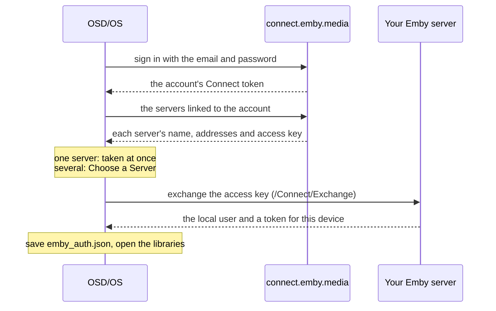

# Emby

The Emby module plays your films, series and home videos from an [Emby](https://emby.media) server. You sign in with the server's own username and password, or with your **Emby Connect** account (your emby.media email), which finds your servers for you. Once you are in, it works the way the [Jellyfin](https://github.com/mehmetraif/OSD-OS/wiki/Jellyfin) module does, screen for screen; this page covers signing in, everything where Emby differs (subtitles, Dolby Vision, intro and credit skipping from the server's chapter markers), every setting with its config key, how the sign-in is stored, and what to do when it doesn't work, and points to the Jellyfin page for the rest.

The module is in [modules/emby](https://github.com/mehmetraif/OSD-OS/tree/main/modules/emby) (views and manifest) and [src/modules/emby](https://github.com/mehmetraif/OSD-OS/tree/main/src/modules/emby) (`EmbyBackend`).

<table>
<tr><th width="50%">Emby</th><th width="50%">Resume</th></tr>
<tr><td></td><td></td></tr>
<tr><td>A server on your network, or Emby Connect.</td><td>Carry on from the server's resume point, or start from the beginning.</td></tr>
</table>

## What you need

- An Emby server the device can reach. For **Local Server** you need its address (`http://` or `https://`, the host or IP address, and the port: Emby's own defaults are 8096 for HTTP and 8920 for HTTPS) and a user account on it. For **Emby Connect** you need an emby.media account linked to the server.
- A keyboard to type with, once: a USB keyboard, or one paired in **Settings → Bluetooth**. The sign-in screen has no on-screen keyboard. The server's address can be put in `config.json` instead ([below](#fill-in-the-address-beforehand)), but a username and password always need typing.

## Turning it on

Emby is off until you turn it on: **Settings → Emby → Enabled** (in the Modules section of Settings). It then appears on the main menu. Its other settings show once you have signed in.

## Signing in

Open **Emby** from the main menu. The **Connect to Server** screen starts with the way to sign in: **LOCAL SERVER** or **EMBY CONNECT**, side by side. ◄ ► choose one; Enter (or ▼) moves into the form below it, which asks only for what that way needs:

| | Local Server | Emby Connect |
|---|---|---|
| **Server URL** | The server's address, with `http://` or `https://` and the port | (not asked: the account knows its servers) |
| **Username** / **Email** | Your username on that server | Your emby.media email (or user name) |
| **Password** | Its password (masked; leave it empty for a user without one) | Your emby.media password |

▲ ▼ (or Tab and Shift+Tab) move from row to row, round the ends; below the first row ◄ ► do the same, so they don't move the cursor inside a field. Enter in any field, or on **Sign In**, signs in. Backspace deletes a character; Esc leaves the screen. The line above **Sign In** says what to do (**CHOOSE HOW TO SIGN IN**, **SIGN IN WITH YOUR SERVER ACCOUNT**, **EMBY CONNECT USES YOUR EMBY.MEDIA EMAIL**), **CONNECTING...** while it works, or what went wrong. The Server URL field holds the address used last time, if any.

### Local Server

OSD/OS sends the username and password to the server (`/Users/AuthenticateByName`), receives a token for this device, and opens the libraries. The password goes to the server only, as typed (use an `https://` address if your network isn't to be trusted with it), and is never stored.

### Emby Connect



With more than one server on the account, **Choose a Server** lists them by name; select one. OSD/OS talks to a server at its address on your network when Emby Connect knows one, else at its address on the internet. If the exchange fails (that address doesn't answer from here), the error shows on the same list, to pick another. After sign-in, Emby Connect isn't needed again: OSD/OS keeps the server's own token, not the Connect one.

### What the sign-in screen can say

| Message | What it means |
|---|---|
| **PLEASE ENTER A SERVER URL**, **PLEASE ENTER A USERNAME**, **ENTER YOUR EMBY CONNECT EMAIL** | A field the chosen way needs is empty |
| **INCORRECT USERNAME OR PASSWORD** | The server answered 401 |
| **SIGN IN FAILED (HTTP …)** | The server refused the sign-in with that status |
| **CONNECTION FAILED: …** | Nothing answered: a typing slip, a missing `http://` or port, the server is off, or (Emby Connect) no internet |
| **INVALID AUTH RESPONSE** | Something answered, but not with a sign-in |
| **INCORRECT EMBY CONNECT EMAIL OR PASSWORD** | emby.media answered 401 |
| **EMBY CONNECT SIGN IN FAILED (HTTP …)**, **INVALID EMBY CONNECT RESPONSE** | emby.media refused or answered oddly |
| **FAILED TO LOAD SERVERS: …** | The account's server list couldn't be fetched |
| **NO SERVERS LINKED TO THIS ACCOUNT** | No server is linked to the emby.media account (link it in the server's user settings) |
| **SERVER EXCHANGE FAILED (HTTP …)**, **INVALID EXCHANGE RESPONSE** | The chosen server didn't accept the account's key, or didn't answer at that address. Pick another, or use Local Server |
| **INVALID SERVER SELECTION** | Emby Connect listed the server without an access key |

### Fill in the address beforehand

For Local Server, the address can go in `config.json` (in the data folder: `~/.local/share/OSD-OS/` on Linux and the image, `~/Library/Application Support/OSD-OS/` on a Mac), with OSD/OS stopped, so only the username and password are left to type:

```json
{
    "modules": {
        "com.osdos.emby": {
            "enabled": true,
            "server_url": "http://192.168.1.30:8096"
        }
    }
}
```

Merge it into the `modules` part of the file you have. On the image, `sudo systemctl stop osdos` before editing and `sudo systemctl start osdos` after; check the file with `python3 -m json.tool ~/.local/share/OSD-OS/config.json`, since a file that isn't valid JSON is read as empty.

In the server's list of devices, OSD/OS appears under the machine's host name, with **OSD/OS** as the app. Each time you open the module it checks its token with the server; one the server no longer accepts (HTTP 401) signs OSD/OS out and brings back the sign-in screen. A server that doesn't answer at that moment leaves you signed in.

## The same as Jellyfin

Once signed in, these work exactly as in the Jellyfin module, so its page describes them:

- [The home screen](https://github.com/mehmetraif/OSD-OS/wiki/Jellyfin#the-home-screen): `EMBY | <SERVER> (<USER>)`, **Continue Watching** and **Next Up** when they have something (up to 20 each), then the Movies, Shows, Home Videos and Collections libraries that are ON in **Settings → Emby → Libraries**.
- [Browsing](https://github.com/mehmetraif/OSD-OS/wiki/Jellyfin#browsing): films and series A to Z, home videos folder by folder, collections by kind, oldest first.
- [Browsing by letter](https://github.com/mehmetraif/OSD-OS/wiki/Jellyfin#browsing-by-letter): ► to the letters in the Movies, Shows and Home Videos lists.
- [Series and seasons](https://github.com/mehmetraif/OSD-OS/wiki/Jellyfin#series-and-seasons): PLAY on a series opens the episode the server's Next Up gives; on a season, its part-watched, first unwatched or first episode.
- [An item's page](https://github.com/mehmetraif/OSD-OS/wiki/Jellyfin#an-items-page): **PLAY ►** / **RSUM ►**, **Audio** and **Subtitles** picked from your server user's language preferences and subtitle mode, ► on PLAY for a playlist.
- [Video Quality](https://github.com/mehmetraif/OSD-OS/wiki/Jellyfin#direct-play-and-transcoding): Direct Play, or a transcode at 480p (NTSC CRT), 576p (PAL CRT), 720p or 1080p (4, 4.5, 6 or 10 Mbps), with a transcode tried by itself when Direct Play fails.
- [Resume and Continue Watching](https://github.com/mehmetraif/OSD-OS/wiki/Jellyfin#resume-continue-watching-and-next-up): the server's resume points, progress reported every 10 seconds and at the stop, **Resume Playback** Ask or Always.
- [Autoplay Next Episode](https://github.com/mehmetraif/OSD-OS/wiki/Jellyfin#autoplay-next-episode): the next episode of the series, across seasons, with the same audio and subtitle languages.
- [With Transparent Background](https://github.com/mehmetraif/OSD-OS/wiki/Jellyfin#with-transparent-background): back returns to the menus with the picture behind them; no player menu, no main-menu row.
- [Putting a video on a playlist](https://github.com/mehmetraif/OSD-OS/wiki/Jellyfin#putting-a-video-on-a-playlist): ► on PLAY, online (streamed as the original file) or offline (downloaded as the original file where the server lets your user download).

## Where Emby differs

| | Jellyfin | Emby |
|---|---|---|
| Signing in | Quick Connect | Username and password, or Emby Connect |
| An episode in a list | `SHOW S1E2: TITLE` | `SHOW: TITLE`, with `(YEAR)` when the episode has one |
| The Collections library's list | With the letter panel | Without it |
| Text subtitles with Direct Play | Every text track fetched and handed to mpv | Only the one you chose ([below](#subtitles)) |
| Text subtitles in a transcode | Burned into the picture | Fetched as a file, as with Direct Play ([below](#subtitles)) |
| AUDIO and SUBTITLE in the deck's menu during a transcode | Ask the server for a new transcode with the next track | Step through what the stream carries |
| Dolby Vision on Direct Play | As the server decides | An SDR transcode instead ([below](#dolby-vision)) |
| Intro and credit skipping | The server's media segments, settings shown only when it has them | The server's chapter markers, settings always shown ([below](#intro-skip-and-credit-skip)) |
| Sign out | Ends the session | Removes the device from the server, then ends the session |
| The token | In the `Authorization` header | In `X-Emby-Authorization` and `X-Emby-Token`, and in the stream's address (`api_key`), which is how Emby checks a stream |

## Subtitles

With **Direct Play**, a text subtitle (SRT, ASS, WebVTT…) is fetched from the server as a file, and only the one you chose on the item's page is handed to mpv: Emby extracts a subtitle as it is asked for, and fetching every track used to hold a file with many subtitles for 20 to 30 seconds per track before it played. Subtitles inside the file stay reachable with the deck's **SUBTITLE** button; another external track isn't, so choose it on the item's page. Picture subtitles (PGS, DVB, DVD) are picked from the file.

In a **transcode**, a text subtitle is still fetched as a separate file, so the video itself is transcoded untouched (Emby fails on burning text subtitles in). Only picture subtitles are burned into the picture. The transcode carries just the audio track you chose, so pick tracks on the item's page before PLAY.

## Dolby Vision

mpv can't show a Dolby Vision picture, so when the server reports a video as Dolby Vision, OSD/OS asks for a transcode to SDR even on **Direct Play**, and the server tone-maps it. That transcode is capped at 1080 lines and 20 Mbps (a full 4K transcode wouldn't start quickly enough). With a quality tier every video is transcoded anyway, at the tier's cap. A text subtitle survives it (it comes as a file); a picture subtitle is dropped for that video, since burning it in would stop the transcode altogether.

## Intro Skip and Credit Skip

Emby marks an intro and the credits as chapter markers once it has detected them (`IntroStart`, `IntroEnd`, `CreditsStart`). When **Intro Skip** or **Credit Skip** isn't Off, OSD/OS reads a video's chapters as it starts (and each next episode's, with Autoplay Next Episode): the intro runs from `IntroStart` to `IntroEnd`, the credits from `CreditsStart` to the end of the file. A video the server hasn't detected markers in plays as usual.

| Setting | What happens when the intro or the credits start |
|---|---|
| **Off** (the default) | Nothing |
| **Auto** | Skipped, once per episode. Skipping the credits jumps to the end, so the episode ends there (and Autoplay Next Episode, if on, starts the next) |
| **Button** | The deck's menu opens with **SKIP** under the cursor: select skips, or let it play. The menu hides after 5 seconds as usual; ▲ or ▼ brings it back, SKIP and all, while the part lasts |

Both settings show once you are signed in, whether or not the server has markers.

## Settings

Settings → Emby. Everything but Enabled and Scaling shows only once you have signed in.

| Setting | Values | Default | What it does | Config key |
|---|---|---|---|---|
| Enabled | ON, OFF | OFF | Shows Emby on the main menu | `modules.com.osdos.emby.enabled` |
| Libraries | each library, ON or OFF | all ON | Which libraries the home screen lists | `modules.com.osdos.emby.libraries` |
| Video Quality | Direct Play, 480p (NTSC CRT), 576p (PAL CRT), 720p, 1080p | Direct Play | Direct Play, or a transcode capped at that size | `modules.com.osdos.emby.video_quality` |
| Resume Playback | Ask, Always | Ask | Whether a video with a resume point asks, or carries on | `modules.com.osdos.emby.resume_playback` |
| Autoplay Next Episode | ON, OFF | OFF | Plays the series' next episode when one ends | `modules.com.osdos.emby.autoplay_next_episode` |
| Intro Skip | Off, Auto, Button | Off | What happens at an intro the server has marked | `modules.com.osdos.emby.intro_skip` |
| Credit Skip | Off, Auto, Button | Off | What happens at credits the server has marked | `modules.com.osdos.emby.outro_skip` |
| Scaling | Default, Letterbox, 14:9, Pan & Scan, Anamorphic | Default | How a 16:9 picture fills the 4:3 screen in Emby; Default follows Settings → Scaling | `modules.com.osdos.emby.video_scaling` |
| Sign out | (an action) | | Removes this device from the server, ends the session and forgets it here | |

### How the values are saved

| Key | Saved as |
|---|---|
| `enabled`, `autoplay_next_episode` | `true` or `false` |
| `libraries` | an object of `"<library id>": true` or `false`; a library left out counts as ON |
| `video_quality` | `"auto"` (Direct Play), `"480p"`, `"576p"`, `"720p"` or `"1080p"` |
| `resume_playback` | `"ask"` or `"always"` |
| `intro_skip`, `outro_skip` | `"Off"`, `"Auto"` or `"Button"` |
| `video_scaling` | `"Default"`, `"Letterbox"`, `"14:9"`, `"Pan & Scan"` or `"Anamorphic"` |
| `server_url` | the server address signed in to: the one typed, or for Emby Connect the address chosen (no setting row; it fills the sign-in screen's field) |

A whole `modules` entry (the library id is an example of its shape):

```json
{
    "modules": {
        "com.osdos.emby": {
            "enabled": true,
            "server_url": "http://192.168.1.30:8096",
            "libraries": {
                "7": true,
                "12": false
            },
            "video_quality": "576p",
            "resume_playback": "always",
            "autoplay_next_episode": true,
            "intro_skip": "Auto",
            "outro_skip": "Button",
            "video_scaling": "Letterbox"
        }
    }
}
```

See [Configuration Files](https://github.com/mehmetraif/OSD-OS/wiki/Configuration-Files) for the whole file.

## How the sign-in is stored

`emby_auth.json` in the data folder, readable by your user only (mode 600) and written whole:

| Field | What it is |
|---|---|
| `serverUrl` | The server's address |
| `accessToken` | The server's token for this device |
| `userId`, `userName` | The user OSD/OS plays as |
| `serverName` | The server's name, for the title bar |
| `deviceId` | This device's id towards the server, made on first use |

The Emby Connect token is used for the sign-in only and never saved; neither is a password. OSD/OS sends the token in `X-Emby-Authorization` (`MediaBrowser Client="OSD/OS", Device="<host name>", DeviceId="…", Version="…", Token="…"`) and `X-Emby-Token`. For what mpv fetches (the stream, a transcode, a subtitle file) it goes in the address as `api_key`, which is how Emby checks those requests, so treat mpv's log as private. **Sign out** removes the device from the server's device list (`DELETE /Devices`), ends the session (`/Sessions/Logout`), deletes the file and makes a new device id. OSD/OS's own requests to the server accept a certificate the server made itself, one issued for another name, or one from an authority the system doesn't know, for that server's address only.

## Troubleshooting

| Problem | What to do |
|---|---|
| No way to type | Plug in or pair a keyboard (Settings → Bluetooth). The address alone can [go in config.json](#fill-in-the-address-beforehand) |
| **CONNECTION FAILED: …** | Check the address has `http://` or `https://` and the port. From the device, `curl http://192.168.1.30:8096/System/Info/Public` (with your address) should answer with the server's name |
| **INCORRECT USERNAME OR PASSWORD** | The server's own account, not the emby.media one (that is Emby Connect) |
| **NO SERVERS LINKED TO THIS ACCOUNT** | Link the server to your emby.media account in the server's user settings, or sign in with Local Server |
| **SERVER EXCHANGE FAILED (HTTP …)** | The server's address from Emby Connect doesn't answer from the device (HTTP 0: nothing answered), or refused the account; try another server on the list, or Local Server with the address you know works |
| The home screen stays on **LOADING...** | The server didn't answer (the log has `LOAD LIBRARIES FAILED`), or there is nothing to list: no Movies, Shows, Home Videos or Collections library is ON in Settings → Emby → Libraries, and nothing to continue |
| Back on the sign-in screen by itself | The server stopped accepting the token (the device was removed on the server). Sign in again |
| A Dolby Vision film transcodes on Direct Play | On purpose: mpv can't show Dolby Vision, so the server makes SDR of it |
| A film with many subtitles is slow to start | Only the subtitle you chose is fetched; with subtitles Off it starts straight away |
| An external subtitle can't be picked during playback | Choose it on the item's page before PLAY |
| No intro or credits are skipped | The server hasn't detected markers in that episode; Intro Skip and Credit Skip can only use what it has marked |
| Offline playlist says **Not Allowed** | Your Emby user isn't allowed to download media; an administrator can allow it on the server, then **Retry Downloads** on the playlist's page |
| No Continue Watching or Next Up | They show only when they have something; a failed check of them is logged (`[Emby] shelf probe failed`) |

The app's log has the details: `journalctl -u osdos -b | grep -i emby` with the service (lines start `[EmbyBackend]` or `[Emby]`, and the screens' own `[Emby Player]`, `[Emby Library]`, `[Emby Items]` and the like; a refused Direct Play is logged with the server's reasons, and a Dolby Vision switch says so). mpv's own log is `/tmp/osdos-mpv.log` (in the system's temp folder on a Mac). See [Troubleshooting](https://github.com/mehmetraif/OSD-OS/wiki/Troubleshooting).

## See also

- [Jellyfin](https://github.com/mehmetraif/OSD-OS/wiki/Jellyfin): the twin module, with the full description of browsing and playback
- [Plex](https://github.com/mehmetraif/OSD-OS/wiki/Plex)
- [Playlists](https://github.com/mehmetraif/OSD-OS/wiki/Playlists): Emby videos with Local Files, YouTube and Jellyfin ones, online or downloaded
- [Playback and mpv](https://github.com/mehmetraif/OSD-OS/wiki/Playback-and-mpv): the deck menu, Scaling and Transparent Background
- [Settings](https://github.com/mehmetraif/OSD-OS/wiki/Settings) and [Configuration Files](https://github.com/mehmetraif/OSD-OS/wiki/Configuration-Files)
- [Modules](https://github.com/mehmetraif/OSD-OS/wiki/Modules)
- [Troubleshooting](https://github.com/mehmetraif/OSD-OS/wiki/Troubleshooting)
