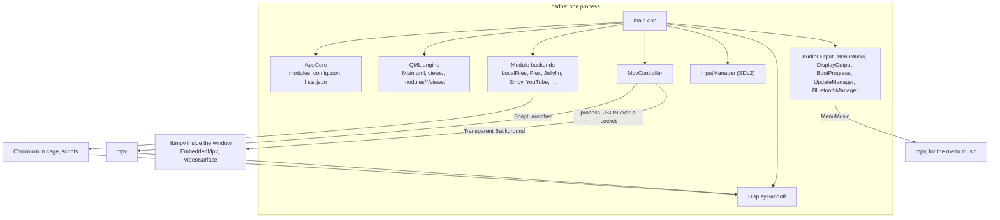
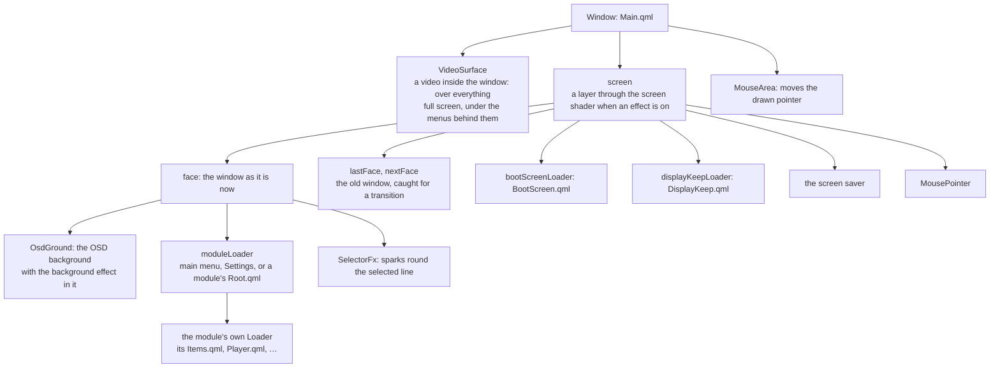
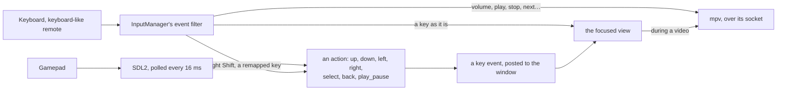
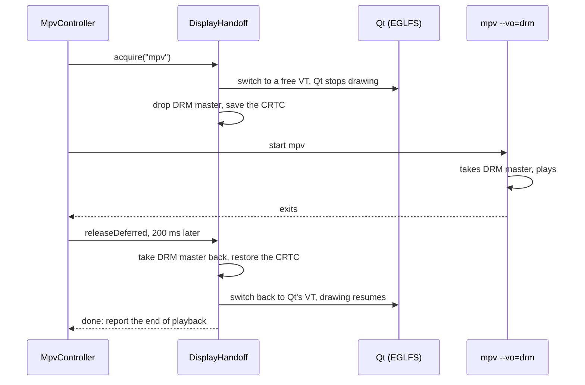
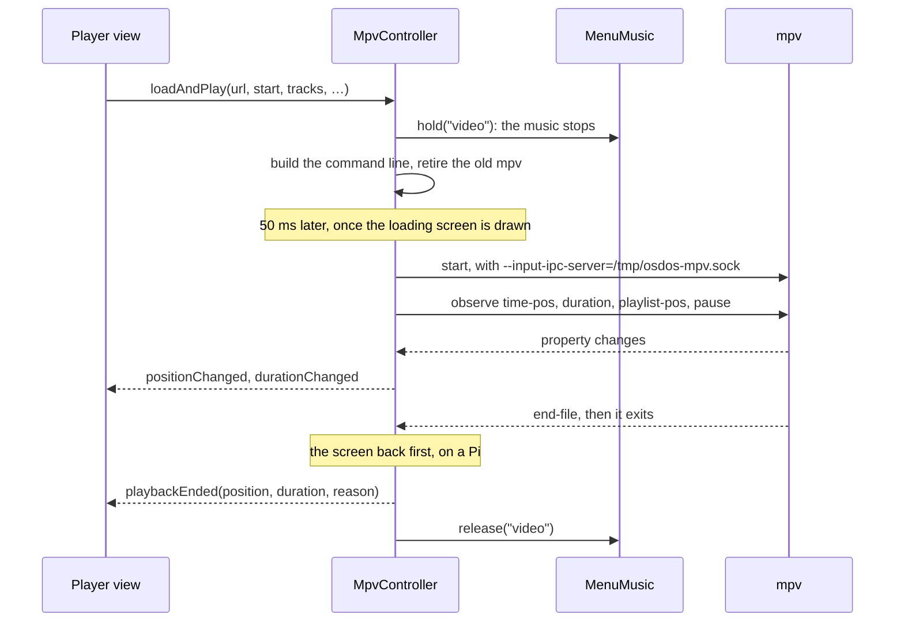
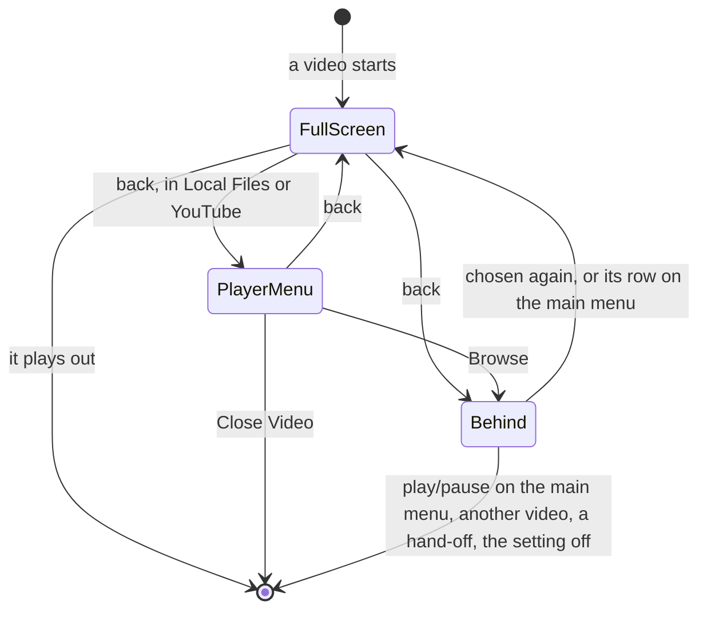
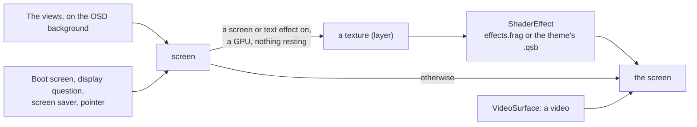

# How it works

What happens inside OSD/OS, for the curious and for anyone about to change it: the shell and how it finds its modules, how the screens are put together and moved between, how a remote's keys arrive, how the picture reaches the screen and who takes it over, how a video plays (in an mpv process, or inside the window), the menu music, the effects, where settings are kept, and the logs. [ARCHITECTURE.md](https://github.com/mehmetraif/OSD-OS/blob/main/ARCHITECTURE.md) is the reference for every detail; this page is the map, with links into it and short pieces of the real code.

## The big picture

OSD/OS is a **browsing shell that hands off to tools made for the job**. The shell, one C++ Qt 6 program with its screens in QML, does the browsing, the sign-ins and the settings. Playing is someone else's: mpv for a video (as a process of its own, or inside the window as libmpv with Transparent Background), Chromium for Netflix and Prime Video, and your own programs through the Scripts module.



The rest of this page follows that picture from the top.

## What happens at start

[`src/main.cpp`](https://github.com/mehmetraif/OSD-OS/blob/main/src/main.cpp) sets everything up, in this order:

1. **Before the application exists:** Qt's own mouse cursor is hidden on a headless screen (`QT_QPA_EGLFS_HIDECURSOR=1`, unless set), and OpenGL contexts share their objects (`Qt::AA_ShareOpenGLContexts`), so a video drawn inside the window can be shown as it is.
2. **The application**, named `OSD-OS`, its version the build's (`APP_VERSION`; `dev` for a build that isn't a release). The pointer is hidden; the app draws its own.
3. **Signals.** SIGTERM, SIGINT and SIGHUP are only noted; a 100 ms timer then leaves the event loop with 128 plus the signal's number, so destructors run, mpv is stopped and the screen is given back. That exit code is also how the service's stop helper tells `systemctl stop` from the user's Quit ([The OSD/OS image → osdos-stop](https://github.com/mehmetraif/OSD-OS/wiki/The-OSD-OS-Image#osdos-stop)).
4. **The two folders** (below), and a line in the log for every screen attached: `[main] display index 0: "<name>" 720x480 at (0,0)`.
5. **`AppCore`**, which finds the modules.
6. **The objects**, each living as long as the app: the module backends, `DisplayHandoff` (ahead of everything that takes the screen through it, so it outlives them), `MpvController`, `InputManager`, `IdleTracker` (the screen saver), `UpdateManager`, `BootProgress`, `DisplayOutput`, `AudioOutput`, `MenuMusic`, `BluetoothManager`.
7. **The wiring** between them: a gamepad's keys to mpv while the window has no focus, a change of sound card to mpv and to the menu music, and a video's end to the menu music.
8. **Each backend registered** with `AppCore`, then the other objects handed to QML as context properties, the image providers `osdicon` and `osdskin`, and the QML types `VideoSurface`, `VhsNoise` and `SelectorFx` (`import OSDOS.Video`).
9. **`Main.qml` loaded.** If it fails to load, the app logs `[main] QML engine failed to load Main.qml` and exits with 1.
10. **The first frame** (`frameSwapped`, or five seconds whatever happens) tells `BootProgress`, which, on the OSD/OS image, lets the held-back services start.

### The app's folder and the data folder

| | What | Where |
|---|---|---|
| **`APP_ROOT`** | `Main.qml`, `views/`, `modules/`, `assets/`, `scripts/`, `LICENSE` | `$APP_ROOT` if set; inside a macOS bundle, its `Contents/Resources`; else `../share/osdos` beside the binary when it exists (`/opt/osdos/share/osdos` on a Pi); else the binary's parent folder |
| **`DATA_ROOT`** | Settings, lists, sign-ins, browser profiles, staged updates, a yt-dlp of its own | `$DATA_ROOT` if set (an existing folder); else `~/.local/share/OSD-OS` on Linux, `~/Library/Application Support/OSD-OS` on macOS |

Run from a source tree, `APP_ROOT=$(pwd) ./build/osdos` points the app at the checkout. OSD/OS was 240-MP: at start, a `240-MP` data folder beside the new one is moved over when the new one is missing or empty, and module ids in its JSON files are renamed (`com.240mp.x` to `com.osdos.x`). Every `OSDOS_…` environment variable is also read under its old `MP240_…` name ([`src/util/LegacyNames`](https://github.com/mehmetraif/OSD-OS/blob/main/src/util/LegacyNames.cpp)).

## The shell: AppCore and the modules

[`AppCore`](https://github.com/mehmetraif/OSD-OS/blob/main/src/AppCore.cpp) is the shell, the context property `appCore` in QML. As it is made, it reads every `modules/*/manifest.json`, folder by folder in name order. A manifest needs an `id` and an `entry_point_qml`; one that isn't JSON, or lacks either, is skipped with a warning (`[AppCore] Bad manifest.json in …`, or `[AppCore] Skipping …: manifest missing 'id' or 'entry_point_qml'`). Ambient:Mode's, whole:

```json
{
  "id": "com.osdos.ambient_mode",
  "name": "Ambient:Mode",
  "icon": "assets/images/logo.svg",
  "entry_point_qml": "views/Root.qml",
  "settings": [
    { "key": "enabled", "label": "ENABLED", "type": "toggle", "default": "OFF" },
    { "key": "media_directory", "label": "Media Directory", "type": "directory_browser", "default": "" },
    { "key": "auto_launch", "label": "Auto-Launch Playback", "type": "toggle", "default": "OFF" },
    {
      "key": "video_scaling",
      "label": "Scaling",
      "type": "list_single",
      "options": ["Default", "Letterbox", "14:9", "Pan & Scan", "Anamorphic"],
      "default": "Default",
      "description": "How a 16:9 picture fills the 4:3 screen in this module\n[DEFAULT] As Settings' Scaling says"
    }
  ]
}
```

- **The settings** a manifest lists become the module's page under Settings → Modules, saved under `modules.<id>` in `config.json`. No C++ is needed to add one ([ARCHITECTURE.md → manifest.json Reference](https://github.com/mehmetraif/OSD-OS/blob/main/ARCHITECTURE.md#manifestjson-reference)).
- **Enabled or not**: the module's `enabled` in `config.json`, else its manifest's default for `enabled`, else on.
- **The main menu** (`views/ModuleList.qml`) asks `scan_for_modules()` and gets the enabled modules, each with its entry point (`modules/<folder>/views/Root.qml`). A backend may add rows of its own after them (`get_menu_entries()`), as Scripts does for the scripts you put on the main menu.

### A backend, in one line

A module that needs C++ (a server's API, a device) has a backend in `src/modules/<name>/`, made in `main.cpp` and registered with one call, the only place its id is written in C++:

```cpp
appCore.registerModule("com.osdos.local_files",  "localFilesBackend",  &localFiles,  ctx);
appCore.registerModule("com.osdos.plex",         "plexBackend",        &plexBackend, ctx);
appCore.registerModule("com.osdos.youtube",      "youtubeBackend",     &youtubeBackend, ctx);
appCore.registerModule("com.osdos.playlists",    "playlistsBackend",   &playlistsBackend, ctx);
```

`registerModule` keeps the backend for `invoke_module_action()`, hands it to QML under its name (`localFilesBackend`), and connects what it declares, found by introspection:

| The backend declares | Connected to |
|---|---|
| signal `dynamicOptionsReady(QString, QVariant)` | `appCore.dynamicOptionsReady(moduleId, key, options)`: a setting's choices, filled in at run time |
| signal `authStateChanged()` | `appCore.moduleAuthStateChanged(moduleId)`: settings that need a sign-in show or hide |
| slot `onSettingChanged(QString, QString, QVariant)` | `appCore.moduleSettingChanged`: the backend hears its settings change |
| `Q_INVOKABLE QString get_auth_state()` | asked when needed, for `requires_auth` settings |
| `Q_INVOKABLE QVariantList get_menu_entries()` | asked when needed, for rows of its own on the main menu |

All twelve modules have one: `com.osdos.local_files`, `plex`, `jellyfin`, `emby`, `ambient_mode`, `nfc_reader`, `youtube`, `weather`, `scripts`, `netflix`, `prime_video` and `playlists`. A module of QML alone needs no line at all. [Writing a module](https://github.com/mehmetraif/OSD-OS/wiki/Writing-a-Module) walks through one; [ARCHITECTURE.md → AppCore](https://github.com/mehmetraif/OSD-OS/blob/main/ARCHITECTURE.md#appcore--the-app-shell) lists every slot.

### What QML can reach

| Context property | What it is |
|---|---|
| `appCore` | Modules, settings, lists, themes and skins, the file picker's folders |
| `localFilesBackend`, `plexBackend`, … | One per module backend |
| `mpvController` | Playback |
| `inputManager` | Gamepads, remaps, the hints for the foot of each screen |
| `displayHandoff` | Whether something else has the screen |
| `audioOutput`, `menuMusic`, `displayOutput`, `bootProgress` | Settings → Audio Output, the menu music, Settings → Display Output, the boot screen |
| `updateManager`, `bluetoothManager`, `idleTracker` | Settings → Update, Settings → Bluetooth, the screen saver |

## Main.qml and the screens

[`Main.qml`](https://github.com/mehmetraif/OSD-OS/blob/main/Main.qml) is one full-screen, frameless window. Everything else is loaded into it:



- **Every view is a `FocusScope`** that declares `property var navParams` and talks to its router with signals; the router loads it into a `Loader` ([Navigation](https://github.com/mehmetraif/OSD-OS/wiki/How-It-Works#navigation)).
- **Views read the shell through `root.*`**, `Main.qml`'s own properties, rather than context properties: `root.hints`, `root.bootActive`, `root.videoActive`, `root.primaryColor`… When a `Loader` swaps views, the dying view's context properties turn null and bindings on them throw errors; `root`, found by its id, lives as long as the app.
- **Sizes come from the screen**: `root.sw` and `root.sh` are its width and height, `root.px` one pixel of a 240-line picture (`sh / 240`), and `root.contentBox` the area every view lays out in, well inside a CRT's edges ([Display Output → Overscan and the safe area](https://github.com/mehmetraif/OSD-OS/wiki/Display-Output#overscan-and-the-safe-area)).
- **The look** (the colour scheme, the skin, the effects, the transition, the menu music) is resolved here from Settings and the theme, and the views read `root.primaryColor`, `root.surfaceColor` and `root.skin` ([Themes](https://github.com/mehmetraif/OSD-OS/wiki/Themes)). Everything is drawn in two colours.
- **The layers above the views** take the keys while they are up: the boot screen, the question after a display switch, the screen saver.

## Navigation

There are two levels, each a `Loader` with a stack:

- **The app's**: `Main.qml`'s `moduleLoader` and its `appNavStack`, between the main menu, Settings and a module.
- **A module's**: its `Root.qml`, the router every module has, with its own `Loader` and `navStack`, between the module's views.

A view never loads another itself. It emits `navigateTo(path, params, listState)` or `goBack()`, and its router does the rest: it keeps where the list was (`listState`), loads the next view with `params` as its `navParams`, and on the way back hands the old view its `navListState`, so the cursor is where it was. From Local Files' [`Root.qml`](https://github.com/mehmetraif/OSD-OS/blob/main/modules/local_files/views/Root.qml):

```qml
function navigateTo(viewPath, params, fromState) {
    var resolved = Qt.resolvedUrl(viewPath)
    navStack.push({ source: internalLoader.source, params: currentParams, listState: fromState || {} })
    currentParams = params || {}
    root.changeWindow(internalLoader, resolved, { "navParams": params || {} })
}

function navigateBack() {
    if (navStack.length === 0) {
        moduleRoot.goBack()
        return
    }
    var prev = navStack.pop()
    if (!prev.source || prev.source.toString() === "") {
        moduleRoot.goBack()
        return
    }
    var restored = Object.assign({}, prev.params)
    restored.navListState = prev.listState || {}
    currentParams = restored
    root.changeWindow(internalLoader, prev.source, { "navParams": restored })
}
```

- **Back from a module's first view** empties its stack: `Root.qml` emits `goBack()`, and `Main.qml` pops its own stack, back to the main menu. Back on the main menu opens Settings.
- **`replaceWith(path, params)`** loads a view without stacking the one before, for a step that shouldn't come back (a sign-in done, a card resolved into its player).
- **`root.changeWindow(loader, source, properties)`** is how every view changes, the app's and each module's. It plays Settings → Transition: the old window is caught as a picture (`lastFace`), then it fades, turns like a cube, ripples, rides a wave or spreads from a drop. It changes at once, with no transition, into or out of a video's views, while the effects rest, under the boot screen or the display question, and for the very first view:

```qml
if (transition === "" || windowChange.changing || effectsRest || bootActive || displayHolding
        || from === "" || playbackView.test(from) || playbackView.test(to)) {
    showView(loader, source, properties)
    return
}
```

- **At start**, once the boot screen and the display question are gone, `openStartupModule()` opens Settings → Start on Module's module with `navParams.fromAppStartup`, or, when a favourite is set to Play at Startup, that favourite's module with `navParams.startupPlay`.

[ARCHITECTURE.md → QML View Patterns](https://github.com/mehmetraif/OSD-OS/blob/main/ARCHITECTURE.md#qml-view-patterns) has the full router and view templates.

## Input

Every screen works with the arrows, select, back and play/pause, whatever they come from. All of it reaches QML as ordinary key events, so a view that handles the right keys handles every device ([`src/input/InputManager`](https://github.com/mehmetraif/OSD-OS/blob/main/src/input/InputManager.cpp)):



| Action | Key it becomes | mpv's name | Gamepad, by default |
|---|---|---|---|
| up, down, left, right | the arrows | `UP`, `DOWN`, `LEFT`, `RIGHT` | D-pad, left stick; LB and RB for left and right |
| select | Return | `ENTER` | A (the south button) |
| back | Escape | `ESC` | B (east), Back/Select |
| play_pause | Space | `SPACE` | Start |

- **Gamepads** go through SDL2's game controller layer, without its video part, so it works on a bare console. Buttons are named by position on an Xbox layout, so a Nintendo or PlayStation pad behaves alike. A held direction repeats after 400 ms, every 100 ms. `input.cfg` in the data folder overrides any binding and is read again as it changes; `gamecontrollerdb.txt` there adds pads SDL doesn't know ([Controls](https://github.com/mehmetraif/OSD-OS/wiki/Controls)).
- **Keyboards and remotes** send real keys. Right Shift is a second back, for one hand, except while a text field has the focus. Settings → Controls binds one more key, remote button or mouse button to each of six actions, up, down, left, right, select and back (`app.remote_keymap.<action>`), on top of its own key.
- **Media keys** (volume, mute, play/pause, stop, next, previous, forward, rewind) always go to mpv, over its socket, never to the menus.
- **During a video in an mpv process**, the player's view passes keys on to mpv (`mpvController.sendKey()`), where the deck's menu (`scripts/mpv-osc.lua`) takes them. On a Pi the window keeps the keyboard even while mpv has the screen: Qt and SDL read `/dev/input` directly, and only drawing stops. On a Mac, where mpv's window has the focus, a gamepad's keys go to mpv straight from `InputManager`.
- **The hints** at the foot of each screen (`[ESC]:BACK`, `[B]:BACK`) follow the device used last and the bindings in force: views bind `root.hints.*`.

[ARCHITECTURE.md → Input](https://github.com/mehmetraif/OSD-OS/blob/main/ARCHITECTURE.md#input-inputmanager) has the details.

## The display path


**On a desktop** (macOS, a Linux desktop, SteamOS), OSD/OS is a full-screen window, and mpv opens a full-screen window of its own over it. The compositor holds the screen. On Linux mpv runs through X11 when a `DISPLAY` is there (Xwayland under Wayland), as mpv's Wayland output stalls under labwc.

**On the OSD/OS image, and on Raspberry Pi OS Lite**, there is no display server. Qt draws with its EGLFS platform straight to the kernel's KMS/DRM driver. The launcher (`/usr/local/bin/osdos`) chooses it when neither `WAYLAND_DISPLAY` nor `DISPLAY` is set, points it at the DRM card that has a display (a Pi 5's render-only node can take the first number), and on a Pi 5 at the output the display preset names ([Display Output → The Pi 5's output](https://github.com/mehmetraif/OSD-OS/wiki/Display-Output#the-pi-5s-output)).

### Handing the screen over

Only one program draws on the screen at a time: the one holding the DRM *master*. When something else must have the screen, [`DisplayHandoff`](https://github.com/mehmetraif/OSD-OS/blob/main/src/util/DisplayHandoff.cpp) hands it over and takes it back, in an order found on real Pis and not to be changed:

```text
acquire():  VT switch  ->  drmDropMaster  ->  save CRTC state
release():  drmSetMaster  ->  restore CRTC (and clear the cursor)  ->  VT switch back
```



- **The VT switch goes first**, because it suspends Qt's drawing before the master is dropped; on kernels from 5.8 a process not root can't take master while another holds it.
- **The 200 ms wait** lets the child's last display commit clear in the vc4 driver, and the restore uses the old `drmModeSetCrtc`, not an atomic commit, which would fail after the child's cleanup.
- **One owner at a time.** `acquire()` takes a name and refuses another while one holds the screen. The names are `mpv`, `scripts`, and the web players' `netflix`, `prime_video` and `youtube` (its sign-in).
- **What Qt last drew stays on the glass** for the whole hand-off, since nothing clears it. So a screen is painted, and presented, before the hand-off: a video's loading screen, a takeover script's notice.
- **Anything that animates rests** while the screen is handed off (`root.screenHandedOff`), and a video playing behind the menus ends the moment another takes the screen (`handingOff`).
- **Quitting mid-video** gives the screen back at once (`releaseNow()`), so the Pi never stays on a blank console.
- On macOS and on a desktop there is nothing to hand over: `acquire()` returns at once.

| Who takes the screen | How | Owner |
|---|---|---|
| A video | mpv with `--vo=drm` | `mpv` |
| Netflix, Prime Video, YouTube's sign-in | `scripts/web-player.sh`: Chromium in kiosk mode, inside the `cage` compositor | `netflix`, `prime_video`, `youtube` |
| A takeover script | Your script, run by `ScriptLauncher` in a session of its own | `scripts` |
| A video with Transparent Background | Nobody: OSD/OS keeps the screen and draws the video itself | |

[ARCHITECTURE.md → Raspberry Pi headless hand-off](https://github.com/mehmetraif/OSD-OS/blob/main/ARCHITECTURE.md#raspberry-pi-headless-hand-off-eglfs) has the pitfalls, such as never switching to the VT already in use.

## Playback

All playback goes through [`MpvController`](https://github.com/mehmetraif/OSD-OS/blob/main/src/player/MpvController.cpp), the context property `mpvController`. A module's player view calls `loadAndPlay()` with what to play and how, and waits for one signal, `playbackEnded`.

### An mpv process



1. **The command line** comes from `sessionArgs()`: what the app needs, then what this video needs, then the settings. What plays comes last, after `--`, so a name starting with `-` is never taken for an option:

   ```cpp
   args << QString("--input-ipc-server=%1").arg(m_socketPath)
        << QString("--log-file=%1").arg(m_logFilePath)
        << (hasOscScript ? "--osc=no" : "--osc=yes")
        << "--osd-level=0";
   ```

2. **Its scripts**: the deck's menu (`scripts/mpv-osc.lua`, or Ambient:Mode's own), media keys and the VOLUME bar (`mpv-media-keys.lua`), the channel logo (`mpv-logo.lua`, unless Channel Logo is Off), the screen saver (`mpv-screensaver.lua`, when Settings → Screen Saver has a time), and for photos `mpv-slideshow-redraw.lua`.
3. **The old player** is told to quit (SIGTERM), killed a second later if it is still there, and given up on after five seconds. The new one waits until the old one is gone and the screen is free.
4. **The socket.** `MpvController` sends JSON commands over `/tmp/osdos-mpv.sock` (seek, keys) and follows what mpv reports. Its input file, `/tmp/osdos-input.conf`, maps Escape and Backspace to `script-message osdos-menu` (back: it ends the video, or for a player with a menu of its own, opens that menu) and Enter to pause. The deck's menu, while open, takes back first.
5. **The end.** `playbackEnded(finalPos, finalDur, reason)` comes once mpv has exited and, on a Pi, the screen is the app's again:

| `reason` | When | What a module does |
|---|---|---|
| `eof` | The file played to its end | Most return to the menu; Plex may play the next episode |
| `stopped` | Quit before the end, or a crash | Save where it got to, return |
| `failed` | mpv exited with code 2: it couldn't play it | Try again another way (Plex transcodes), or return |
| `menu` | Back, for a player with a menu of its own, without Transparent Background | Save, open its menu, start again from there as it closes |

A handler must always either go back or start playing again: mpv has exited, and a player view left over a dead process would leave the app looking frozen. [ARCHITECTURE.md → Playback Hand-off](https://github.com/mehmetraif/OSD-OS/blob/main/ARCHITECTURE.md#playback-hand-off-mpvcontroller) has it all.

### Decoding, board by board

The board's family (from `/proc/device-tree/model`, [`src/util/Board`](https://github.com/mehmetraif/OSD-OS/blob/main/src/util/Board.cpp)) picks mpv's output and decoder (`appendVideoArgs()`):

| Where | mpv process | Why |
|---|---|---|
| Pi 4, no display server | `--vo=drm --hwdec=drm-copy,v4l2m2m-copy` | Hardware decoding, its frames copied back so they land on the main plane: smooth, and cropping works |
| Pi 3, no display server | `--vo=gpu --gpu-context=drm --hwdec=v4l2m2m`; with Settings → 1080p Playback Off, `--vo=drm --hwdec=v4l2m2m-copy` | Straight to an overlay plane, the lightest on its CPU, but it can't crop; Off trades smoothness for crop |
| Pi 5, and any other Linux with no display server | `--vo=drm --hwdec=auto-safe` | On a Pi 5 this finds FFmpeg's Vulkan decoder on its V3D GPU, for H.264 and HEVC; elsewhere it is a safe default |
| Linux desktop (X11, Wayland, SteamOS) | `--hwdec=vaapi,nvdec,vaapi-copy,nvdec-copy,no` | VA-API or NVDEC where they work, else software, never Vulkan decoding, which froze on some PCs |
| macOS | `--hwdec=videotoolbox` | Apple's decoder |

On a Pi 5, the output the launcher found is added: `--drm-device`, `--drm-connector`, `--drm-mode`. `mpv_video_args` in `config.json` (`"app": { "mpv_video_args": "--vo=drm --hwdec=v4l2m2m-copy" }`) replaces the automatic `--vo` and `--hwdec` flags (and a Pi 5's `--drm-*` ones), read at each video ([Playback and mpv](https://github.com/mehmetraif/OSD-OS/wiki/Playback-and-mpv)).

### Who decides which flag

Every option mpv gets belongs to one layer, and each layer can only set what the ones above it left alone:

```text
app constants  →  app per-playback  →  app presentation (Settings)  →  device decode (overridable)  →  ~/.config/mpv/mpv.conf
```

| Layer | Examples | Who |
|---|---|---|
| App constants | `--input-ipc-server`, `--input-conf`, `--osc`, `--script`, `--log-file`, `--no-input-terminal` | The app only |
| Per playback | `--start`, `--aid`, `--sub-file`, `--http-header-fields` | The app only |
| Presentation | `--panscan`, `--keepaspect=no` (Scaling), `--video-output-levels` (Video Levels), `--audio-device` (Audio Output) | You, in Settings |
| Device decode | `--vo`, `--gpu-context`, `--hwdec` | The app, or you with `mpv_video_args` |
| Your preferences | deinterlacing, cache, subtitle style, … | You, in `mpv.conf` |

A presentation setting left at its default (Scaling on Letterbox, Video Levels on Auto, Audio Output on Auto) puts no flag on the command line, so the same line in your `mpv.conf` still applies. [ARCHITECTURE.md → How mpv flags are layered](https://github.com/mehmetraif/OSD-OS/blob/main/ARCHITECTURE.md#how-mpv-flags-are-layered-the-precedence-cascade) explains why.

### Transparent Background: mpv inside the window

With Settings → **Transparent Background** on, a video plays inside OSD/OS's own window, so the menus can lie over the picture while it plays on.

- **[`EmbeddedMpv`](https://github.com/mehmetraif/OSD-OS/blob/main/src/player/EmbeddedMpv.cpp)** is mpv as a library. libmpv is opened as the app runs (`libmpv.so.2`, or `libmpv.2.dylib` on a Mac), never linked, so OSD/OS runs where it is missing; Settings offers the row only where it loaded.
- **The same session.** It takes the command line an mpv process would get and turns it into options, adding `vo=libmpv`. The socket, the deck's menu and every signal work as for a process. It reads no `mpv.conf`, and `mpv_video_args` doesn't apply. There is no hand-off: OSD/OS keeps the screen.
- **The picture** is drawn on the GPU where Qt Quick draws with OpenGL (a Pi, a Linux desktop): mpv renders on a thread of its own into textures shared with Qt's scene graph, and [`VideoSurface`](https://github.com/mehmetraif/OSD-OS/blob/main/src/player/VideoSurface.cpp) shows them as they are, so no picture passes through the CPU. Elsewhere (Metal on a Mac, the software renderer) mpv's software renderer draws it. The log says which (`[EmbeddedMpv] pictures drawn on the GPU: …`).
- **Its decoders** follow where it is drawn:

| Board | Drawn on the GPU | Drawn on the CPU |
|---|---|---|
| Pi 4 | `--hwdec=drm,v4l2m2m,drm-copy,v4l2m2m-copy` | `--hwdec=drm-copy,v4l2m2m-copy` |
| Pi 3 | `--hwdec=v4l2m2m,v4l2m2m-copy` | `--hwdec=v4l2m2m-copy` |
| Pi 5 | `--hwdec=auto-copy-safe` | `--hwdec=auto-copy-safe` |
| Linux, other | `--hwdec=nvdec,vaapi-copy,nvdec-copy,no` | `--hwdec=vaapi-copy,nvdec-copy,no` |
| macOS | not used: Qt Quick draws with Metal there | `--hwdec=videotoolbox-copy` |

  On a Pi's GPU it also enlarges with mpv's `fast` profile and shrinks with `--dscale=hermite --correct-downscaling=yes`, so a 1080p picture brought down to a CRT's lines doesn't shimmer.



- **Back** sends the video behind the menus: its module takes it as stopped and goes back to its menus, while it plays on. `VideoSurface` is over everything while a video plays full screen, under the views while it plays behind them, and the OSD background lies between, as solid as the setting's slider says.
- **Chosen again**, the same video comes back full screen where it is, without reloading. For Local Files, YouTube and Playlists, which note what they play, the main menu also leads with a row for it (`► <title>`).
- **A player with a menu of its own** (Local Files, YouTube) opens it over the picture instead.

[ARCHITECTURE.md → Transparent Background](https://github.com/mehmetraif/OSD-OS/blob/main/ARCHITECTURE.md#transparent-background-video-inside-the-app) and [Playback and mpv](https://github.com/mehmetraif/OSD-OS/wiki/Playback-and-mpv) have the rest.

## The menu music

The tune under the menus is another mpv, kept by [`MenuMusic`](https://github.com/mehmetraif/OSD-OS/blob/main/src/audio/MenuMusic.cpp):

```text
mpv --no-config --no-video --no-terminal --really-quiet --loop-file=inf --volume=60
    --input-ipc-server=/tmp/osdos-menu-music-<pid>.sock [--audio-device=…] -- <file>
```

- **When.** `Main.qml` wants it in the menus only: not while the effects rest (a video playing, loading or showing its menu), nor under the boot screen, the screen saver or the display question.
- **Held off.** Anything about to play sound holds it first: a video (`video`), Ambient:Mode's music, Weather's music, a script or a web player. A hold kills the music's mpv and waits for it, so the sound card is free before the other opens it. It starts again, from the beginning, 700 ms after nothing holds it.
- **Live.** Settings → Music Volume changes its volume over its socket as the slider moves, and a new sound card in Settings → Audio Output restarts it there.
- **MIDI and trackers.** A MIDI file is made into a WAV first by FluidSynth, with a SoundFont; a tracker's module mpv can't play, by openmpt123. The WAV is kept in the cache folder, so a file is made once. A file mpv gives up on within three seconds isn't tried again until the setting changes.

[Menu music](https://github.com/mehmetraif/OSD-OS/wiki/Menu-Music) has what it plays and how to give it yours.

## The effects

The effects are drawn in the menus only, by `Main.qml`; the views know nothing of them ([ARCHITECTURE.md → Effects](https://github.com/mehmetraif/OSD-OS/blob/main/ARCHITECTURE.md#effects)).



- **The screen and text effects: one pass.** Everything but a video is drawn inside one item, `screen`. With a screen or text effect in force, `screen` becomes a layer: Qt Quick draws it into a texture, and a `ShaderEffect` draws that through `shaders/effects.frag`, or a theme's own shader. Its knobs, 0 to 1, are the shader's uniforms: `scanlines`, `curvature`, `glow`, `bleed`, `noise`, `vignette` for the screen, `rainbow`, `shimmer`, `flicker`, `inkGlow` for the text. With none, the layer is off and nothing of it runs:

  ```qml
  layer.enabled: shaded
  layer.smooth: true
  layer.effect: ShaderEffect {
      fragmentShader: screen.shader
      property size resolution: Qt.size(root.sw, root.sh)
      property real px: root.px
      property real time: root.fxTime
      property real scanlines: root.screenEffect.scanlines || 0
      property real curvature: root.screenEffect.curvature || 0
      // … glow, bleed, noise, vignette, rainbow, shimmer, flicker, inkGlow
      property color ink: root.primaryColor
      property color paper: root.surfaceColor
  }
  ```

- **The background**: `BackgroundFx`, placed by each OSD background in its window, draws its shader (`shaders/bg-matrix.frag`, `bg-fire.frag`, `bg-stars.frag`, `bg-snow.frag`, or a theme's) at the size of the art pixels and scales it up without smoothing.
- **The selector**: [`SelectorFx`](https://github.com/mehmetraif/OSD-OS/blob/main/src/fx/SelectorFx.cpp), a C++ item, draws sparks, bolts or a rainbow round the selected line into a small picture about thirty times a second.
- **The transitions**: `changeWindow()` catches the old window, then Fade and the cubes move pictures, and Ripple, Wave and Drop are shaders (`ripple.frag`, `wave.frag`, `drop.frag`).
- **Time** counts every 33 ms only while something moves; a still menu isn't drawn again.
- **They rest around a video**, along with the menu music:

  ```qml
  readonly property bool effectsRest: videoActive || screenHandedOff || restLayers.length > 0
                                      || playbackLoaders.length > 0
  ```

  That is: a video playing in the window or behind the menus, another program with the screen, a video's loading screen or menu, or a player's view. `VideoSurface` lies outside `screen`, so not a frame of a video passes through a shader.
- **The shaders are compiled into the app** when it is built with Qt Shader Tools (`qt_add_shaders`), for every graphics API Qt Quick draws with. A build without it, or Qt's software renderer, leaves out what needs them, and Settings doesn't offer them.

[Effects](https://github.com/mehmetraif/OSD-OS/wiki/Effects) shows them; [Shaders](https://github.com/mehmetraif/OSD-OS/wiki/Shaders) is about writing your own.

## Settings and state

Settings live in **`config.json`** in the data folder, the app's under `app`, each module's under `modules.<id>`:

```json
{
  "app": {
    "color_scheme": "Video 1",
    "osd_background": "Window",
    "transparent_background": 40,
    "audio_output": ""
  },
  "modules": {
    "com.osdos.local_files": {
      "enabled": true,
      "media_directory": ""
    }
  }
}
```

- **Read and written through `AppCore`**: `get_setting(moduleId, key)` and `save_setting(moduleId, key, value)`, `""` as the module for the app's own. A key may reach one level down with a dot (`"remote_keymap.back"` is `remote_keymap` → `back`).
- **Each save reads the file, changes the one key and writes it all again**, then signals `appSettingChanged` or `moduleSettingChanged`, which the views and backends follow. An edit you make by hand while OSD/OS runs survives its next save; it applies when the setting is next read, which for most settings is the next start.
- **Written whole, never cut short.** Every state file goes through `writeFileAtomically()`: a new file beside the old one, renamed over it once it is complete and on the disk. A power cut mid-save leaves the old file. That matters most here: a `config.json` the app can't read is taken for none, and the next save would write the defaults over every setting.

  ```cpp
  inline bool writeFileAtomically(const QString &path, const QByteArray &data,
                                  QFileDevice::Permissions permissions = {}) {
      QSaveFile file(path);
      const bool written = file.open(QIODevice::WriteOnly)
                           && (!permissions || file.setPermissions(permissions))
                           && file.write(data) == data.size()
                           && file.commit();
      ...
  }
  ```

- **`lists.json`**, beside it, holds each module's lists, Recently Watched (`recent`) and Favorites (`favorites`): `{ "<module id>": { "<list>": [ entries, newest first ] } }`, an entry known by its `path`, at most 50 unless a module asks for more.
- **Sign-ins** (Plex's, Jellyfin's, Emby's) are files of their own, written readable only by their owner.

[Configuration files](https://github.com/mehmetraif/OSD-OS/wiki/Configuration-Files) lists every file and key; [Settings](https://github.com/mehmetraif/OSD-OS/wiki/Settings) every row.

## Logs

OSD/OS logs to its standard output and error: a terminal when you run it by hand, the journal under the autostart service, the image's or `install.sh`'s (`journalctl -u osdos -b`). Each part tags its lines, so `grep` finds them:

| Tag | From |
|---|---|
| `[main]` | Start: the folders, the screens |
| `[AppCore]` | Manifests, modules, settings saved |
| `[MpvController]`, `[mpv]` | Playback, and mpv's own messages (tokens blanked out) |
| `[EmbeddedMpv]` | Transparent Background: GPU or CPU, decoders |
| `[DisplayHandoff]` | Screen hand-offs |
| `[boot]` | The boot screen's timings |
| `[DisplayOutput]`, `[AudioOutput]` | Display and sound card changes |
| `[MenuMusic]` | What the menu music plays, or why it can't |
| `[input]` | Gamepads, remaps, `input.cfg` |
| `[Scripts]`, `[WebPlayer]`, `[TMDB]` | Scripts, the web players and their catalogue |
| `[Bluetooth]` | Settings → Bluetooth |
| `[LocalFiles]`, `[Plex]`, `[Jellyfin]`, `[Emby]`, `[Playlists]`, `[Weather]`, `[NfcReader]`, `[AmbientMode]` | The modules |
| `[legacy]` | 240-MP's data brought over |
| `[AtomicFile]` | A file that couldn't be saved |
| `[Effect]` | A shader that couldn't be used |

mpv writes its own detailed log to `/tmp/osdos-mpv.log` (the temp folder elsewhere), of the last video only (mpv empties it as it starts), readable only by its owner. For Qt itself, `QT_LOGGING_RULES="qt.qml.*=true"`, `QML_IMPORT_TRACE=1` and, on a Pi, `QT_QPA_EGLFS_DEBUG=1` say more ([Troubleshooting](https://github.com/mehmetraif/OSD-OS/wiki/Troubleshooting), [BUILDING.md → Debugging & logs](https://github.com/mehmetraif/OSD-OS/blob/main/BUILDING.md#debugging--logs)).

## Environment variables

What OSD/OS reads from its environment. Each `OSDOS_…` name is also read as `MP240_…`, its 240-MP name.

| Variable | What it does |
|---|---|
| `APP_ROOT` | The app's folder ([What happens at start](https://github.com/mehmetraif/OSD-OS/wiki/How-It-Works#the-apps-folder-and-the-data-folder)) |
| `DATA_ROOT` | The data folder, an existing one; the launcher looks for staged updates there too |
| `OSDOS_AUTOSTART` | Set by the autostart service: Quit offers Power Off, Restart and Exit to Terminal |
| `OSDOS_LAUNCHER_API` | Set by the launcher: what its stop helper can do ([The launcher API](https://github.com/mehmetraif/OSD-OS/wiki/The-OSD-OS-Image#the-launcher-api)) |
| `OSDOS_BOOT_UNITS_FILE`, `OSDOS_READY_FILE` | The OSD/OS image's boot screen: the services it follows, the file written at the first frame |
| `OSDOS_MEDIA_DIR` | Local Files' folder while its setting is unset (the image's film partition) |
| `OSDOS_DRM_DEVICE`, `OSDOS_DRM_CONNECTOR`, `OSDOS_DRM_MODE` | Set by the launcher on a Pi 5: the output mpv plays on |
| `OSDOS_EMBEDDED_RENDER` | `sw` keeps Transparent Background's pictures on the CPU; `gpu` takes OpenGL drawn on the CPU too |
| `OSDOS_UPDATE_FEED_URL` | Where Settings → Update looks for releases |
| `OSDOS_NFC_SERIAL_DEVICE`, `OSDOS_NFC_DEBUG` | The NFC reader's serial port, when detection can't find it; more about detection in the log |
| `OSDOS_BOARD_MODEL`, `OSDOS_BOOT_DIR`, `OSDOS_ASOUND_DIR`, `OSDOS_MOUNTINFO`, `OSDOS_TMDB_URL`, `OSDOS_WIKIDATA_URL` | Stand-ins for tests: the board's model, `/boot/firmware`, `/proc/asound`, the mount table, TMDB and Wikidata |

And what it gives the programs it starts: `APP_ROOT` to mpv and to scripts; on Linux, `FONTCONFIG_FILE` to mpv, so its menus find OSD/OS's fonts; `DATA_ROOT`, `OSDOS_MODE` (`console` or `takeover`) and, for a takeover on a Pi, `OSDOS_VT` to scripts; `ALSA_CARD` to scripts and web players when Settings → Audio Output names a card ([Scripts](https://github.com/mehmetraif/OSD-OS/wiki/Scripts)).

## Tests

Four regression test programs live in [`tests/`](https://github.com/mehmetraif/OSD-OS/tree/main/tests), built apart from the app: Local Files' search and the state files, themes and skins, an mpv player retired for the next, and the menu music. CI runs them for every pull request that touches the C++ ([tests/README.md](https://github.com/mehmetraif/OSD-OS/blob/main/tests/README.md)).

## See also

- [ARCHITECTURE.md](https://github.com/mehmetraif/OSD-OS/blob/main/ARCHITECTURE.md): the reference for all of the above
- [Writing a module](https://github.com/mehmetraif/OSD-OS/wiki/Writing-a-Module): a module of your own, step by step
- [Building from source](https://github.com/mehmetraif/OSD-OS/wiki/Building-from-Source)
- [The OSD/OS image](https://github.com/mehmetraif/OSD-OS/wiki/The-OSD-OS-Image): the boot, the services, the stop helper
- [Display Output](https://github.com/mehmetraif/OSD-OS/wiki/Display-Output) and [Audio Output](https://github.com/mehmetraif/OSD-OS/wiki/Audio-Output)
- [Playback and mpv](https://github.com/mehmetraif/OSD-OS/wiki/Playback-and-mpv)
- [Controls](https://github.com/mehmetraif/OSD-OS/wiki/Controls)
- [Effects](https://github.com/mehmetraif/OSD-OS/wiki/Effects), [Shaders](https://github.com/mehmetraif/OSD-OS/wiki/Shaders), [Themes](https://github.com/mehmetraif/OSD-OS/wiki/Themes)
- [Configuration files](https://github.com/mehmetraif/OSD-OS/wiki/Configuration-Files)
- [Troubleshooting](https://github.com/mehmetraif/OSD-OS/wiki/Troubleshooting)
