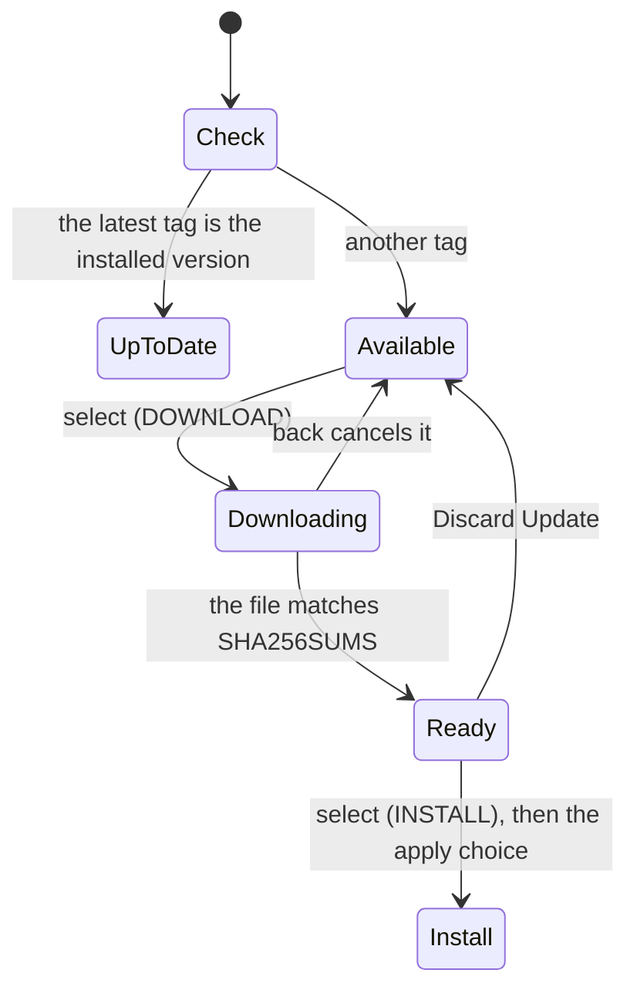

# Installation

Everything it takes to get OSD/OS running: the OSD/OS image, which makes a Raspberry Pi boot straight into OSD/OS, and OSD/OS as an app on Raspberry Pi OS, on an Apple Silicon Mac, and on SteamOS or another x86_64 Linux. It also covers updating, uninstalling, and which hardware OSD/OS has been tried on.


## Which way to choose

| | The OSD/OS image | App on Raspberry Pi OS | App on macOS | App on SteamOS / Linux x86_64 |
|---|---|---|---|---|
| Runs on | Raspberry Pi 4 or 5 ([Supported hardware](https://github.com/mehmetraif/OSD-OS/wiki/Installation#supported-hardware)) | Raspberry Pi OS Trixie, 64-bit | Apple Silicon Macs | x86_64 Linux with X11 or XWayland, glibc 2.39 or newer |
| You download | `OSD-OS-<version>-raspberry-pi.img.xz` | `install.sh`, which fetches `OSD-OS-<version>-linux-arm64.tar.gz` | `OSD-OS-<version>-macOS-arm64.dmg` | `OSD-OS-linux-x86_64.AppImage` |
| Starts | At power-on, before the rest of the system | At boot (with the autostart service), or with `osdos` | Like any app | Like any app, or from Steam |
| mpv | On the image | Installed by `install.sh` | `brew install mpv` | Inside the AppImage |
| Transparent Background | Yes | Yes (`libmpv2`) | Yes (Homebrew's libmpv) | No |
| Settings → Display Output | Yes | No | No | No |
| What YouTube, Netflix and Prime Video run | On the image (yt-dlp, Deno, Chromium with Widevine) | Installed by hand ([below](https://github.com/mehmetraif/OSD-OS/wiki/Installation#optional-extras)) | See [YouTube](https://github.com/mehmetraif/OSD-OS/wiki/YouTube) and [Netflix and Prime Video](https://github.com/mehmetraif/OSD-OS/wiki/Netflix-and-Prime-Video) | See the same pages |

The OSD/OS image is the simplest way, and the only one where OSD/OS is the whole system. The app installs keep the system you already have.

All the files are on the [latest release](https://github.com/mehmetraif/OSD-OS/releases/latest):

| File | What it is |
|---|---|
| `OSD-OS-<version>-raspberry-pi.img.xz` | The OSD/OS image, to flash to an SD card |
| `OSD-OS-<version>-raspberry-pi.info` | The list of packages on the image, with their versions |
| `OSD-OS-<version>-linux-arm64.tar.gz` | The app for Raspberry Pi OS, as `install.sh` installs it |
| `OSD-OS-<version>-macOS-arm64.dmg` | The app for Apple Silicon Macs |
| `OSD-OS-linux-x86_64.AppImage` | The app for SteamOS and other x86_64 Linux. No version in its name: it updates itself in place |
| `SHA256SUMS` | The SHA-256 checksum of the image, the `.dmg`, the `.tar.gz` and the AppImage |
| `install.sh` | The installer for Raspberry Pi OS |
| `setup-nfc-reader.sh` | Sets up access to an NFC reader ([NFC Reader](https://github.com/mehmetraif/OSD-OS/wiki/NFC-Reader)) |

To check a download, run this in the folder you downloaded it to (`shasum -a 256 -c` in place of `sha256sum -c` on a Mac):

```sh
grep raspberry-pi.img.xz SHA256SUMS | sha256sum -c
```

It prints the file's name and `OK`.

## The OSD/OS image

The OSD/OS image is Raspberry Pi OS Lite (64-bit), based on Debian 13 "trixie" and built with Raspberry Pi's own image builder, pi-gen, with one stage on top that makes it boot straight into OSD/OS. There is no desktop, no login prompt and no boot text: from power-on the screen is OSD/OS's, starting with its boot screen. OSD/OS starts as soon as the display driver is up, and Wi-Fi, Bluetooth and the local network wait until it is on screen. On the first boot the card's free space becomes a partition of its own, in exFAT, for your films. Chromium (for Netflix and Prime Video), yt-dlp and Deno (for YouTube), FluidSynth and openmpt123 (for menu music) are already on it. [The OSD/OS image](https://github.com/mehmetraif/OSD-OS/wiki/The-OSD-OS-Image) has the details; this section is how to get it onto a card.

### What you need

- A Raspberry Pi 4 or 5 (see [Supported hardware](https://github.com/mehmetraif/OSD-OS/wiki/Installation#supported-hardware)).
- A microSD card. The system keeps 8 GiB of it; the rest becomes the film partition, as long as at least 2 GiB is left over: on a 16 GB card that is about 6 GiB for films, on an 8 GB card none.
- A TV. The image starts on HDMI. For a CRT, it switches to composite (or SCART RGB on the GPIO pins) in Settings → Display Output, or you can pick the output on the card before the first boot ([below](https://github.com/mehmetraif/OSD-OS/wiki/Installation#composite-or-scart-from-the-first-boot)).
- A USB keyboard, remote or gamepad. A Bluetooth one can be paired later, from Settings → Bluetooth ([Controls](https://github.com/mehmetraif/OSD-OS/wiki/Controls#bluetooth)).
- A network, if you want the network modules: an Ethernet cable, or Wi-Fi set up while flashing.

### Download

Download `OSD-OS-<version>-raspberry-pi.img.xz` from the [latest release](https://github.com/mehmetraif/OSD-OS/releases/latest) (`OSD-OS-v0.0.2-raspberry-pi.img.xz`, for example). There is no need to unpack it: Raspberry Pi Imager and balenaEtcher read `.img.xz` as it is.

An image from the **OS image** workflow (the Actions tab, for a branch or a pull request) comes as a zip, the run's `osdos-image` artifact: take the `.img.xz` out of it. Its app is built as `dev`, which turns in-app updates off, so that a branch image never replaces itself with a release that lacks its changes. A release's image updates itself from later releases.

### Flashing with Raspberry Pi Imager

1. Open [Raspberry Pi Imager](https://www.raspberrypi.com/software/), choose your Raspberry Pi, then for the operating system choose **Use custom** and pick the `.img.xz`.
2. Choose the SD card and write.

**OS customisation.** Raspberry Pi Imager 2 skips OS customisation (Wi-Fi, a user and password, SSH, the hostname, the locale and the keyboard) for an image chosen with **Use custom**: it can't tell which kind of customisation the image takes. Imager 1 seems to apply it, but on Trixie its settings never take effect. Without customisation, the image still works: Ethernet needs nothing, and Wi-Fi can be [set up by hand](https://github.com/mehmetraif/OSD-OS/wiki/Installation#wi-fi-by-hand-network-config). To have the customisation, open the image through a local manifest, as follows.

#### A local manifest, for OS customisation

A manifest is a small JSON file that tells Imager about an image, including the customisation it takes. Raspberry Pi OS Trixie, and so the OSD/OS image, takes `"init_format": "cloudinit-rpi"` ([Imager's notes on local manifests](https://github.com/raspberrypi/rpi-imager/tree/main/doc/local_json)). The manifest also has to give the size and the SHA-256 checksum of the unpacked image, which Imager checks the written card against. This Python script works them out and writes the manifest next to the image. Save it as `make_manifest.py`:

```python
#!/usr/bin/env python3
# make_manifest.py: writes a Raspberry Pi Imager manifest for an OSD/OS image,
# so that Imager offers its OS customisation (Wi-Fi, user, SSH, locale) for it.
# Usage: python3 make_manifest.py OSD-OS-<version>-raspberry-pi.img.xz
import datetime, hashlib, json, lzma, pathlib, sys

image = pathlib.Path(sys.argv[1]).expanduser().resolve()
sha, size = hashlib.sha256(), 0
with lzma.open(image) as f:              # the .img inside the .img.xz
    while chunk := f.read(1 << 20):
        sha.update(chunk)
        size += len(chunk)

icons = "https://downloads.raspberrypi.com/imager/icons/"
manifest = {
    "imager": {"devices": [
        {"name": "Raspberry Pi 5", "tags": ["pi5-64bit", "pi5-32bit"],
         "icon": icons + "RPi_5.png", "matching_type": "exclusive",
         "description": "Raspberry Pi 5, 500 / 500+, and Compute Module 5"},
        {"name": "Raspberry Pi 4", "tags": ["pi4-64bit", "pi4-32bit"],
         "icon": icons + "RPi_4.png", "matching_type": "inclusive",
         "description": "Raspberry Pi 4 Model B, 400, and Compute Module 4 / 4S"},
        {"name": "Raspberry Pi 3", "tags": ["pi3-64bit", "pi3-32bit"],
         "icon": icons + "RPi_3.png", "matching_type": "inclusive",
         "description": "Raspberry Pi 3 Model A+ / B / B+ and Compute Module 3 / 3+"},
    ]},
    "os_list": [{
        "name": "OSD/OS",
        "description": "Raspberry Pi OS Lite (64-bit) that boots straight into OSD/OS",
        "icon": "https://downloads.raspberrypi.com/raspios_armhf/Raspberry_Pi_OS_(32-bit).png",
        "url": image.as_uri(),
        "extract_size": size,
        "extract_sha256": sha.hexdigest(),
        "image_download_size": image.stat().st_size,
        "release_date": datetime.date.fromtimestamp(image.stat().st_mtime).isoformat(),
        "init_format": "cloudinit-rpi",
        "devices": ["pi5-64bit", "pi4-64bit", "pi3-64bit"],
    }],
}
out = image.with_name("OSD-OS.rpi-imager-manifest")
out.write_text(json.dumps(manifest, indent=2) + "\n")
print("Wrote", out)
```

Run it on the downloaded image (Python 3.8 or later; it takes a minute, as it unpacks the image to measure it):

```sh
python3 make_manifest.py ~/Downloads/OSD-OS-*-raspberry-pi.img.xz
```

It writes `OSD-OS.rpi-imager-manifest` beside the image, pointing at it by its full path (so keep the image where it is). The device entries and the icons are the ones Raspberry Pi's own manifest uses for Raspberry Pi OS Lite (64-bit). Then open the manifest in Imager, in one of three ways:

- double-click `OSD-OS.rpi-imager-manifest`;
- or in Imager, **App Options** → **Content Repository** → **EDIT** → **Use custom file**, pick the manifest, then **APPLY & RESTART**;
- or start Imager with it: `rpi-imager --repo ~/Downloads/OSD-OS.rpi-imager-manifest`.

**OSD/OS** is then on Imager's OS page, and Imager offers its customisation: fill in the Wi-Fi, a user with a password, SSH and the locale. cloud-init applies them on the first boot, and the image then switches cloud-init off, so that it doesn't slow down later boots.

### Flashing with another tool

Any tool that writes disk images works, balenaEtcher for example, but none of them customises the image. On Linux, `dd` does it from the command line. Find the card's device first with `lsblk`, and make sure it is the card: `dd` overwrites whatever it is given.

```sh
xz -dc ~/Downloads/OSD-OS-*-raspberry-pi.img.xz | sudo dd of=/dev/sdX bs=4M conv=fsync status=progress
```

Replace `/dev/sdX` with the card's device (a whole disk, such as `/dev/sdb` or `/dev/mmcblk0`, not a partition such as `/dev/sdb1`).

### Wi-Fi by hand: network-config

Without Imager's customisation, set up Wi-Fi before the first boot by editing `network-config` on the card's boot partition. After flashing, take the card out and put it back in: the computer shows the boot partition as a drive called **bootfs** (Windows and macOS open it). `network-config` is a [netplan](https://netplan.io/reference)-style file that cloud-init applies on the first boot. As it comes, it holds only comments and commented-out examples. Add these lines at its end, with your network's name, its password and your two-letter country code. They are what Raspberry Pi Imager itself writes there for a Wi-Fi network:

```yaml
network:
  version: 2
  ethernets:
    eth0:
      dhcp4: true
      dhcp6: true
      optional: true
  wifis:
    wlan0:
      dhcp4: true
      regulatory-domain: "GB"
      access-points:
        "My Home WiFi":
          password: "correct battery horse staple"
      optional: true
```

- Keep the `ethernets` lines: what `network-config` sets up replaces Raspberry Pi OS's default, and they keep the Ethernet port working beside the Wi-Fi.
- `regulatory-domain` is the Wi-Fi country. Raspberry Pi OS keeps Wi-Fi switched off until a country is set.
- Indent with spaces, never tabs: YAML reads the indentation. Keep the quotes around the name and the password.
- For an open network, replace the `password:` line with `auth:` and, under it, `key-management: none`; for a hidden one, add `hidden: true` at the same level as `password:`.
- It is applied on the first boot only. To change the Wi-Fi later, use NetworkManager on the Pi itself, over SSH or from Exit to Terminal: `sudo nmcli device wifi connect "My Home WiFi" password "correct battery horse staple"`.

### Composite or SCART from the first boot

The image starts on HDMI. If the Pi will only ever see a CRT, choose its output on the card before the first boot, as the image's `config.txt` explains: copy one of the presets on **bootfs** over `osdos-display.txt`. For example, for composite PAL from a Pi 4's AV jack or a Pi 5's TV pads, on Linux or macOS (on Windows, copy the file and rename it in the file manager):

```sh
cp /media/$USER/bootfs/osdos-display-crt-pal.txt /media/$USER/bootfs/osdos-display.txt   # Linux
cp /Volumes/bootfs/osdos-display-crt-pal.txt /Volumes/bootfs/osdos-display.txt           # macOS
```

| Preset | Output | Pi 4 | Pi 5 |
|---|---|---|---|
| `osdos-display-hdmi.txt` | HDMI, resolution detected (the default) | ✓ | ✓ |
| `osdos-display-crt-ntsc.txt`, `osdos-display-crt-pal.txt` | Composite NTSC / PAL, 4:3: the AV jack, or a Pi 5's TV pads | ✓ | ✓ |
| `osdos-display-crt-gpio-ntsc.txt`, `osdos-display-crt-gpio-pal.txt` | Composite from a Pi 5's GPIO pins | | ✓ |
| `osdos-display-scart-rgb-ntsc.txt`, `osdos-display-scart-rgb-pal.txt` | SCART RGB on the GPIO pins, 480i / 576i | ✓ | ✓ |
| `osdos-display-scart-rgb-240p.txt`, `osdos-display-scart-rgb-288p.txt` | SCART RGB on the GPIO pins, 240p / 288p | ✓ | |

A Pi 5's SCART RGB also needs a line on the system partition (`options drm_rp1_dpi force_csync=1` in `/etc/modprobe.d/osdos-display.conf`), which Windows and macOS can't reach: choose it in Settings → Display Output instead, which writes it. Once running, Settings → Display Output switches outputs, and keeps a new one only when you confirm it on its own screen. [Display Output](https://github.com/mehmetraif/OSD-OS/wiki/Display-Output) has the cables and every detail.

### The first boot


Put the card in the Pi, connect the TV and the keyboard, remote or gamepad, and switch it on. On the first boot:

1. **The card is split.** Before the system starts, the root partition grows to 8 GiB instead of the whole card, and the rest becomes a third partition in exFAT, labelled **OSD-OS**. This happens once, on a freshly flashed card. A card with less than 2 GiB to spare past the system gets no film partition, and the system takes all of it.
2. **The boot screen.** OSD/OS comes up as soon as the display driver is ready and shows its boot screen: the OSD/OS cassette, its reels turning and its tape winding from one onto the other as the progress bar fills, and a line per service: `[ OK ] WI-FI`, `BLUETOOTH`, `LOCAL NETWORK`, `SSH` (only when the image was built with SSH on) and `ONLINE`, a check that the network is really up, which gives up after 20 seconds without one. The boot screen closes by itself once every service has settled, or after a minute. Keys do nothing while it is up, but Ctrl+Q, which powers the Pi off.
3. **cloud-init** applies Imager's customisation or your `network-config`, then is switched off for later boots.
4. **The main menu.** Out of the box it lists **Local Files** and **Playlists**, the two modules that are on by default. Turn the others on in Settings (back, on the main menu); each module's own page says how to set it up ([Modules](https://github.com/mehmetraif/OSD-OS/wiki/Modules)).

Later boots skip the first and third steps. [Using OSD/OS](https://github.com/mehmetraif/OSD-OS/wiki/Using-OSD-OS) goes through every screen from here.

**Films on the card.** Local Files opens the **OSD-OS** partition (`/media/OSD-OS`) until its Media Directory setting names another folder. To fill it from a computer: quit OSD/OS (Settings → Quit → Power Off), take the card out, and copy films onto the drive called **OSD-OS**, in folders if you like. Windows also offers to format the system's partition, which it can't read: always answer **Cancel**, as formatting it erases the system. A USB stick or disk plugged into the Pi shows up in Local Files too, as `USB: <label>`. [The OSD/OS image](https://github.com/mehmetraif/OSD-OS/wiki/The-OSD-OS-Image) and [Local Files](https://github.com/mehmetraif/OSD-OS/wiki/Local-Files) have the details.

### The user, the password and SSH

The image's own user is `pi`, and OSD/OS runs as that user. You only need to log in for **Exit to Terminal** (Settings → Quit) or SSH.

- **The password.** A release image's `pi` gets the password the repository secret `OS_FIRST_USER_PASS` holds, when the release was built with one. An image built without a password has `pi`'s account locked: Exit to Terminal then logs `pi` in by itself (whoever is at the keyboard could take the card out anyway), but that shell has no root, as `sudo` asks for the password `pi` doesn't have. If Exit to Terminal gives you a login prompt instead, the image has a password.
- **A user of your own.** The user Imager's customisation creates can log in, with a password, and use `sudo`. That is the way to SSH and `sudo` on an image whose `pi` is locked.
- **SSH** is off on a release image. Turn it on in Imager's customisation (through the [local manifest](https://github.com/mehmetraif/OSD-OS/wiki/Installation#a-local-manifest-for-os-customisation)), or from a shell on the Pi with a user who can use `sudo`:

  ```sh
  sudo systemctl enable --now ssh
  ```

  Then connect by the hostname, `osdos` unless the customisation set another, or by the IP address, which Settings shows at the right of its title bar:

  ```sh
  ssh your-user@osdos.local
  ```


Once in, `journalctl -u osdos -b` shows OSD/OS's log for this boot ([Troubleshooting](https://github.com/mehmetraif/OSD-OS/wiki/Troubleshooting)).

### Ethernet

Plug the cable in, before or after switching on: there is nothing to set up. NetworkManager takes an address by DHCP, and the boot screen's `ONLINE` line waits for it.

## As an app on Raspberry Pi OS

Installed this way, OSD/OS is an app on a Raspberry Pi OS you set up yourself: the system boots its own way, then OSD/OS starts, at boot if you install the autostart service, or when you type `osdos`. Choose this to keep a system you already have; otherwise the image is simpler.

### What you need

- A Raspberry Pi with **Raspberry Pi OS Trixie (Debian 13), 64-bit**. Raspberry Pi OS Lite is the one these steps use; the installer refuses anything but arm64 (`aarch64`).
- An SD card of at least 4 GB.
- A keyboard to begin with, and network access (Wi-Fi or Ethernet).
- Optional: a USB remote or gamepad; a CRT and a composite cable.

### 1. Write Raspberry Pi OS Lite (64-bit)

In [Raspberry Pi Imager](https://www.raspberrypi.com/software/), choose **Raspberry Pi OS (other)** → **Raspberry Pi OS Lite (64-bit)**. Imager's customisation works for this official image: fill in the hostname, a user, the Wi-Fi, and turn SSH on, which saves setting them up later.

### 2. config.txt, for a CRT or for HDMI

When Imager has finished, take the card out and put it back in, and replace `config.txt` on its **bootfs** drive with the one that matches your TV. These are the settings the OSD/OS image uses too.

**Composite to a CRT** (NTSC; set `sdtv_mode=2` for PAL):

```ini
# --- Global ---
auto_initramfs=1
disable_splash=1
disable_overscan=1
dtparam=audio=on

# Composite
enable_tvout=1
sdtv_mode=0      # 0 = NTSC, 2 = PAL
sdtv_aspect=1    # 1 = 4:3

# --- Pi 3B ---
[pi3]

# Drivers & Video
dtoverlay=vc4-fkms-v3d,cma-256

# Overclocking
over_voltage=4
arm_freq=1300
core_freq=450
sdram_freq=500

# --- Pi 3B+ ---
[pi3+]

# Drivers & Video
dtoverlay=vc4-fkms-v3d,cma-256

# Overclocking
over_voltage=2
arm_freq=1500
core_freq=500
sdram_freq=500

# --- Pi 4B ---
[pi4]

# Drivers & Video
dtoverlay=vc4-fkms-v3d,cma-256
dtoverlay=rpivid-v4l2

# Overclocking
over_voltage=2
arm_freq=1750
gpu_freq=600

# --- Pi 5 ---
[pi5]

# Drivers & Video
dtoverlay=vc4-kms-v3d,cma-512,composite=1

# --- Global ---
[all]
```

**HDMI to a modern TV:**

```ini
# --- Global ---
auto_initramfs=1
disable_splash=1
disable_overscan=1

# HDMI
display_auto_detect=1
hdmi_force_hotplug=1

# --- Pi 3B ---
[pi3]

# Drivers & Video
dtoverlay=vc4-fkms-v3d,cma-256

# Overclocking
over_voltage=4
arm_freq=1300
core_freq=450
sdram_freq=500

# --- Pi 3B+ ---
[pi3+]

# Drivers & Video
dtoverlay=vc4-fkms-v3d,cma-256

# Overclocking
over_voltage=2
arm_freq=1500
core_freq=500
sdram_freq=500

# --- Pi 4B ---
[pi4]

# Drivers & Video
dtoverlay=vc4-fkms-v3d,cma-256
dtoverlay=rpivid-v4l2

# Overclocking
over_voltage=2
arm_freq=1750
gpu_freq=600

# --- Pi 5 ---
[pi5]

# Drivers & Video
dtoverlay=vc4-kms-v3d

# --- Global ---
[all]
```

The Pi 3 and Pi 4 run the firmware's "fake" KMS driver (`vc4-fkms-v3d`), the Pi 5 the full KMS driver (`vc4-kms-v3d`); OSD/OS picks its video decoding to match ([Playback and mpv](https://github.com/mehmetraif/OSD-OS/wiki/Playback-and-mpv)). The overclocking lines are the ones these configurations have always carried; remove them if you'd rather not overclock.

### 3. First boot and SSH

Put the card in the Pi and let it boot. Raspberry Pi OS Lite has no desktop: you may see boot messages, a text login, or a blinking cursor for a while. Then connect over SSH, with the hostname and user you gave Imager, or the Pi's IP address (your router's client list has it, or `hostname -I` on the Pi):

```sh
ssh your-user@your-hostname.local
```

Run `sudo raspi-config` and set **System Options → Auto Login → Yes** and **Advanced Options → Expand Filesystem**, then **Finish** and let the Pi restart.

### 4. Run the installer

Over SSH again, run:

```sh
bash <(curl -fsSL https://github.com/mehmetraif/OSD-OS/releases/latest/download/install.sh)
```

It installs the latest release. To install a particular one, download that release's `install.sh` and give it the release's tag, as the Releases page lists it:

```sh
TAG=v0.0.1   # the release you want, as the Releases page names it
curl -fsSLO "https://github.com/mehmetraif/OSD-OS/releases/download/$TAG/install.sh"
bash install.sh "$TAG"
```

It asks two questions:

- `Install systemd autostart service? [y/N]`: **y** makes the Pi start OSD/OS at every boot, an appliance as close to the image as an install gets. **N** (the default) installs the app only.
- `Run service as user [default: pi]:` (only after **y**): the user OSD/OS runs as. Give your own user's name if it isn't `pi`.

Installing the dependencies can take a while; over Wi-Fi, about 20 minutes. Then `osdos` starts OSD/OS at any time, and with the service installed, the next boot goes straight into it. Follow the service's log with `sudo journalctl -u osdos -f`.

#### What install.sh does

| Step | What |
|---|---|
| Finds the release | The latest release's tag from GitHub's API, or the tag you gave it |
| Replaces 240-MP | An install from OSD/OS's days as 240-MP (`/opt/240mp`, `240mp.service`) is removed, so the two never fight over the screen. OSD/OS moves 240-MP's data folder over to its own on its first start |
| Installs packages | `libqt6quick6 libqt6qml6 libqt6opengl6 libqt6network6 libqt6svg6 qt6-svg-plugins qt6-wayland qml6-module-qtquick qml6-module-qtquick-controls qml6-module-qtquick-window qml6-module-qtquick-effects libsdl2-2.0-0 libpcsclite1 libmpv2 mpv fluidsynth timgm6mb-soundfont openmpt123` |
| A udev rule | `/etc/udev/rules.d/99-osdos-tty.rules`: lets the `tty` group open `/dev/tty0`, for handing the screen to mpv and back |
| The `bluetooth` group | Adds the user OSD/OS runs as, so Settings → Bluetooth can talk to BlueZ |
| Unpacks the app | `OSD-OS-<version>-linux-arm64.tar.gz` into `/opt/osdos`, owned by the user OSD/OS runs as, so in-app updates can replace it |
| The launcher | `/usr/local/bin/osdos`: applies a downloaded update, then starts OSD/OS on Wayland or X11 when there is a desktop, or straight on the screen (Qt's EGLFS) when there isn't, on the right display card (a Pi 5's video card is not always the first) |
| The service | Only after **y**: `/etc/systemd/system/osdos.service`, its stop helper `/usr/local/bin/osdos-stop`, and `osdos-terminal.service` for Exit to Terminal. The console login on `tty1` is masked (`getty@tty1`, `autovt@`), so the screen is OSD/OS's |

#### The autostart service

The service starts OSD/OS after the rest of the system (`multi-user.target`), as the user you named, with access to the screen and the input devices. When OSD/OS exits, the stop helper `osdos-stop` decides what happens by its exit code:

| Exit code | Comes from | What happens |
|---|---|---|
| 0 | Quit → Power Off (or Ctrl+Q) | The Pi powers off |
| 10 | Quit → Exit to Terminal | A login prompt on `tty1`; the service stays installed for the next boot |
| 11 | Settings → Update → Apply & Restart | Nothing: systemd starts OSD/OS again through the launcher, which applies the update |
| 12 | Quit → Restart | The Pi reboots |
| 20–29 | Settings → Display Output (the OSD/OS image) | A display preset is written, then the Pi reboots |
| 129, 130, 143 (SIGHUP, SIGINT, SIGTERM, which OSD/OS turns into these), or SIGKILL | `systemctl stop` / `restart`, a shutdown | Nothing: the Pi stays on |
| Anything else: a crash (SIGSEGV, SIGABRT…), an error exit such as 1 | | The Pi powers off |

From a shell, `sudo systemctl start osdos` brings OSD/OS back after Exit to Terminal. To run it by hand while debugging, stop the service first, so the two don't fight over the screen; run by hand, quitting just returns to the shell:

```sh
sudo systemctl stop osdos
osdos
```

#### Optional extras

`install.sh` installs what the app and its menu music need. A few modules need more, which the OSD/OS image has and a manual install doesn't:

- **YouTube** needs yt-dlp, kept up to date, and a JavaScript runtime for it, Deno. Raspberry Pi OS's own yt-dlp is too old; get the latest from yt-dlp's releases:

  ```sh
  sudo wget https://github.com/yt-dlp/yt-dlp/releases/latest/download/yt-dlp -O /usr/local/bin/yt-dlp && sudo chmod a+rx /usr/local/bin/yt-dlp
  ```

  Install Deno following yt-dlp's [EJS guide](https://github.com/yt-dlp/yt-dlp/wiki/EJS), and make sure `deno` is on the `PATH` of the user OSD/OS runs as. OSD/OS looks for yt-dlp first in its data folder (`~/.local/share/OSD-OS/bin/yt-dlp`), then next to its own program, then on the `PATH`. [YouTube](https://github.com/mehmetraif/OSD-OS/wiki/YouTube) has the rest.
- **Netflix and Prime Video** (and YouTube's sign-in) open the service's own player in Chromium, with Widevine, under the `cage` kiosk compositor when there is no desktop, and close it with `wtype`:

  ```sh
  sudo apt install chromium libwidevinecdm0 cage wtype
  ```

  See [Netflix and Prime Video](https://github.com/mehmetraif/OSD-OS/wiki/Netflix-and-Prime-Video).
- **An NFC reader** needs device access set up once: see [NFC Reader](https://github.com/mehmetraif/OSD-OS/wiki/NFC-Reader).
- **USB drives** are not mounted by themselves on Raspberry Pi OS Lite, as they are on the image. Local Files still lists a drive mounted under `/media` some other way.
- **A gamepad that isn't seen**: the service runs OSD/OS with access to the input devices; run by hand, your user needs to be in the `input` group: `sudo usermod -aG input $USER`, then reboot.

#### On a CRT: picture and sound

- **A picture slightly squeezed or stretched.** mpv assumes square pixels, which a CRT's aren't. Create `~/.config/mpv/mpv.conf` (for the user OSD/OS runs as) with the line below, and tune the number against a 4:3 test pattern; [pixel aspect ratio](https://en.wikipedia.org/wiki/Pixel_aspect_ratio#Introduction) has the values for NTSC and PAL:

  ```ini
  monitorpixelaspect=0.888889
  ```

- **Composite sound unusually quiet:** `amixer sset PCM 100%`, and `sudo alsactl store` to keep the level across reboots.
- **No sound at all:** Settings → Audio Output picks the sound card (the AV jack, HDMI or a USB card) where plain ALSA plays, as on Raspberry Pi OS Lite. [Audio Output](https://github.com/mehmetraif/OSD-OS/wiki/Audio-Output) also covers choosing it for the whole system.

## On macOS (Apple Silicon)

OSD/OS runs on Apple Silicon Macs (not Intel ones), full screen. It plays videos with Homebrew's mpv, which you install yourself.

1. Download `OSD-OS-<version>-macOS-arm64.dmg` from the [latest release](https://github.com/mehmetraif/OSD-OS/releases/latest).
2. Open it and drag **osdos.app** onto the **Applications** folder beside it.
3. Install mpv with [Homebrew](https://brew.sh), and the optional extras you want:

   ```sh
   brew install mpv                  # required: plays the videos, and libmpv for Transparent Background
   brew install fluid-synth libopenmpt   # optional: menu music from MIDI files and trackers' XM, MOD, S3M and IT
   brew install yt-dlp deno          # optional: the YouTube module
   ```

   A MIDI file needs a General MIDI SoundFont (an `.sf2` file) in the data folder's `soundfonts` folder, `~/Library/Application Support/OSD-OS/soundfonts/`: Homebrew's FluidSynth doesn't bring one.
4. Open **osdos** from Applications. If macOS refuses because it can't check it (a release that isn't notarized; its notes say so), go to **System Settings → Privacy & Security** and choose **Open Anyway**, or run the line below and open it again. You only need to do this the first time.

   ```sh
   xattr -dr com.apple.quarantine /Applications/osdos.app
   ```

On a Mac:

- The data folder, with your settings, is `~/Library/Application Support/OSD-OS/`.
- There is no Settings → Bluetooth: pair keyboards, remotes and gamepads in macOS's own Bluetooth settings. Settings → Display Output and Audio Output are not offered either.
- With several displays, OSD/OS opens on the main one. To open it on another (a CRT through an adapter, say), find the display's number in the log (`[main] display index 1: …`) and set `display_index` in `config.json`, then start it again; videos follow it:

  ```json
  {
    "app": {
      "display_index": 1
    }
  }
  ```

  [Configuration files](https://github.com/mehmetraif/OSD-OS/wiki/Configuration-Files) has the whole file.

## On SteamOS and Linux x86_64 (AppImage)

On SteamOS (a Steam Deck) and other x86_64 Linux, OSD/OS comes as an AppImage: a single file with Qt, SDL2 and mpv 0.40 inside, so there is nothing else to install, even on SteamOS's read-only system.

It needs a graphical session, X11, or Wayland with XWayland (the AppImage carries Qt's X11 platform plugin only), and a recent system: it is built on Ubuntu 24.04, so it needs glibc 2.39 or newer (a current Steam Deck and current distributions; not Ubuntu 22.04, Debian 12 or an older SteamOS). It carries spare Wayland client libraries for X11-only systems that have none, such as Batocera, and uses them only when the system lacks its own.

1. On SteamOS, switch to **Desktop Mode** first.
2. Download `OSD-OS-linux-x86_64.AppImage` from the [latest release](https://github.com/mehmetraif/OSD-OS/releases/latest).
3. Make it executable: in the file manager, right-click it → **Properties → Permissions** → tick **Is executable**, or from a terminal:

   ```sh
   chmod +x OSD-OS-linux-x86_64.AppImage
   ```

4. Double-click it to start OSD/OS.

**Gaming Mode.** In Desktop Mode, open Steam → **Games → Add a Non-Steam Game to My Library**, choose **Browse**, and pick the AppImage. In Gaming Mode it is then in your library under Non-Steam games.

**YouTube.** yt-dlp is deliberately not inside the AppImage: YouTube changes often, and yt-dlp has to be updated apart from OSD/OS. Put a copy in the data folder, where OSD/OS looks first, and where it can update itself even on SteamOS:

```sh
mkdir -p ~/.local/share/OSD-OS/bin
curl -fsSL -o ~/.local/share/OSD-OS/bin/yt-dlp https://github.com/yt-dlp/yt-dlp/releases/latest/download/yt-dlp
chmod +x ~/.local/share/OSD-OS/bin/yt-dlp
~/.local/share/OSD-OS/bin/yt-dlp -U    # later, to update it
```

OSD/OS hands the same copy to mpv. For a JavaScript runtime for it, see yt-dlp's [EJS guide](https://github.com/yt-dlp/yt-dlp/wiki/EJS).

On the AppImage:

- The data folder is `~/.local/share/OSD-OS/`, as on the Pi.
- **Transparent Background is not offered**: the AppImage is built without libmpv, which it needs.
- Gamepads work through Steam Input too: when Steam's virtual gamepad is present, OSD/OS listens to it alone, so that no press arrives twice ([Controls](https://github.com/mehmetraif/OSD-OS/wiki/Controls#gamepads)).
- `display_index` chooses the display, as on a Mac (above).

## The data folder

Wherever OSD/OS runs, it keeps your settings apart from the app, so reinstalling or updating never loses them:

| System | Data folder |
|---|---|
| Raspberry Pi (the image and `install.sh`), SteamOS, Linux | `~/.local/share/OSD-OS/`, in the home of the user OSD/OS runs as (`$XDG_DATA_HOME/OSD-OS` when `XDG_DATA_HOME` is set) |
| macOS | `~/Library/Application Support/OSD-OS/` |

It holds `config.json` (the settings), `lists.json` (each module's Recently Watched and Favorites), sign-ins, and the folders the modules use. The environment variable `DATA_ROOT`, set to an existing folder, puts it elsewhere; on a Raspberry Pi, set it where the launcher can see it too (in the service), or it won't find downloaded updates. [Configuration files](https://github.com/mehmetraif/OSD-OS/wiki/Configuration-Files) describes every file.

## Updating


### Settings → Update

Settings → **Update** checks GitHub for the [latest release](https://github.com/mehmetraif/OSD-OS/releases/latest) of OSD/OS and installs it, on every system. It shows the version installed, the latest one and its release notes (▲ ▼ scroll them), and select does the next step:



- **CHECK** asks GitHub for the latest release. A release whose tag differs from the installed version is offered. Pre-releases (tags with `-rc`, `-beta` or `-alpha`) are never the latest, so they are never offered.
- **DOWNLOAD** fetches the file for this system (the `.tar.gz` on a Raspberry Pi, the `.dmg` on a Mac, the AppImage on x86_64 Linux) into the data folder's `updates` folder, and checks it against the release's `SHA256SUMS`. It needs three times the file's size free. Back during the download cancels it.
- **INSTALL** asks **Install update?** A downloaded update does nothing until you choose to apply it; back, or **Discard Update**, leaves the installed version as it is.

What applying does depends on the system:

| System | The choice | What happens |
|---|---|---|
| The OSD/OS image, or `install.sh` with the autostart service | **Apply & Restart** | OSD/OS exits (code 11), systemd starts it again through the launcher, and the launcher swaps the new version into `/opt/osdos` before starting it |
| `install.sh` without the service | **Quit & Apply on Next Launch** | OSD/OS quits; the launcher applies the update the next time you run `osdos` |
| macOS, the app in `/Applications` | **Apply & Relaunch** | The new app replaces the old one in `/Applications` and opens |
| macOS, the app anywhere else | **Quit & Open Disk Image** | OSD/OS quits and opens the downloaded `.dmg`, to drag the app into place yourself |
| The AppImage | **Quit & Apply on Next Launch** | The new AppImage replaces the old one in place, keeping a `.bak` of the old one until the new one starts; in Desktop Mode it then starts again by itself, in Gaming Mode it quits and you start it from Steam (the path is the same, so the shortcut still works) |

Your settings stay as they are. Some installs can't update in place, and the page says why: an install from before in-app updates (run `install.sh` once more, below), an install in a non-standard place, an AppImage in a read-only folder (download the new one by hand), or a `dev` build, such as an image from the OS image workflow, which can check and read the notes but not download.

### Updating with install.sh

On Raspberry Pi OS, running the installer again also updates OSD/OS, keeping your settings. It is the way for an install made before in-app updates existed:

```sh
bash <(curl -fsSL https://github.com/mehmetraif/OSD-OS/releases/latest/download/install.sh)
```

Answer **y** to the autostart question if the service is installed (that keeps the app's files owned by the service's user, which in-app updates need), **N** to keep going without it. Then `sudo reboot`.

### Updating Raspberry Pi OS on the image

Settings → Update updates OSD/OS, which lives in `/opt/osdos` and isn't a Debian package. The system underneath, Raspberry Pi OS (the kernel, the firmware, mpv, Qt, Chromium), updates with apt. The image has switched off the timers that would run apt by itself, so that nothing wakes the card mid-film: update it by hand when you choose, from SSH or Exit to Terminal, as a user who can use `sudo`:

```sh
sudo apt update
sudo apt full-upgrade
sudo reboot
```

YouTube's yt-dlp is the exception: on the image it replaces itself with its newest nightly build two minutes after each boot and once a day (`osdos-yt-dlp-update.timer`), when there is a connection.

## Uninstalling

**The OSD/OS image** is the whole system: to use the card for something else, flash another image over it. Copy your films off the **OSD-OS** partition first.

**On Raspberry Pi OS,** stop and remove the service (if you installed it), then the app, its launcher and its udev rule, and last your settings if you don't want them back:

```sh
sudo systemctl disable --now osdos.service
sudo systemctl unmask getty@tty1.service autovt@.service
sudo rm -f /etc/systemd/system/osdos.service /etc/systemd/system/osdos-terminal.service /usr/local/bin/osdos-stop
sudo systemctl daemon-reload
sudo rm -rf /opt/osdos
sudo rm -f /usr/local/bin/osdos /etc/udev/rules.d/99-osdos-tty.rules
rm -rf ~/.local/share/OSD-OS
```

Stopping the service from outside leaves the Pi on. The packages `install.sh` installed stay; remove them with apt if nothing else uses them.

**On macOS,** drag **osdos** from Applications to the Bin, and delete `~/Library/Application Support/OSD-OS/`.

**The AppImage:** delete `OSD-OS-linux-x86_64.AppImage` (and remove it from Steam if you added it), and delete `~/.local/share/OSD-OS/`.

## Supported hardware

OSD/OS is tested on a **Raspberry Pi 4**. Its owner also tests it on a **Raspberry Pi 5 (8 GB)**. Nothing else has been tested with OSD/OS so far: on another board, please tell us how it went in an [issue](https://github.com/mehmetraif/OSD-OS/issues).

OSD/OS reads the board's model (`/proc/device-tree/model`) and sets itself up for its family: the mpv flags it plays videos with, and the outputs Settings → Display Output offers.

| Board | With OSD/OS | Display driver | mpv's video flags | Settings → Display Output offers (on the image) |
|---|---|---|---|---|
| Raspberry Pi 4 | Tested | Fake KMS (`vc4-fkms-v3d`) | `--vo=drm --hwdec=drm-copy,v4l2m2m-copy` | HDMI, composite (AV jack), SCART RGB 480i/576i/240p/288p |
| Raspberry Pi 5 | The owner also tests on one (8 GB) | Full KMS (`vc4-kms-v3d`) | `--vo=drm --hwdec=auto-safe` | HDMI, composite (TV pads, or GPIO), SCART RGB 480i/576i |
| Raspberry Pi 3B / 3B+ | Not tested with OSD/OS | Fake KMS (`vc4-fkms-v3d`) | `--vo=gpu --gpu-context=drm --hwdec=v4l2m2m` | HDMI, composite (AV jack) |
| Raspberry Pi 400 / 500 | Not tested | As a Pi 4 / Pi 5 | As a Pi 4 / Pi 5 | As a Pi 4 / Pi 5, without the AV jack's or the TV pads' composite |
| Any other board | Not tested | | `--vo=drm --hwdec=auto-safe` | Not offered |

Of the outputs, only the Pi 4's HDMI and composite have been tried on a TV. The others are starting points; a new output stays only when you keep it on its own screen, so one that shows nothing comes back to the old one by itself after 15 seconds.

### How a Raspberry Pi 5 differs

- **No AV jack.** Its composite video comes from two pads on the board (J7), which need wires or a pin header soldered on. Settings → Display Output calls it Composite NTSC or PAL, as on a Pi 4. A Pi 5 can also send composite from its GPIO pins, as an 8-bit code for a DAC to turn into a picture; the pads are the simpler way. A Pi 5 may keep HDMI on beside the CRT: the display preset names the output and the mode OSD/OS and its videos use.
- **No analog sound.** Sound goes out over HDMI, or through a USB sound card for a CRT, chosen in Settings → Audio Output.
- **Full KMS.** It boots the full KMS driver (`vc4-kms-v3d`), so mpv draws straight to the screen (`--vo=drm`), and `--hwdec=auto-safe` picks FFmpeg's Vulkan decoder on the Pi 5's GPU, which reaches its HEVC hardware and keeps H.264 light too, with crop working.
- **SCART RGB** on its GPIO pins is the kernel's (480i and 576i, no 240p or 288p), with the composite sync SCART needs made on GPIO 1.
- **The display card.** On a Pi 5 the GPU's render-only device often comes first, so OSD/OS's launcher picks the card that has a display connected.

[Display Output](https://github.com/mehmetraif/OSD-OS/wiki/Display-Output) and [Audio Output](https://github.com/mehmetraif/OSD-OS/wiki/Audio-Output) have the wiring and the settings.

### The other boards

- **Raspberry Pi 3B / 3B+.** OSD/OS keeps the settings 240-MP's author used on a Pi 3. Its mpv flags send the video straight to a hardware overlay, which keeps 1080p H.264 smooth but can't crop: Settings → **1080p Playback** (shown on a Pi 3 only) trades that the other way, and [Playback and mpv](https://github.com/mehmetraif/OSD-OS/wiki/Playback-and-mpv) shows how to set the flags yourself (`mpv_video_args`). Some USB flash drives hang a Pi 3 booting from USB: if it won't start from one, try an SD card first.
- **Raspberry Pi 400 / 500** are read as a Pi 4 and a Pi 5, without the AV jack or TV pads they don't have.
- **Boards without a 64-bit Raspberry Pi OS** (the Pi 1 and the first Pi Zero, for example) can't run OSD/OS: the image and the app are 64-bit (arm64), and `install.sh` stops on anything else.
- **Other computers:** an Apple Silicon Mac, or an x86_64 Linux machine with the AppImage (above).

## See also

- [Using OSD/OS](https://github.com/mehmetraif/OSD-OS/wiki/Using-OSD-OS): every screen, from the boot screen on
- [Controls](https://github.com/mehmetraif/OSD-OS/wiki/Controls): keyboards, remotes, gamepads, Bluetooth
- [The OSD/OS image](https://github.com/mehmetraif/OSD-OS/wiki/The-OSD-OS-Image): how the image boots, its films partition and USB drives
- [Display Output](https://github.com/mehmetraif/OSD-OS/wiki/Display-Output) and [Audio Output](https://github.com/mehmetraif/OSD-OS/wiki/Audio-Output)
- [Configuration files](https://github.com/mehmetraif/OSD-OS/wiki/Configuration-Files): the data folder and `config.json`
- [Troubleshooting](https://github.com/mehmetraif/OSD-OS/wiki/Troubleshooting)
- [Building from source](https://github.com/mehmetraif/OSD-OS/wiki/Building-from-Source): building the app and the image yourself
