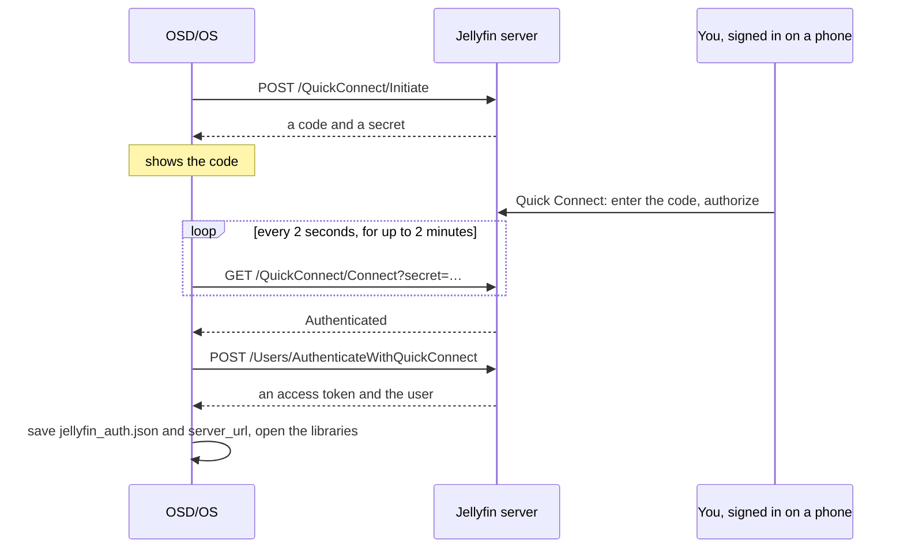

# Jellyfin

The Jellyfin module plays your films, series and home videos from a [Jellyfin](https://jellyfin.org) server, the free and open media server. You sign in with **Quick Connect**: OSD/OS shows a code, you approve it from any device where you are already signed in to Jellyfin, and no password is typed on the TV. This page covers signing in step by step, the libraries and how to browse them, Continue Watching and Next Up, resume, autoplay, audio and subtitle tracks, video quality, intro and credit skipping, putting videos on a playlist, every setting with its config key, how the sign-in is stored, and what to do when it doesn't work.

The module is in [modules/jellyfin](https://github.com/mehmetraif/OSD-OS/tree/main/modules/jellyfin) (views and manifest) and [src/modules/jellyfin](https://github.com/mehmetraif/OSD-OS/tree/main/src/modules/jellyfin) (`JellyfinBackend`). The [Emby](https://github.com/mehmetraif/OSD-OS/wiki/Emby) module is its twin; its page lists where the two differ.

<table>
<tr><th width="50%">Jellyfin</th><th width="50%">Add to Playlist</th></tr>
<tr><td></td><td></td></tr>
<tr><td>Connect to a server with Quick Connect.</td><td>► on PLAY puts the video on a playlist.</td></tr>
</table>

## What you need

- A Jellyfin server the device can reach, and its address: `http://` or `https://`, the host or IP address, and the port (Jellyfin's usual ones are 8096 for HTTP and 8920 for HTTPS), such as `http://192.168.1.20:8096`.
- **Quick Connect** turned on in the server's settings (an administrator can do it in the Jellyfin dashboard).
- A phone, tablet or computer where you are signed in to Jellyfin as the user OSD/OS should play as, to approve the code.
- Something to type the server's address with, once: a USB keyboard, or one paired in **Settings → Bluetooth**. The sign-in screen has no on-screen keyboard. Without a keyboard, put the address in `config.json` first ([below](#sign-in-without-a-keyboard)), and the remote does the rest.

## Turning it on

Jellyfin is off until you turn it on: **Settings → Jellyfin → Enabled** (in the Modules section of Settings). It then appears on the main menu. Its other settings show once you have signed in.

## Signing in with Quick Connect

1. Open **Jellyfin** from the main menu. The **Connect to Server** screen has a **Server URL** field and a **Quick Connect** button. The field holds the address used last time, if any.
2. Type the server's address in the field, with its `http://` or `https://` and its port.
3. Press Enter (in the field, or with ▼ on **Quick Connect**). **CONNECTING…** shows while OSD/OS asks the server for a code.
4. The code fills the screen, with **Enter the above code at:** and an address on your server ending `/web/#quickconnect`, and **Waiting…** under it.
5. On your other device, signed in to Jellyfin as the user you want, open Quick Connect (that address, in a browser), enter the code and authorize it.
6. OSD/OS asks the server every 2 seconds whether the code has been approved. Once it has, the screen reads **Approved**, OSD/OS signs in, and the libraries open.

Back on the code screen cancels (OSD/OS asks the server to drop the code). After 2 minutes without approval the screen reads **CODE EXPIRED**; back (`[ESC]:RETRY`) returns to the first screen to ask for a new one.



OSD/OS then shows up in the server's list of devices as **OSD/OS**, named after the machine's host name. Each time you open the module it checks its token with the server; a token the server no longer accepts (the device was removed in the dashboard, say) signs OSD/OS out and brings back the sign-in screen.

What the sign-in screens can say:

| Message | What it means |
|---|---|
| **Please enter a server URL** | The Server URL field is empty |
| **CONNECTION FAILED: …** | Nothing answered at that address: a typing slip, a missing `http://` or port, or the server is off or on another network. **CONNECTION FAILED: HOST REQUIRES AUTHENTICATION** is the server refusing the code request (HTTP 401): Quick Connect is off, so turn it on in its dashboard. Any other refusal ends `SERVER REPLIED:` and the server's reason |
| **INVALID RESPONSE FROM SERVER** | Something answered, but not with a Quick Connect code (another program on that port?) |
| **CODE EXPIRED** | Two minutes passed. Go back and start again |
| **POLL FAILED: …** | The connection dropped while waiting, or the server no longer knows the code (it ends `SERVER REPLIED: NOT FOUND`). Go back and start again |
| **Approved…**, and nothing after it | The code was approved, but turning it into a sign-in failed; this screen doesn't say why. Go back and start again |

### Sign in without a keyboard

Put the server's address in `config.json` (in the data folder: `~/.local/share/OSD-OS/` on Linux and the image, `~/Library/Application Support/OSD-OS/` on a Mac), with OSD/OS stopped:

```json
{
    "modules": {
        "com.osdos.jellyfin": {
            "enabled": true,
            "server_url": "http://192.168.1.20:8096"
        }
    }
}
```

Merge it into the `modules` part of the file you have; the rest stays as it is. The **Connect to Server** screen then opens with the address filled in, and select (Enter, or a gamepad's bottom face button) starts Quick Connect. On the image, `sudo systemctl stop osdos` before editing and `sudo systemctl start osdos` after; check the file with `python3 -m json.tool ~/.local/share/OSD-OS/config.json`, since a file that isn't valid JSON is read as empty.

## The home screen

The title bar reads `JELLYFIN | <SERVER> (<USER>)`. The list holds:

| Row | Shown when | What it opens |
|---|---|---|
| **Continue Watching** | You have something part-watched | Up to 20 part-watched films and episodes |
| **Next Up** | A series has a next episode for you | Up to 20 next episodes, one per series, as Jellyfin works them out |
| Each library | It is a Movies, Shows, Home Videos or Collections library, and ON in **Settings → Jellyfin → Libraries** | The library ([below](#browsing)) |

Music, books and photo libraries, and libraries of mixed content, are left out. Back leaves Jellyfin.

## Browsing

In every list, an episode reads `SHOW S1E2: TITLE` and anything else `TITLE (YEAR)`. Selecting a series opens its page, a collection its contents, a folder the folder, anything else its own page. **LOADING…** while the server answers, **NO ITEMS FOUND** for an empty list.

| Library | How it is listed |
|---|---|
| Movies | Every film, A to Z by the server's sort name, with the letter panel |
| Shows | Every series, A to Z, with the letter panel |
| Home Videos | Its folders and videos one level at a time, as they are on disk, A to Z with the letter panel. Photo albums, photos and audio are left out |
| Collections | Every collection, A to Z, with the letter panel |

**A collection** (Jellyfin's box set) opens on what kinds of thing it holds: **MOVIES**, **SERIES**, **EPISODES**, **COLLECTIONS** (a collection can hold others), each listed oldest first by release date. A collection of one kind skips that step and opens its list straight away.

### Browsing by letter

In the A-to-Z lists a column of letters stands to the right of the list:

- ► moves to the letters (the hint bar shows `[►]:BROWSE`);
- ▲ ▼ jump from letter to letter, the list following to the first title under each;
- select, ◄ or back return to the list.

Titles are filed under the first letter of the server's sort name for them, which already leaves out "The" and "A" the way your server is set to; anything that doesn't start with a letter goes under `#`.

## Series and seasons

A series' page has **PLAY ►** (**RSUM ►** when the server reports a resume point for the series), the overview, and its **Seasons**. A season's page has **PLAY ►** (**RSUM ►** when one of its episodes is part-watched) and its **Episodes**. ▲ ▼ move between the button and the list.

| PLAY on | Opens the page of |
|---|---|
| A series | The episode Jellyfin's Next Up gives for it (the one to resume, or the next unwatched); for a series never started, the first episode of its first season (season 1, not specials) |
| A season | Its part-watched episode; failing that, its first unwatched one; failing that, its first |

## An item's page

A film's, episode's or video's page shows **PLAY ►** (**RSUM ►** when it has a resume point), the name, the year and running time (`S1E2: TITLE` for an episode), the overview (scrolling when long), then under **Playback Settings:**

| Row | What it does |
|---|---|
| **Audio** | ◄ ► choose the audio track, when the file has more than one |
| **Subtitles** | ◄ ► choose a subtitle track, or **Off** (shown when the file has subtitles) |

▲ ▼ move between the rows; select on PLAY plays; ► on PLAY puts the video on a playlist ([below](#putting-a-video-on-a-playlist)), the hint bar showing `[►]:PLAYLIST` while the Playlists module is on.

The tracks start as your server would choose them. OSD/OS reads your user's preferences from the server (preferred audio language, preferred subtitle language and subtitle mode) and picks the way Jellyfin's own apps do: the subtitle mode **Default** shows the file's forced or default subtitles; **Smart** shows those, or your language's when the audio isn't in it; **Always** shows your language's; **OnlyForced** shows forced ones only; **None** shows none. After that, the languages of the tracks on the last page you left or played from (changed or not) come first on the next item, down to the same one among several in a language (a commentary track, say), until OSD/OS restarts.

While the stream is prepared, the loading screen covers the page, with the item's resume point and length as the server gives them; back cancels.

## Playing

### Direct Play and transcoding

**Settings → Jellyfin → Video Quality** decides how the server sends a video:

| Video Quality | What happens |
|---|---|
| **Direct Play** (the default) | OSD/OS offers the server to play anything, and when the server agrees the file is streamed as it is (`/Videos/{id}/stream?static=true`) and mpv decodes it. Text subtitles (SRT, ASS, WebVTT…) are fetched as files and handed to mpv, so they never need a transcode; picture subtitles (PGS, DVB, DVD) are picked from the file. When the server says a file can't be played directly, it sends the transcode it offers instead |
| **480p (NTSC CRT)** | A transcode, at most 480 lines and 4 Mbps |
| **576p (PAL CRT)** | A transcode, at most 576 lines and 4.5 Mbps |
| **720p** | A transcode, at most 720 lines and 6 Mbps |
| **1080p** | A transcode, at most 1080 lines and 10 Mbps |

A transcode is an HLS stream of H.264 video with AAC or MP3 audio, carrying the audio track you chose, with the subtitle you chose burned into the picture. A CRT shows 480 or 576 lines anyway, so the CRT tiers save the network and the Pi's work without losing anything on screen.

If Direct Play fails (mpv can't open or play the file), OSD/OS reports the failure, asks the server for a transcode, and goes on by itself from where it was.

### Resume, Continue Watching and Next Up

Resume points are the server's: what you watch here shows up in Continue Watching in every Jellyfin app, and the reverse. While a video plays OSD/OS reports where it is every 10 seconds, and once more when it stops (a video stopped before it showed a picture keeps the resume point it had). With **Resume Playback** on **Ask** (the default), a video with a resume point asks **Resume playback?** `Resume from 0:30` / `Start from the beginning`; on **Always** it carries on without asking.

### Autoplay Next Episode

With **Autoplay Next Episode** on, an episode that plays to its end is followed by the next one of the series, from its beginning: the next episode of the season, or the first of the next season after the last one. It carries on the audio and subtitle languages you had, choosing the closest track by language, then title, codec and channels. When there is no next episode, or the video wasn't an episode, the player returns to the page. Back from the player returns to the page of the episode that was playing.

### Tracks during playback

▲ or ▼ during a video opens the deck's menu: the position bar, **AUDIO**, **SUBTITLE**, **CROP** and **STOP** ([Playback and mpv](https://github.com/mehmetraif/OSD-OS/wiki/Playback-and-mpv)).

- **Direct Play:** **AUDIO** and **SUBTITLE** step through the file's tracks, as with any file.
- **A transcode** carries one audio track and burns one subtitle in, so the deck's **AUDIO** and **SUBTITLE** buttons ask the server for a new transcode with the next track instead (subtitles step through to Off and round again; audio has no Off). The video stops, the new stream starts where it was, and the menu's track lines at the top left (`AUDIO:`, `SUBTITLE:`) name the track in use.

### Intro Skip and Credit Skip

**Intro Skip** and **Credit Skip** use the media segments your server marks in an episode: an intro and the credits. The server has to mark them: the settings' help line names the Jellyfin Intro Skipper plugin. OSD/OS offers the two settings only when the server answers at its media segments address (`/MediaSegments`); an episode without segments plays as usual whatever they say. When either isn't Off, the episode's segments are fetched as it starts.

| Setting | What happens when an intro or credits segment starts |
|---|---|
| **Off** (the default) | Nothing |
| **Auto** | It is skipped: the video jumps to the end of the segment, once per episode |
| **Button** | The deck's menu opens with **SKIP** under the cursor: select skips, or let it play. The menu hides after 5 seconds as usual; ▲ or ▼ brings it back, SKIP and all, while the segment lasts |

### With Transparent Background

With **Settings → Transparent Background** on, back during a video returns to Jellyfin's menus while the picture plays on behind them. OSD/OS reports the video stopped to the server, as it does, so a transcode may end soon after, when the server closes it. The Jellyfin player has no menu of its own and no row on the main menu: choose the video again to play it full screen, from its resume point.

## Putting a video on a playlist

With the [Playlists](https://github.com/mehmetraif/OSD-OS/wiki/Playlists) module on, ► on **PLAY** asks **Add to playlist?**: your playlists (an offline one marked `(Offline)`), then **New Online Playlist** and **New Offline Playlist** (named on the on-screen keyboard). It says what became of the video in the same window: **Added to …** (and **It downloads in the background, once** for an offline list), or **Already on …**. An episode goes on as `SHOW - EPISODE`. Series and seasons can't go on as a whole; open them and add their episodes, or use the Playlists module's **Add Videos**, which browses Jellyfin's Continue Watching, Next Up and libraries down to the episodes.

On an **online** playlist a Jellyfin video streams from the server as it is (the original file, never a transcode, whatever Video Quality says). On an **offline** one it is downloaded once as the original file, if the server lets your user download (a user without that right shows **Not Allowed**). A playlist doesn't report what you watch to the server, so it leaves resume points and watched marks as they were.

## Settings

Settings → Jellyfin. Everything but Enabled and Scaling shows only once you have signed in; Intro Skip and Credit Skip only when the server answers for media segments.

| Setting | Values | Default | What it does | Config key |
|---|---|---|---|---|
| Enabled | ON, OFF | OFF | Shows Jellyfin on the main menu | `modules.com.osdos.jellyfin.enabled` |
| Libraries | each library, ON or OFF | all ON | Which libraries the home screen lists | `modules.com.osdos.jellyfin.libraries` |
| Video Quality | Direct Play, 480p (NTSC CRT), 576p (PAL CRT), 720p, 1080p | Direct Play | Direct Play, or a transcode capped at that size | `modules.com.osdos.jellyfin.video_quality` |
| Resume Playback | Ask, Always | Ask | Whether a video with a resume point asks, or carries on | `modules.com.osdos.jellyfin.resume_playback` |
| Autoplay Next Episode | ON, OFF | OFF | Plays the series' next episode when one ends | `modules.com.osdos.jellyfin.autoplay_next_episode` |
| Intro Skip | Off, Auto, Button | Off | What happens at an intro segment | `modules.com.osdos.jellyfin.intro_skip` |
| Credit Skip | Off, Auto, Button | Off | What happens at a credits segment | `modules.com.osdos.jellyfin.outro_skip` |
| Scaling | Default, Letterbox, 14:9, Pan & Scan, Anamorphic | Default | How a 16:9 picture fills the 4:3 screen in Jellyfin; Default follows Settings → Scaling | `modules.com.osdos.jellyfin.video_scaling` |
| Sign out | (an action) | | Signs out: revokes the token on the server and forgets it here | |

### How the values are saved

| Key | Saved as |
|---|---|
| `enabled`, `autoplay_next_episode` | `true` or `false` |
| `libraries` | an object of `"<library id>": true` or `false`; a library left out counts as ON |
| `video_quality` | `"auto"` (Direct Play), `"480p"`, `"576p"`, `"720p"` or `"1080p"` |
| `resume_playback` | `"ask"` or `"always"` |
| `intro_skip`, `outro_skip` | `"Off"`, `"Auto"` or `"Button"` |
| `video_scaling` | `"Default"`, `"Letterbox"`, `"14:9"`, `"Pan & Scan"` or `"Anamorphic"` |
| `server_url` | the server address signed in to (no setting row; it fills the sign-in screen's field) |

A whole `modules` entry, as the app writes it (the library id is an example of its shape):

```json
{
    "modules": {
        "com.osdos.jellyfin": {
            "enabled": true,
            "server_url": "http://192.168.1.20:8096",
            "libraries": {
                "f137a2dd21bbc1b99aa5c0f6bf02a805": false
            },
            "video_quality": "480p",
            "resume_playback": "ask",
            "autoplay_next_episode": true,
            "intro_skip": "Button",
            "outro_skip": "Auto",
            "video_scaling": "Default"
        }
    }
}
```

See [Configuration Files](https://github.com/mehmetraif/OSD-OS/wiki/Configuration-Files) for the whole file.

## How the sign-in is stored

`jellyfin_auth.json` in the data folder, readable by your user only (mode 600) and written whole:

| Field | What it is |
|---|---|
| `serverUrl` | The server's address |
| `accessToken` | The token Quick Connect gave this device |
| `userId`, `userName` | The user OSD/OS plays as |
| `serverName` | The server's name, for the title bar |
| `deviceId` | This device's id towards the server, made on first use |

OSD/OS sends the token in the `Authorization` header (`MediaBrowser Client="OSD/OS", Device="<host name>", DeviceId="…", Version="…", Token="…"`), and hands it to mpv as an `Authorization` header for a stream. Only on a Playlists list does it ride in the stream's address instead (`api_key`), so that in a list mixing sources it goes to this server and nowhere else. **Sign out** tells the server to end the session (`/Sessions/Logout`), deletes the file and makes a new device id, so the next sign-in is a new device. Your password is never asked for and never stored.

OSD/OS's own requests to the server accept a certificate the server made itself, one issued for another name, or one from an authority the system doesn't know, for that server's address only.

## Troubleshooting

| Problem | What to do |
|---|---|
| No way to type the address | Plug in or pair a keyboard (Settings → Bluetooth), or [put the address in config.json](#sign-in-without-a-keyboard) |
| **CONNECTION FAILED: …** | Check the address has `http://` or `https://` and the port. From the device, `curl http://192.168.1.20:8096/System/Info/Public` (with your address) should answer with the server's name |
| **CONNECTION FAILED: HOST REQUIRES AUTHENTICATION** | Quick Connect is off: turn it on in the Jellyfin dashboard |
| **CODE EXPIRED** | Approve within 2 minutes; go back and start again for a new code |
| Back on the sign-in screen by itself | The server stopped accepting the token (the device was removed in the dashboard, or signed out from there). Sign in again |
| The home screen stays on **LOADING...** | The server didn't answer (the log has `LOAD LIBRARIES FAILED`), or there is nothing to list: no Movies, Shows, Home Videos or Collections library is ON in Settings → Jellyfin → Libraries, and nothing to continue |
| A library is missing | Settings → Jellyfin → Libraries. Only Movies, Shows, Home Videos and Collections libraries are listed |
| No Continue Watching or Next Up | They show only when they have something |
| No Intro Skip or Credit Skip rows | The server has no media segments (the setting's help line names the Intro Skipper plugin), or you aren't signed in |
| A video stutters | Choose a CRT tier in Video Quality: the server then sends at most 480 or 576 lines. A file mpv can't play falls back to a transcode by itself |
| Changing subtitles restarts the video | It is a transcode: the subtitle is burned into the picture, so another one needs a new stream. Direct Play switches without a restart |
| Offline playlist says **Not Allowed** | Your Jellyfin user isn't allowed to download media; an administrator can allow it in the dashboard, then **Retry Downloads** on the playlist's page |

The app's log has the details: `journalctl -u osdos -b | grep -i jellyfin` with the service (lines start `[JellyfinBackend]` or `[Jellyfin]`, and the screens' own `[Jellyfin Player]`, `[Jellyfin Library]`, `[Jellyfin Items]` and the like; a refused Direct Play is logged with the server's reasons). mpv's own log is `/tmp/osdos-mpv.log` (in the system's temp folder on a Mac). See [Troubleshooting](https://github.com/mehmetraif/OSD-OS/wiki/Troubleshooting).

## See also

- [Emby](https://github.com/mehmetraif/OSD-OS/wiki/Emby): the same module for Emby servers, with a password or Emby Connect
- [Plex](https://github.com/mehmetraif/OSD-OS/wiki/Plex)
- [Playlists](https://github.com/mehmetraif/OSD-OS/wiki/Playlists): Jellyfin videos with Local Files, YouTube and Emby ones, online or downloaded
- [Playback and mpv](https://github.com/mehmetraif/OSD-OS/wiki/Playback-and-mpv): the deck menu, Scaling and Transparent Background
- [Settings](https://github.com/mehmetraif/OSD-OS/wiki/Settings) and [Configuration Files](https://github.com/mehmetraif/OSD-OS/wiki/Configuration-Files)
- [Modules](https://github.com/mehmetraif/OSD-OS/wiki/Modules)
- [Troubleshooting](https://github.com/mehmetraif/OSD-OS/wiki/Troubleshooting)
