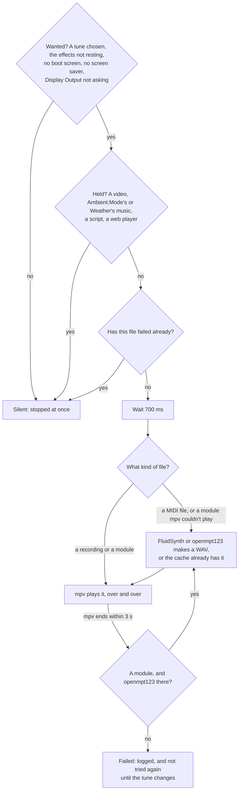

# Menu music

OSD/OS can play a tune under the menus, over and over: a [theme](https://github.com/mehmetraif/OSD-OS/wiki/Themes)'s, or a file of your own. It never plays over anything else: it stops the moment a video, a module's own music, a script or a web player is about to make a sound, and starts again from the beginning back in the menus. This page covers the settings, the tunes the themes come with, every format and how each is played (recordings by mpv, trackers' modules through libopenmpt or openmpt123, MIDI files through FluidSynth), exactly when the music plays and when it rests, installing what MIDI files and modules need, adding a SoundFont, making tunes of your own with `make-menu-music.py`, examples, and the log lines that say what went wrong.

## Settings

| Setting | Values | Default | What it does | Config key |
|---|---|---|---|---|
| Menu Music | THEME (with a theme), Off, File | THEME; without a theme, Off | **THEME**: the theme's tune, if it has one. **Off**: none. **File**: the Music File below | `app.menu_music`: `""`, `"Off"` or `"File"` |
| Music File | A file picked on the file browser, or No File | None | The tune of your own, offered while Menu Music is File. Select opens the file browser, which lists folders and the files OSD/OS can play: MP3, WAV, OGG, Opus, FLAC, M4A, AAC, MID, MIDI, XM, MOD, S3M and IT. **No File**, at the top, chooses none | `app.menu_music_file`: the file's full path, `""` for none |
| Music Volume | A slider from QUIET to LOUD, 0 to 100 in steps of 10 | 60 | How loud the tune is. It changes as the slider moves, while the music plays. Offered unless Menu Music is Off | `app.menu_music_volume`: a number |

- **Choosing a theme** sets Menu Music back to THEME. Music File and Music Volume keep what they were, so File brings your tune back.
- **A file of your own** can be anywhere OSD/OS's file browser reaches: Home; Media, `/media`, where drives and partitions are mounted (on the OSD/OS image, the card's **OSD-OS** partition and USB drives); Drives, `/run/media/<user>`; Volumes, a Mac's `/Volumes`; and Root. It must be a file on this machine: a stream's address doesn't play.
- **Over a video** there is never music, whatever these say ([below](#when-it-plays-and-when-it-rests)).

What Settings saves in `config.json` ([Configuration files](https://github.com/mehmetraif/OSD-OS/wiki/Configuration-Files)), here a file of your own, a little quieter:

```json
{
    "app": {
        "menu_music": "File",
        "menu_music_file": "/media/OSD-OS/Music/menu-loop.ogg",
        "menu_music_volume": 40
    }
}
```

On the OSD/OS image, the easiest way to a tune of your own: copy it from your computer onto the card's OSD-OS partition (Windows and macOS open it), then choose Settings → Menu Music: File, and Music File → Media → OSD-OS → the file.

## The themes' tunes

Seven of the eight themes have a tune of their own, each a short loop made by [make-menu-music.py](https://github.com/mehmetraif/OSD-OS/blob/main/scripts/make-menu-music.py) ([below](#making-tunes-with-make-menu-musicpy)):

| Theme | File | What it is | Length |
|---|---|---|---|
| Trinitron | `trinitron.ogg` | Calm and warm, in A minor: an arpeggio, a soft bass and a gentle melody, 92 beats a minute | 21 s |
| Late Show | `late-show.ogg` | After hours, swung: an electric piano's chords, a walking bass, brushes, a muted melody and a worn record's crackle, 72 beats a minute | 27 s |
| Matrix | `matrix.ogg` | Dark and driving, in E Phrygian: a pulsing bass, a cold pad and bells, 112 beats a minute | 17 s |
| Inferno | `inferno.ogg` | Fast and fiery, in D minor: a galloping bass, power chords and a riff, 140 beats a minute | 14 s |
| Arcade | `arcade.ogg` | Bright and bouncy, in C major: arpeggios, an octave bass and a catchy melody, 128 beats a minute | 15 s |
| Winter | `winter.ogg` | Gentle, in F major: a music box over a soft pad, with sleigh bells, 84 beats a minute | 23 s |
| Demoscene | `demoscene.xm` | A tracker's module, four channels as FastTracker 2 wrote them: a lead with vibrato, a chord arpeggio, an octave bass and drums, in A minor | 31 s |
| Green Screen | — | No music | — |

The six OGGs are Opus, mono, 90 to 170 KB each, and made to loop: what rings on past a tune's end is folded back into its start, so it runs on without a seam. Demoscene's module is 7 KB. The [theme template](https://github.com/mehmetraif/OSD-OS/tree/main/docs/theme-template)'s tune is a MIDI file, `tune.mid`: 20 seconds in D major, an electric piano, a finger bass, a vibraphone and a light kit.

## What plays it

An **mpv** process of its own plays the music, on the card Settings → Audio Output chooses ([Audio Output](https://github.com/mehmetraif/OSD-OS/wiki/Audio-Output)):

```text
mpv --no-config --no-video --no-terminal --really-quiet --loop-file=inf
    --volume=60 --input-ipc-server=/tmp/osdos-menu-music-<pid>.sock
    [--audio-device=<Audio Output's card>] -- <the file>
```

- **`--loop-file=inf`**: over and over, until it is stopped.
- **`--no-config`**: mpv's own `mpv.conf` isn't read for the menu music.
- **`--volume`** starts at Music Volume; moving the slider changes it over the socket (`--input-ipc-server`) as the music plays.
- **It starts 700 ms after it is wanted** and nothing holds it, from the beginning of the tune, every time. It doesn't start between a hold and a release in quick turns.
- **On another sound card**: when Settings → Audio Output changes, the music starts again from the beginning on the new card. The card is looked up each time the music starts: a chosen card that is unplugged is passed over for the system's default until it is back.

## Formats

| Kind | Extensions | How it plays | Needs |
|---|---|---|---|
| A recording | `.ogg`, `.opus`, `.mp3`, `.flac`, `.wav`, `.m4a`, `.aac` | mpv plays it as it is | mpv |
| A tracker's module | `.xm`, `.mod`, `.s3m`, `.it` | mpv plays it through ffmpeg's libopenmpt. Where mpv can't (it ends within 3 seconds of starting), openmpt123 makes it into a WAV, which mpv then plays | mpv; openmpt123 where mpv's ffmpeg has no libopenmpt |
| A MIDI file | `.mid`, `.midi` | FluidSynth plays it into a WAV with a SoundFont, which mpv then plays | FluidSynth and a SoundFont |

The extension says which, in capitals or not (`TUNE.MID` is a MIDI file). A theme's `music` must be one of these, in the theme's folder; Music File offers only these.

### A tracker's module

A module is notes and short samples, played by a tracker: tiny files (Demoscene's is 7 KB). mpv plays one where its ffmpeg was built with libopenmpt; Homebrew's may not be. Where it wasn't, mpv ends at once, and OSD/OS has **openmpt123** render the module once into a WAV, which mpv loops:

```sh
openmpt123 --batch --quiet --force --samplerate 44100 --repeat 0 -o <the WAV> -- <the module>
```

### A MIDI file

A MIDI file is notes only: the sound comes from a **SoundFont**, a bank of recorded instruments. OSD/OS has **FluidSynth** play the file into a WAV with the first SoundFont of:

1. **one beside the MIDI file, of its name**: `tune.sf2` beside `tune.mid` (the extension in lower case). A theme's own SoundFont goes there;
2. **the first in the data folder's `soundfonts`**, by name (`.sf2` or `.SF2`);
3. **the system's General MIDI SoundFont**, the first of these there is:

| Path | From |
|---|---|
| `/usr/share/sounds/sf2/default-GM.sf2` | Debian's and Raspberry Pi OS's default, a link to the one installed |
| `/usr/share/sounds/sf2/FluidR3_GM.sf2` | `fluid-soundfont-gm` |
| `/usr/share/sounds/sf2/TimGM6mb.sf2` | `timgm6mb-soundfont` |
| `/usr/share/soundfonts/default.sf2` | other Linux systems |
| `/usr/share/soundfonts/FluidR3_GM.sf2` | other Linux systems |
| `/opt/homebrew/share/soundfonts/default.sf2` | Homebrew's folder on Apple silicon, if a SoundFont is put there |
| `/usr/local/share/soundfonts/default.sf2` | Homebrew's folder on Intel, the same way |

FluidSynth runs as fast as it can, with no MIDI input and no shell:

```sh
fluidsynth -ni -q -g 0.8 -r 44100 -F <the WAV> <the SoundFont> <the MIDI file>
```

FluidSynth lets the last notes ring out and then runs on a moment: with FluidSynth 2.3, the WAV ends in about two seconds of silence, so a MIDI tune pauses briefly before it starts again. A recording made to loop has no such pause.

### The cache

What FluidSynth and openmpt123 make is kept in the cache folder, so a file is made into a WAV once:

| System | Cache folder |
|---|---|
| Linux, the OSD/OS image | `~/.cache/OSD-OS/menu-music/` (or `$XDG_CACHE_HOME/OSD-OS/menu-music/`) |
| macOS | `~/Library/Caches/OSD-OS/menu-music/` |

- Each WAV is named by a hash of the file's path, size and time, and, for a MIDI file, the SoundFont's path. A changed file, or another SoundFont, makes a new one.
- Only the newest is kept: switching between two MIDI themes makes each again.
- A SoundFont replaced by another under the same path is not noticed: delete the folder, and the music is made again the next time it plays. Deleting it is always safe.
- While a WAV is being made, anything that holds the music stops the maker at once, leaving nothing behind; it starts over the next time.

## When it plays and when it rests

The music plays while it is **wanted** and **nothing holds it**.

**Wanted**: there is a tune (Menu Music THEME with a theme that has one, or File with a Music File), and none of these:

- the effects are resting: a video playing in OSD/OS's window or behind the menus, another program with the screen, a video loading, a video's menu open, or a video's screen shown in a module ([Effects](https://github.com/mehmetraif/OSD-OS/wiki/Effects#never-over-a-video));
- the boot screen is up (on the OSD/OS image);
- the screen saver is showing;
- the window asking to keep a new display output is up ([Display Output](https://github.com/mehmetraif/OSD-OS/wiki/Display-Output)).

**Held**: anything about to play sound of its own holds the music off first:

| What | Holds it | Lets it go |
|---|---|---|
| A video, from any module (mpv) | As mpv is about to start | When the video's session ends |
| Ambient:Mode's music | As its music starts | When its music stops |
| Weather's music | As its music starts | When its music stops |
| A script, from the Scripts module | As it starts | When it has ended |
| Netflix's or Prime Video's web player | As it starts | When it has ended |

A hold stops the music there and then: its mpv is killed and waited for, so the sound card is free before the other opens it. Once nothing holds it and it is wanted again, it starts 700 ms later, from the beginning.



A file mpv couldn't play, or that wasn't there, isn't tried again until the tune changes: choose another theme or file and back, or restart OSD/OS.

## Installing what it needs

Recordings need only mpv, which OSD/OS needs anyway. MIDI files need FluidSynth and a SoundFont; a module needs openmpt123 only where mpv can't play it.

| System | What to do |
|---|---|
| The OSD/OS image | Nothing: it comes with FluidSynth, a small General MIDI SoundFont (TimGM6mb, about 6 MB) and openmpt123 |
| Raspberry Pi OS, installed with `install.sh` | Nothing: the installer installs `fluidsynth`, `timgm6mb-soundfont` and `openmpt123` |
| Raspberry Pi OS or Debian, by hand | `sudo apt install fluidsynth timgm6mb-soundfont openmpt123` (or `fluid-soundfont-gm` for a larger, fuller SoundFont) |
| macOS | `brew install fluid-synth libopenmpt` (libopenmpt brings openmpt123), and a General MIDI `.sf2` in the data folder's `soundfonts`: Homebrew's FluidSynth comes without one |
| Other systems | FluidSynth, a General MIDI SoundFont and openmpt123 from the system's packages, where it has them |

## Adding a SoundFont

A SoundFont of your own changes how every MIDI tune sounds, or one theme's:

- **For every MIDI tune**: put it in the data folder's `soundfonts`, which comes before the system's. With more than one, the first by name is used.

  ```sh
  mkdir -p ~/.local/share/OSD-OS/soundfonts
  cp ~/Downloads/GeneralUser.sf2 ~/.local/share/OSD-OS/soundfonts/
  ```

  On a Mac, `~/Library/Application Support/OSD-OS/soundfonts/`.

- **For one theme's tune**: put it beside the MIDI file, under the same name: `tune.sf2` for `tune.mid`.

  ```text
  themes/organ-grinder/
  ├── theme.json        "music": "tune.mid"
  ├── tune.mid
  └── tune.sf2          used for tune.mid, whatever the system has
  ```

- **For a fuller sound on Debian or Raspberry Pi OS**, `sudo apt install fluid-soundfont-gm` brings FluidR3 (about 140 MB); copy `/usr/share/sounds/sf2/FluidR3_GM.sf2` into `soundfonts` to have it used before the system's default.

A different SoundFont makes a new WAV the next time the tune plays. If you replace one under the same name, delete the [cache folder](#the-cache) to hear the change.

## Making tunes with make-menu-music.py

The themes' tunes are made by [scripts/make-menu-music.py](https://github.com/mehmetraif/OSD-OS/blob/main/scripts/make-menu-music.py), from notes written in it, with instruments of the kind an old games console had: pulse and triangle waves, noise drums, a bell, an electric piano.

### What it makes

| Name | It writes | What |
|---|---|---|
| `trinitron`, `late-show`, `matrix`, `inferno`, `arcade`, `winter` | `assets/themes/<name>/<name>.ogg` | Each theme's tune: eight bars, played from its notes, mixed so that its end runs into its start, encoded as Opus |
| `demoscene` | `assets/themes/demoscene/demoscene.xm` | A FastTracker 2 module: single cycles of a wave as its instruments, its notes rows of patterns |
| `template` | `docs/theme-template/tune.mid` | The theme template's MIDI file: notes only, a General MIDI instrument on each channel |

### Running it

It needs Python 3, and for the OGGs, ffmpeg with libopus; the module and the MIDI file need nothing more. It writes into the repository it is in, so run it in a copy of the repository:

```sh
curl -L https://github.com/mehmetraif/OSD-OS/archive/refs/heads/main.tar.gz | tar -xz -C ~
cd ~/OSD-OS-main
python3 scripts/make-menu-music.py                  # all eight
python3 scripts/make-menu-music.py matrix winter    # only these
```

It prints each file and its length:

```text
/home/pi/OSD-OS-main/scripts/../assets/themes/matrix/matrix.ogg: 17.1 s
/home/pi/OSD-OS-main/scripts/../assets/themes/winter/winter.ogg: 22.9 s
```

### How a tune is written

Each tune is a function that builds a `Tune` and returns it with how to finish it:

| Piece | What it does |
|---|---|
| `Tune(bpm, bars, swing=0.0, seed=1)` | An empty loop: so many bars of four beats at a tempo. `swing` delays every second eighth (0.33 for Late Show's), `seed` sets the drums' noise |
| `note(start, length, note, voice, volume, attack, decay, sustain, release, vibrato)` | One note: from `start` for `length` beats, a name (`"A4"`, `"F#3"`, `"Bb2"`) on an instrument, with its envelope |
| `melody(start, voice, volume, line)` | A tune: `line` is `[(note, eighths)]`, `"R"` a rest |
| `chords(tune, start, progression, beats, voice, volume)` | Each chord of a progression held for `beats` |
| `arpeggio(tune, start, progression, pattern, step, voice, volume)` | Each chord's notes in `pattern`'s order, a note every `step` beats, a bar per chord |
| `kick`, `snare`, `hat`, `brush` | Drums, at a beat |
| `pulse(duty)`, `triangle`, `sine`, `saw`, `epiano`, `bell` | The instruments |
| `finish(path, echo, echo_beats, lowpass, gain)` | Mixes it (an echo, a low pass, the level) and writes the OGG through ffmpeg |

A note that runs past the loop's end is folded back onto its start, so the tune loops without a seam.

### A tune of your own

Rather than change the script, load it from a script of your own and write the tune wherever you like. Save this as `scripts/my-tune.py` beside `make-menu-music.py` in your copy of the repository:

```python
#!/usr/bin/env python3
"""A menu tune of my own, made with make-menu-music.py's instruments: eight
bars that loop seamlessly, written as an OGG wherever it is told.

    python3 scripts/my-tune.py ~/.local/share/OSD-OS/themes/amber-terminal/amber.ogg
"""
import importlib.util
import os
import sys

# make-menu-music.py, beside this file, loaded as a module (its name has
# hyphens, so it can't simply be imported).
HERE = os.path.dirname(os.path.abspath(__file__))
spec = importlib.util.spec_from_file_location("menu_music", os.path.join(HERE, "make-menu-music.py"))
mm = importlib.util.module_from_spec(spec)
spec.loader.exec_module(mm)


def amber():
    # Slow and patient, in D minor: a terminal humming to itself.
    t = mm.Tune(80, 8, seed=21)
    prog = [["D3", "F3", "A3"], ["Bb2", "D3", "F3"], ["C3", "E3", "G3"], ["A2", "C#3", "E3"]] * 2
    mm.chords(t, 0, prog, 4, mm.sine, 0.05, attack=0.5, decay=0.4, sustain=0.8, release=0.6)
    mm.arpeggio(t, 0, prog, [0, 1, 2, 1], 0.5, mm.pulse(0.125), 0.045, decay=0.05, sustain=0.3)
    for bar, root in enumerate(["D2", "Bb1", "C2", "A1"] * 2):
        t.note(bar * 4, 3.6, root, mm.triangle, 0.3, decay=0.3, sustain=0.6)
    t.melody(0, mm.bell, 0.16, [
        ("A4", 4), ("F4", 2), ("D4", 2),
        ("F4", 4), ("D4", 4),
        ("E4", 2), ("G4", 2), ("C5", 4),
        ("A4", 6), ("R", 2),
        ("D5", 4), ("C5", 2), ("A4", 2),
        ("Bb4", 4), ("F4", 4),
        ("G4", 2), ("E4", 2), ("C4", 4),
        ("D4", 6), ("R", 2)], decay=1.0, sustain=0.0, release=0.4)
    for beat in range(32):
        t.hat(beat + 0.5, 0.03)
        if beat % 4 == 0:
            t.kick(beat, 0.3)
    return t, dict(echo=0.3, echo_beats=0.75, lowpass=4500, gain=0.45)


if __name__ == "__main__":
    if len(sys.argv) != 2:
        sys.exit("usage: my-tune.py OUTPUT.ogg")
    tune, finish = amber()
    tune.finish(os.path.expanduser(sys.argv[1]), **finish)
```

```sh
python3 scripts/my-tune.py ~/.local/share/OSD-OS/themes/amber-terminal/amber.ogg
```

```text
/home/pi/.local/share/OSD-OS/themes/amber-terminal/amber.ogg: 24.0 s
```

Then name it in the theme's `theme.json`, `"music": "amber.ogg"`, and choose the theme again. Each bar holds eight eighths of melody: keep every line's lengths adding up to 8 per bar, or the tune drifts against its chords.

### A MIDI tune of your own

`write_midi()`, from the same script, writes notes as a MIDI file, small and played with the SoundFont of your choice:

```python
#!/usr/bin/env python3
"""A MIDI menu tune, made with make-menu-music.py's write_midi(): notes only,
a General MIDI instrument for each channel, played by FluidSynth with a
SoundFont.

    python3 scripts/my-midi.py ~/.local/share/OSD-OS/themes/sunday-morning/tune.mid
"""
import importlib.util
import os
import sys

HERE = os.path.dirname(os.path.abspath(__file__))
spec = importlib.util.spec_from_file_location("menu_music", os.path.join(HERE, "make-menu-music.py"))
mm = importlib.util.module_from_spec(spec)
spec.loader.exec_module(mm)

# [(start beat, beats, note, velocity, channel)]; channel 9 is the drums.
notes = []
for bar, chord in enumerate([["C4", "E4", "G4"], ["A3", "C4", "E4"], ["F3", "A3", "C4"], ["G3", "B3", "D4"]]):
    for beat in range(4):
        for note in chord:
            notes.append((bar * 4 + beat, 0.9, note, 60, 0))      # the chords, on every beat
    root = chord[0][:-1] + "2"
    notes.append((bar * 4, 1.9, root, 90, 1))                     # the bass, twice a bar
    notes.append((bar * 4 + 2, 1.9, root, 80, 1))
tune = [("E5", 1), ("G5", 1), ("C6", 2), ("A5", 1), ("G5", 1), ("E5", 2),
        ("F5", 1), ("A5", 1), ("C6", 2), ("B5", 1), ("A5", 1), ("G5", 2)]
at = 0
for note, beats in tune:
    notes.append((at, beats * 0.9, note, 85, 2))                  # the tune
    at += beats
for beat in range(16):
    notes.append((beat, 0.25, 36 if beat % 2 == 0 else 38, 80, 9))  # kick and snare
    notes.append((beat + 0.5, 0.25, 42, 40, 9))                    # closed hi-hat

if len(sys.argv) != 2:
    sys.exit("usage: my-midi.py OUTPUT.mid")
# 120 beats a minute; Bright Acoustic Piano, Acoustic Bass, Flute.
mm.write_midi(os.path.expanduser(sys.argv[1]), 120, {0: 1, 1: 32, 2: 73}, notes)
```

The instruments are General MIDI program numbers counted from 0 (1 is Bright Acoustic Piano, 32 Acoustic Bass, 73 Flute); channel 9 is the drum kit, its notes drums (36 a kick, 38 a snare, 42 a closed hi-hat).

## Examples

A theme's `music`, one of each kind:

```json
{ "music": "menu.ogg" }
```

```json
{ "music": "chiptune.xm" }
```

```json
{ "music": "tune.mid" }
```

A theme whose MIDI tune always plays with its own SoundFont, whatever the system has:

```text
themes/music-box/
├── theme.json
├── waltz.mid
└── waltz.sf2
```

```json
{
    "name": "Music Box",
    "colors": { "primary": "#FFE9C2", "surface": "#3A1F14" },
    "skin": "rounded",
    "effects": { "text": "Shimmer", "selector": "Sparkles", "transition": "Fade" },
    "music": "waltz.mid"
}
```

A data folder with a SoundFont for every MIDI tune:

```text
~/.local/share/OSD-OS/
├── config.json
├── soundfonts/
│   └── FluidR3_GM.sf2
└── themes/
    └── …
```

## Troubleshooting

The log says what the music did, in `[MenuMusic]` lines ([where to read it](https://github.com/mehmetraif/OSD-OS/wiki/Themes#reading-the-log)):

```sh
journalctl -u osdos -b | grep MenuMusic
```

| Line | What happened | What to do |
|---|---|---|
| `[MenuMusic] playing /home/pi/.local/share/OSD-OS/themes/x/menu.ogg` | It plays, the file or the WAV made of it | — |
| `[MenuMusic] making /…/tune.mid into a WAV with fluidsynth` | A MIDI file (or, `with openmpt123`, a module mpv couldn't play) being made into a WAV, the first time | Wait a moment |
| `[MenuMusic] /…/tune.mid: no such file` | The file isn't there any more | Choose it again, or another |
| `[MenuMusic] /…/tune.mid: a MIDI file needs FluidSynth and a SoundFont: fluidsynth is not installed` | No FluidSynth | [Install it](#installing-what-it-needs) |
| `[MenuMusic] /…/tune.mid: a MIDI file needs FluidSynth and a SoundFont: no SoundFont found` | No SoundFont beside it, in `soundfonts`, or on the system | [Add one](#adding-a-soundfont) |
| `[MenuMusic] mpv couldn't play /…/song.xm (exit 2)` | A module mpv's ffmpeg can't play, and no openmpt123 to make it into a WAV | Install openmpt123 |
| `[MenuMusic] /…/tune.mid couldn't be made into a WAV (exit 1): …` | FluidSynth or openmpt123 failed; its own words follow | A damaged file, or SoundFont |
| `[MenuMusic] mpv couldn't play /…/menu.mp3 (exit 2)` | mpv ended within 3 seconds: not a sound file it knows, or damaged | Try the file in mpv; use another |
| `[MenuMusic] mpv not found: no menu music` | No mpv | Install mpv ([Installation](https://github.com/mehmetraif/OSD-OS/wiki/Installation)) |
| `[AppCore] theme x: its music, "menu.wma", is not a ogg/opus/mp3/flac/wav/m4a/aac/mid/midi/xm/mod/s3m/it file in its folder` | A theme's `music` isn't one of the types, isn't there, or is outside its folder | Fix `music` |

| What you hear | Why | What to do |
|---|---|---|
| Nothing, and no `[MenuMusic]` line | Menu Music is Off; or THEME with a theme that has none (Green Screen); or File without a Music File; or something is resting it (a video behind the menus) | Check Settings → Menu Music and Music File |
| Nothing, though the log says `playing` | Music Volume at QUIET, or the sound going to another card | Music Volume; [Audio Output](https://github.com/mehmetraif/OSD-OS/wiki/Audio-Output) |
| A failed tune doesn't come back after you fix it | A file that failed isn't tried again until the tune changes | Choose another theme or file and back, or restart OSD/OS |
| A MIDI tune sounds the same after you changed its SoundFont | Same path: the WAV in the cache is used | Delete the [cache folder](#the-cache) |
| A pause before the tune starts over | A MIDI tune's WAV ends in silence; a song may fade out at its end | Use a recording made to loop |
| It stops when Weather or Ambient:Mode opens | They play music of their own, and hold the menu music off | That is by design |
| It never plays during a video | That is by design: it rests while a video plays, loads or has its menu open | — |

## See also

- [Themes](https://github.com/mehmetraif/OSD-OS/wiki/Themes): a theme's `music`, and making a theme
- [Effects](https://github.com/mehmetraif/OSD-OS/wiki/Effects#never-over-a-video): the music rests with the effects
- [Audio Output](https://github.com/mehmetraif/OSD-OS/wiki/Audio-Output): the card it plays on
- [Settings](https://github.com/mehmetraif/OSD-OS/wiki/Settings#the-look): Menu Music, Music File and Music Volume
- [Configuration files](https://github.com/mehmetraif/OSD-OS/wiki/Configuration-Files): the data folder, the cache and the logs
- [Ambient:Mode](https://github.com/mehmetraif/OSD-OS/wiki/Ambient-Mode) and [Weather](https://github.com/mehmetraif/OSD-OS/wiki/Weather): modules with music of their own
