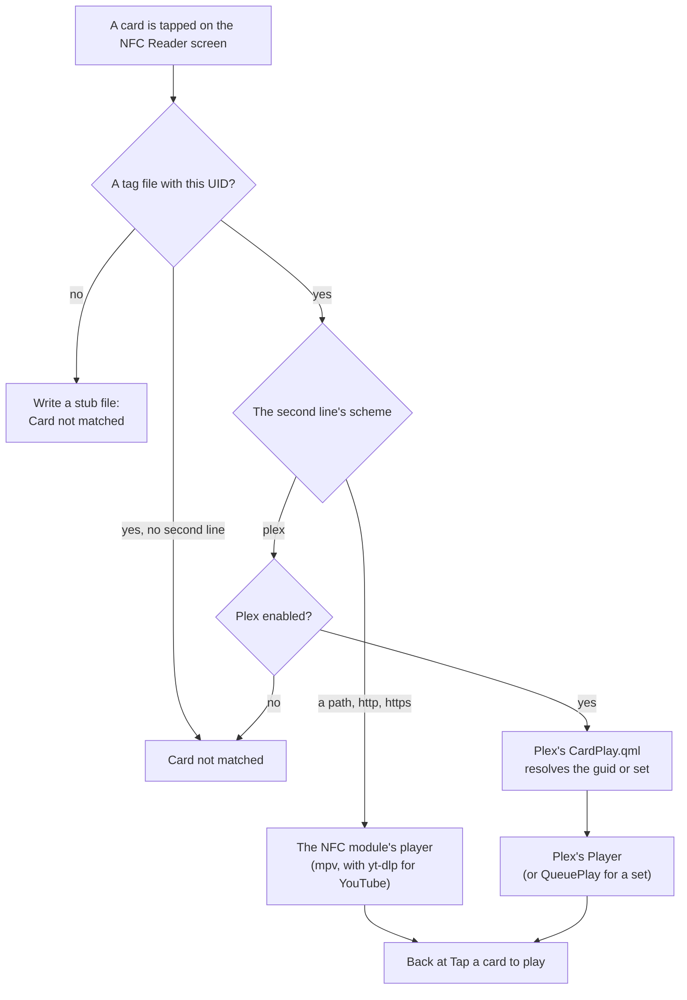

# NFC Reader

Tap a card to play, the way a tape goes into a deck. Each NFC card stands for something to play: a file, a stream, a YouTube video or playlist, or a Plex film, show, collection or playlist. Open the NFC Reader module, touch a card to the reader, and it plays. This page covers the readers OSD/OS supports and how to set one up, the tag files that map cards to videos (with examples of each kind), writing a card from Plex, how a card hands off to another module, and troubleshooting.


The module's one screen is a cassette with its state on the label: **Reader not connected** (and what to plug in), **Tap a card to play** (and the reader's name), **Playing ►** (and the card's title), or **Card not matched** (and the card's UID). Back leaves it.

## Readers

OSD/OS only ever reads a card's UID, its fixed serial number. Nothing is written to the card itself: what a card plays is kept in a text file on the player, so any cheap NFC card, sticker or key fob works, and a card can be remapped at any time.

| Reader | How OSD/OS talks to it | Needs |
|---|---|---|
| **PN532 USB** (recommended) | Directly, over the USB-serial chip it is built on, speaking the PN532's own serial protocol. | No driver and no daemon on any system: only permission to open the serial device. Works on SteamOS too. |
| **ACS ACR122U** and other PC/SC contactless readers | Through PC/SC (pcsc-lite on Linux, the system's PC/SC on a Mac), with the standard `FF CA 00 00 00` "get UID" command, so any CCID contactless reader works. | `pcscd` running on Linux, and a build of OSD/OS with PC/SC support (the release builds have it). Not on immutable systems like SteamOS, where pcscd can't be installed. |

A PN532 module is recognised by its USB-serial bridge chip:

| Chip | USB id (vendor:product) |
|---|---|
| QinHeng CH340 (the common PN532 USB module) | `1a86:7523` |
| QinHeng CH341 | `1a86:5523` |
| QinHeng CH9102 | `1a86:55d4` |
| Silicon Labs CP210x | `10c4:ea60` |
| FTDI FT232 | `0403:6001` |
| FTDI FT231X | `0403:6015` |
| Prolific PL2303 | `067b:2303` |

On Linux OSD/OS tries the `ttyUSB*` and `ttyACM*` devices with one of these ids; on a Mac, `/dev/cu.usbserial*`, `/dev/cu.wchusbserial*`, `/dev/cu.SLAB_USBtoUART*` and, last, `/dev/cu.usbmodem*`. A device only counts as a reader once it answers the PN532's handshake, so another gadget on the same chip (an Arduino, say) is tried once and then left alone until it is unplugged.

There is no reader setting: detection is automatic. While the module is enabled, OSD/OS looks for a reader every two seconds, PC/SC first, then PN532, and once one is found reads it twice a second, on a thread of its own. A reader unplugged is noticed, and looked for again.

The module works on Linux (Raspberry Pi OS, the OSD/OS image, SteamOS and other distributions) and macOS. Elsewhere it says **Not supported on this platform**.

## Setting up the reader

### Linux

Run the setup script once, as the user OSD/OS runs as (it uses `sudo` itself). From a checkout:

```sh
bash scripts/setup-nfc-reader.sh
```

or without one, from the latest release:

```sh
bash <(curl -fsSL https://github.com/mehmetraif/OSD-OS/releases/latest/download/setup-nfc-reader.sh)
```

[scripts/setup-nfc-reader.sh](https://github.com/mehmetraif/OSD-OS/blob/main/scripts/setup-nfc-reader.sh) does two independent things:

- **PN532 USB:** writes `/etc/udev/rules.d/99-osdos-nfc.rules`, which gives the chips above mode `0660`, the serial group (`dialout` on Debian and Raspberry Pi OS, `uucp` on Arch and Fedora) and `uaccess` (for a desktop session), and adds the user to that group. No packages.
- **PC/SC** (skipped on immutable systems): installs `pcscd`, `pcsc-tools` and `libpcsclite1` (or your distribution's equivalents), blacklists the kernel's own `pn533` and `pn533_usb` modules (they would claim an ACR122U first), and on Debian-based systems lets the user reach pcscd (a systemd override and a polkit rule). Then it enables and restarts `pcscd`.

At the end it lists the readers it can see. If it added you to a group, log out and back in (or reboot) before trying.

Options:

```sh
bash scripts/setup-nfc-reader.sh pi       # authorise another user than the one running it
SKIP_PCSC=1 bash scripts/setup-nfc-reader.sh   # PN532 only
SKIP_PN532=1 bash scripts/setup-nfc-reader.sh  # PC/SC only
```

### The OSD/OS image

The image doesn't run the script, and doesn't install `pcscd`. A PN532 appears as `/dev/ttyUSB0` (or `/dev/ttyACM0`), which the `dialout` group may open. If the module keeps saying **Reader not connected** with a PN532 plugged in, or you want a PC/SC reader, run the script over SSH. Logged in as another user, give it `pi`, the user the app runs as on the image: `bash <(curl -fsSL https://github.com/mehmetraif/OSD-OS/releases/latest/download/setup-nfc-reader.sh) pi`.

### macOS

Nothing to set up: PC/SC comes with macOS, and PN532 modules appear as `/dev/cu.*` with the system's drivers.

### Turning the module on

Settings → **NFC Reader** → **Enabled**: On. NFC Reader then appears on the main menu.

## How cards map to videos

Each card has a text file in the tags folder: `nfc_tags` in the data folder (`~/.local/share/OSD-OS/nfc_tags/` on Linux and the image, `~/Library/Application Support/OSD-OS/nfc_tags/` on a Mac), or the folder Settings → NFC Reader → **Tags Directory** names. OSD/OS creates it if it is missing.

A tag file:

- is named after what the card plays: the file name, without `.txt`, is the title the screen shows (**Playing ►** `Night of the Living Dead (1968)`);
- holds, on its first non-empty line, the card's **UID**, in any form: `04:A2:3B:1C:5D:80:01`, `04a23b1c5d8001` and `04 A2 3B 1C 5D 80 01` are the same card (anything that isn't a hex digit is dropped, and the rest is read in pairs);
- holds, on its second non-empty line, **what the card plays** (below);
- may hold, on a third, a **mode**: `shuffle`, which Plex show, season, collection and playlist cards understand;
- ignores blank lines and anything after the third. A UTF-8 byte-order mark and Windows line ends are fine.

Only files ending in `.txt` count. If two files hold the same UID, the one that sorts first alphabetically wins, and the log says so. The folder is read each time the module opens, and again when a card it doesn't know is tapped, so a file you add or fix works at the next tap.

### What a card can play

| Second line | Plays |
|---|---|
| An absolute path: `/media/OSD-OS/Films/Night of the Living Dead (1968).mp4` | That file, in mpv. On the image, `/media/OSD-OS` is the card's film partition, and USB drives are under `/media/usb/<label>`. |
| A relative path: `films/Fireplace.mp4` | That file in OSD/OS's own folder if it is there, otherwise in the data folder. |
| A playlist file: `/media/OSD-OS/Playlists/Saturday Morning.m3u` | The list, in mpv. Resume remembers which video it was on. |
| A stream URL: `http://…` or `https://…` | That stream, in mpv. |
| A YouTube URL: `https://www.youtube.com/watch?v=Eg8tK1LpLS8` | The video, through yt-dlp, at the module's YouTube Video Resolution. A playlist URL (`https://www.youtube.com/playlist?list=…`) plays the playlist, and resume remembers which video it was on. |
| A Plex guid: `plex://movie/…`, `plex://show/…`, `plex://season/…`, `plex://episode/…` | Handed to the Plex module, which finds it on your server and plays it. See [Card hand-off](https://github.com/mehmetraif/OSD-OS/wiki/NFC-Reader#card-hand-off-to-another-module). |
| A Plex set: `plex://collection/<ratingKey>`, `plex://playlist/<ratingKey>` | Handed to Plex, which plays the collection or playlist as a queue. |

YouTube and stream URLs are played by the NFC module itself, with mpv's yt-dlp hook turned on; they don't go through the YouTube module (so not its Advanced settings or its sign-in). Plex refs are handed off.

### Examples

A film on the card's film partition, `Night of the Living Dead (1968).txt`:

```text
04:A2:3B:1C:5D:80:01
/media/OSD-OS/Films/Night of the Living Dead (1968).mp4
```

A YouTube video, `Laserdisc An Introduction.txt`:

```text
04:6F:91:2A:7C:3E:80
https://www.youtube.com/watch?v=Eg8tK1LpLS8
```

A YouTube playlist, `The Story of Laserdisc.txt`:

```text
04:11:22:33:44:55:66
https://www.youtube.com/playlist?list=PLv0jwu7G_DFUoByWSHHoSTlUIxY7VkJLi
```

A playlist file on a USB stick labelled `CARTOONS`, `Saturday Morning.txt`:

```text
04:9C:0E:41:B2:63:80
/media/usb/CARTOONS/Saturday Morning.m3u
```

Plex cards are best written by the [card writer](https://github.com/mehmetraif/OSD-OS/wiki/NFC-Reader#writing-a-card-from-plex), which looks the item up for you. By hand, the guid and the ratingKey are in Plex Web's **Get Info → View XML** for the item (its `guid` and `ratingKey` attributes); replace the `<…>` below with them.

A Plex show played as a shuffle of its episodes, `Cowboy Bebop (1998).txt`:

```text
04:D3:5A:72:19:4B:80
plex://show/<the show's guid>
shuffle
```

A Plex collection, in order, `80s Action (Collection).txt`:

```text
04:27:B8:6E:03:91:80
plex://collection/<the collection's ratingKey>
```

The UIDs in these examples are made up: use your own card's, which the screen shows when you tap it (or take the stub file it writes, below).

## Unknown cards

Tap a card OSD/OS has no file for, and it writes one for it: the UID, with `:` made `-`, as the name (`04-A2-3B-1C-5D-80-01.txt`), holding just the UID. The screen says **Card not matched** and shows the UID. Rename the file to the title you want, add the second line, and tap the card again. A file with a UID but no second line is a known card with nothing to play: the screen says the same.

The stub is never written over an existing file of the same name.

## Playing a card

1. Open **NFC Reader** from the main menu. It says **Tap a card to play** and the reader's name (`PN532 v1.6 (/dev/ttyUSB0)`, or the PC/SC reader's).
2. Touch a card to the reader. The label says **Playing ►** and the card's title for a moment, then the video starts, with the loading screen while mpv (and yt-dlp, for YouTube) gets ready.
3. When it ends, or you stop it, you are back at **Tap a card to play**.

- Cards are acted on only while the NFC Reader screen is open: a card that touches the reader anywhere else in OSD/OS does nothing.
- A card has to arrive to count. One already resting on the reader when the screen opens, or left there after its video ends, does nothing until it is lifted and touched again.
- While a card's video plays, other cards are ignored.

### Resume

Where you stopped is kept per mapped path in `nfc_reader_history.json`, so remapping a card to another video doesn't carry the old video's position over.

- A video stopped more than 5 seconds in is resumed; one watched to 95% counts as finished and starts over.
- A playlist (an `.m3u`/`.m3u8`, or a YouTube URL with `list=`) remembers which video it was on as well as the time: **Resume video 3 at 12:34**. Played to its end, it starts over next time.
- **Resume Playback** says what happens: **Ask** (the default) offers to resume or start from the beginning, **Always** resumes, **Never** always starts from the beginning.

### Subtitles and YouTube quality

- **Auto Show Subtitles**: **Forced Only** (the default) shows subtitles only for foreign dialogue, **On** always shows them, **Off** never.
- **Subtitle Language**: the language to prefer (`--slang`), from the full ISO 639-1 list, or **Any** for no preference.
- **YouTube Video Resolution**: 480p (the default), 720p or 1080p, for YouTube URLs on cards. It gives yt-dlp, for 480p:

  ```text
  bestvideo[height<=?480][vcodec^=avc1]+bestaudio/bestvideo[height<=?480]+bestaudio/best[height<=?480]/best
  ```

  H.264 first, which a Pi decodes in hardware, then any codec at that height, then the best single file.
- **Scaling**: how a 16:9 picture fills a 4:3 screen for this module's videos; **Default** follows Settings → Scaling.

A Plex card plays with the Plex module's own settings, since Plex plays it.

## Writing a card from Plex

With the NFC Reader module enabled and a reader connected, Plex's screens offer to write a card:

- **WRITE NFC CARD** on a film's, an episode's, a show's and a season's detail screen, under View Extras;
- **@ WRITE NFC CARD** at the top of a collection's or a playlist's list, with » PLAY ALL and ~ SHUFFLE (which a list gets when it has more than one item, or a show).

Without a reader plugged in, the button isn't there. Then:

1. Select it. The screen says **TAP A CARD FOR…** and the title.
2. Touch a card to the reader.
3. Choose how it plays:
   - a film or an episode: **Write card**;
   - a show or a season: **Write card (Sequential Episodes)**, which plays the episode you are up to (On Deck), or **Write card (Shuffle Episodes)**, which plays its episodes in a shuffled order and leaves your watched state alone. Either carries on to the next episode when Plex's **Autoplay Next Episode** is on;
   - a collection or a playlist: **Write card (In Order)** or **Write card (Shuffled)**.
4. If the card already plays something, OSD/OS asks first: **THIS CARD PLAYS "…". CHANGE TO…** → **Change this card** or **Cancel**.
5. **CARD WRITTEN FOR…**: select to finish.

The card writer is armed only while its screen is open, so a card lying near the reader while you browse can never be written by accident.

What it writes is an ordinary tag file in the tags folder:

- named after the title, with the year, so two of a kind don't collide: `Dune (2021)`, `Cowboy Bebop (1998)` for a show, `Cowboy Bebop (1998) - S1` for a season, `Cowboy Bebop (1998) - S1E5` for an episode, `80s Action (Collection)` or `Road Trip (Playlist)` for a set. A name already taken by another card gets ` (2)`, ` (3)` and so on;
- holding the item's Plex guid (`plex://movie/…`), which survives library rescans and moves between servers, or for a collection or playlist its ratingKey (`plex://collection/<ratingKey>`), since those exist only on one server. A set's contents are looked up at each tap, so the card follows the collection as it changes;
- with `shuffle` on the third line for the shuffled choices;
- replacing the file that held this card before, if any.

You can rename the file afterwards; only its contents matter for the mapping.

## Card hand-off to another module

A card can point at something another module owns. The NFC module decides *which* module from the second line's URI scheme, and that module decides *what* to play: its sign-in, lookup and playback stay where they already live.

| Scheme | Goes to |
|---|---|
| `plex://…`, and legacy agent guids `com.plexapp.agents.…://…` | Plex (`com.osdos.plex`) |
| `http://`, `https://`, a path | Played by the NFC module itself |



What the receiving module does:

- Its `Root.qml` sends a card (`navParams.cardRef`, with `cardMode` and `cardTitle`) straight to its `CardPlay.qml`, **ahead of its own sign-in and user screens**. A card plays as whoever is already signed in, and never asks for a profile switch or a PIN: in physical form that would be a way round the profile PIN.
- `CardPlay.qml` resolves the ref and replaces itself with the player, so back from the video goes straight to the NFC Reader's tap screen, ready for the next card.
- It doesn't change what the server remembers for the item (Plex's audio and subtitle choices). A shuffle card reports no progress, so your watched state, Continue Watching and On Deck stay as they were.
- Its errors look like the NFC module's. Plex's: **NOT SIGNED IN TO PLEX**, **NO PLEX SERVER SELECTED**, **THIS PLEX PROFILE NEEDS ITS PIN / OPEN THE PLEX MODULE TO SIGN IN**, **THIS CARD HAS NO PLEX ITEM**, **PLEX SERVER UNREACHABLE**, **NOT FOUND ON THIS SERVER**, **THIS ITEM HAS NO PLAYABLE MEDIA**, **NO EPISODES FOUND**, **UNSUPPORTED ITEM TYPE**, **COULD NOT LOAD ITEM**. Select retries, back returns.
- Cards never switch server or user: an item on another server, or one the signed-in user can't see, is **NOT FOUND ON THIS SERVER**.

If the receiving module is turned off, the card is refused (**Card not matched**) and the log says which module it needs.

Another module can take cards too: a row in `kHandoffModules` in [NfcReaderBackend.cpp](https://github.com/mehmetraif/OSD-OS/blob/main/src/modules/nfc_reader/NfcReaderBackend.cpp), a `CardPlay.qml`, and a `cardRef` branch in that module's `Root.qml`. Nothing in the NFC module is specific to Plex. See [Writing a module](https://github.com/mehmetraif/OSD-OS/wiki/Writing-a-Module) and [ARCHITECTURE.md](https://github.com/mehmetraif/OSD-OS/blob/main/ARCHITECTURE.md#card-hand-off-nfc--a-module).

## Polling

There is no polling setting. The reader is polled whenever the module is **Enabled**, whether its screen is open or not (the Plex card writer needs it from Plex's screens), but taps only play while the NFC Reader screen is open. Turning **Enabled** off stops the polling.

A reader that stops answering (PC/SC calls can hang on a Mac after a replug) is shown as disconnected after 3 seconds; after 10, its thread is replaced, up to five times in a row.

## Settings

Settings → **NFC Reader**:

| Setting | Values | Default | What it does | Config key |
|---|---|---|---|---|
| Enabled | On, Off | Off | Shows NFC Reader on the main menu and polls the reader. | `modules.com.osdos.nfc_reader.enabled` |
| Tags Directory | A folder, or Default Folder | Default | Where the tag files are. Default is `nfc_tags` in the data folder. | `modules.com.osdos.nfc_reader.tags_directory` (`""` for the default) |
| Resume Playback | Ask, Always, Never | Ask | See [Resume](https://github.com/mehmetraif/OSD-OS/wiki/NFC-Reader#resume). | `modules.com.osdos.nfc_reader.resume_playback` (`ask`, `yes`, `no`) |
| YouTube Video Resolution | 480p, 720p, 1080p | 480p | The most a YouTube card plays at. | `modules.com.osdos.nfc_reader.playback_resolution` |
| Auto Show Subtitles | Forced Only, On, Off | Forced Only | Whether subtitles show when a video starts. | `modules.com.osdos.nfc_reader.auto_subtitles` (`forced`, `on`, `off`) |
| Subtitle Language | Any, or a language | Any | The subtitle language to prefer. | `modules.com.osdos.nfc_reader.sub_lang` (`-` for Any, else an ISO 639-1 code: `en`, `tr` …) |
| Scaling | Default, Letterbox, 14:9, Pan & Scan, Anamorphic | Default | How a 16:9 picture fills a 4:3 screen in this module. | `modules.com.osdos.nfc_reader.video_scaling` |

## Files and config keys

| File | What it is |
|---|---|
| `nfc_tags/*.txt` (or the Tags Directory) | One tag file per card |
| `nfc_reader_history.json` | Resume points: `{ "<mapped path>": { "pos": <ms>, "plPos": <playlist index or -1> } }` |

```json
{
    "modules": {
        "com.osdos.nfc_reader": {
            "enabled": true,
            "tags_directory": "",
            "resume_playback": "ask",
            "playback_resolution": "480p",
            "auto_subtitles": "forced",
            "sub_lang": "en",
            "video_scaling": "Default"
        }
    }
}
```

Two environment variables help when a reader isn't found (`MP240_…` names work too):

| Variable | What it does |
|---|---|
| `OSDOS_NFC_DEBUG=1` | Logs every step of reader detection: each serial device tried and skipped, with its USB id, what it answered, the PC/SC reader list. |
| `OSDOS_NFC_SERIAL_DEVICE=/dev/ttyUSB0` | Tries only this serial device as a PN532, for a reader on a bridge chip outside the list above, or a machine with several. |

For the OSD/OS image (or an install with the autostart service), set them with `sudo systemctl edit osdos`, then `sudo systemctl restart osdos`:

```ini
[Service]
Environment=OSDOS_NFC_DEBUG=1
```

and read the log with `sudo journalctl -u osdos -f`.

## Troubleshooting

**Reader not connected, with a PN532 plugged in.** Check that the device exists and that the user can open it:

```sh
ls -l /dev/ttyUSB* /dev/ttyACM*
id
```

The device should belong to `dialout` (or `uucp`) with `rw` for the group, and `id` should list that group. If not, run the [setup script](https://github.com/mehmetraif/OSD-OS/wiki/NFC-Reader#linux) and log in again. If the device is there and accessible, set `OSDOS_NFC_DEBUG=1`: the log says whether the chip was skipped (an id not on the list: use `OSDOS_NFC_SERIAL_DEVICE`) or tried without answering the PN532 handshake ("no bytes received at all" means nothing reaches the chip: a board in the wrong interface mode, a miswired adapter, or a USB-serial driver that never puts bytes on the wire).

**Reader not connected, with a PC/SC reader plugged in.** `systemctl status pcscd` should say it is running, and `pcsc_scan` should list the reader. If `pcsc_scan` doesn't, the kernel's `pn533` driver may have claimed it: the setup script blacklists it, then unplug and replug the reader. If the screen says **Connect a PN532 USB reader** (without "or PC/SC"), this build of OSD/OS has no PC/SC support: use a PN532.

**Card not matched.** The tags folder has no file with this UID, or the file has no second line. The screen shows the UID; compare it with the files (`grep -ril "04:A2:3B" ~/.local/share/OSD-OS/nfc_tags`). Check Tags Directory, and that no other file holds the same UID.

**A card is not matched although it points at Plex.** The Plex module is turned off.

**Tapping does nothing.** The NFC Reader screen must be open. A card already on the reader has to be lifted and touched again. While a video plays, cards are ignored.

**Playback failed: Check the mapped path or URL (YouTube links require yt-dlp).** The second line names a file that isn't there (paths are case-sensitive on Linux), or a YouTube URL failed: see [YouTube](https://github.com/mehmetraif/OSD-OS/wiki/YouTube#troubleshooting) for yt-dlp. Select retries.

**The Plex card shows an error.** Open the Plex module and sign in, choose the server, or enter the profile's PIN there: a card never does these for you.

**There is no WRITE NFC CARD on Plex's screens.** The NFC Reader module must be enabled and a reader connected.

More in [Troubleshooting](https://github.com/mehmetraif/OSD-OS/wiki/Troubleshooting).

## See also

- [Plex](https://github.com/mehmetraif/OSD-OS/wiki/Plex): where cards are written, and what plays a Plex card
- [YouTube](https://github.com/mehmetraif/OSD-OS/wiki/YouTube): yt-dlp, which YouTube cards need
- [Local Files](https://github.com/mehmetraif/OSD-OS/wiki/Local-Files): the film partition and USB drives on the image
- [Writing a module](https://github.com/mehmetraif/OSD-OS/wiki/Writing-a-Module): taking cards in a module of your own
- [Playback and mpv](https://github.com/mehmetraif/OSD-OS/wiki/Playback-and-mpv)
- [Configuration files](https://github.com/mehmetraif/OSD-OS/wiki/Configuration-Files)
