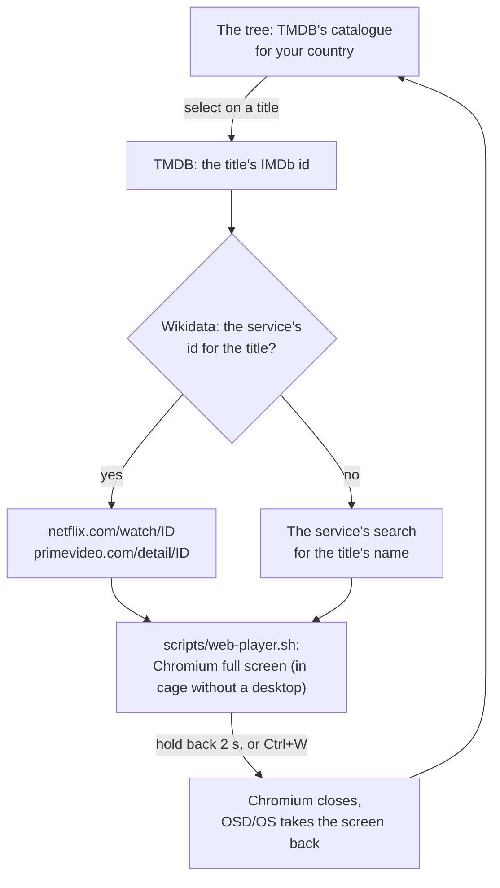

# Netflix and Prime Video

What Netflix and Prime Video carry in your country, browsed in OSD/OS's own menus and played in the service's own player. OSD/OS shows the catalogue; the service plays the title, full screen in Chromium. The two modules work the same way and share their code, so one page covers both: what they need (a TMDB API key, Chromium with Widevine), the catalogue, how a title opens and how you come back, signing in, the settings, and what to do when the browser stays black.

<table>
<tr><th width="50%">Netflix</th><th width="50%">Movies › Popular</th></tr>
<tr><td></td><td></td></tr>
<tr><td>Recently Watched, Favorites, Search, then Movies and Series, and the service's own home page.</td><td>Popular, then each genre, a page of titles at a time.</td></tr>
</table>

<table>
<tr><th width="50%">Info screen</th><th width="50%">Playing on Netflix</th></tr>
<tr><td></td><td></td></tr>
<tr><td>Story, genre, director, cast and rating, from TMDB. Select plays the title; ► offers its options.</td><td>The service's own player has the screen. What you see here is the last thing OSD/OS shows before Chromium takes over.</td></tr>
</table>

<table>
<tr><th width="50%">Prime Video</th><th width="50%">Search</th></tr>
<tr><td></td><td></td></tr>
<tr><td>The same tree, for Prime Video.</td><td>Search is typed on the on-screen keyboard (shown here in Local Files; in these modules it says SEARCH NETFLIX or SEARCH PRIME VIDEO).</td></tr>
</table>

## How it works

Neither service has an API a front end like this one could browse with, and their streams are protected with Widevine DRM, which mpv can't play. So the two halves come from different places:

- **The catalogue** comes from [TMDB](https://www.themoviedb.org) (The Movie Database), whose free API lists, per country, the films and series each service carries, from [JustWatch](https://www.justwatch.com)'s data.
- **Playback** is the service's own website, opened full screen in Chromium with Widevine, at the title's own page when [Wikidata](https://www.wikidata.org) knows it.



## What they need

| Piece | Why | Where it comes from |
|---|---|---|
| A TMDB API key | The catalogue. | Free from themoviedb.org: [below](https://github.com/mehmetraif/OSD-OS/wiki/Netflix-and-Prime-Video#the-tmdb-api-key). |
| Chromium | Plays the service's website. OSD/OS looks for `chromium`, `chromium-browser`, `google-chrome-stable` and `google-chrome`, in that order. | The image has it. |
| Widevine (`libwidevinecdm0`) | The DRM module both services require. | The image has it, from Raspberry Pi's archive. |
| `cage` | A kiosk compositor that gives the browser the screen when there is no desktop (the OSD/OS image, Raspberry Pi OS Lite). | The image has it. |
| `wtype` | Lets holding back close the browser the way `Ctrl+W` does, so a fresh sign-in is kept. | The image has it. |
| A keyboard (or a mouse) | The service's own player is worked with a keyboard: arrow keys move between titles. Signing in needs one. | |

On **Raspberry Pi OS** (an app install), one command:

```sh
sudo apt install chromium libwidevinecdm0 cage wtype
```

The **OSD/OS image** has all of it (Chromium with `rpi-chromium-mods`, `libwidevinecdm0`, the GPU drivers and fonts Chromium only recommends, `cage` and `wtype`, about 400 MB), unless it was built with `OSDOS_STREAMING=0` ([The OSD/OS image](https://github.com/mehmetraif/OSD-OS/wiki/The-OSD-OS-Image)).

On a **desktop** (Raspberry Pi OS with a desktop, SteamOS, another Linux), only the browser, with Widevine, is needed: its window simply covers OSD/OS's. On a **Mac**, OSD/OS opens Google Chrome in kiosk mode if it is in `/Applications`, and Safari otherwise.

Both modules are off by default: Settings → **Netflix** (or **Prime Video**) → **Enabled**: On.

## The TMDB API key

Both modules read the same key, from `tmdb_api_key.txt` in the data folder:

| System | File |
|---|---|
| OSD/OS image, Raspberry Pi OS, SteamOS | `~/.local/share/OSD-OS/tmdb_api_key.txt` |
| macOS | `~/Library/Application Support/OSD-OS/tmdb_api_key.txt` |

To get a key, make a free account on [themoviedb.org](https://www.themoviedb.org), then in your account's **Settings → API** ask for one. TMDB shows two things there, and either works:

- the **API Key** (v3): 32 hexadecimal characters, sent as `api_key=` in each request;
- the **API Read Access Token** (v4): a long token beginning `eyJ`, sent as `Authorization: Bearer …`. OSD/OS tells them apart by that `eyJ`.

The first line that is neither empty nor a `#` comment is the key; anything after it is ignored. For example (not a real key):

```text
# TMDB API key for OSD/OS's Netflix and Prime Video modules
0123456789abcdef0123456789abcdef
```

Written over SSH:

```sh
printf '%s\n' '0123456789abcdef0123456789abcdef' > ~/.local/share/OSD-OS/tmdb_api_key.txt
```

The file is read on every request, so a new key works at once, without a restart. Without it, the tree still shows its top entries, but Search, Movies and Series say **No TMDB API key: put one in tmdb_api_key.txt in the data folder (free from themoviedb.org, Settings, API)**.

## Country and language

Each module has its own:

- **Catalogue Region**: the country whose catalogue to list, as an ISO country code: TR (the default), US, GB, DE, FR, NL, ES, IT, CA or AU. Netflix and Prime Video carry different titles in each country.
- **Catalogue Language**: English (`en-US`) or Turkish (`tr-TR`), for the titles, genres and stories. A story TMDB has no translation of is shown in English.

Changing either forgets what was loaded, so the next folder you open is fetched afresh.

"Carries" means on the subscription: TMDB is asked for titles the service streams as part of the plan (`with_watch_monetization_types=flatrate`), not ones it only rents or sells. The service is found in TMDB's list of providers for the region by its name, **Netflix** or **Amazon Prime Video**, with TMDB's ids 8 and 119 as fallbacks.

## Browsing the catalogue

The catalogue is browsed in the same tree as Local Files ([Using OSD/OS](https://github.com/mehmetraif/OSD-OS/wiki/Using-OSD-OS)).

| Entry | What it holds |
|---|---|
| **Recently Watched** | The last 30 titles you opened from the tree, newest first. |
| **Favorites** | Titles you added from their options, newest first, at most 100. |
| **Search** | TMDB's first page of matches for what you type, films and series together, kept to those the service carries in your country, in TMDB's order. |
| **Movies** | **Popular**, then a folder per genre (as TMDB names them, in the Catalogue Language). |
| **Series** | The same, for series. |
| **Netflix Home** / **Prime Video Home** | The service's own home page (`https://www.netflix.com/browse`, `https://www.primevideo.com`). |

A list of titles shows TMDB's first page (20 titles, the most popular first), with **More…** at the end for the next, up to TMDB's limit of 500 pages. Titles are named with their year: `Rewind Club (2018)`. Recently Watched and Favorites are kept in `lists.json`, under the module's id.

Keys in the tree are those of every tree: ▲ ▼ move, ► or select open a folder, ◄ goes up a level, back goes up a level and, at the top, to the main menu. On a title, select plays it and ► opens its info screen.

### Info screens

A title's info screen comes up with ► on it, or by itself once the cursor has rested on it, as **Settings → Info Screen** says (after 1, 2, 3 or 5 seconds; **Key** for ► only; **Off**, where ► offers the options instead). It shows the PLAY box, the title, a line of facts (`2018 - 1HR:56MIN` for a film, `3 SEASONS` for a series), the story, then GENRE (two at most), DIRECTOR for a film or CREATOR for a series (two at most), CAST (two names) and RATING (TMDB's average out of 10). Each title is fetched from TMDB once per run.

On it, select plays the title, ▲ ▼ close it and move on through the list, ◄ or back close it, ► offers the options.

### Options

► on the info screen (or on a title, with the info screen off):

- **Add to Favorites** / **Remove from Favorites**
- **Play at Startup** / **Don't Play at Startup**: OSD/OS opens this title straight after the boot screen. It goes on Favorites too.

Netflix and Prime Video titles can't go on a [playlist](https://github.com/mehmetraif/OSD-OS/wiki/Playlists): they play in the service's own player.

## Opening a title

Select on a title, and:

1. The title goes on Recently Watched, and a screen says **Opening** and its name.
2. OSD/OS works out where it opens. It asks TMDB for the title's IMDb id, then asks Wikidata, in one query, for the service's own id for the title, matched by its TMDB id (Wikidata's `P4947` for a film, `P4983` for a series) or its IMDb id (`P345`). Wikidata keeps Netflix's id as `P1874` and Prime Video's as `P14440`.
   - Found: the title's page, `https://www.netflix.com/watch/<id>` or `https://www.primevideo.com/detail/<id>`.
   - Not found: the service's search for the title's name, `https://www.netflix.com/search?q=<name>` or `https://www.primevideo.com/search/ref=atv_nb_sr?phrase=<name>`.
3. Chromium opens it full screen. The first time in a run, OSD/OS first shows for 1.2 seconds how to come back, because a Pi's screen is dark while the browser starts; after that, titles open straight away. Back on the Opening screen cancels.
4. The service plays the title in its own player. Work it with a keyboard: Chromium runs with spatial navigation on, so the arrow keys move between links and titles. A mouse works too.

If you aren't signed in, the service's page asks you to; it is easier to [sign in](https://github.com/mehmetraif/OSD-OS/wiki/Netflix-and-Prime-Video#signing-in-and-out) first, from Settings.

While the browser is open:

- The screen saver stays away: an open browser counts as activity.
- A video OSD/OS had left playing behind its menus (Transparent Background) ends: the browser takes the screen.
- The menu music is held off until the browser has closed.
- The keyboard is the browser's. OSD/OS still reads it, but treats it as typing: Right Shift stays Shift instead of standing in for back (held for an `@`, it would otherwise close the browser), and remapped remote buttons don't fire.

## Coming back

| Do this | Keyboard | Gamepad | What happens |
|---|---|---|---|
| Hold back for two seconds | Esc | B (or Back) | OSD/OS closes the browser cleanly and returns to the tree where you were. |
| Close the browser | `Ctrl+W` (or `Alt+F4`) | | The same, from the browser's side. |

Backspace doesn't count as back while the browser is open: the browser's text fields need it. And once the browser has closed, OSD/OS waits for you to let go of back, so its repeats don't carry on back through the menus.

Holding back runs `web-player.sh --close <service>`, which types `Ctrl+W` into the browser's cage with `wtype` (cage 0.1.5 or later, for its virtual keyboard), so Chromium shuts down as when you close it yourself, saving what it holds first. Where that can't be done (no `wtype`, an older cage, a desktop session), or the browser is still open five seconds later (a page may ask to stay, and nothing can answer it), OSD/OS stops it instead: `SIGTERM` to the browser and everything it started, then `SIGKILL`. On a headless Pi the screen comes back once every one of those processes has exited.

On a Mac, quit the browser (`⌘Q`): OSD/OS returns when it has quit.

## Signing in and out

1. Settings → **Netflix** (or **Prime Video**) → **Sign in**. A screen says **Sign in to Netflix** and how to come back.
2. Have a keyboard ready, and press select. The service's sign-in page opens full screen: `https://www.netflix.com/login`, or Prime Video's `https://www.primevideo.com/auth-redirect?signin=1&returnUrl=%2F`, which goes on to Amazon's sign-in for your region.
3. Sign in with the keyboard.
4. Come back by holding back, or with `Ctrl+W`.

Each service keeps its sign-in in a Chromium profile of its own in the data folder, `netflix/browser` and `prime_video/browser`, as any browser keeps one. It stays signed in between visits and restarts. **Sign out** deletes that profile, and the next visit asks again. It does nothing while the browser is open.

**Why closing matters.** Chromium writes new cookies to disk only every half minute or so, and a browser stopped outright loses what it hasn't written yet, a sign-in made moments before included. That is why holding back closes the browser the way `Ctrl+W` does instead of stopping it. Without `wtype` (or on a desktop), close the browser with `Ctrl+W` after signing in, or wait half a minute before holding back.

## Chromium, Widevine and cage

`WebPlayerBackend` ([src/modules/web_player](https://github.com/mehmetraif/OSD-OS/tree/main/src/modules/web_player)) runs the bundled [scripts/web-player.sh](https://github.com/mehmetraif/OSD-OS/blob/main/scripts/web-player.sh) the way the [Scripts](https://github.com/mehmetraif/OSD-OS/wiki/Scripts) module runs a takeover script:

```text
web-player.sh <service> <url> [letterbox|14:9|panscan|anamorphic]
web-player.sh --close <service>
```

Before anything is handed over, OSD/OS checks that the script, a browser and (without a desktop) `cage` exist, so a missing package never blanks the screen: it says what is missing instead. Then, on a headless Pi, it hands the screen over (`DisplayHandoff`), and takes it back once the browser and every process it started have exited.

The script:

- keeps a profile per service: `<data folder>/<service>/browser`;
- runs the browser with `--kiosk --user-data-dir=<profile> --no-first-run --noerrdialogs --disable-infobars --hide-crash-restore-bubble --password-store=basic --autoplay-policy=no-user-gesture-required --ozone-platform-hint=auto --enable-spatial-navigation`;
- on an Arm board, tells the sites it is ChromeOS, with the browser's real version (`Mozilla/5.0 (X11; CrOS aarch64 15917.71.0) AppleWebKit/537.36 (KHTML, like Gecko) Chrome/<version> Safari/537.36`): these players only play on an Arm Linux browser that says so, as Raspberry Pi OS's own Chromium already does. The environment variable `OSDOS_WEB_PLAYER_UA` sets another user agent;
- applies the module's **Scaling** with a small extension it writes for the run (`<data folder>/<service>/scaling`): a stylesheet that makes the player's picture 8/7 larger for 14:9, 4/3 larger for Pan & Scan, or 4/3 taller for Anamorphic. Letterbox, the default, adds nothing. Chromium only;
- with a desktop (`WAYLAND_DISPLAY` or `DISPLAY` set), just opens the browser over OSD/OS;
- without one, starts it inside `cage`, with `--ozone-platform=wayland`. cage opens the display and the input devices itself (`LIBSEAT_BACKEND=noop`), which the app's `video` and `input` groups allow, gets a private runtime folder when there is no login session to give one, and writes where its socket is to `<data folder>/<service>/wayland` for `--close`;
- on a Mac, runs `open -W -n -a "Google Chrome" --args --kiosk --no-first-run --user-data-dir=<profile> <url>`, or Safari without Chrome. Scaling doesn't apply there.

## Settings

Settings → **Netflix**:

| Setting | Values | Default | What it does | Config key |
|---|---|---|---|---|
| Enabled | On, Off | Off | Shows Netflix on the main menu. | `modules.com.osdos.netflix.enabled` |
| Catalogue Region | TR, US, GB, DE, FR, NL, ES, IT, CA, AU | TR | The country whose Netflix catalogue to list. | `modules.com.osdos.netflix.region` |
| Catalogue Language | English, Turkish | English | The language of titles, genres and stories. | `modules.com.osdos.netflix.catalog_language` |
| Scaling | Default, Letterbox, 14:9, Pan & Scan, Anamorphic | Default | How a 16:9 picture fills a 4:3 screen in Netflix's player. Default follows Settings → Scaling. | `modules.com.osdos.netflix.video_scaling` |
| Sign in | Select | | Opens Netflix's sign-in page full screen. | (the profile `netflix/browser`) |
| Sign out | Select | | Forgets the sign-in: deletes the profile. | |

Settings → **Prime Video**:

| Setting | Values | Default | What it does | Config key |
|---|---|---|---|---|
| Enabled | On, Off | Off | Shows Prime Video on the main menu. | `modules.com.osdos.prime_video.enabled` |
| Catalogue Region | TR, US, GB, DE, FR, NL, ES, IT, CA, AU | TR | The country whose Prime Video catalogue to list. | `modules.com.osdos.prime_video.region` |
| Catalogue Language | English, Turkish | English | The language of titles, genres and stories. | `modules.com.osdos.prime_video.catalog_language` |
| Scaling | Default, Letterbox, 14:9, Pan & Scan, Anamorphic | Default | As for Netflix. | `modules.com.osdos.prime_video.video_scaling` |
| Sign in | Select | | Opens Amazon's sign-in for Prime Video full screen. | (the profile `prime_video/browser`) |
| Sign out | Select | | Forgets the sign-in: deletes the profile. | |

The app's **Info Screen** (`app.info_screen`), **Play at Startup** (`app.startup_favorite`) and **Scaling** (`app.video_scaling`) apply too ([Settings](https://github.com/mehmetraif/OSD-OS/wiki/Settings)).

## Files and config keys

In the data folder:

| File | What it is |
|---|---|
| `tmdb_api_key.txt` | The TMDB key, shared by both modules |
| `lists.json` | Recently Watched (`recent`) and Favorites (`favorites`), under `com.osdos.netflix` and `com.osdos.prime_video` |
| `netflix/browser/`, `prime_video/browser/` | Each service's Chromium profile, with its sign-in |
| `netflix/scaling/`, `prime_video/scaling/` | The Scaling extension, rewritten for each run (absent with Letterbox) |
| `netflix/wayland`, `prime_video/wayland` | Where cage's socket is, while the browser is open |

A `config.json` fragment (change these in Settings; edit the file only while OSD/OS is closed):

```json
{
    "modules": {
        "com.osdos.netflix": {
            "enabled": true,
            "region": "GB",
            "catalog_language": "English",
            "video_scaling": "Default"
        },
        "com.osdos.prime_video": {
            "enabled": true,
            "region": "DE",
            "catalog_language": "English",
            "video_scaling": "Pan & Scan"
        }
    }
}
```

## Attribution

This product uses the TMDB API but is not endorsed or certified by TMDB. Which service carries a title where comes from [JustWatch](https://www.justwatch.com), through TMDB. A title's page on each service is found through [Wikidata](https://www.wikidata.org). Netflix and Prime Video are their owners' services: OSD/OS only opens their websites. See [Credits](https://github.com/mehmetraif/OSD-OS/wiki/Credits).

## Troubleshooting

**No TMDB API key: put one in tmdb_api_key.txt in the data folder.** The file is missing, empty, or in the wrong folder. See [The TMDB API key](https://github.com/mehmetraif/OSD-OS/wiki/Netflix-and-Prime-Video#the-tmdb-api-key).

**TMDB turned the API key down: check tmdb_api_key.txt.** TMDB answered 401. Check that the whole key or token is on one line, with nothing else on it.

**Could not reach TMDB: check the network.** No answer from `api.themoviedb.org`.

**A folder is empty, or titles you know are missing.** The catalogue is the region's, on the subscription only, as TMDB and JustWatch know it. Check Catalogue Region.

**Could not open Netflix: Chromium is not installed** (or **cage is not installed**). Install what the screen names: `sudo apt install chromium libwidevinecdm0 cage wtype`. **web-player.sh is missing from the app** means the install is incomplete: reinstall OSD/OS.

**The browser closed with error N** (or **The browser did not start**), with the browser's last lines under it. Those lines say why. Without a desktop, cage opens the display and the input devices itself, so the user running OSD/OS must be in the `video` and `input` groups (the image's service, and the one `install.sh` writes, run with both).

**The screen stays black after selecting a title.** The screen is dark while the browser starts, and on a Pi that can take several seconds; the first time in a run, OSD/OS shows how to come back just before. If it stays black, hold back to return, then check the browser on its own: on the image or Raspberry Pi OS, `dpkg -l chromium libwidevinecdm0` says whether both are installed. `sudo journalctl -u osdos -f` shows the app's log while you try again.

**The service says it can't play protected content** (a DRM error page instead of the title). Widevine is missing (`sudo apt install libwidevinecdm0`, then try again), or the site doesn't take the browser for one it supports. On an Arm board the web player says it is ChromeOS, which these players accept; if you set `OSDOS_WEB_PLAYER_UA`, unset it.

**Signed out again after closing the browser.** It was stopped before it saved its cookies. Install `wtype`, or close with `Ctrl+W`, or wait half a minute after signing in before holding back.

**Holding back does nothing.** Hold Esc (or B on a gamepad), not Backspace, for the full two seconds.

**A title opens at the service's search instead of its page.** Wikidata has no id for it on that service. Pick it from the search results.

**No sound.** The browser plays through Settings → Audio Output's card, which the web player passes on to it ([Audio Output](https://github.com/mehmetraif/OSD-OS/wiki/Audio-Output)).

More in [Troubleshooting](https://github.com/mehmetraif/OSD-OS/wiki/Troubleshooting).

## See also

- [YouTube](https://github.com/mehmetraif/OSD-OS/wiki/YouTube): its sign-in uses the same web player
- [Scripts](https://github.com/mehmetraif/OSD-OS/wiki/Scripts): the takeover mechanism the web player runs on
- [The OSD/OS image](https://github.com/mehmetraif/OSD-OS/wiki/The-OSD-OS-Image): what it installs, and `OSDOS_STREAMING`
- [Using OSD/OS](https://github.com/mehmetraif/OSD-OS/wiki/Using-OSD-OS): the tree, the keyboard, info screens and options
- [Controls](https://github.com/mehmetraif/OSD-OS/wiki/Controls)
- [Credits](https://github.com/mehmetraif/OSD-OS/wiki/Credits)
