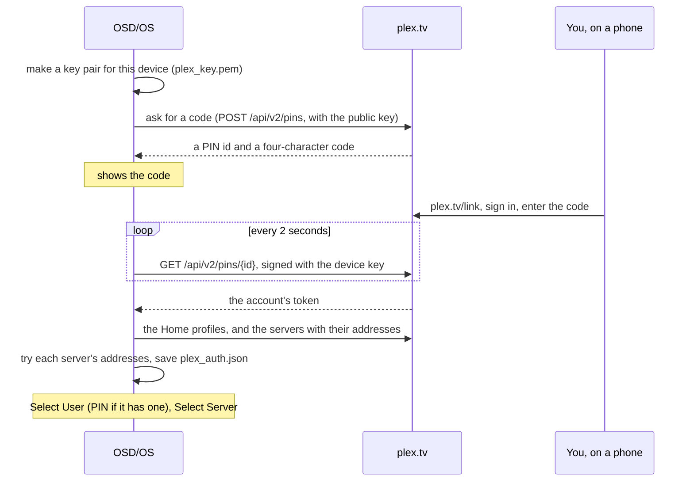

# Plex

The Plex module plays your films and series from a [Plex Media Server](https://www.plex.tv): you sign in with a code at plex.tv/link (no typing on the TV), pick your Plex Home profile and your server, then browse the libraries the way Plex arranges them, carry on where you stopped, and watch. This page covers signing in, profiles and their PINs, servers, every screen, how playback picks Direct Play or a transcode, resume and autoplay, audio and subtitle tracks, Live TV, writing NFC cards, every setting with its config key, how the sign-in is stored, and what to do when it doesn't work.

The module is in [modules/plex](https://github.com/mehmetraif/OSD-OS/tree/main/modules/plex) (views and manifest) and [src/modules/plex](https://github.com/mehmetraif/OSD-OS/tree/main/src/modules/plex) (`PlexBackend`, the reference backend for writing modules).

<table>
<tr><th width="50%">Signing in</th><th width="50%">Resume</th></tr>
<tr><td></td><td></td></tr>
<tr><td>Sign in with a code at plex.tv/link.</td><td>Carry on from Plex's own resume point, or start from the beginning.</td></tr>
</table>

## What you need

- A Plex account, and a Plex Media Server it can use (yours, or one shared with you), reachable from the device: on your network, or over the internet through the address Plex offers.
- The network at sign-in, to reach plex.tv. After that OSD/OS talks to the server directly, and to plex.tv to renew its sign-in, check the device is still authorized and switch profiles.
- A phone or computer to enter the code on. No keyboard is needed on the TV, not even for a profile PIN.

## Turning it on

Plex is off until you turn it on: **Settings → Plex → Enabled** (in the Modules section of Settings). It then appears on the main menu. Its other settings show once you have signed in.

## Signing in

1. Open **Plex** from the main menu. It asks plex.tv for a code (**Requesting Pin…**), then shows it: four characters, with **Visit plex.tv/link and enter the code above** and **Waiting…** under it.
2. On a phone or computer, go to **plex.tv/link**, sign in to your Plex account if asked, and enter the code.
3. OSD/OS asks plex.tv every 2 seconds whether the code has been entered. As soon as it has, it fetches your Plex Home profiles and your servers.
4. **Select User** lists the profiles. An account with one profile skips this step. A profile with a PIN asks for it ([below](#profiles)).
5. **Select Server** lists the servers that profile can use. Choose one.
6. The home screen opens: the server's name and the profile in the title bar, then Continue Watching and the libraries.



The device shows up in your Plex account's authorized devices as **OSD/OS**, named after the machine's host name, on Linux or macOS. Removing it there signs OSD/OS out the next time you open Plex.

## Profiles

Plex Home profiles are Plex's users. OSD/OS plays as one of them at a time: its Continue Watching, its watched marks, its libraries.

- **Choosing one.** **Select User** lists the profiles. With **Auto Sign In** off, the default, it comes up every time you open Plex, so each person picks themselves. With **Auto Sign In** on, Plex opens straight on the libraries as the profile chosen last.
- **Changing it from Settings.** **Settings → Plex → Current User** switches profile without opening the module. If the new profile has a PIN, Settings can't ask for it: the PIN screen comes up the next time you open Plex, and the switch happens only once it is right.
- **A PIN.** A profile protected with a PIN asks for its 4 digits on a spinner made for a remote: ▲ ▼ change the digit under the cursor, ◄ ► move between the four (only the one under the cursor shows; the others read `*`), select submits. A keyboard's digit keys type straight in. **Checking…** while plex.tv checks it; **INCORRECT PIN** if it is wrong. Back cancels, and the profile in use stays as it was. OSD/OS asks plex.tv live whether a profile has a PIN each time you switch, so a PIN added or removed in Plex counts at once. The PIN goes to plex.tv with the switch and is never saved.
- **Managed users** (profiles the account owner made) see only the servers shared with them; Select Server, Settings → Plex → Server and the quick switch list only those.
- **NFC cards never switch profiles.** A card plays as whoever is signed in now; switching profiles from a card would get round the PIN ([Writing an NFC card](#writing-an-nfc-card)).

## Servers

At sign-in OSD/OS reads every server your account can use from plex.tv, each with the addresses Plex knows for it, and tries them in this order, 3 seconds each:

1. local addresses (on your network);
2. remote addresses (the server's own address on the internet);
3. relay addresses (Plex's relay service).

The first that answers is kept. When none answers, a relay address is taken if the server has one, else its first internet address that isn't IPv6, so the server is still listed. A server with no address at all isn't listed. The address chosen is saved with the sign-in, and these addresses are tried only at sign-in: if a server moves (a new IP address, a new router), sign out and sign in again.

To use another server:

- On the Plex home screen, ◄ or ► opens **Select Server** (when the profile has more than one server; the hint bar shows `[◄►]:SERVER`). The one in use is highlighted; choosing one returns to the home screen on it.
- Or **Settings → Plex → Server**, which takes effect the next time Plex loads its libraries.

## The home screen

The title bar reads `PLEX | <SERVER> (<PROFILE>)`. The list holds:

| Row | Shown when | What it opens |
|---|---|---|
| **Continue Watching** | The server has something to carry on with | What this profile has part-watched and what comes next, as Plex's Continue Watching has it |
| **Live TV** | The server has a DVR with a channel lineup | The channel list ([Live TV](#live-tv)) |
| Each library | It is a film, TV or other-video library (Plex's section types `movie`, `show` and `clip`) and is ON in **Settings → Plex → Libraries** | The library's own menu |

Music and photo libraries are left out. Back leaves Plex.

## Inside a library

A library opens on its own menu:

| Row | What it lists |
|---|---|
| **Recommended** | The library's hubs, as Plex arranges them (Recently Added and the like). Shown only when the library has some. Select one to see its titles |
| **Library** | Everything in the library, sorted by title, with a letter panel to jump through it |
| **Collections** | The library's collections. Select one to see what it holds |
| **Playlists** | The server's video playlists that hold this library's titles. Select one to see what it holds |
| **Categories** | The filters the server offers for the library (genre, year, director and the like). Select one to see its values (each genre…), then a value to see its titles. A yes-or-no filter goes straight to its titles |
| **Folders** | The library's folders as they are on the server's disk, shown with a trailing `/`. The title bar shows the way down (`MOVIES / 1980S / A`) |

In the lists, an episode reads `SHOW S1E2: TITLE` and a film with an edition carries it (`BLADE RUNNER (FINAL CUT)`). A season in Continue Watching, a hub, a collection, a playlist or a category is shown as its episodes. Selecting a show opens its page, anything else its own page.

### Browsing by letter

In **Library**, and in a **Folders** listing that is in alphabetical order with more than one first letter, a column of letters stands to the right of the list:

- ► moves to the letters (the hint bar shows `[►]:BROWSE`);
- ▲ ▼ jump from letter to letter, the list following to the first title under each;
- select, ◄ or back return to the list.

Titles are filed under the first letter of their sort title, as Plex sorts them (`The Thing` under T unless its sort title says otherwise); anything else under `#`. In Folders the letter is the folder's or file's own first character, as on disk.

### Collections and playlists: Play All and Shuffle

A collection's or playlist's list starts with rows that act on the whole set, when it holds more than one title, or a single show:

| Row | What it does |
|---|---|
| **» PLAY ALL** | Plays everything in it, in order. A show plays all its episodes, in season and episode order |
| **~ SHUFFLE** | The same, shuffled after the shows have been opened up, so episodes of different shows are mixed |
| **@ WRITE NFC CARD** | Writes a card that plays the set ([below](#writing-an-nfc-card)). Shown while the NFC Reader module is on and a reader is connected |

Every title in such a queue starts from its beginning, and the queue goes on to the next title whatever Autoplay Next Episode says; one that won't load is skipped. A queue that opens up shows is cut at 2000 episodes. Back from the player returns to the list. Progress is reported to Plex as for any playback.

## Shows and seasons

A show's page has **PLAY ►** (**RSUM ►** when Plex reports a resume point for the show), **VIEW EXTRAS** when the show has extras, **WRITE NFC CARD** when a reader is there, and the list of **Seasons**. A season's page is the same, with its **Episodes**, and reads **RSUM ►** when one of its episodes is part-watched. ▲ ▼ move between them all; select acts.

**PLAY** on a show or a season asks **What would you like to play?**:

| Choice | On a show | On a season |
|---|---|---|
| **Play Next Episode** (**Resume Next Episode** when one is part-watched) | Opens the page of the episode Plex has on deck with a saved position; failing that, the first episode not yet watched in the first season that has one; failing that, the first episode | Opens the page of this season's part-watched episode; failing that, its first unwatched one; failing that, its first |
| **Shuffle Episodes** | Plays random episodes from the whole show | Plays random episodes from this season |

**Shuffle Episodes** is a jukebox. Episodes are drawn from a shuffle bag, so every episode comes up once before any comes up again, and the one just finished never opens a new round. Each starts from its beginning. A jukebox reports nothing to Plex, so the show's watched marks and Continue Watching stay as they were. It keeps going from one episode to the next only while **Autoplay Next Episode** is on; with it off it plays one random episode and returns. Back from it returns to the show or season page.

## A film's or an episode's page

The page shows **PLAY ►** (or **RSUM ►** when it has a saved position), the name, the year and running time (or `S1E2: TITLE`), the summary (scrolling when long), then:

| Row | What it does |
|---|---|
| **VIEW EXTRAS** | Trailers, deleted scenes, behind the scenes and the like, each labelled with its kind. Select one to play it; it returns to the extras list when it ends. Shown when there are extras |
| **WRITE NFC CARD** | Writes a card for this film or episode. Shown while the NFC Reader module is on and a reader is connected |
| **Audio** | ◄ ► choose the audio track |
| **Subtitles** | ◄ ► choose a subtitle track, or **OFF** |

▲ ▼ move between the rows, select on PLAY plays. The tracks start as the ones Plex has stored for the file. When you press PLAY, OSD/OS saves your choice back to Plex (for this file, `audioStreamID` and `subtitleStreamID` on its part, `0` for subtitles off), so every Plex app plays it the same way next time. While the stream is prepared, the loading screen covers the page (back cancels).

## Playing

### Direct Play and transcoding

**Settings → Plex → Video Quality** decides how the server sends a video:

| Video Quality | What happens |
|---|---|
| **Direct Play** (the default) | The file is streamed as it is and mpv decodes it. The best picture, and no work for the server. Subtitle files kept beside the video on the server are fetched and handed to mpv; subtitles inside the file (text or pictures, such as PGS and VobSub) are picked from it |
| **8 Mbps (1080p)**, **4 Mbps (720p)**, **2 Mbps (480p)** | The server re-encodes every video into an HLS stream capped at that bitrate (`maxVideoBitrate` 8000, 4000 or 2000 kbps, Plex's Chrome profile), with the audio track you chose and the subtitle burned into the picture. For a weak network, or a file the device can't decode |

A transcode always starts from the beginning of the video, so all of it can be sought, and mpv jumps to the resume point. If Direct Play fails (mpv can't open or play the stream), OSD/OS asks the server for a transcode and starts the video again by itself, at its resume point.

### Resume and Continue Watching

Resume points are Plex's own: what you watch here shows up in Continue Watching in every Plex app, and the reverse. While a video plays, OSD/OS reports where it is every 10 seconds, and once more when it stops. With **Resume Playback** on **Ask** (the default), a video with a resume point asks **Resume playback?** `Resume from 0:30` / `Start from the beginning`; on **Always** it carries on without asking.

### Autoplay Next Episode

With **Autoplay Next Episode** on, an episode that plays to its end is followed by the next one of the same season, from its beginning, without going back to the menus. It carries on the audio and subtitle languages you had (saving them to Plex for the new episode too). Episode entries that share one file with the episode just played (a double episode, `S01E01-E02.mkv`) are passed over, so the same file doesn't play twice. The last episode of a season, and anything that isn't an episode, return to the page. Back from the player then returns to the page of the episode that was playing, not the one you started from.

### Audio and subtitles during playback

▲ or ▼ during a video opens the deck's menu: the position bar, **AUDIO**, **SUBTITLE**, **CROP** and **STOP** ([Playback and mpv](https://github.com/mehmetraif/OSD-OS/wiki/Playback-and-mpv)). In Direct Play, **AUDIO** and **SUBTITLE** step through the file's tracks. A transcode carries only the tracks chosen on the page, so choose them there before PLAY. With subtitles **OFF**, subtitles marked forced (for dialogue in another language) still show.

### With Transparent Background

With **Settings → Transparent Background** on, back during a video returns to Plex's menus while the picture plays on behind them. OSD/OS reports the video stopped to Plex as it does, so a transcode may end soon after, when the server closes it. The Plex player has no menu of its own and no row on the main menu: choose the title again to play it full screen, from its resume point.

## Live TV

When the server has a DVR set up with a channel lineup, **Live TV** sits on the home screen after Continue Watching. It lists the channels by number and name; select one to watch it (**TUNING …** while the server tunes it). OSD/OS asks the server for a live HLS stream and keeps the tuner busy with a message every 8 seconds; back stops it and frees the tuner. To change channel, go back to the list and pick another. Watching is all it does: there is nothing for recordings or the guide.

## Writing an NFC card

With the [NFC Reader](https://github.com/mehmetraif/OSD-OS/wiki/NFC-Reader) module on and a reader connected, Plex pages offer **WRITE NFC CARD**. A card written here plays the title when it touches the reader, through the Plex module, as whoever is signed in.

| From | The card plays | It asks |
|---|---|---|
| A film's or an episode's page | That film or episode | **Write card** |
| A show's or a season's page | The show or season: the episode on deck (part-watched, else the first unwatched), or random episodes | **Write card (Sequential Episodes)** or **Write card (Shuffle Episodes)** |
| A collection's or playlist's list (**@ WRITE NFC CARD**) | The whole set, as PLAY ALL or SHUFFLE would | **Write card (In Order)** or **Write card (Shuffled)** |

The screen reads **TAP A CARD FOR…** and the title; hold a card to the reader. If the card already plays something, it asks **THIS CARD PLAYS "…". CHANGE TO…** (**Change this card** or **Cancel**). **CARD WRITTEN FOR…** when it is done. Nothing is written to the card itself: OSD/OS keeps a text file per card in the NFC Reader's tags folder (`nfc_tags` in the data folder unless its Tags Directory setting names another), named after the title, which holds the card's ID, what it plays and, for a shuffle card, `shuffle`:

```text
04:A3:5B:2C:8D:61:80
plex://movie/5d776b59ad5437001f79c6f8
```

That is `DUNE (2021).txt`. A film or an episode is written as Plex's guid, which outlives a library rescan or a move to another server; the card finds it again on whatever server is in use. A show card that shuffles:

```text
04:1F:9C:32:6A:55:81
plex://show/5d9c086c46115600200aa2fe
shuffle
```

A collection or playlist has no guid, so its card names it by the server's own number for it (`plex://collection/12345` or `plex://playlist/67890`) and follows it as it changes, until it is deleted. File names carry the year, the season and the episode (`Cowboy Bebop (1998) - S1E5.txt`), and a second card for the same title gets ` (2)`.

A show or season card that shuffles plays as a jukebox, like Shuffle Episodes (nothing reported to Plex, and it keeps going only with Autoplay Next Episode on). A collection or playlist card that shuffles plays the set once, in a shuffled order, and reports as usual. The first title a card plays keeps the tracks Plex has stored for it, unchanged; the episodes or titles after it carry those languages on and, except on a shuffle card, save them to Plex, as autoplay does.

A card never signs in, switches profile or switches server. When it can't play, the NFC Reader's screen says why: **NOT SIGNED IN TO PLEX**, **NO PLEX SERVER SELECTED**, **THIS PLEX PROFILE NEEDS ITS PIN — OPEN THE PLEX MODULE TO SIGN IN**, **NOT FOUND ON THIS SERVER** (also when the profile in use can't see it), **PLEX SERVER UNREACHABLE**, **NO EPISODES FOUND**, **THIS ITEM HAS NO PLAYABLE MEDIA**. Select tries again; back returns to the NFC Reader. Back from a card's video returns to the NFC Reader too, ready for the next card.

## Settings

Settings → Plex. Everything but Enabled and Scaling shows only once you have signed in.

| Setting | Values | Default | What it does | Config key |
|---|---|---|---|---|
| Enabled | ON, OFF | OFF | Shows Plex on the main menu | `modules.com.osdos.plex.enabled` |
| Current User | the account's Plex Home profiles | the one chosen at sign-in | Switches profile; a PIN is asked the next time you open Plex | `modules.com.osdos.plex.current_user_id` |
| Auto Sign In | ON, OFF | OFF | ON opens Plex straight on the libraries as the current profile; OFF asks for the profile every time | `modules.com.osdos.plex.auto_sign_in` |
| Server | the servers the profile can use | the one chosen at sign-in | The server Plex browses and plays from | `modules.com.osdos.plex.server_machine_id` |
| Libraries | each library of the server, ON or OFF | all ON | Which libraries the home screen lists | `modules.com.osdos.plex.libraries` |
| Video Quality | Direct Play, 8 Mbps (1080p), 4 Mbps (720p), 2 Mbps (480p) | Direct Play | Direct Play, or a transcode capped at that bitrate | `modules.com.osdos.plex.video_quality` |
| Resume Playback | Ask, Always | Ask | Whether a video with a resume point asks, or carries on | `modules.com.osdos.plex.resume_playback` |
| Autoplay Next Episode | ON, OFF | OFF | Plays the season's next episode when one ends | `modules.com.osdos.plex.autoplay_next_episode` |
| Scaling | Default, Letterbox, 14:9, Pan & Scan, Anamorphic | Default | How a 16:9 picture fills the 4:3 screen in Plex; Default follows Settings → Scaling | `modules.com.osdos.plex.video_scaling` |
| Sign out | (an action) | | Signs out of Plex on this device | |

### How the values are saved

| Key | Saved as |
|---|---|
| `enabled`, `auto_sign_in`, `autoplay_next_episode` | `true` or `false` |
| `current_user_id` | the profile's Plex user id, as a string |
| `server_machine_id` | the server's machine identifier |
| `libraries` | an object of `"<machine id>_<library number>": true` or `false`; a library left out counts as ON |
| `video_quality` | `"auto"` (Direct Play), `"8000"`, `"4000"` or `"2000"` (kbps). Unset means Direct Play |
| `resume_playback` | `"ask"` or `"yes"` (Always) |
| `video_scaling` | `"Default"`, `"Letterbox"`, `"14:9"`, `"Pan & Scan"` or `"Anamorphic"` |

A `config.json` fragment, the `modules` part (the app writes it as you choose in Settings and Plex; the ids here are examples of their shape):

```json
{
    "modules": {
        "com.osdos.plex": {
            "enabled": true,
            "current_user_id": "12345678",
            "auto_sign_in": true,
            "server_machine_id": "1a2b3c4d5e6f7a8b9c0d1e2f3a4b5c6d7e8f9a0b",
            "libraries": {
                "1a2b3c4d5e6f7a8b9c0d1e2f3a4b5c6d7e8f9a0b_1": true,
                "1a2b3c4d5e6f7a8b9c0d1e2f3a4b5c6d7e8f9a0b_3": false
            },
            "video_quality": "auto",
            "resume_playback": "ask",
            "autoplay_next_episode": true,
            "video_scaling": "Pan & Scan"
        }
    }
}
```

The keys that are safe to change by hand, with OSD/OS stopped, are `enabled`, `auto_sign_in`, `video_quality`, `resume_playback`, `autoplay_next_episode` and `video_scaling`; profile and server are better changed in Settings, which also switch the tokens behind them. See [Configuration Files](https://github.com/mehmetraif/OSD-OS/wiki/Configuration-Files).

## How the sign-in is stored

Two files in the data folder (`~/.local/share/OSD-OS/` on Linux and the image, `~/Library/Application Support/OSD-OS/` on a Mac, or `$DATA_ROOT`), each readable by your user only (mode 600) and written whole:

**`plex_key.pem`** is a private key (Ed25519) made for this device at sign-in. Its public half is registered with plex.tv along with the code, and OSD/OS signs a short message with it (a device token good for an hour) whenever it asks plex.tv for a fresh account token. Nobody needs your password, and nothing else can refresh the sign-in.

**`plex_auth.json`** holds:

| Field | What it is |
|---|---|
| `client_identifier` | This device's id towards Plex, made on first use |
| `jwt_key_id` | The id the device key is registered under |
| `auth_token`, `jwt_exp` | The account's token from plex.tv (a JWT) and when it expires |
| `account_user_id` | The account owner's Plex user id |
| `users` | The Plex Home profiles: `id`, `uuid`, `title`, `managed`, `protected` (has a PIN), `admin` |
| `servers` | The servers found at sign-in: `machineId`, `name`, `uri` (the address chosen), `local`, `relay` |
| `user_server_tokens`, `managed_user_tokens` | The token each server accepts, by machine id, for the owner and for a managed profile |
| `active_user_id`, `active_user_token` | The profile in use |
| `active_server_uri`, `active_server_machine_id` | The server in use |

How it is kept fresh:

- Each time Plex loads its libraries, an account token that expires within a day is renewed first, signed with the device key. A server that answers 498 (token expired) gets the same renewal and the request again.
- Each time you open Plex, OSD/OS checks with plex.tv (once) that the device is still authorized; if it isn't (removed from the account), it goes back to the sign-in screen.
- A server that answers 401 makes OSD/OS fetch the profile's server tokens again and try once more before it shows an error.
- A sign-in made by an older version, a token without a device key, is moved over to a device key by itself the first time it is used.
- **Sign out** asks plex.tv to forget the device (as far as Plex lets a device do that for itself), then deletes both files. Without the key, the device can't renew a sign-in again even if a token survived somewhere.

Profile PINs and your Plex password are never stored. The sign-in's log lines (`[PlexAuth]`) name only a token's kind and length (`token= JWT len=…`) and the last four characters of a server's id, never the token itself.

## Troubleshooting

| Problem | What to do |
|---|---|
| **Requesting Pin…** stays, or **PIN REQUEST FAILED: …** | The device can't reach plex.tv: check the network (on the image, the boot screen waits for it) |
| The code was entered but it still says **Waiting…** | The code may have run out at plex.tv. Back out, open Plex again for a fresh code, and enter that one |
| **FAILED TO LOAD ACCOUNT: …** | plex.tv answered the sign-in but not the account's profiles; try again |
| **Select Server** is empty | The account has no server it can use, or none of a server's addresses answered and it offered no other. Check the server is running and signed in to the same account (or shared with it) |
| **NO SERVER CONFIGURED**, or **LOAD LIBRARIES FAILED: …** | The server's saved address doesn't answer: the server is off, or it moved (new IP). **Settings → Plex → Sign out**, then sign in again: the addresses are tried afresh |
| **SERVER REJECTED THIS DEVICE. PLEASE TRY AGAIN.** | The server refused the token even after OSD/OS fetched new ones. Try again; if it stays, sign out and in |
| **PLEX DID NOT ISSUE A SERVER TOKEN FOR THIS DEVICE…** | plex.tv gave no token the server accepts. Sign out and sign in again |
| Back on the sign-in screen by itself | The device was removed from your Plex account, or its sign-in couldn't be renewed. Sign in again |
| **INCORRECT PIN** | The profile's PIN is wrong; ◄ ► to the digit, ▲ ▼ to fix it |
| A library is missing | Settings → Plex → Libraries; music and photo libraries are never listed |
| A video stutters or buffers | On a weak or remote connection (a relay address is slow), pick a lower **Video Quality**. With a transcode, the server's processor may be the limit: try **Direct Play**. How the Pi decodes is covered in [Playback and mpv](https://github.com/mehmetraif/OSD-OS/wiki/Playback-and-mpv) |
| A video always transcodes | Video Quality isn't Direct Play. On Direct Play, a file mpv couldn't play is transcoded by itself after the first try fails |
| Subtitles show though they're OFF | They are forced subtitles, for dialogue in another language; they show with OFF too |
| Certificate errors | OSD/OS already accepts Plex's own `*.plex.direct` certificates where the system's certificate store can't complete their chain, and starts mpv with `--tls-verify=no` for those addresses only. With any other HTTPS address, check the server's certificate |
| Card errors | See [Writing an NFC card](#writing-an-nfc-card): a card never signs in or switches profile for you |

The app's log has the details: `journalctl -u osdos -b | grep -i plex` with the service on the image or a Raspberry Pi install (the lines start `[PlexAuth]`, `[PlexBackend]` or `[Plex]`); mpv's own log is `/tmp/osdos-mpv.log` (in the system's temp folder on a Mac). See [Troubleshooting](https://github.com/mehmetraif/OSD-OS/wiki/Troubleshooting).

## See also

- [Modules](https://github.com/mehmetraif/OSD-OS/wiki/Modules): every module at a glance
- [Jellyfin](https://github.com/mehmetraif/OSD-OS/wiki/Jellyfin) and [Emby](https://github.com/mehmetraif/OSD-OS/wiki/Emby): the other media servers
- [NFC Reader](https://github.com/mehmetraif/OSD-OS/wiki/NFC-Reader): playing Plex titles from cards
- [Playback and mpv](https://github.com/mehmetraif/OSD-OS/wiki/Playback-and-mpv): the deck menu, Scaling and Transparent Background
- [Settings](https://github.com/mehmetraif/OSD-OS/wiki/Settings) and [Configuration Files](https://github.com/mehmetraif/OSD-OS/wiki/Configuration-Files)
- [Writing a Module](https://github.com/mehmetraif/OSD-OS/wiki/Writing-a-Module): `PlexBackend` is the reference backend
- [Troubleshooting](https://github.com/mehmetraif/OSD-OS/wiki/Troubleshooting)
