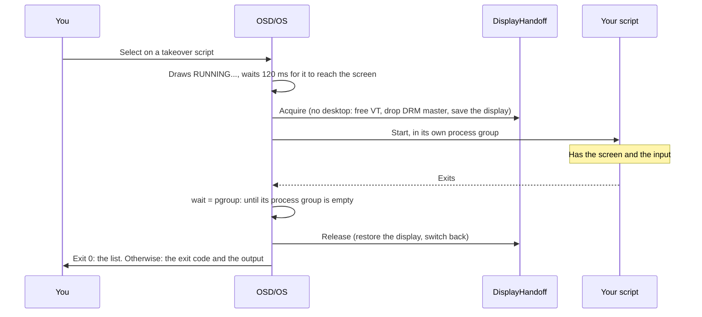

# Scripts

Your own shell scripts, run from the remote. The Scripts module lists the `.sh` files in a folder and runs the one you choose, so OSD/OS can start anything else on the machine: an update, RetroArch or a game, a TV-channel simulator like FieldStation42, a backup. A script either runs in a console, with OSD/OS showing its output, or takes over the whole screen until it exits. A small text file beside each script sets its name and how it runs, so a script you didn't write never has to be edited. This page covers setting it up, every option of that text file, the two modes, favourites on the main menu, running a script at start, what a script receives, three complete examples, and troubleshooting.

<table>
<tr><th width="50%">Scripts</th><th width="50%">A console script</th></tr>
<tr><td></td><td></td></tr>
<tr><td>Your own shell scripts, each with its mode. ► puts one on the main menu. The line at the foot shows the selected script's file.</td><td>A console script shows its output. A takeover script gets the whole screen until it exits.</td></tr>
</table>

## Setting it up

1. Settings → **Scripts** → **ENABLED**: On. Scripts appears on the main menu.
2. Put your scripts in the scripts folder: `user_scripts` in the data folder, which OSD/OS creates.

   | System | Folder |
   |---|---|
   | OSD/OS image, Raspberry Pi OS, SteamOS | `~/.local/share/OSD-OS/user_scripts/` |
   | macOS | `~/Library/Application Support/OSD-OS/user_scripts/` |

   Or pick another with Settings → Scripts → **Scripts Directory**, on the same folder tree Local Files is browsed with: **USE THIS FOLDER** picks the one open, **Default Folder** goes back to `user_scripts`.
3. Open **Scripts**. Every script gets its `.txt` file the first time it is listed; edit it to name the script and choose its mode.

The scripts are the files ending in `.sh` (in any case: `FOO.SH` counts) directly in the folder, not in folders under it, sorted by name. Hidden files are left out. The folder is read again every time the list opens, so a script you add, or a `.txt` you edit, shows the next time you open Scripts. **Rescan Scripts** in Settings reads it at once and writes any missing `.txt` files.

A script doesn't need to be executable. If it is, OSD/OS runs it directly, so its `#!` line is honoured (`#!/bin/bash`, `#!/usr/bin/env python3`); if not (a script copied off a Mac or a USB stick often loses the bit), OSD/OS runs it with `/bin/sh`, which is not bash. A bash script should therefore be executable: `chmod +x`.

## The list

Each row is the script's name, with its mode on the right (CONSOLE or TAKEOVER) and a `*` before the mode when it is a favourite. The box at the foot shows the selected script's file name, and FAVORITE and CONFIRM when its `.txt` sets them.

| Action | Keyboard | Gamepad | What it does |
|---|---|---|---|
| Move | ▲ ▼ | D-pad, left stick | Up and down the list (it wraps) |
| Run | Enter | A | Runs the script (after a yes/no question, if its `.txt` asks for one) |
| Favourite | ► | D-pad right | Puts the script on the main menu, or takes it off |
| Back | Esc | B | Back to the main menu |

With no scripts in the folder, the screen says **No scripts found: Please add .sh files to the scripts directory**.

## The .txt beside each script

Each script's settings are in a text file with its name and `.txt` in place of `.sh`: `retroarch.sh` → `retroarch.txt`, in the same folder. The script itself is never read or changed, so a script that comes from someone else (a launcher kept in git, say) can be listed as it is.

The format:

- one `key = value` per line, split at the **first** `=`, so a value may itself hold one;
- spaces around the key and the value don't matter, and keys are not case-sensitive;
- `#` starts a comment, but only at the start of a line;
- blank lines are ignored, a byte-order mark and Windows line ends are fine;
- a key OSD/OS doesn't know is ignored (it says so in the log), so a `.txt` written for a newer OSD/OS still works with an older one;
- a key left out keeps its default.

| Key | Values | Default | What it does |
|---|---|---|---|
| `name` | Any text | The file name without `.sh`, with `_` and `-` made spaces (`update-yt-dlp.sh` → `update yt dlp`) | The name the list (and the main menu, for a favourite) shows. The menus show it in capitals. |
| `mode` | `console`, `takeover` | `console` | **console**: OSD/OS keeps the screen and shows the output. **takeover**: the script gets the whole screen until it exits. Anything else is read as `console` (with a warning in the log): a typo must never hand the screen to a script. See [Console and takeover](https://github.com/mehmetraif/OSD-OS/wiki/Scripts#console-and-takeover). |
| `favorite` | `yes`, `no` | `no` | `yes` also puts the script on the main menu. ► in the list rewrites this line for you. |
| `confirm` | `yes`, `no` | `no` | `yes` asks **Run script?** first, with Cancel selected, so a stray select can't run something destructive. Asked from the main menu too, but not when the script runs at start. |
| `args` | Arguments | Nothing | Added after the script's path. Split on spaces, with double quotes keeping spaces together (`"/media/OSD-OS/Channel 3"`). It is not a shell: `$VARIABLES`, `~`, `*` and `|` are passed as they are. |
| `wait` | `pgroup`, `child` | `pgroup` | Takeover only. **pgroup**: OSD/OS takes the screen back only once everything the script started has exited. **child**: as soon as the script itself exits. Anything else is read as `pgroup`. |
| `tty` | `yes`, `no` | `no` | Takeover on a Linux system without a desktop only. `yes` gives the script a real terminal (the screen's virtual console) for its input and output, for a program that reads typed keys. Needs a udev rule: see [tty = yes](https://github.com/mehmetraif/OSD-OS/wiki/Scripts#tty--yes-and-its-udev-rule). |

For `favorite`, `confirm` and `tty`, `yes`, `on`, `true` and `1` mean yes, and `no`, `off`, `false` and `0` mean no; anything else leaves the default.

A script without a `.txt` gets one, holding its defaults and the format, the first time OSD/OS lists it. For `update-yt-dlp.sh`:

```ini
# OSD/OS script metadata for update-yt-dlp.sh
# Whole-line comments only. Unknown keys are ignored.
# Delete this file to regenerate it with defaults.

# Row label shown in OSD/OS.
name = update yt dlp

# console  = OSD/OS stays on screen and shows this script's output.
# takeover = the script gets the whole screen (a TV app, a game front end).
mode = console

# yes = also show this script on the main menu.
favorite = no

# yes = ask for confirmation before running.
confirm = no

# Extra arguments passed to the script. Split on spaces, quotes respected.
# Not a shell: $VARIABLES, globs and pipes are not expanded.
args =

# takeover only. pgroup = wait for everything the script started before
# taking the screen back; child = wait only for the script itself.
wait = pgroup

# takeover on Linux only, and needs a udev rule (see the wiki:
# github.com/mehmetraif/OSD-OS/wiki/Scripts).
# yes = give the script a real terminal, for one that needs typed input.
tty = no
```

Delete the `.txt` to have it written again. OSD/OS never writes over a `.txt` that is already there: if one of the same name exists (your own notes, say), it is read as settings, and whatever it doesn't set stays at its default. In a folder OSD/OS can't write to (a read-only share), the scripts still run, on their defaults.

## Console and takeover

### Console

OSD/OS stays on the screen and shows the script's output, its standard output and errors together, as it comes. It works the same on every system.

- The status line says **RUNNING…**, then **EXIT 0** (or another exit code), **STOPPED** or **FAILED TO START**; a script OSD/OS refused to start says **COULD NOT START:** and why.
- The output keeps the last 500 lines (64 KB at most). A carriage return rewrites the line, so a progress bar (yt-dlp's, curl's, apt's) stays one line that updates. ▲ ▼ scroll; the view follows the end unless you scroll up, and follows it again when you scroll back down.
- **Back while it runs stops it**: OSD/OS sends `SIGTERM` to the script and everything it started, and `SIGKILL` three seconds later if they are still there. The view stays, so you can read the end. Back again leaves. Holding back counts as one press.

### Takeover

The script gets the whole screen until it exits. For a program with a picture of its own: RetroArch, a game, a TV-channel simulator, a browser.

- **On a Linux system without a desktop** (the OSD/OS image, Raspberry Pi OS Lite), OSD/OS draws a black screen saying **RUNNING...** and the script's name, then hands the screen over (`DisplayHandoff`: it switches to a free virtual console, gives up the display, and saves its state), and starts the script. The script, or what it starts, draws straight to the display (through KMS/DRM, as mpv with `--vo=drm` or RetroArch do). When it is done, OSD/OS restores the display and switches back.
- **On a desktop, macOS or SteamOS**, nothing has to be handed over: the program's window simply covers OSD/OS's.
- **There is no stop key** while a takeover script runs. The script owns the input: on a Pi, every key reaches both OSD/OS and the script, and a back key that stopped it would fire inside RetroArch, which uses Esc in its own menus. Quit the program its own way, and OSD/OS comes back.
- **When it exits**, with `wait = pgroup` (the default) OSD/OS waits until every process the script started has gone before taking the screen back. That covers a launcher that starts a program in the background and exits at once: the screen stays the program's until it has really gone. With `wait = child`, OSD/OS takes the screen back as soon as the script itself exits.
- **Exit code 0** returns to where you started it (the list, or the main menu for a favourite), as after a video. Any other ending stays on the takeover screen, with the exit code and the output the script printed, the only way to see what went wrong on a Pi.
- If the display's state couldn't be saved (it then couldn't be put back), OSD/OS doesn't hand it over: it runs the script anyway, without the screen, and says **DISPLAY COULD NOT BE HANDED OVER — RAN WITHOUT IT**. Back then stops the script, as in a console.
- A process that hasn't started within five seconds counts as failed to start, so the screen is never left handed over to nothing.
- Starting a takeover ends a video OSD/OS had left playing behind its menus (Transparent Background).

While any script runs, console or takeover, the menu music is held off, and comes back afterwards.



### tty = yes, and its udev rule

A takeover script normally runs without a terminal: its output is captured (and shown if it fails), and nothing it reads from standard input comes from a keyboard. Most programs don't need one: RetroArch reads the keyboard and gamepads itself. A program that takes its keys from a terminal does, mpv among them.

With `tty = yes`, on a Linux system without a desktop, OSD/OS makes the virtual console it switched to (`/dev/tty2`, typically) the script's controlling terminal, and its standard input, output and error. The keyboard then types into the script, and its output goes to that console rather than to OSD/OS (so nothing is shown if it fails). Where the screen wasn't handed over (a desktop, macOS, a console script), `tty` does nothing.

OSD/OS has to open that console for reading and writing, and on Linux the consoles `/dev/tty2` and up belong to `root:tty` with mode `0620`: the `tty` group may write but not read. So it takes a udev rule widening them to `0660`, which OSD/OS doesn't install. On the OSD/OS image (and with the service `install.sh` sets up), the app runs with the `tty` group, so this rule is enough:

```sh
echo 'KERNEL=="tty[1-9]*", GROUP="tty", MODE="0660"' | sudo tee /etc/udev/rules.d/99-osdos-vt.rules
sudo udevadm control --reload-rules
sudo udevadm trigger --subsystem-match=tty
```

It lets every member of the `tty` group read the virtual consoles, which is what a script with `tty = yes` needs, and what you trade for it. Without the rule, a `tty = yes` script still runs, but without a terminal, and the log says `tty=yes requested but /dev/ttyN is not openable … running without a controlling terminal`. (This is a different rule from the one OSD/OS installs, `99-osdos-tty.rules`, which only lets the `tty` group open `/dev/tty0` to switch consoles.)

## Favourites on the main menu

A script marked `favorite = yes` (or with ► in the list) gets a row of its own on the main menu, beside the modules, after them. Choosing it runs the script straight away, without the list: a `confirm = yes` script still asks first, and when it ends you are back on the main menu. The rows come and go with the `.txt` files, and only while the Scripts module is enabled.

► in the list rewrites only the `favorite` line of the script's `.txt` (or adds one), keeping your comments and the other lines as they are.

## Running a script at start

To have OSD/OS run a script every time it starts, for a machine that should boot into RetroArch or a TV channel, say:

1. Settings → Scripts → **Auto-Run On Startup**: the script (**None** by default).
2. Settings → **Start on Module**: Scripts.

At start, OSD/OS opens Scripts and, after three quarters of a second (time for the screen's first frame, which a takeover has to save), runs the script, without asking even if its `.txt` says `confirm = yes`: nobody is there to answer. When it is done you are on the main menu (a takeover that exits with 0 goes there by itself; otherwise back does). If the script no longer exists, the Scripts list opens instead. A favourite chosen with **Play at Startup** ([Settings](https://github.com/mehmetraif/OSD-OS/wiki/Settings)) comes before Start on Module.

The setting stores the script's file name, not its path, so moving the scripts folder doesn't break it.

## What a script receives

| | |
|---|---|
| **Working folder** | The script's own folder. |
| **Arguments** | The `.txt`'s `args`, split as [described](https://github.com/mehmetraif/OSD-OS/wiki/Scripts#the-txt-beside-each-script). |
| **`APP_ROOT`** | OSD/OS's own folder (its QML, scripts and assets). |
| **`DATA_ROOT`** | The data folder (`~/.local/share/OSD-OS` on Linux and the image), where `bin/yt-dlp`, `config.json` and the rest are. |
| **`OSDOS_MODE`** | `console` or `takeover`: how it is really running (`console` for a takeover that couldn't be handed the screen). |
| **`OSDOS_VT`** | Only when the screen was handed over (a takeover on Linux without a desktop): the number of the virtual console OSD/OS switched to. |
| **`ALSA_CARD`** | Only when Settings → Audio Output names a sound card: that card, so a program playing through ALSA's default device plays where OSD/OS does. |
| **`MP240_MODE`, `MP240_VT`** | The same as `OSDOS_MODE` and `OSDOS_VT`, under 240-MP's names, for scripts written for it. |
| **Everything else** | The environment OSD/OS itself was started with. On the image that includes `QT_QPA_PLATFORM=eglfs`, which a Qt program started from a script will follow. |

A script runs in a process group of its own (`setsid`), so stopping it stops everything it started, and an empty group is how OSD/OS knows a takeover is done. On SteamOS, the Gaming Mode overlay library of the wrong word size is taken out of `LD_PRELOAD`, so its loader warning doesn't appear in the console as if your script had printed it.

## Examples

Three complete scripts, each with its `.txt`. Put both files in the scripts folder.

### 1. Update yt-dlp (console)

Updates the yt-dlp the [YouTube](https://github.com/mehmetraif/OSD-OS/wiki/YouTube) module uses, from the remote: the copy in the data folder if there is one (the OSD/OS image's, which also updates itself daily), else the one on the `PATH`.

`update-yt-dlp.sh`:

```sh
#!/bin/sh
# Updates the yt-dlp OSD/OS's YouTube module uses: the data folder's copy
# if there is one (where OSD/OS looks first), else the one on the PATH.
if [ -x "$DATA_ROOT/bin/yt-dlp" ]; then
    YTDLP="$DATA_ROOT/bin/yt-dlp"
else
    YTDLP=$(command -v yt-dlp) || { echo "yt-dlp is not installed"; exit 1; }
fi
echo "Updating $YTDLP"
exec "$YTDLP" --update
```

`update-yt-dlp.txt`:

```ini
name = Update yt-dlp
mode = console
favorite = yes
confirm = no
args =
wait = pgroup
tty = no
```

The console shows yt-dlp's answer (`yt-dlp is up to date (…)`, or the version it updated to) and **EXIT 0**. A copy installed by root in `/usr/local/bin` can't replace itself as the user OSD/OS runs as; yt-dlp says so, and the script exits with its error.

### 2. RetroArch, or one game (takeover)

[RetroArch](https://www.retroarch.com) with the whole screen. On Raspberry Pi OS and the OSD/OS image, install it and a core or two from Debian's packages:

```sh
sudo apt install retroarch libretro-nestopia
```

Without a desktop, RetroArch draws straight to the display, and reads the keyboard and gamepads itself (the app's user is in the `input` and `video` groups). Quit it from its own menu (Main Menu → Quit RetroArch) to come back to OSD/OS.

`retroarch.sh`:

```sh
#!/bin/sh
# RetroArch with the whole screen, passing on any arguments from the .txt.
exec retroarch "$@"
```

`retroarch.txt`:

```ini
name = RetroArch
mode = takeover
favorite = yes
confirm = no
args =
wait = pgroup
tty = no
```

For one game, straight in, a second script with the core and the game as its arguments. `alter-ego.sh` (the same one line):

```sh
#!/bin/sh
exec retroarch "$@"
```

`alter-ego.txt`, for a NES game kept on the card's film partition:

```ini
name = Alter Ego
mode = takeover
favorite = yes
args = -L /usr/lib/aarch64-linux-gnu/libretro/nestopia_libretro.so "/media/OSD-OS/Games/NES/Alter Ego.nes"
```

(`-L` names the core; Debian's cores are in `/usr/lib/aarch64-linux-gnu/libretro/` on a 64-bit Pi. The keys left out keep their defaults.)

### 3. A channel of your own (takeover, tty)

In the spirit of FieldStation42: every video in a folder, in a shuffled order, round and round, like a station that never signs off. It uses the mpv OSD/OS already has. Keys reach mpv through the terminal, so it needs `tty = yes` and [the udev rule](https://github.com/mehmetraif/OSD-OS/wiki/Scripts#tty--yes-and-its-udev-rule): `q` on a keyboard ends the channel, space pauses, ◄ ► seek.

`channel-3.sh`:

```sh
#!/bin/sh
# Channel 3: every video in a folder (the first argument), shuffled once,
# then round and round. q ends it (with tty = yes in channel-3.txt).
CHANNEL=${1:-/media/OSD-OS/Channel 3}
LIST=$(mktemp) || exit 1
trap 'rm -f "$LIST"' EXIT

find "$CHANNEL" -type f \( -iname '*.mp4' -o -iname '*.mkv' -o -iname '*.avi' \
    -o -iname '*.mov' -o -iname '*.m4v' -o -iname '*.mpg' -o -iname '*.mpeg' \) | shuf > "$LIST"
if [ ! -s "$LIST" ]; then
    echo "No videos in $CHANNEL"
    exit 1
fi

if [ -n "${WAYLAND_DISPLAY:-}${DISPLAY:-}" ]; then
    # A desktop: a full-screen window over OSD/OS.
    mpv --fs --loop-playlist=inf --really-quiet --playlist="$LIST"
else
    # No desktop (the OSD/OS image): straight to the screen OSD/OS handed over.
    mpv --vo=drm --hwdec=auto-safe --loop-playlist=inf --really-quiet --playlist="$LIST"
fi
```

`channel-3.txt`:

```ini
name = Channel 3
mode = takeover
favorite = yes
confirm = no
args = "/media/OSD-OS/Channel 3"
wait = pgroup
tty = yes
```

On a Pi 4, `--hwdec=v4l2m2m-copy` in place of `--hwdec=auto-safe` decodes H.264 in hardware, as OSD/OS's own playback does there. mpv plays through Settings → Audio Output's card (`ALSA_CARD`). Without the udev rule mpv gets no keys, and with no stop key during a takeover the channel runs until it is stopped from elsewhere: over SSH, `pkill -x mpv` ends mpv (OSD/OS's own mpv isn't running during a takeover), the script then exits, and OSD/OS shows mpv's exit code with back to leave. Ending only the script wouldn't do: mpv, which it started, would keep the screen, and OSD/OS waits for it (`wait = pgroup`).

FieldStation42 itself, or any program with a launcher of its own, is listed the same way: a short takeover script that changes to its folder and starts it, and `wait = pgroup` so OSD/OS waits for whatever the launcher leaves running.

## Settings

Settings → **Scripts**:

| Setting | Values | Default | What it does | Config key |
|---|---|---|---|---|
| ENABLED | On, Off | Off | Shows Scripts, and the favourites' rows, on the main menu. | `modules.com.osdos.scripts.enabled` |
| Scripts Directory | A folder, or Default Folder | Default (`user_scripts` in the data folder) | The folder holding your `.sh` files. | `modules.com.osdos.scripts.scripts_directory` (`""` for the default) |
| Auto-Run On Startup | None, or one of your scripts | None | Runs that script when OSD/OS starts on this module (Settings → Start on Module: Scripts). | `modules.com.osdos.scripts.startup_script` (the script's file name, or `None`) |
| Rescan Scripts | Select | | Reads the scripts folder again and writes any missing `.txt` files. | |

## Files and config keys

| File | What it is |
|---|---|
| `user_scripts/*.sh` (or the Scripts Directory) | Your scripts |
| `user_scripts/*.txt` | Each script's settings |

```json
{
    "app": {
        "startup_module": "com.osdos.scripts"
    },
    "modules": {
        "com.osdos.scripts": {
            "enabled": true,
            "scripts_directory": "",
            "startup_script": "channel-3.sh"
        }
    }
}
```

## Troubleshooting

**No scripts found.** The files must end in `.sh` and sit directly in the scripts folder (check Settings → Scripts → Scripts Directory), readable by the user OSD/OS runs as.

**COULD NOT START: …** OSD/OS refused before starting anything: **File no longer exists**, **Not a regular file**, **File is not readable**, **Not executable and /bin/sh is missing**, **Another script is still running** (a takeover's processes are still exiting), or **The screen is in use** (something else holds the display).

**FAILED TO START.** The system couldn't run it: a `#!` line naming a program that isn't installed, or a script with Windows line ends (`#!/bin/sh\r`). The output says `[OSD/OS] Failed to start:` and why. `sed -i 's/\r$//' script.sh` removes Windows line ends.

**A bash script fails with `/bin/sh` errors** (`[[: not found`, `Syntax error`). It isn't executable, so it ran with `/bin/sh`. `chmod +x` it, with `#!/bin/bash` as its first line.

**`$HOME`, `~` or `*` in `args` arrive as they are.** `args` is not a shell. Expand them in the script instead.

**A takeover script leaves a black screen, or OSD/OS doesn't come back.** OSD/OS waits for every process the script started (`wait = pgroup`). Something it started is still running: quit it, or over SSH find it with `ps -ef` and end it. Set `wait = child` if you really want the screen back as soon as the script exits, but then whatever it left running loses the screen.

**A takeover program shows nothing on a Pi without a desktop.** It has to draw to the display itself (KMS/DRM), with no X11 or Wayland: a program that needs a desktop can be started inside a kiosk compositor such as `cage`, as the [web players](https://github.com/mehmetraif/OSD-OS/wiki/Netflix-and-Prime-Video) do.

**Typed keys don't reach a takeover program.** It reads its keys from a terminal: set `tty = yes` and add [the udev rule](https://github.com/mehmetraif/OSD-OS/wiki/Scripts#tty--yes-and-its-udev-rule). The log says when the console couldn't be opened.

**DISPLAY COULD NOT BE HANDED OVER — RAN WITHOUT IT.** OSD/OS couldn't save the display's state, so it didn't give the screen up. This can happen when a takeover runs before OSD/OS has drawn a first frame; try again from the list.

To read the log on the image: `sudo journalctl -u osdos -f`; it says which script ran, how (`direct` or `/bin/sh`, console or takeover, the console's number) and how it finished. More in [Troubleshooting](https://github.com/mehmetraif/OSD-OS/wiki/Troubleshooting).

## See also

- [YouTube](https://github.com/mehmetraif/OSD-OS/wiki/YouTube): yt-dlp, which the first example updates
- [Netflix and Prime Video](https://github.com/mehmetraif/OSD-OS/wiki/Netflix-and-Prime-Video): their web player runs as a takeover too
- [Settings](https://github.com/mehmetraif/OSD-OS/wiki/Settings): Start on Module and Play at Startup
- [How it works](https://github.com/mehmetraif/OSD-OS/wiki/How-It-Works): the display hand-off
- [The OSD/OS image](https://github.com/mehmetraif/OSD-OS/wiki/The-OSD-OS-Image): SSH, the film partition, the services
- [Configuration files](https://github.com/mehmetraif/OSD-OS/wiki/Configuration-Files)
