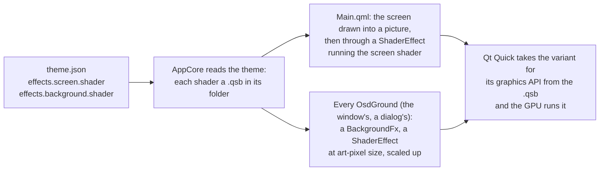

# Shaders

A [theme](https://github.com/mehmetraif/OSD-OS/wiki/Themes) can bring two kinds of shader of its own, small programs the GPU runs for every pixel it draws: a **screen effect's**, which draws the whole screen from a picture of it, and a **background effect's**, which draws behind the menus. This page covers how OSD/OS runs them, the rules every shader follows, what each kind is given, compiling with `qsb`, what happens when a shader can't be used, four complete worked examples, and the [theme template](https://github.com/mehmetraif/OSD-OS/tree/main/docs/theme-template)'s two shaders explained line by line. The selector effects and the transitions are OSD/OS's own: a theme names them, but can't replace them.

## Two kinds

| | A screen effect's shader | A background effect's shader |
|---|---|---|
| In `theme.json` | `"screen": { "shader": "tube.frag.qsb", "animate": true }` | `"background": { "shader": "plasma.frag.qsb", "area": "foot" }` |
| What it draws | The whole screen: OSD/OS draws the screen into a picture and gives it to the shader as `source`; the shader says what colour each point gets | Itself only, over the window's ground and under the menus; what it leaves clear shows the ground |
| How often it runs | For every screen pixel, each time the screen is drawn | For every art pixel of its area, each time the screen is drawn |
| What it is given | `source`, `resolution`, `px`, `time`, the six screen numbers, the four text numbers, `ink`, `paper` | `size`, `origin`, `time`, `ink`, `paper` |
| Its clock | Counts with `"animate": true` | Always counts while it shows |
| What it replaces | OSD/OS's screen shader, which also draws the text effects | OSD/OS's background effect |

Settings can still overrule either: Screen Effect or Background Effect set to a name puts OSD/OS's in place of the theme's, and Off turns it off ([Themes](https://github.com/mehmetraif/OSD-OS/wiki/Themes#how-a-theme-is-applied)).

## How OSD/OS runs a shader



- **The screen shader** is the `layer.effect` of the item that holds everything OSD/OS draws ([Main.qml](https://github.com/mehmetraif/OSD-OS/blob/main/Main.qml)): while a screen or text effect is in force, that item is drawn into a picture (its layer), and the picture is drawn to the screen through a `ShaderEffect` running your shader. A video played inside the window is outside that item, and never passes through it.
- **The background shader** is drawn by [BackgroundFx.qml](https://github.com/mehmetraif/OSD-OS/blob/main/views/Components/BackgroundFx.qml): a `ShaderEffect` one pixel per art pixel, scaled up without smoothing. Every ground laid on the screen has one: the window's, and each dialog's.
- **The values** come from properties of the `ShaderEffect` with the same names as the shader's uniforms: Qt Quick copies each property into the uniform of its name, every time it changes.

## The rules every shader follows

1. **It is written in GLSL 4.40 for Qt Shader Tools**: it starts with `#version 440`. `qsb` translates it for each graphics API.
2. **It reads the point it runs for**, `layout(location = 0) in vec2 qt_TexCoord0;`, from (0, 0) at the top left of what it draws to (1, 1) at the bottom right, **and writes its colour**, `layout(location = 0) out vec4 fragColor;`.
3. **Its uniforms are one block at binding 0 that starts with `mat4 qt_Matrix` and `float qt_Opacity`, in that order:**

   ```glsl
   layout(std140, binding = 0) uniform buf {
       mat4 qt_Matrix;
       float qt_Opacity;
       // then any of OSD/OS's names, in any order: only those it uses
   };
   ```

   Qt's own vertex shader reads `qt_Matrix` from the start of the block. With anything before it, the effect draws nothing at all, and nothing in the log says why.
4. **After those two come any of the names OSD/OS sets**, in any order, each with its type (below). Leave out what you don't use. A name OSD/OS doesn't set stays 0, and Qt logs `ShaderEffect: 'speed' does not have a matching property`.
5. **A screen shader reads the screen** from `layout(binding = 1) uniform sampler2D source;`. A background shader has no picture to read: don't declare one.
6. **Its colour is premultiplied**: red, green and blue already multiplied by alpha, `vec4(color * alpha, alpha)`. Multiply the result by `qt_Opacity`, as every Qt Quick shader does.
7. **It is compiled into a `.qsb`**, for every graphics API, and the theme names the `.qsb` ([below](#compiling-with-qsb)).

| QML property | GLSL type | The names |
|---|---|---|
| `size`, `point` | `vec2` | `resolution`, `size`, `origin` |
| `real` | `float` | `px`, `time` and every number |
| `color` | `vec4`: red, green, blue, alpha, each 0 to 1 | `ink`, `paper` |
| the screen's picture | `sampler2D` | `source` |

## A screen effect's shader

| Name | Type | What it is |
|---|---|---|
| `source` | `sampler2D`, binding 1 | The screen as OSD/OS drew it: the menus on their ground with the background and selector effects, the boot screen, the screen saver, the pointer. Never a video |
| `resolution` | `vec2` | The screen, in its pixels: 640 × 480, 720 × 576, 1920 × 1080 |
| `px` | `float` | Screen pixels per art pixel, a pixel of a 240-line picture: the screen's height ÷ 240, rounded down (2 at 480 and 576 lines, 3 at 720, 4 at 1080) |
| `time` | `float` | Seconds. It counts while the theme's screen effect has `"animate": true`, and otherwise only while something else moves (a background effect, `noise`, a moving text effect). It starts over at 3600 |
| `scanlines`, `curvature`, `glow`, `bleed`, `noise`, `vignette` | `float` | The theme's screen numbers, 0 to 1, 0 for one left out |
| `rainbow`, `shimmer`, `flicker`, `inkGlow` | `float` | The text effect's numbers, Settings' or the theme's (`inkGlow` is the text's `glow`), 0 for none |
| `ink`, `paper` | `vec4` | The colours in force: the scheme's colour (`primary`) and its background (`surface`). With OSD Background: Off, the lighter of the two and black |

- **The numbers are yours to use** or not, and to give meanings of their own: the [hold roll](#1-a-hold-roll-over-the-screen) below reads `scanlines`, and nothing else.
- **It runs** whenever the theme's screen effect has a shader, even with every number 0, where there is a GPU and the effects aren't resting.
- **It draws the whole screen**: write an opaque colour, alpha 1.
- **Pixels and art pixels**: `qt_TexCoord0 * resolution` is the point in screen pixels, and that `/ px` in art pixels; `floor()` of it is the art pixel. Work in whole art pixels and the menus stay crisp.
- **It replaces OSD/OS's screen shader, text effects and all.** Settings → Text Effect's numbers still reach your shader, as `rainbow`, `shimmer`, `flicker` and `inkGlow`, but they show only if your shader draws them ([example 4](#4-keeping-the-text-effects)).

## A background effect's shader

| Name | Type | What it is |
|---|---|---|
| `size` | `vec2` | The area it draws, in art pixels |
| `origin` | `vec2` | Where that area's top left is on the screen, in art pixels |
| `time` | `float` | Seconds, counting while it shows. It starts over at 3600 |
| `ink`, `paper` | `vec4` | The colours in force, as for the screen |

- **One pixel per art pixel.** The shader is drawn `size` pixels big, then scaled up by `px` without smoothing: `floor(qt_TexCoord0 * size)` is the art pixel in the area, and adding `origin` makes it the art pixel on the screen.
- **The area** is the window inside its frame, or, with `"area": "foot"`, from the window's top down to the screen's foot; with OSD Background Full or Off, the whole screen ([Effects](https://github.com/mehmetraif/OSD-OS/wiki/Effects#background-effects)).
- **Every ground draws it again**: the window's, and each dialog's (a question, the on-screen keyboard, an info screen). All of them are given the same `size` and `origin`, so a shader that works from the screen's art pixel, `floor(qt_TexCoord0 * size) + origin`, draws the same picture under a dialog as beside it, carrying on seamlessly.
- **Clear where it draws nothing**: `fragColor = vec4(0.0)` leaves the ground showing. Keep what it draws faint (an alpha of 0.3 to 0.5), so the menus read over it.
- **Its clock always runs** while it shows; `"animate"` is not needed.

## Compiling with qsb

### The command

After every change, compile the shader into the `.qsb` that `theme.json` names:

```sh
qsb --glsl "100 es,120,150" --hlsl 50 --msl 12 -o plasma.frag.qsb plasma.frag
```

| Option | Makes the shader for |
|---|---|
| `--glsl "100 es,120,150"` | OpenGL ES (the Raspberry Pi) and desktop OpenGL (Linux, SteamOS) |
| `--msl 12` | Metal (macOS) |
| `--hlsl 50` | Direct3D, which OSD/OS doesn't use; harmless |
| always, without an option | SPIR-V, for Vulkan |

They are the same variants OSD/OS's own shaders are compiled with. A `.qsb` holds them all, so it can be made on any computer and copied to any other.

On an error, `qsb` prints the GLSL compiler's message with the line, exits with 1, and writes nothing; an earlier `.qsb` of that name stays as it was:

```text
QSpirvCompiler: Failed to parse shader
Shader baking failed: ERROR: warp.frag:38: '' :  syntax error, unexpected FOR, expecting COMMA or SEMICOLON
ERROR: 1 compilation errors.  No code generated.
```

### Where qsb comes from

`qsb` comes with Qt Shader Tools.

| On | Get it | Run it as |
|---|---|---|
| Raspberry Pi OS, Debian, Ubuntu | `sudo apt install qt6-shader-baker` | `/usr/lib/qt6/bin/qsb` |
| macOS, Qt from Qt's online installer | Add Qt Shader Tools (under Additional Libraries) | `~/Qt/<version>/macos/bin/qsb` |
| macOS, Homebrew | `brew install qt`, which includes Qt Shader Tools | find it with `find "$(brew --prefix qt)/" -name qsb` |
| SteamOS | — | Compile on another computer and copy the `.qsb` |

### Which Qt's qsb

A `.qsb` is written in its `qsb`'s format. Qt reads files of its own format and older ones, but not newer: compile with the Qt OSD/OS runs on, or an older one. The template's shaders are compiled with `qsb` 6.4 (format 6), which every Qt OSD/OS runs on reads: the releases are built with Qt 6.4 (Raspberry Pi) and 6.7 (macOS, the AppImage), and on Raspberry Pi OS the app runs with the system's own Qt. Debian 12's and Ubuntu 24.04's `qt6-shader-baker` is `qsb` 6.4.

`qsb -d` shows what a file holds: its format, its variants, and its uniform block, with each name, type and offset, to check against the tables above:

```text
$ /usr/lib/qt6/bin/qsb -d warp.frag.qsb
Stage: Fragment
QSB_VERSION: 6
Has 6 shaders: (unordered list)
  Shader 0: GLSL 120 [Standard]
  Shader 1: GLSL 150 [Standard]
  Shader 2: SPIR-V 100 [Standard]
  Shader 3: GLSL 100 es [Standard]
  Shader 4: MSL 12 [Standard]
  Shader 5: HLSL 50 [Standard]
…
```

## Loading, fallback and the log

| What is wrong | What the log says | What is drawn |
|---|---|---|
| The file isn't there, isn't inside the theme's folder, or isn't a `.qsb` | `[AppCore] theme my-theme: its screen shader, "tube.frag.qsb", is not a qsb file in its folder` (or `background shader`) | Screen: OSD/OS's shader, with the theme's numbers. Background: nothing |
| The file isn't a compiled shader, or comes from a newer Qt | Qt's `ShaderEffect: Failed to deserialize QShader from …`, then `qml: [Effect] file:///…/tube.frag.qsb can't be used, OSD/OS's own in its place` (a background's: `… can't be used`) | Screen: OSD/OS's shader, with the theme's numbers. Background: nothing |
| It was compiled without the variant this Qt draws with (no `--glsl` on the Pi, no `--msl` on a Mac) | Qt's own complaint that the file has no code for its graphics API (with OpenGL, `No GLSL shader code found …`), then `Failed to build graphics pipeline state`; no `[Effect]` line | Nothing. A screen shader takes the menus with it |
| Its uniform block doesn't start with `qt_Matrix` and `qt_Opacity` | Nothing | Nothing. A screen shader takes the menus with it |
| It declares a name OSD/OS doesn't set | `ShaderEffect: 'speed' does not have a matching property` | It works, that value 0 |

- **A theme's screen shader that failed** is tried again when the theme is chosen again, after another.
- **A screen shader that leaves the menus unreadable** leaves Settings unreadable too: move the theme out of `themes` over SSH and restart OSD/OS ([Themes](https://github.com/mehmetraif/OSD-OS/wiki/Themes#getting-back-from-a-theme-that-hides-the-menus)).
- **A shader changed under the same file name** stays as it was until OSD/OS restarts: a shader already loaded stays in memory. To try changes without restarting, compile each to a new file name (`warp2.frag.qsb`), change `theme.json` to match, and choose the theme again.

Where to read the log: [Themes](https://github.com/mehmetraif/OSD-OS/wiki/Themes#reading-the-log).

## Worked examples

Each comes with what it takes in its theme's `effects` (in `theme.json`). Save the source in the theme's folder, compile it there with the [command above](#the-command), and choose the theme (again).

### 1. A hold roll over the screen

A screen effect: every twelve seconds, a band rolls down the picture in three seconds, the lines in it pulled sideways like a set losing its horizontal hold, a little brighter as they tear; and the theme's scanlines all the time.

```json
{ "screen": { "shader": "holdroll.frag.qsb", "animate": true, "scanlines": 0.3 } }
```

`holdroll.frag`:

```glsl
#version 440
// A screen effect: every twelve seconds a band rolls down the picture, the
// lines in it pulled sideways like a set losing its horizontal hold, and the
// theme's scanlines all the time. It moves: its theme.json says "animate": true.

layout(location = 0) in vec2 qt_TexCoord0;
layout(location = 0) out vec4 fragColor;

layout(std140, binding = 0) uniform buf {
    mat4 qt_Matrix;
    float qt_Opacity;
    vec2 resolution;  // the screen, in its pixels
    float px;         // screen pixels to an art pixel
    float time;       // seconds, counting while "animate" is true
    float scanlines;  // the theme's "scanlines", 0 to 1
};

layout(binding = 1) uniform sampler2D source;

void main()
{
    vec2 uv = qt_TexCoord0;
    // Which line of art pixels this is: a whole line moves together.
    float line = floor(uv.y * resolution.y / px);

    // The band, an eighth of the screen either side of its middle, rolls from
    // above the top to below the foot in the first 3 seconds of every 12.
    float cycle = mod(time, 12.0);
    float middle = -0.25 + 1.5 * cycle / 3.0;
    float band = (1.0 - smoothstep(0.0, 0.125, abs(uv.y - middle))) * step(cycle, 3.0);

    // Each line in the band pulled its own way, up to 6 art pixels, in whole
    // art pixels so the letters stay crisp.
    float pull = floor(sin(line * 0.9 + time * 20.0) * 6.0 * band + 0.5);
    uv.x += pull * px / resolution.x;

    // Off the picture's edge, black, as on a tube.
    float inside = step(0.0, uv.x) * step(uv.x, 1.0);
    vec3 color = texture(source, uv).rgb * inside;

    // The torn band a little brighter.
    color *= 1.0 + 0.15 * band;

    // Scanlines: the foot of every line of art pixels darker.
    color *= 1.0 - scanlines * 0.7 * step(0.5, fract(qt_TexCoord0.y * resolution.y / px));

    fragColor = vec4(clamp(color, 0.0, 1.0), 1.0) * qt_Opacity;
}
```

- **`line`** numbers the lines of art pixels, so that a whole line moves as one and the letters keep their shape.
- **`cycle`** runs from 0 to 12 seconds over and over; 12 divides 3600, so the roll keeps its beat when the clock starts over. In the first 3 seconds, `middle` goes from a quarter of the screen's height above its top to a quarter below its foot, and `band` is 1 at the band's middle, fading to 0 an eighth of the screen away. The rest of the time it is 0, and the picture is as it is.
- **`pull`** is a different sideways shift for each line, changing quickly with `time`, rounded to whole art pixels (`px / resolution.x` is an art pixel across, in the picture's coordinates).
- **`inside`** blacks out what is pulled in from beyond the picture's edges.
- One read of `source` per pixel: it costs about as much as plain scanlines.

### 2. A warp starfield

A background effect: stars streaming out of the middle of the window as if it were flying through them, slow and dim at first, then faster, brighter and drawn out into streaks near the edges.

```json
{ "background": { "shader": "warp.frag.qsb" } }
```

`warp.frag`:

```glsl
#version 440
// A background effect: stars streaming out of the middle of the window as if
// it flew through them, slow and dim at first, then faster, brighter and
// drawn out into streaks near its edges. On art pixels, in the scheme's colour.

layout(location = 0) in vec2 qt_TexCoord0;
layout(location = 0) out vec4 fragColor;

layout(std140, binding = 0) uniform buf {
    mat4 qt_Matrix;
    float qt_Opacity;
    vec2 size;    // the area it draws, in art pixels
    vec2 origin;  // where that is on the screen, in art pixels
    float time;   // seconds
    vec4 ink;     // the colour scheme's colour
};

// A number from 0 to 1 for a point, without sin(): the Pi's GPU keeps its
// precision.
float grain(vec2 p)
{
    vec3 p3 = fract(vec3(p.xyx) * 0.1031);
    p3 += dot(p3, p3.yzx + 33.33);
    return fract((p3.x + p3.y) * p3.z);
}

void main()
{
    // This art pixel's middle, from the area's middle (every copy of the
    // effect, a dialog's too, has the same area, so the same middle).
    vec2 p = floor(qt_TexCoord0 * size) + origin;
    vec2 d = p + 0.5 - (origin + size * 0.5);
    float r = length(d);
    float a = atan(d.y, d.x);
    float reach = length(size) * 0.5;

    float light = 0.0;
    for (int i = 0; i < 2; ++i) {
        float layer = float(i);
        // The circle cut into slices, one star flying out along each.
        float slices = 72.0 + 48.0 * layer;
        float k = floor((a / 6.2831853 + 0.5) * slices);
        float along = (k + 0.5) / slices * 6.2831853 - 3.1415927;
        // How far this pixel is from the slice's middle line, in art pixels.
        float off = abs(sin(a - along)) * r;

        // How far out the star is: 0 at the middle, 1 at the edge, a trip
        // every 3 to 7 seconds; faster the further out, as stars rush past.
        float rate = 0.14 + 0.2 * grain(vec2(k, 7.0 + layer));
        float f = fract(time * rate + grain(vec2(k, 3.0 + layer)));
        float head = f * f * reach;
        float tail = 0.5 + 7.0 * f * f;

        if (off < 0.5 && r <= head && r > head - tail)
            light = max(light, 0.2 + 0.7 * f);
    }
    vec3 color = mix(ink.rgb, vec3(1.0), 0.3);
    fragColor = vec4(color * light, light) * qt_Opacity;
}
```

- **`d`, `r` and `a`** are the art pixel's way, distance and angle from the area's middle.
- **The slices**: the circle is cut into 72 slices, then 120 for a second layer of stars, each with one star flying out along its middle line. `off` is how far the pixel is from that line; under half an art pixel, it is on it.
- **The star's trip**: `f` goes from 0 to 1 at the slice's own `rate` (one trip in 3 to 7 seconds) and from its own starting point (`grain`, so they don't all start together). Its distance, `head`, is `f` squared times the way to the corner: slow near the middle, rushing at the edges, where its streak, `tail`, is up to 7.5 art pixels long and its light at its brightest.
- **`grain()`** makes a number from 0 to 1 for a point with arithmetic only: hashes built on `sin()` lose their precision on some GPUs, the Pi's among them. OSD/OS's own shaders use the same one.
- The stars are the scheme's colour, 30% lighter, at 20% to 90% opacity, premultiplied.

### 3. A synthwave grid along the foot

A background effect for `"area": "foot"`: a floor of grid lines running to a horizon two fifths of the way up, scrolling towards you, as on a synthwave record's sleeve. Its lines are an art pixel wide, in the scheme's colour, fading into the distance.

```json
{ "background": { "shader": "grid.frag.qsb", "area": "foot" } }
```

`grid.frag`:

```glsl
#version 440
// A background effect for "area": "foot": a floor of grid lines running to a
// horizon and scrolling towards you, as on a synthwave record's sleeve. Its
// lines are an art pixel wide, in the scheme's colour, fading into the distance.

layout(location = 0) in vec2 qt_TexCoord0;
layout(location = 0) out vec4 fragColor;

layout(std140, binding = 0) uniform buf {
    mat4 qt_Matrix;
    float qt_Opacity;
    vec2 size;    // the area, in art pixels: the window's top to the screen's foot
    vec2 origin;  // its top left on the screen, in art pixels
    float time;   // seconds
    vec4 ink;     // the colour scheme's colour
};

// The floor's rows, counted from the horizon and coming towards you, at a
// point `below` art pixels under it.
float rowAt(float below)
{
    return 48.0 / below + time * 1.5;
}

// The lines running to the horizon, counted from its middle, at a point `x`
// art pixels across from the middle and `below` under it.
float lineAt(float x, float below)
{
    return x * 3.0 / below;
}

// Whether a whole number lies between two values: a line crosses there.
bool crosses(float a, float b)
{
    return floor(min(a, b)) != floor(max(a, b));
}

void main()
{
    vec2 p = floor(qt_TexCoord0 * size) + origin;
    // The horizon two fifths of the way up from the area's foot, the lines
    // meeting in its middle.
    float horizon = floor(origin.y + size.y * 0.6);
    float x = p.x - (origin.x + size.x * 0.5);
    float below = p.y - horizon;

    float light = 0.0;
    if (below == 0.0) {
        light = 0.6;                       // the horizon itself
    } else if (below > 0.0) {
        // Lit when a row or a line passes through this art pixel: between its
        // top and its foot, or between any two of its corners. Rows only
        // from where they are two art pixels apart or more.
        bool row = below >= 10.0 && crosses(rowAt(below), rowAt(below + 1.0));
        bool line = crosses(lineAt(x, below), lineAt(x + 1.0, below + 1.0))
                 || crosses(lineAt(x + 1.0, below), lineAt(x, below + 1.0));
        if (row || line)
            // Gone near the horizon, where they would crowd together.
            light = 0.45 * smoothstep(12.0, 56.0, below);
    }
    fragColor = vec4(ink.rgb * light, light) * qt_Opacity;
}
```

- **Perspective in one division.** A row of the floor `below` art pixels under the horizon is `48 / below` rows into the distance; adding `time * 1.5` moves every row towards you, a row and a half a second. A line to the horizon `x` art pixels across from the middle is `x * 3 / below` lines out.
- **Lines an art pixel wide**: rather than testing how close a pixel is to a line, the shader asks whether a line passes through the art pixel, a whole number lying between the values at its edges (`crosses`). For the rows, between its top and its foot; for the lines to the horizon, between opposite corners, so that a shallow line far out to the side stays unbroken.
- **The distance**: rows nearer than two art pixels apart (`below` under 10) are left out, and everything fades in from 12 to 56 art pixels under the horizon, where the lines would crowd into a blur.
- **The clock**: when `time` starts over at 3600, every row moves by 5400 rows, a whole number, so nothing jumps.
- With `"area": "foot"` the area runs from the window's top to the screen's foot, so the floor fills the lowest two fifths of it, from below the window up into it. With `"area": "window"` it would sit in the window's lower part instead.

### 4. Keeping the text effects

A screen shader of your own takes the place of OSD/OS's, which is the one that draws the text effects (Rainbow, Shimmer, Glow, Flicker). This one draws them as OSD/OS's does, from the same numbers, so Settings → Text Effect and the theme's `text` keep working; its own look is only scanlines, where yours goes.

```json
{
    "text": "Rainbow",
    "screen": { "shader": "keeptext.frag.qsb", "scanlines": 0.3 }
}
```

`keeptext.frag`:

```glsl
#version 440
// A screen effect of one's own that keeps Settings → Text Effect working:
// the text effects are drawn by OSD/OS's own screen shader, which this one
// replaces, so it draws them itself, as OSD/OS's does (shaders/effects.frag).
// Its own look here is only scanlines: put yours where it says.

layout(location = 0) in vec2 qt_TexCoord0;
layout(location = 0) out vec4 fragColor;

layout(std140, binding = 0) uniform buf {
    mat4 qt_Matrix;
    float qt_Opacity;
    vec2 resolution;
    float px;
    float time;
    float scanlines;
    float rainbow;    // the text effect's numbers, 0 to 1
    float shimmer;
    float flicker;
    float inkGlow;
    vec4 ink;
    vec4 paper;
};

layout(binding = 1) uniform sampler2D source;

float grain(vec2 p)
{
    vec3 p3 = fract(vec3(p.xyx) * 0.1031);
    p3 += dot(p3, p3.yzx + 33.33);
    return fract((p3.x + p3.y) * p3.z);
}

vec3 hue(float h)
{
    return clamp(abs(fract(h + vec3(0.0, 2.0 / 3.0, 1.0 / 3.0)) * 6.0 - 3.0) - 1.0, 0.0, 1.0);
}

// How much of the ink a colour is: 0 the paper, 1 the ink.
float inkOf(vec3 c)
{
    vec3 axis = ink.rgb - paper.rgb;
    return clamp(dot(c - paper.rgb, axis) / max(dot(axis, axis), 0.0001), 0.0, 1.0);
}

// The text effects, on what is drawn in the two colours only.
vec3 textEffects(vec3 color, vec2 uv)
{
    vec2 art = px / resolution;
    float t = inkOf(color);
    float drawn = 1.0 - smoothstep(0.06, 0.2, length(color - mix(paper.rgb, ink.rgb, t)));
    vec3 newInk = ink.rgb;
    if (rainbow > 0.0) {
        vec2 cell = floor(uv / art);
        newInk = mix(newInk, mix(hue(fract(cell.x * 0.006 + cell.y * 0.003 - time * 0.15)), vec3(1.0), 0.15), rainbow);
    }
    if (shimmer > 0.0) {
        float d = uv.x + uv.y * 0.35 - (fract(time / 3.5) * 1.8 - 0.4);
        newInk = mix(newInk, vec3(1.0), (1.0 - smoothstep(0.0, 0.06, abs(d))) * shimmer * 0.85);
    }
    if (flicker > 0.0) {
        float f = grain(vec2(floor(time * 12.0), 7.31));
        float dip = f > 0.9 ? 1.0 : (f > 0.82 ? 0.5 : 0.0);
        newInk = mix(paper.rgb, newInk, 1.0 - flicker * (0.75 * dip + 0.06 * (0.5 + 0.5 * sin(time * 45.0))));
    }
    if (inkGlow > 0.0) {
        vec2 g = art * 1.5;
        float around = (inkOf(texture(source, uv + vec2(g.x, 0.0)).rgb) + inkOf(texture(source, uv - vec2(g.x, 0.0)).rgb)
                      + inkOf(texture(source, uv + vec2(0.0, g.y)).rgb) + inkOf(texture(source, uv - vec2(0.0, g.y)).rgb)) * 0.25;
        t = max(t, t + (around - t) * inkGlow * 0.8);
    }
    return mix(color, paper.rgb + (newInk - paper.rgb) * t, drawn);
}

void main()
{
    vec2 uv = qt_TexCoord0;
    vec3 color = texture(source, uv).rgb;
    color = textEffects(color, uv);
    // Your own look here; this one's is scanlines.
    color *= 1.0 - scanlines * 0.7 * step(0.5, fract(uv.y * resolution.y / px));
    fragColor = vec4(clamp(color, 0.0, 1.0), 1.0) * qt_Opacity;
}
```

- **`inkOf()`** says how far a colour lies from the paper towards the ink, 0 to 1. **`drawn`** is 1 for colours on the line between the two (the text, the lines, the bars, a letter's soft edge) and 0 for anything else, a picture or a flame, which is left as it is.
- **`textEffects()`** changes the ink, not the picture: the rainbow's hues, the shimmer's white glint, the flicker's dips towards the paper; then it redraws each drawn pixel with the new ink, as much of it as the pixel had. Glow raises that amount where there is more ink round about.
- No `"animate"` is needed here: Rainbow, Shimmer and Flicker keep the clock running themselves, as they do for OSD/OS's shader. A shader that moves on its own needs `"animate": true`.
- Copy `textEffects()` and its three helpers into a shader of your own, call it on the colour you read from `source`, and the text effects keep working with it.

## The template's shaders, line by line

### plasma.frag: a background

The [template](https://github.com/mehmetraif/OSD-OS/blob/main/docs/theme-template/plasma.frag)'s background effect: a plasma, the old demos' favourite, drifting slowly behind the menus in the scheme's colour, faint and dithered as an old computer would draw it.

```glsl
#version 440
// The template theme's background effect: a plasma, the old demos' favourite,
// drifting slowly behind the menus in the colour scheme's colour. Faint, so
// the menus stay easy to read, on art pixels, and dithered as an old
// computer would: a pixel is lit or not, more of them where the plasma is
// brighter.

layout(location = 0) in vec2 qt_TexCoord0;
layout(location = 0) out vec4 fragColor;

layout(std140, binding = 0) uniform buf {
    mat4 qt_Matrix;
    float qt_Opacity;
    vec2 size;        // the area it draws, in art pixels
    vec2 origin;      // where that is on the screen, in art pixels
    float time;       // seconds
    vec4 ink;         // the colour scheme's colour
    vec4 paper;       // its background
};

// A 4×4 ordered dither's threshold for an art pixel, 0 to 1.
float bayer2(vec2 a)
{
    a = floor(a);
    return fract(dot(a, vec2(0.5, a.y * 0.75)));
}

float bayer4(vec2 a)
{
    return bayer2(0.5 * a) * 0.25 + bayer2(a);
}

void main()
{
    // The screen's art pixel, the same wherever on the screen this is
    // drawn: a dialog's ground (OsdGround) shows the same plasma as the
    // window's under it.
    vec2 p = floor(qt_TexCoord0 * size) + origin;
    float t = time * 0.4;
    vec2 centre = vec2(160.0, 120.0) + 60.0 * vec2(sin(t * 0.7), cos(t * 0.9));
    float v = sin(p.x * 0.05 + t) + sin(p.y * 0.07 - t * 1.3)
            + sin((p.x + p.y) * 0.04 + t * 0.6) + sin(length(p - centre) * 0.08 - t);
    // The plasma's brightness here, 0 to 1, and a pixel lit or not by it.
    float level = 0.5 + 0.125 * v;
    float lit = step(bayer4(p), level * level * 0.5);
    float alpha = 0.4 * lit;
    fragColor = vec4(ink.rgb * alpha, alpha) * qt_Opacity;
}
```

| Lines | What they do |
|---|---|
| `#version 440` | GLSL 4.40, what `qsb` compiles from |
| `in vec2 qt_TexCoord0`, `out vec4 fragColor` | The point it runs for, 0 to 1 across and down its area, and the colour it writes |
| `uniform buf { … }` | The block: `qt_Matrix` and `qt_Opacity` first, then the names it uses, `size`, `origin`, `time`, `ink` and `paper` (declared, but not used) |
| `bayer2()` | A 2 × 2 ordered dither: from whether the art pixel's column and row are odd or even, a threshold of 0, 0.5, 0.75 or 0.25, the four spread as evenly as can be |
| `bayer4()` | A 4 × 4 one, built from two: the 2 × 2 pattern at half the size, a quarter as strong, added to it at full size, for 16 thresholds from 0 to 15/16 |
| `vec2 p = floor(qt_TexCoord0 * size) + origin;` | The art pixel, on the screen: the same point gets the same plasma under a dialog's ground as under the window's |
| `float t = time * 0.4;` | Its own clock, slowed to drift |
| `vec2 centre = …` | A point wandering round (160, 120), the middle of a 320 × 240 picture, up to 60 art pixels away, at two speeds across and down |
| `float v = …` | The plasma: four waves added, across, down, slanted, and in rings round the wandering point, each moving at its own speed; from -4 to 4 |
| `float level = 0.5 + 0.125 * v;` | That as a brightness from 0 to 1 |
| `step(bayer4(p), level * level * 0.5)` | The dither: the pixel is lit where its threshold is below the brightness, squared to keep the dark parts dark, and halved so that at most half the pixels light |
| `float alpha = 0.4 * lit;` | A lit pixel at 40%, so the menus read over it |
| `fragColor = vec4(ink.rgb * alpha, alpha) * qt_Opacity;` | The scheme's colour, premultiplied; clear where the pixel is unlit |

### tube.frag: a screen

The template's screen effect: a picture tube's phosphor stripes, a hum bar rolling slowly down the picture, and the theme's `scanlines`. Its comments call it the skin template's and mention `skin.json`, from before themes had their own template: it is the theme template's, named in `theme.json`.

```glsl
#version 440
// The skin template's own effect: a picture tube's phosphor stripes, a hum
// bar rolling slowly down the picture, and the effect's scanlines.
//
// After a change, compile it again into the .qsb that skin.json names:
//
//     qsb --glsl "100 es,120,150" --hlsl 50 --msl 12 -o tube.frag.qsb tube.frag
//
// qsb comes with Qt Shader Tools: qt6-shader-baker on Debian and Raspberry
// Pi OS, in the bin folder of a Qt from Qt's installer.

// The point of the screen this runs for, 0 to 1 across and down, and the
// colour it shows there.
layout(location = 0) in vec2 qt_TexCoord0;
layout(location = 0) out vec4 fragColor;

// What OSD/OS gives a shader. Every one starts with qt_Matrix and qt_Opacity,
// in that order; after them come any of the rest, by name, in any order:
// those it uses.
layout(std140, binding = 0) uniform buf {
    mat4 qt_Matrix;
    float qt_Opacity;
    vec2 resolution;  // the screen, in its pixels
    float px;         // screen pixels to an art pixel, a pixel of a 240-line picture
    float time;       // seconds, counting up while the effect's "animate" is true
    float scanlines;  // the effect's "scanlines", 0 to 1
};

// The screen as OSD/OS drew it.
layout(binding = 1) uniform sampler2D source;

void main()
{
    vec3 color = texture(source, qt_TexCoord0).rgb;
    vec2 pixel = qt_TexCoord0 * resolution;

    // Phosphor stripes: the screen's columns of pixels red, green and blue in
    // turn, a little brighter all over to make up for it.
    float stripe = mod(floor(pixel.x), 3.0);
    vec3 mask = vec3(stripe < 0.5 ? 1.0 : 0.7, abs(stripe - 1.0) < 0.5 ? 1.0 : 0.7, stripe > 1.5 ? 1.0 : 0.7);
    color *= mask * 1.2;

    // A hum bar: a band a little brighter, rolling down the picture once
    // every 20 seconds.
    float fromBar = abs(fract(qt_TexCoord0.y - time * 0.05) - 0.5);
    color *= 1.0 + 0.08 * smoothstep(0.35, 0.5, fromBar);

    // Scanlines: the foot of every line of art pixels darker.
    color *= 1.0 - scanlines * 0.7 * step(0.5, fract(pixel.y / px));

    fragColor = vec4(clamp(color, 0.0, 1.0), 1.0) * qt_Opacity;
}
```

| Lines | What they do |
|---|---|
| `uniform buf { … }` | `qt_Matrix` and `qt_Opacity`, then only what it uses: `resolution`, `px`, `time`, `scanlines` |
| `uniform sampler2D source` | The screen as OSD/OS drew it, at binding 1 |
| `vec3 color = texture(source, qt_TexCoord0).rgb;` | The screen's colour at this point |
| `vec2 pixel = qt_TexCoord0 * resolution;` | The point in screen pixels |
| `float stripe = mod(floor(pixel.x), 3.0);` | Which of three columns this screen pixel is in: 0, 1 or 2 |
| `vec3 mask = …; color *= mask * 1.2;` | A phosphor stripe: column 0 keeps all its red and 70% of its green and blue, column 1 its green, column 2 its blue; then 20% brighter all over, to make up for what the mask takes |
| `float fromBar = abs(fract(qt_TexCoord0.y - time * 0.05) - 0.5);` | Where this point is from the hum bar: the bar is at the point whose `fract()` is 0, which moves down a twentieth of the screen a second, so it comes round once every 20 seconds; `fromBar` is 0.5 on the bar and 0 half a screen away |
| `color *= 1.0 + 0.08 * smoothstep(0.35, 0.5, fromBar);` | Up to 8% brighter within 15% of the screen's height of the bar |
| `color *= 1.0 - scanlines * 0.7 * step(0.5, fract(pixel.y / px));` | Scanlines: the lower half of every line of art pixels (every second screen line at 480 lines) darkened by up to 70% |
| `fragColor = vec4(clamp(color, 0.0, 1.0), 1.0) * qt_Opacity;` | Kept within 0 to 1, opaque |

The template's `theme.json` gives it `"animate": true`, so that the hum bar rolls, and `"scanlines": 0.4`. Its text numbers, `shimmer` and `glow`, reach it as `shimmer` and `inkGlow` but aren't read, so the template's text effect doesn't show: the [fourth example](#4-keeping-the-text-effects) shows how to draw it.

## Tips

- **Start from OSD/OS's own.** The repository's [shaders](https://github.com/mehmetraif/OSD-OS/tree/main/shaders) take the same names: `effects.frag` is the screen and text effects, `bg-matrix.frag`, `bg-fire.frag`, `bg-stars.frag` and `bg-snow.frag` the backgrounds. Copy one into your theme, change it, compile it. Compiled into a theme with `"area": "window"`, `bg-fire.frag` burns from the window's foot instead of the screen's.
- **Think in art pixels.** Snap to them with `floor()`, draw in the scheme's colour, and shade with a dither rather than with transparency, and an effect looks like the rest of the OSD.
- **Make random numbers without `sin()`.** The `grain()` hash above keeps its precision on the Pi's GPU.
- **Keep it light.** A screen shader runs for every screen pixel each time the screen is drawn, about 2 million at 1080p and 307,200 at 640 × 480, and a moving effect draws the screen about thirty times a second. Each read of `source` and each turn of a loop counts.
- **Mind the hour.** `time` starts over at 3600. A period that divides 3600 (1, 2, 3, 4, 5, 6, 8, 10, 12, 15, 20, 30, 60 seconds) keeps its beat across it.
- **Try it on the TV.** What reads well on a monitor may not on a CRT, and the Pi's GPU is slower than a computer's.

## See also

- [Themes](https://github.com/mehmetraif/OSD-OS/wiki/Themes): the `theme.json` a shader goes in, and making a theme
- [Effects](https://github.com/mehmetraif/OSD-OS/wiki/Effects): OSD/OS's own effects, their numbers, and what they cost
- [Skins](https://github.com/mehmetraif/OSD-OS/wiki/Skins): the window a background effect is drawn in
- [Building from source](https://github.com/mehmetraif/OSD-OS/wiki/Building-from-Source): Qt Shader Tools in a build
- [Troubleshooting](https://github.com/mehmetraif/OSD-OS/wiki/Troubleshooting)
