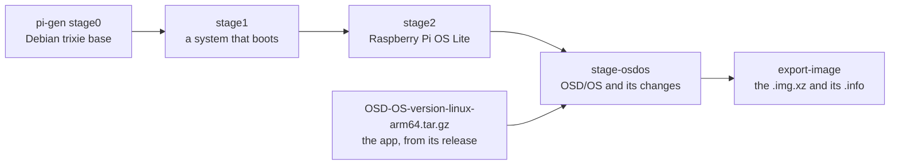
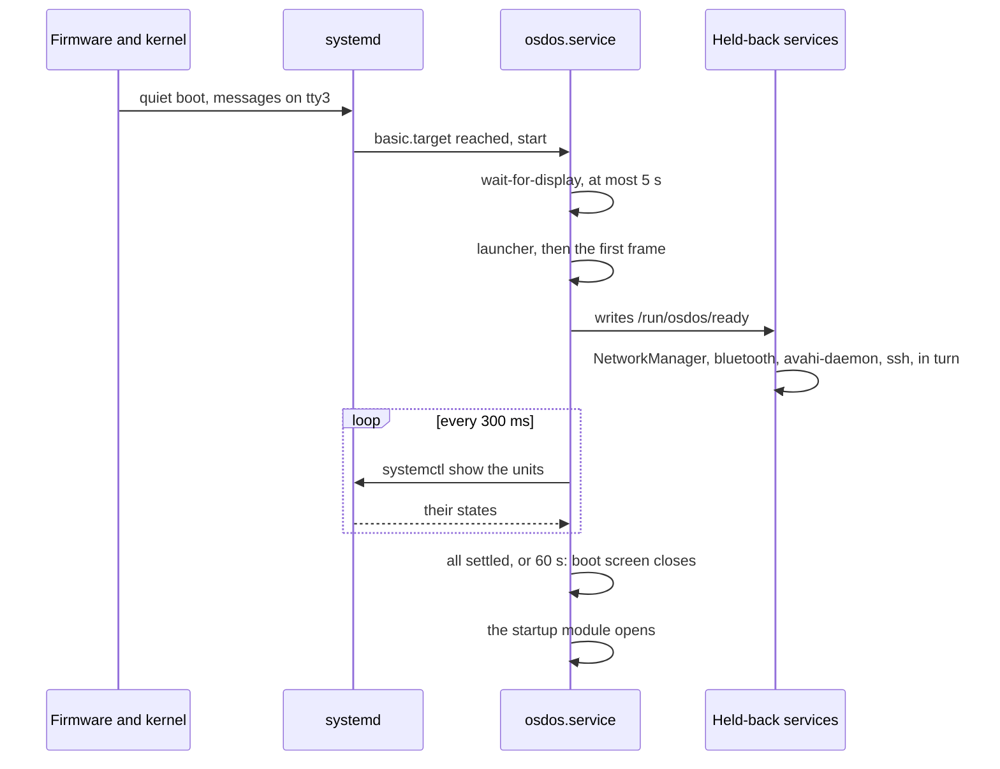
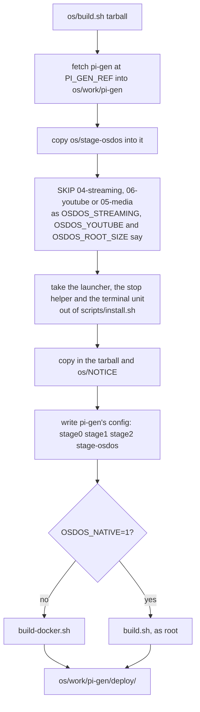

# The OSD/OS image

On a Raspberry Pi, OSD/OS can be the whole system: one image that you flash to an SD card and that starts straight into OSD/OS. This page covers what the image is made of, everything it changes in Raspberry Pi OS and why, how its boot works, the film partition, USB drives, the network, SSH, the user and its password, quitting and updating, where every file lives, and how to build the image yourself. The source of all of it is the [`os/`](https://github.com/mehmetraif/OSD-OS/tree/main/os) folder of the repository, and its [README](https://github.com/mehmetraif/OSD-OS/blob/main/os/README.md).

<table>
<tr><th width="50%">The boot screen</th><th width="50%">Settings, once it is up</th></tr>
<tr><td></td><td></td></tr>
<tr><td>From power on, the screen is OSD/OS's. The cassette winds its tape while the services start, <code>[ OK ]</code> once each is up.</td><td>The title bar shows the version and the Pi's network address, which is handy for SSH.</td></tr>
</table>

## An operating system, not an app

Installed as an app ([Installation](https://github.com/mehmetraif/OSD-OS/wiki/Installation)), OSD/OS runs on a system that is already set up: Raspberry Pi OS, SteamOS or macOS. That system boots its own way first, with its splash, its boot messages and its login prompt or desktop. The image is the system itself:

- **It boots into OSD/OS.** There is no rainbow splash, no boot text and no login prompt. The first thing on screen is OSD/OS's boot screen.
- **No desktop.** There is no display server (X11 or Wayland), no window manager and no file manager. OSD/OS draws straight to the screen through the kernel's display driver, and so does mpv ([Nothing between the app and the screen](https://github.com/mehmetraif/OSD-OS/wiki/The-OSD-OS-Image#nothing-between-the-app-and-the-screen)).
- **Every screen is OSD/OS's own**: the boot screen, the menus, the file browser, the on-screen keyboard, Settings, Bluetooth pairing, updates, and power off. It hands the screen over only to what plays: mpv for a video, Chromium (full screen, nothing around it) for Netflix, Prime Video and YouTube's sign-in, and a script of yours that asks for the screen.
- **Nothing runs that a TV box doesn't need.** Wi-Fi, Bluetooth, the local network and SSH wait until OSD/OS is on screen. The timers that wake the SD card at random times are gone.
- **Films go on the card**, on a partition of their own that Windows and macOS can open.
- **USB drives** show up in Local Files as they are plugged in, read-only.

### What it is built on

- **Raspberry Pi OS Lite (64-bit)**, the system without a desktop that Raspberry Pi makes for its boards. It is based on **Debian 13 "trixie"**, arm64. Its packages are Debian's, with Raspberry Pi's on top from Raspberry Pi's archive: the kernel, the firmware, a patched FFmpeg, Widevine and more.
- **pi-gen**, the tool Raspberry Pi builds Raspberry Pi OS with, at a pinned commit of its `arm64` branch (`PI_GEN_REF` in [`os/build.sh`](https://github.com/mehmetraif/OSD-OS/blob/main/os/build.sh), today `4d8ee447dd3d37e8b0ef8752e460d9082d9d435d`). Its stages 0 to 2 make Raspberry Pi OS Lite.
- **One stage of OSD/OS's own**, [`os/stage-osdos`](https://github.com/mehmetraif/OSD-OS/tree/main/os/stage-osdos), on top. It adds the app and changes the system as this page describes.
- The release name is **OSD/OS** (`PI_GEN_RELEASE`). pi-gen writes it to `/boot/firmware/issue.txt`.



The kernel, the firmware, the Wi-Fi and Bluetooth drivers and the patched FFmpeg that mpv's Pi 4 HEVC decoding relies on are exactly Raspberry Pi OS's.

### Compared with an app install

What changes against flashing Raspberry Pi OS Lite and running `scripts/install.sh` with its autostart service:

| | Raspberry Pi OS Lite + `install.sh` | The OSD/OS image |
|---|---|---|
| When OSD/OS starts | After `multi-user.target`, once every other service is up | After `basic.target`, as soon as the display driver is ready |
| First thing on screen | Boot messages, then a login prompt until OSD/OS starts | Black, then OSD/OS's boot screen |
| Wi-Fi, Bluetooth, mDNS, SSH | Start with the system, ahead of OSD/OS | Wait for OSD/OS's first frame, then start one after another |
| apt, man-db, e2scrub and dpkg-backup timers, cron | Running | Switched off |
| Raspberry Pi Connect agent | Installed | Removed |
| cloud-init | Runs at every boot | First boot only |
| Where films go | `~/.local/share/OSD-OS/media` | The card's own exFAT partition, `/media/OSD-OS` |
| USB drives | Not mounted by themselves | Mounted read-only under `/media/usb` as they come |
| Netflix, Prime Video, YouTube sign-in | Install Chromium, Widevine, cage and wtype yourself | Included |
| YouTube | Install yt-dlp and Deno yourself | Included; yt-dlp updates itself |
| Settings → Display Output | Not offered | Offered |
| Bluetooth adapter blocked by rfkill | Stays blocked | Unblocked as Bluetooth starts |

Everything else is the same as an app install: the launcher, the in-app updater, Exit to Terminal, and the data folder `~/.local/share/OSD-OS`. The launcher, the stop helper and the terminal unit are taken from `scripts/install.sh` when the image is built, so the two can't drift apart.

## Getting it onto a card

Download `OSD-OS-<version>-raspberry-pi.img.xz` from the [latest release](https://github.com/mehmetraif/OSD-OS/releases/latest) and flash it with Raspberry Pi Imager (**Use custom**). [Installation](https://github.com/mehmetraif/OSD-OS/wiki/Installation) has the steps, and [os/README.md → Flashing](https://github.com/mehmetraif/OSD-OS/blob/main/os/README.md#flashing) the details. Two things to know first:

- **Raspberry Pi Imager 2 offers no OS customisation** (Wi-Fi, a user, SSH, locale, keyboard) for an image chosen with **Use custom**: it can't tell which kind of customisation the image takes. To get it, open the image through a local manifest that gives it `"init_format": "cloudinit-rpi"` ([Imager's notes](https://github.com/raspberrypi/rpi-imager/tree/main/doc/local_json)). Imager 1 seems to apply it, but on trixie its settings never take effect.
- **Without customisation**, Ethernet needs nothing. For Wi-Fi, edit `network-config` on the card's boot partition before the first boot ([Wi-Fi](https://github.com/mehmetraif/OSD-OS/wiki/The-OSD-OS-Image#wi-fi)).

### The first boot

The first boot does a few things once and takes longer:

1. In the initramfs, the card is split: the system's partition grows to 8 GiB and the rest becomes the film partition, formatted exFAT ([Films on the card](https://github.com/mehmetraif/OSD-OS/wiki/The-OSD-OS-Image#films-on-the-card)).
2. The root file system grows to fill its partition (Raspberry Pi OS's `rpi-resize.service`).
3. cloud-init applies what Raspberry Pi Imager or `network-config` asked for: a user, Wi-Fi, SSH, the locale. Then `osdos-cloud-init-once.service` switches cloud-init off for good.
4. OSD/OS starts as on every boot, with the boot screen.

## The boot: OSD/OS first


A manual install starts OSD/OS last, once every service is up, after a black screen, boot messages and a login prompt. The image turns that around. OSD/OS starts as soon as systemd reaches `basic.target`. Wi-Fi, Bluetooth, the local network and SSH (when enabled) wait for its first frame, then start one after another. The boot screen shows them coming up.

### Step by step

1. **Firmware.** It loads the kernel with no splash (`disable_splash=1`) and no one-second pause (`boot_delay=0`).
2. **Kernel.** It boots quietly and logs to `tty3`, so `tty1`, the screen, stays black: `console=tty3 quiet loglevel=3 logo.nologo vt.global_cursor_default=0 consoleblank=0` in `cmdline.txt`.
3. **systemd reaches `basic.target`.** `osdos.service` starts. Its `wait-for-display` holds it, at most five seconds, until the KMS display driver has a connector: started this early, Qt's EGLFS would otherwise find none, fail, and only retry five seconds later.
4. **The launcher** (`/usr/local/bin/osdos`) applies a staged update if there is one, picks the DRM card and output, and starts the app.
5. **The first frame is on screen.** The app writes `/run/osdos/ready` (`OSDOS_READY_FILE`), holding its process id. A five-second timer writes it anyway, should the window never report a frame.
6. **The held-back services start**, one after another: NetworkManager (Wi-Fi), Bluetooth, avahi-daemon (the local network), and SSH if it was enabled when the image was built.
7. **The boot screen follows them**, then the check that the network is online (`NetworkManager-wait-online.service`, at most 20 seconds here instead of a minute).
8. **The boot screen closes** once every step has settled, or after a minute whatever happens. The startup module opens then, so a module that needs the network finds it ready.



### How the services are held back

Each held-back unit gets a drop-in, `/etc/systemd/system/<unit>.d/osdos-defer.conf`, that runs `/usr/lib/osdos/wait-for-app` before it starts and orders it after the unit before it. For `bluetooth.service`:

```ini
# OSD/OS image: start once the app is on screen, after the service before it.
[Unit]
After=NetworkManager.service

[Service]
ExecStartPre=+-/usr/lib/osdos/wait-for-app
```

[`wait-for-app`](https://github.com/mehmetraif/OSD-OS/blob/main/os/stage-osdos/02-system/files/wait-for-app) returns as soon as `/run/osdos/ready` exists, or after 20 seconds whatever happens, and at once when OSD/OS isn't starting this boot at all (not running and no start job queued). It never fails, so a service always comes up. It is a wait rather than an `After=osdos.service` ordering on purpose: the worst a wait can cost is its timeout, while an ordering cycle with an early-boot unit could stall the whole boot.

The units and their labels are listed in `/etc/osdos/boot-units`, in start order. On an image built without SSH:

```text
# Services OSD/OS's boot screen follows, as unit|LABEL, in start order.
# All but the last hold back until the app is on screen (see their
# osdos-defer.conf drop-ins); the last is the network-online check.
NetworkManager.service|WI-FI
bluetooth.service|BLUETOOTH
avahi-daemon.service|LOCAL NETWORK
NetworkManager-wait-online.service|ONLINE
```

An image built with `ENABLE_SSH=1` has `ssh.service|SSH` before the last line, and SSH waits too, after avahi-daemon.

### The boot screen

The boot screen ([`views/BootScreen.qml`](https://github.com/mehmetraif/OSD-OS/blob/main/views/BootScreen.qml), its state in [`src/boot/BootProgress`](https://github.com/mehmetraif/OSD-OS/blob/main/src/boot/BootProgress.cpp)) is a deck playing a tape: **PLAY ▶** in the corner, the OSD/OS cassette (`views/Components/VhsCassette.qml`) whose reels turn while the tape winds from one onto the other with the progress bar, then `LOADING...` (or `READY`) with a percentage, and a line per service. The one starting now is inverted, like a selected menu line.

| Mark | Means |
|---|---|
| `[    ]` | Waiting its turn |
| `[ .  ]`, `[ .. ]`, `[ ...]` | Starting |
| `[ OK ]` | Started |
| `[FAIL]` | Failed |
| `[ -- ]` | Skipped: not installed, masked, or its condition failed (`bluetooth.service` on a board without Bluetooth) |

- **The bar.** A step that has settled (started, failed or skipped) counts whole, one that is starting half. Once all have settled the screen stays at 100% for 1.2 seconds, so the last line can be read, then closes.
- **It never stays more than a minute**, whatever the services do.
- **Keys do nothing** while it is up, so none reaches the menu underneath. The one exception is Ctrl+Q on a keyboard, which quits OSD/OS, and on the image that powers the Pi off.
- **Only during the boot.** At start, `BootProgress` asks `systemctl is-system-running`. Unless systemd says `initializing` or `starting`, there is no boot screen, so OSD/OS started again later (after a crash, an update or Exit to Terminal) opens straight on its menu.
- **Only on the image.** Without `OSDOS_BOOT_UNITS_FILE`, which only the image's service sets, `BootProgress` does nothing at all.
- **Over it, after a display switch**, comes the question whether to keep the new display output ([Display Output](https://github.com/mehmetraif/OSD-OS/wiki/Display-Output#keep-or-go-back)).

### Changing what the boot screen shows

- **A label** is the text after the `|` in `/etc/osdos/boot-units`. Change it there (`sudo nano /etc/osdos/boot-units`); it shows from the next boot.
- **Another service** can be held back and shown too. Give it the same drop-in, after the last held-back unit, and add a line for it before `ONLINE` (16 lines at most). For a service of yours called `example.service`:

  ```sh
  sudo mkdir -p /etc/systemd/system/example.service.d
  sudo tee /etc/systemd/system/example.service.d/osdos-defer.conf > /dev/null << 'EOF'
  [Unit]
  After=avahi-daemon.service

  [Service]
  ExecStartPre=+-/usr/lib/osdos/wait-for-app
  EOF
  sudo sed -i 's/^NetworkManager-wait-online.service|ONLINE$/example.service|EXAMPLE\n&/' /etc/osdos/boot-units
  sudo systemctl daemon-reload
  ```

### Measuring the boot

The app logs when its first frame appeared and when each service settled, counted from its own start:

```sh
journalctl -b -u osdos | grep '\[boot\]'
systemd-analyze critical-chain osdos.service
systemd-analyze blame
```

The `[boot]` lines read `boot screen up, watching 4 unit(s)`, `first frame … ms after start`, `<unit> done at … ms` (or `failed`, `skipped`), and `boot screen closed at … ms (all services settled)`, `(timed out)` naming what was still starting.

## What runs, and what doesn't

| Unit | On the image |
|---|---|
| `osdos.service` | Enabled. OSD/OS itself, as the first user (`pi`) |
| `NetworkManager.service`, `bluetooth.service`, `avahi-daemon.service`, `ssh.service` (if built with `ENABLE_SSH=1`) | Held back until OSD/OS's first frame, then started in that order |
| `NetworkManager-wait-online.service` | Gives up after 20 seconds (`NM_ONLINE_TIMEOUT=20`) instead of a minute |
| `osdos-cloud-init-once.service` | After the first boot, writes `/etc/cloud/cloud-init.disabled`: cloud-init's stages would otherwise delay every boot. Delete that file to have cloud-init run again |
| `osdos-yt-dlp-update.timer` | Updates yt-dlp two minutes after each boot and once a day ([Updates](https://github.com/mehmetraif/OSD-OS/wiki/The-OSD-OS-Image#updates)) |
| `osdos-usb-mount@<device>.service` | One per USB drive plugged in ([USB drives](https://github.com/mehmetraif/OSD-OS/wiki/The-OSD-OS-Image#usb-drives)) |
| `osdos-terminal.service` | Not enabled. Started only by Exit to Terminal |
| `getty@tty1.service`, `autovt@.service` | Masked: `tty1` belongs to OSD/OS, and no login prompt appears on the console mpv switches to |
| `apt-daily.timer`, `apt-daily-upgrade.timer`, `man-db.timer`, `e2scrub_all.timer`, `dpkg-db-backup.timer`, `cron.service` | Disabled. They wake the CPU and the SD card at random times, mid-film included. Updating the system is the image's business, not a timer's |
| `rpi-connect-lite` | Purged: a remote-access agent has no place on a TV box |

### The service

`osdos.service`, as the image has it (`systemctl cat osdos` shows it, with its comments, and its drop-in):

```ini
[Unit]
Description=OSD/OS Media Player
After=sound.target
Wants=network-online.target

[Service]
Type=simple
User=pi
SupplementaryGroups=tty video input
AmbientCapabilities=CAP_SYS_TTY_CONFIG
Environment=QT_QPA_PLATFORM=eglfs
Environment=QT_QPA_EGLFS_ALWAYS_SET_MODE=1
Environment=QT_QPA_EGLFS_KMS_ATOMIC=1
Environment=QML2_IMPORT_PATH=/usr/lib/aarch64-linux-gnu/qt6/qml
Environment=OSDOS_AUTOSTART=1
Environment=OSDOS_BOOT_UNITS_FILE=/etc/osdos/boot-units
Environment=OSDOS_READY_FILE=/run/osdos/ready
RuntimeDirectory=osdos
ExecStartPre=+-/usr/bin/systemctl stop osdos-terminal.service
ExecStartPre=-/usr/lib/osdos/wait-for-display
ExecStart=/usr/local/bin/osdos
Restart=on-failure
RestartSec=5s
RestartPreventExitStatus=10 12 20 21 22 23 24 25 26 27 28 29
ExecStopPost=+/usr/local/bin/osdos-stop
StandardOutput=journal
StandardError=journal

[Install]
WantedBy=multi-user.target
```

- **After `sound.target`, not `multi-user.target`.** The default dependencies put it after `basic.target`. `Wants=network-online.target` pulls in the online check the boot screen ends on, without waiting for it.
- **`SupplementaryGroups` and `CAP_SYS_TTY_CONFIG`** let it switch virtual terminals and hand the screen to mpv. A udev rule (`/etc/udev/rules.d/99-osdos-tty.rules`) lets the `tty` group open `/dev/tty0` for that.
- **`OSDOS_AUTOSTART=1`** tells OSD/OS it runs as the system's own: Quit offers Power Off, Restart and Exit to Terminal, and Settings offers Display Output.
- **`RestartPreventExitStatus`** keeps systemd from starting OSD/OS again over Exit to Terminal (10), a restart (12) or a display switch (20 to 29). `osdos-stop` acts on them ([Quitting](https://github.com/mehmetraif/OSD-OS/wiki/The-OSD-OS-Image#quitting-restarting-and-exit-to-terminal)).
- **The drop-in** `/etc/systemd/system/osdos.service.d/osdos-media.conf` adds `Environment=OSDOS_MEDIA_DIR=/media/OSD-OS`: Local Files opens the film partition while its Media Directory setting is unset.

## Nothing between the app and the screen


On a desktop, OSD/OS and mpv are windows. They hand their frames to a compositor (labwc on Raspberry Pi OS), and the compositor holds the screen. A kiosk replaces the desktop with one full-screen window, but Xorg or cage still sits in between.

The image has no display server at all. OSD/OS draws through Qt's EGLFS platform straight to the kernel's KMS/DRM driver (vc4), as Kodi does on LibreELEC. Only one program draws at a time, the one holding the *DRM master*, so there are no windows to manage. `DisplayHandoff` gives the screen to whatever takes over and takes it back when that exits:

- mpv (`--vo=drm`) while a video plays;
- Chromium, in the `cage` kiosk compositor, for Netflix, Prime Video and YouTube's sign-in;
- a takeover script from the Scripts module.

With **Transparent Background**, mpv runs inside OSD/OS as libmpv instead. OSD/OS then keeps the screen the whole time, draws the video as part of its own picture, and lays its menus over it. [How it works → The display path](https://github.com/mehmetraif/OSD-OS/wiki/How-It-Works#the-display-path) has the mechanics, and [Display Output](https://github.com/mehmetraif/OSD-OS/wiki/Display-Output) how the output itself is chosen.

## Films on the card

The card's free space becomes a partition of its own, in exFAT, labelled **OSD-OS**. Windows and macOS read and write exFAT, so films copied onto it from a computer show up in Local Files.

### How the card is split

On the first boot, Raspberry Pi OS grows its system partition to the end of the card. The image replaces that step. Raspberry Pi OS does it in the initramfs, in a script called `resize_early` (from `raspberrypi-sys-mods`). A script of the same name in `/etc/initramfs-tools/scripts` overrides it, and the image puts [its own](https://github.com/mehmetraif/OSD-OS/blob/main/os/stage-osdos/05-media/files/resize_early) there:

1. It acts only on a freshly flashed card: when `resize` is on the kernel command line, which Raspberry Pi OS removes after the first boot.
2. It grows the system partition (the second) to `OSDOS_ROOT_SIZE` GiB, 8 by default, counted from where it starts. It never shrinks it.
3. It makes a third partition from the next 4 MiB boundary to the end of the card, of MBR type 0x07, where Windows looks for exFAT.
4. It formats it with `mkfs.exfat -L OSD-OS`. The image's initramfs carries `mkfs.exfat` for this (the hook `/etc/initramfs-tools/hooks/osdos-media`).
5. Should less than **2 GiB** be left after the system, there is no film partition: the system takes the whole card, as on stock Raspberry Pi OS. The same goes for an image built with `OSDOS_ROOT_SIZE=0`.

Nothing in it can stop the boot. A step that fails is logged, and the card is left as far as it got. A first boot cut short after the split finds the film partition there and leaves the card alone.

| Partition | Label | File system | Size | Mounted at |
|---|---|---|---|---|
| 1 | `bootfs` | FAT32 | 512 MiB | `/boot/firmware` |
| 2 | `rootfs` | ext4 | 8 GiB (`OSDOS_ROOT_SIZE`) | `/` |
| 3 | `OSD-OS` | exFAT | the rest of the card | `/media/OSD-OS` |

The boot partition starts 8 MiB into the card, so the first two take about 8.5 GiB. A card needs about 10.5 GiB (11.3 GB as cards are sold) for a film partition: an 8 GB card gets none, a 16 GB card about 6 GiB of films, a 32 GB card about 21 GiB. The partition table is MBR, so on a disk over 2 TiB the partitions stop at 2 TiB. On a USB disk the system boots from, the film partition is `sda3` instead of `mmcblk0p3`.

### How it is mounted

`/etc/fstab` has this line (`1000` is the first user's id):

```text
LABEL=OSD-OS  /media/OSD-OS  exfat  rw,noexec,nosuid,nodev,nofail,noatime,uid=1000,gid=1000,umask=0022,x-systemd.device-timeout=10s  0  2
```

| Option | Why |
|---|---|
| `rw` | Films are copied onto it from a computer, and the Playlists module downloads its offline playlists' videos into it |
| `noexec,nosuid,nodev` | It only ever holds media, and anyone with the card can write to it, so nothing on it can run |
| `uid=1000,gid=1000,umask=0022` | exFAT keeps no owners, so its files belong to the user OSD/OS runs as |
| `nofail`, `x-systemd.device-timeout=10s` | A card without the partition doesn't hold the boot more than 10 seconds |
| `noatime` | No write each time a film is read |
| `0  2` | Checked at every boot with `fsck.exfat` before it is mounted: switching the Pi off at the wall mid-download can leave it untidy |

The Playlists module writes each downloaded video to the card as it completes, into a **Playlists** folder there (its Download Folder setting can name another).

### Copying films onto it

1. Quit OSD/OS (Settings → Quit → Power Off) and take the card out.
2. In a computer's card reader the card shows up as two drives, **bootfs** and **OSD-OS**. Copy films onto **OSD-OS**, in folders if you like.
3. Windows also offers to format the system's partition, which it can't read. Always say no (**Cancel**): formatting it erases the system.
4. Put the card back in the Pi. Local Files opens **OSD-OS** (`/media/OSD-OS`) until its Media Directory setting names another folder ([Local Files](https://github.com/mehmetraif/OSD-OS/wiki/Local-Files)).

> **Flashing an image again erases the whole card**, the films on OSD-OS included: the new image's first boot formats the partition afresh. Copy the films off first ([Moving to a new image](https://github.com/mehmetraif/OSD-OS/wiki/The-OSD-OS-Image#moving-to-a-new-image)).

### A card flashed with an earlier image

Images from before offline playlists mount the film partition read-only (`ro` in `/etc/fstab`), and offline playlists' downloads fail, naming the folder as the reason. Flash a new image, or edit the film partition's line in `/etc/fstab` (`/media/240-MP`, as those images named it): change `ro` to `rw,noexec,nosuid,nodev`, and its last `0` to `2`.

## USB drives

A USB stick or disk plugged into the Pi is mounted by itself, read-only, under `/media/usb`, in a folder named after its label. Local Files lists it at the top of its tree as `USB: <label>`. Pulled out, its folder goes, and so does its row.

- **Read-only**, so a drive can be pulled out at any moment, mid-film included, with nothing on it half written. A file system with a journal is mounted without replaying it, which would write to the drive.
- **Its files belong to the user OSD/OS runs as**, as the film partition's do, and nothing on it can run (`noexec`).
- **Named after its label**, else its UUID, else its device. A slash becomes `_`; control characters, leading dots and spaces, and trailing spaces are taken out. Two drives with one label: the second is named after its device too (`KINGSTON (sdb1)`).
- **Never the system's own.** A partition already mounted (what `/etc/fstab` mounts, the card's OSD-OS partition) or on the disk the system boots from is left alone.
- **An app install doesn't do this**: Raspberry Pi OS Lite mounts nothing by itself. Local Files still lists a drive mounted under `/media` some other way.

| File system | Mounted as | Options besides `ro,nosuid,nodev,noexec` |
|---|---|---|
| FAT32 (`vfat`) | `vfat` | owner, `umask=0022`, `utf8` |
| exFAT | `exfat` | owner, `umask=0022` |
| NTFS | `ntfs3`, the kernel's driver; `ntfs-3g` where that fails | owner, `umask=0022` |
| HFS+ (a Mac's) | `hfsplus` | owner |
| ext3, ext4 | as is | `noload`: the journal isn't replayed |
| XFS | `xfs` | `norecovery` |
| btrfs | `btrfs` | `nologreplay` |
| ext2, F2FS, ISO 9660, UDF (a disc in a USB drive) | as is | none |
| Swap, RAID or LVM members, encrypted volumes | not mounted | |

"Owner" is `uid` and `gid` of the user OSD/OS runs as.

### How it works

A udev rule, `/etc/udev/rules.d/99-osdos-usb-mount.rules`, starts a service for each file system that appears on a USB drive:

```text
ACTION=="add", SUBSYSTEM=="block", ENV{ID_BUS}=="usb", ENV{ID_FS_USAGE}=="filesystem", TAG+="systemd", ENV{SYSTEMD_WANTS}+="osdos-usb-mount@%k.service"
```

`osdos-usb-mount@<device>.service` is bound to the device (`BindsTo=dev-%i.device`): it runs `/usr/lib/osdos/usb-mount add <device>` as the drive comes and `usb-mount remove <device>` as it goes. The script notes each mount point in `/run/osdos-usb/<device>`, and unmounts lazily (`umount -l`), since a player may still hold a file open on a drive pulled out. Each mount, and why a drive couldn't be mounted, is in the journal:

```sh
journalctl -u 'osdos-usb-mount@*'
```

```text
usb-mount: /dev/sda1 (vfat) mounted read-only at /media/usb/KINGSTON
```

## Network, Wi-Fi and Bluetooth

There is no Wi-Fi setting in OSD/OS. The network is NetworkManager's, as on Raspberry Pi OS: set it up with Raspberry Pi Imager's customisation, with `network-config` before the first boot, or from a shell.

### Wi-Fi

Raspberry Pi OS starts every radio blocked (`rfkill.default_state=0`) so that Wi-Fi stays off until its country is set. Raspberry Pi Imager's customisation sets it with the network, an image built with `WPA_COUNTRY` has it from the start, and in `network-config` it is `regulatory-domain`.

**Before the first boot**, with the card in a computer, open `network-config` on the **bootfs** drive. It is cloud-init's file, in netplan's format, and holds commented examples. cloud-init applies it on the first boot only. For one Wi-Fi network, the file can read:

```yaml
network:
  version: 2
  wifis:
    wlan0:
      dhcp4: true
      optional: true
      access-points:
        "MyHomeWiFi":
          password: "my-wifi-password"
      regulatory-domain: GB
```

Use spaces, never tabs, to indent. `GB` is a two-letter country code: yours.

**After the first boot**, `network-config` is no longer read. From a shell (Exit to Terminal, or SSH over Ethernet), `sudo raspi-config` sets Wi-Fi under System Options, or NetworkManager's own tool does:

```sh
sudo nmcli device wifi connect "MyHomeWiFi" password "my-wifi-password"
```

Both need `sudo`, so an image built with a password ([The user, its password and sudo](https://github.com/mehmetraif/OSD-OS/wiki/The-OSD-OS-Image#the-user-its-password-and-sudo)).

### The local network

The hostname is `osdos` (`TARGET_HOSTNAME`), unless Raspberry Pi Imager set another. avahi-daemon publishes it on the local network as `osdos.local`. Settings shows the Pi's IPv4 address in its title bar, Ethernet's before Wi-Fi's, read again every five seconds.

### Bluetooth

Settings → Bluetooth searches for, pairs and connects keyboards, gamepads and remotes through BlueZ ([Controls](https://github.com/mehmetraif/OSD-OS/wiki/Controls)). The image prepares two things for it:

- **The user OSD/OS runs as is in the `bluetooth` group**, which BlueZ's D-Bus policy lets in.
- **Bluetooth is unblocked as bluetoothd starts.** After blocking every radio, Raspberry Pi OS unblocks Bluetooth only on the adapters pi-gen knows by device path. The Pi 4 this was found on wasn't one of them: its adapter stayed blocked, and BlueZ couldn't turn it on (`Failed to set mode: Failed (0x03)`). The drop-in `/etc/systemd/system/bluetooth.service.d/osdos-unblock.conf` unblocks it, and systemd-rfkill keeps it so from one boot to the next:

  ```ini
  # OSD/OS image: Bluetooth is switched in the app, through BlueZ; rfkill never blocks it.
  [Service]
  ExecStartPre=+-/usr/sbin/rfkill unblock bluetooth
  ```

Bluetooth starts after OSD/OS is on screen. Settings → Bluetooth calls BlueZ only once it is on the bus, so it doesn't start it early.

## SSH

SSH is off on the image as it comes (`ENABLE_SSH=0`). Two ways to have it:

- **Raspberry Pi Imager's customisation** enables it, with the user it creates (Imager 2 needs the local manifest, see [Getting it onto a card](https://github.com/mehmetraif/OSD-OS/wiki/The-OSD-OS-Image#getting-it-onto-a-card)).
- **Build the image with `ENABLE_SSH=1`.** SSH is then held back like the other services, after the local network, and has its own line on the boot screen. Built with `PUBKEY_SSH_FIRST_USER` too, a public key goes into `/home/pi/.ssh/authorized_keys`, and `PUBKEY_ONLY_SSH=1` turns password logins off.

Then, from a computer on the same network:

```sh
ssh pi@osdos.local
```

or the address in Settings' title bar in place of `osdos.local`. The user, and whether it has a password, are set when the image is built (below).

## The user, its password and sudo

The image's first user is `pi` (`FIRST_USER_NAME`), and OSD/OS runs as that user, whatever user Raspberry Pi Imager creates beside it. Its data folder is therefore `/home/pi/.local/share/OSD-OS`. pi-gen's first-boot rename wizard is off (`DISABLE_FIRST_BOOT_USER_RENAME=1`): the service needs the name it was built with, and the wizard would fight OSD/OS for `tty1`.

The user is in pi-gen's groups (`adm dialout cdrom audio users sudo video games plugdev input gpio spi i2c netdev render`), and the image adds `bluetooth`. `adm` lets it read the system journal without `sudo`.

| Built | Logging in as `pi` | Exit to Terminal | `sudo` |
|---|---|---|---|
| With `FIRST_USER_PASS` (in CI, the secret `OS_FIRST_USER_PASS`) | With that password, on the console and over SSH | A login prompt | Asks for that password |
| Without one (the account is locked) | Not with a password; SSH with a key (`PUBKEY_SSH_FIRST_USER`) | Logs `pi` in by itself | Unusable: there is no password to give |

Without a password, `os/build.sh` hands pi-gen a random one and the stage locks it (`passwd -l pi`). Exit to Terminal would otherwise end at a login nobody can pass, so the terminal logs `pi` in by itself (`/etc/systemd/system/osdos-terminal.service.d/osdos-autologin.conf`). Whoever is at the keyboard could take the card out anyway. That shell has no root, though. For `sudo`, build the image with a password, or log in as the user Raspberry Pi Imager's customisation creates.

## Quitting, restarting and Exit to Terminal

<table>
<tr><th width="50%">Quit</th><th width="50%">Update</th></tr>
<tr><td></td><td></td></tr>
<tr><td>Settings → Quit, run by hand: Yes or No. Started with the system, as on the image, it offers Power Off, Restart, Exit to Terminal and Cancel instead.</td><td>Settings → Update checks for a newer release and installs it.</td></tr>
</table>

Settings → **Quit** on the image asks **Really quit?** with:

| Choice | Offered | OSD/OS exits with | Then |
|---|---|---|---|
| **Power Off** | Always | 0 | The Pi powers off |
| **Restart** | Launcher API 2 or later (the image's is 3) | 12 | The Pi reboots |
| **Exit to Terminal** | Always | 10 | A login shell on the screen (`tty1`); the Pi stays on |
| **Cancel** | Always | | Back to Settings |

Ctrl+Q on a keyboard quits at once, anywhere, as Power Off does.

### osdos-stop

The service's `ExecStopPost=+/usr/local/bin/osdos-stop` runs as root each time OSD/OS ends, with its exit code (or the signal that ended it) in `EXIT_STATUS`. That is how an app run as `pi` powers off, reboots and writes to the boot partition without `sudo`:

```bash
case "${EXIT_STATUS:-}" in
    10) systemctl start osdos-terminal.service ;;
    11) : ;;  # in-app update restart — Restart=on-failure brings the app back up
    12) systemctl reboot ;;  # the quit menu's Restart
    2[0-9]) display_output "${DISPLAY_PRESETS[EXIT_STATUS - 20]}"; systemctl reboot ;;
    129|130|143|HUP|INT|TERM|KILL) : ;;  # stopped from outside, not by the user
    *)  systemctl poweroff ;;
esac
```

| Exit | From | Effect |
|---|---|---|
| 0 | Quit → Power Off, Ctrl+Q | Power off |
| 10 | Quit → Exit to Terminal | `osdos-terminal.service` starts |
| 11 | Update → Apply & Restart | Nothing: systemd starts OSD/OS again (`Restart=on-failure`) and the launcher applies the update first |
| 12 | Quit → Restart | Reboot |
| 20 to 28 | Settings → Display Output | That output's preset written, then a reboot ([Display Output](https://github.com/mehmetraif/OSD-OS/wiki/Display-Output#what-the-switch-writes)) |
| 29 | A new display output not kept | The previous preset written back, then a reboot |
| 129, 130, 143, or killed by a signal | `systemctl stop`, `systemctl restart`, a shutdown | Nothing: the Pi stays on |
| anything else, a crash included | | Power off |

OSD/OS catches SIGTERM, SIGINT and SIGHUP and exits with 128 plus the signal's number (143, 130, 129), so `sudo systemctl stop osdos` and `sudo systemctl restart osdos` leave the Pi on.

### The launcher API

The launcher exports `OSDOS_LAUNCHER_API`, and OSD/OS offers only what the launcher and its stop helper can do:

| `OSDOS_LAUNCHER_API` | What it adds |
|---|---|
| set at all | The launcher applies staged updates: Settings → Update can install them |
| 2 or more | `osdos-stop` reboots on exit 12: Quit offers Restart |
| 3 or more | `osdos-stop` writes a display preset on exits 20 to 29, and the launcher takes the output a preset names: Settings offers Display Output |

The image's launcher is level 3, as `install.sh`'s is.

### Exit to Terminal

Exit to Terminal starts `osdos-terminal.service` on `tty1`:

```ini
[Unit]
Description=OSD/OS exit-to-terminal login shell

[Service]
Type=idle
ExecStart=-/sbin/agetty --noclear tty1 linux
StandardInput=tty
StandardOutput=tty
TTYPath=/dev/tty1
TTYReset=yes
TTYVHangup=yes
KillMode=process
Restart=no
```

On an image built without a password, its drop-in replaces the `ExecStart` with `agetty --autologin pi --noclear tty1 linux`. To come back to OSD/OS from that shell:

- `sudo systemctl start osdos`: the service again, which first stops the terminal (needs the password);
- `sudo reboot`: the Pi starts from scratch, into OSD/OS (needs the password);
- `osdos`: the app run by hand in this shell, unmanaged; its Quit is then Yes or No, and Yes returns to the shell;
- or switch the Pi off and on again.

## Updates

### OSD/OS itself

Settings → **Update** checks GitHub for the latest release ([Installation](https://github.com/mehmetraif/OSD-OS/wiki/Installation)). On an image made by a release:

1. **CHECK** reads the latest release and its notes. **DOWNLOAD** fetches its `OSD-OS-<version>-linux-arm64.tar.gz` into `~/.local/share/OSD-OS/updates`, checks it against the release's `SHA256SUMS`, and needs three times its size free.
2. **INSTALL** offers **Apply & Restart** and **Discard Update**. Apply & Restart arms the update (`staged.sha256`) and exits with 11.
3. systemd starts OSD/OS again, and the launcher, before it starts the app, checks the tarball's SHA-256, unpacks it into `/opt/osdos/.new` and swaps its folders in. A half-done swap is put right at the next start, and a tarball that won't unpack is set aside rather than tried at every boot. Settings stay as they were.

This works because `/opt/osdos` belongs to `pi`, the launcher's API is set, and the app is `/opt/osdos/bin/osdos`.

An image built by the **OS image** workflow (or locally from a branch) has an app built as `dev`. Its Update screen checks, to read the notes, but says **Dev build — self-update is disabled.** That way a branch's image can't replace itself with a release that doesn't have the branch's changes.

### yt-dlp

YouTube changes often, and a yt-dlp a few weeks old soon stops finding its videos. The image carries yt-dlp's latest nightly build in `~/.local/share/OSD-OS/bin/yt-dlp`, where OSD/OS looks first, and `osdos-yt-dlp-update.timer` replaces it with the newest build two minutes after each boot and once a day:

```ini
[Service]
Type=oneshot
User=pi
ExecCondition=/usr/bin/nm-online -q -t 300
ExecStart=/home/pi/.local/share/OSD-OS/bin/yt-dlp --update
Nice=19
IOSchedulingClass=idle
```

A check is one small request to GitHub, an update one write of about 3 MB, at the lowest priority so a film playing isn't disturbed. Without a connection within five minutes the run is skipped, not failed: a player that only plays its own films may never be online. `journalctl -u osdos-yt-dlp-update` shows each run.

### The system's packages

Nothing updates the system's packages by itself: the apt timers are off. A newer image brings newer packages. To update by hand, from a shell, with `sudo`:

```sh
sudo apt update && sudo apt full-upgrade
```

### Moving to a new image

Flashing a new image replaces everything on the card: the system, OSD/OS's data folder (settings, lists, sign-ins) and the film partition. Before you flash, copy what you want to keep onto the film partition from a shell, then off the card with a computer:

```sh
cp ~/.local/share/OSD-OS/config.json ~/.local/share/OSD-OS/lists.json /media/OSD-OS/
```

After the new image's first boot, put the films back on OSD-OS from the computer, and the two files back into the data folder from Exit to Terminal (OSD/OS isn't running then):

```sh
cp /media/OSD-OS/config.json /media/OSD-OS/lists.json ~/.local/share/OSD-OS/
```

Then start OSD/OS again ([Exit to Terminal](https://github.com/mehmetraif/OSD-OS/wiki/The-OSD-OS-Image#exit-to-terminal)). [Configuration files](https://github.com/mehmetraif/OSD-OS/wiki/Configuration-Files) lists the other files in the data folder.

## Where things live

| Path | What |
|---|---|
| `/opt/osdos/bin/osdos` | The app |
| `/opt/osdos/share/osdos/` | Its QML, modules, assets, mpv scripts and `LICENSE` (the app's `APP_ROOT`) |
| `/usr/local/bin/osdos` | The launcher: applies a staged update, picks the display, starts the app |
| `/usr/local/bin/osdos-stop` | The stop helper, run as root when the app ends |
| `/etc/systemd/system/osdos.service` | The service; its drop-in `osdos.service.d/osdos-media.conf` |
| `/etc/systemd/system/osdos-terminal.service` | Exit to Terminal's login shell |
| `/etc/systemd/system/osdos-cloud-init-once.service` | Turns cloud-init off after the first boot |
| `/etc/systemd/system/<unit>.d/osdos-defer.conf` | The held-back services' drop-ins |
| `/etc/osdos/boot-units` | What the boot screen follows |
| `/usr/lib/osdos/wait-for-app`, `wait-for-display`, `usb-mount` | The image's helpers |
| `/etc/udev/rules.d/99-osdos-tty.rules`, `99-osdos-usb-mount.rules` | The `/dev/tty0` and USB drive rules |
| `/run/osdos/ready` | Written at OSD/OS's first frame |
| `/home/pi/.local/share/OSD-OS/` | The data folder: `config.json`, `lists.json`, sign-ins, `bin/yt-dlp`, `updates/` ([Configuration files](https://github.com/mehmetraif/OSD-OS/wiki/Configuration-Files)) |
| `/media/OSD-OS` | The film partition |
| `/media/usb/<label>` | USB drives, read-only |
| `/boot/firmware/config.txt` | The firmware's settings, including `osdos-display.txt` |
| `/boot/firmware/osdos-display.txt`, `osdos-display-*.txt` | The display output in force, and the presets ([Display Output](https://github.com/mehmetraif/OSD-OS/wiki/Display-Output)) |
| `/boot/firmware/cmdline.txt` | The kernel's command line |
| `/boot/firmware/network-config`, `user-data`, `meta-data` | cloud-init's first-boot files |
| `/etc/initramfs-tools/scripts/local-premount/resize_early` | The first boot's card split |
| `/usr/local/bin/deno` | The JavaScript runtime yt-dlp needs for YouTube |
| `/usr/share/doc/osdos/NOTICE` | What the image is made of, and under which licences |
| `/tmp/osdos-mpv.log` | mpv's own log ([Logs](https://github.com/mehmetraif/OSD-OS/wiki/The-OSD-OS-Image#logs)) |

## Logs

OSD/OS writes its log to the journal. The first user is in the `adm` group, so it reads it without `sudo`:

```sh
journalctl -u osdos -b                    # this boot
journalctl -u osdos -f                    # as it happens
journalctl -u osdos -b | grep '\[boot\]'   # the boot screen's timings
journalctl -u 'osdos-usb-mount@*'         # USB drives
journalctl -u osdos-yt-dlp-update         # yt-dlp's updates
```

mpv's messages reach the journal too, as `[mpv]` lines, with every token blanked out. mpv also writes its own, more detailed log to `/tmp/osdos-mpv.log`, a header for each video; it is readable only by `pi`, as it can hold a server's token. [Troubleshooting](https://github.com/mehmetraif/OSD-OS/wiki/Troubleshooting) has more, and [How it works → Logs](https://github.com/mehmetraif/OSD-OS/wiki/How-It-Works#logs) the tags each part of OSD/OS logs under.

## What it is made of: NOTICE and licences

[`os/NOTICE`](https://github.com/mehmetraif/OSD-OS/blob/main/os/NOTICE), which the image carries as `/usr/share/doc/osdos/NOTICE`, lists what the image is made of and under which licences:

1. **OSD/OS**, under the GNU GPL version 3, with its licence at `/opt/osdos/share/osdos/LICENSE` and in Settings → About → License. Its source is the commit Settings → About → Build names.
2. **Raspberry Pi OS's and Debian's packages**, unmodified, each with its own licence in `/usr/share/doc/<package>/copyright`. The image's `.info` file, published with it, lists them with their versions. Their source is in the Debian and Raspberry Pi archives, and OSD/OS offers the source of the GPL and LGPL software on an image for three years after it is published.
3. **What the stage adds**: yt-dlp (public domain, The Unlicense), Deno (MIT; its licence in `/usr/local/share/doc/deno/LICENSE.md`), and Widevine, Google's proprietary module, from Raspberry Pi's archive as Raspberry Pi OS installs it. An image built with `OSDOS_YOUTUBE=0` has neither yt-dlp nor Deno; one built with `OSDOS_STREAMING=0` has no Chromium or Widevine.
4. **The data the modules show**: TMDB (with the notice its terms ask for), Open-Meteo (CC BY 4.0) and Wikidata (CC0).
5. **pi-gen's licence**, since its configuration stays on the image.
6. **The Raspberry Pi firmware's licence**, which asks to be reproduced with it.
7. **Trademarks**: Raspberry Pi is a trademark of Raspberry Pi Ltd, Debian a registered trademark of Software in the Public Interest, Inc., and the services' names their owners'. OSD/OS is endorsed by none of them.

[Credits](https://github.com/mehmetraif/OSD-OS/wiki/Credits) has who made OSD/OS and what it stands on.

## Building the image yourself

The image is built by pi-gen from the app's arm64 tarball: `OSD-OS-<version>-linux-arm64.tar.gz`, as a release has it, or one you build. `os/build.sh` does the rest.

### On GitHub

1. Fork the repository and enable Actions on the fork.
2. Optionally, add the repository secret `OS_FIRST_USER_PASS` (Settings → Secrets and variables → Actions): it becomes `pi`'s password. Without it the account is locked.
3. Run the **OS image** workflow ([`os-image.yml`](https://github.com/mehmetraif/OSD-OS/blob/main/.github/workflows/os-image.yml)) from the Actions tab, on the branch you want.
4. The image is the run's `osdos-image` artifact: the `.img.xz` and its `.info`, kept for 30 days. A failed run uploads pi-gen's logs as `pi-gen-logs`.

The workflow also runs on every pull request that touches `os/`, `src/boot/`, `views/BootScreen.qml`, `views/Components/VhsCassette.qml`, `scripts/install.sh` or the workflow itself. It has two jobs, both on GitHub's arm64 runner (`ubuntu-24.04-arm`), so pi-gen needs no emulation:

- **app** builds OSD/OS from the branch with `APP_VERSION` left at `dev` and packs it as `OSD-OS-dev-linux-arm64.tar.gz`;
- **image** frees disk space, then runs `os/build.sh` on that tarball, with up to three hours to do it.

**With a release**: pushing a version tag ([Building from source](https://github.com/mehmetraif/OSD-OS/wiki/Building-from-Source)) runs the release workflow, whose `build-os-image` job builds the image from that release's own tarball, names it `OSD-OS-<tag>-raspberry-pi.img.xz` with its `.info`, and attaches both to the release. Its app is the release's and updates itself from later releases.

### Locally

You need Docker, on an arm64 Linux host. An x86 host works too, through QEMU emulation, but takes hours. First the tarball, built on an arm64 Debian or Ubuntu machine with the dependencies in [Building from source](https://github.com/mehmetraif/OSD-OS/wiki/Building-from-Source), the way the workflow does it:

```sh
cmake -B build -DCMAKE_BUILD_TYPE=Release -DCMAKE_INSTALL_PREFIX="$PWD/install/usr/local"
cmake --build build --parallel
cmake --install build
tar -czf OSD-OS-dev-linux-arm64.tar.gz -C install .
```

Or download a release's tarball, whose app updates itself:

```sh
curl -fLO https://github.com/mehmetraif/OSD-OS/releases/download/<tag>/OSD-OS-<tag>-linux-arm64.tar.gz
```

Then the image:

```sh
FIRST_USER_PASS='choose-a-password' os/build.sh OSD-OS-dev-linux-arm64.tar.gz
```

The image lands in `os/work/pi-gen/deploy/`, named by pi-gen after the date and `IMG_NAME` (`image_<date>-osdos.img.xz`, and `<date>-osdos.info`).

### Its settings

All of them come through the environment:

| Variable | Default | What it does |
|---|---|---|
| `FIRST_USER_PASS` | none | The first user's password. Without one the account is locked ([The user](https://github.com/mehmetraif/OSD-OS/wiki/The-OSD-OS-Image#the-user-its-password-and-sudo)) |
| `FIRST_USER_NAME` | `pi` | The first user, as which OSD/OS runs |
| `OSDOS_DISPLAY` | `hdmi` | The display preset the image starts on, by its name: `hdmi`, `crt-ntsc`, `crt-pal`, `crt-gpio-ntsc`, `crt-gpio-pal`, `scart-rgb-ntsc`, `scart-rgb-pal`, `scart-rgb-240p`, `scart-rgb-288p` ([Display Output](https://github.com/mehmetraif/OSD-OS/wiki/Display-Output)) |
| `OSDOS_STREAMING` | `1` | `0` leaves out the browser Netflix, Prime Video and YouTube's sign-in open (Chromium, Widevine, cage, wtype), about 400 MB |
| `OSDOS_YOUTUBE` | `1` | `0` leaves out yt-dlp, Deno and ffmpeg, about 90 MB; the YouTube module then says yt-dlp is missing |
| `OSDOS_ROOT_SIZE` | `8` | GiB the system keeps of the card; the rest becomes the film partition. A whole number. `0`: no film partition, the system takes the whole card |
| `ENABLE_SSH` | `0` | `1` enables SSH, held back after the local network |
| `TARGET_HOSTNAME` | `osdos` | The hostname |
| `IMG_NAME` | `osdos` | Part of the image's file name |
| `DEPLOY_COMPRESSION` | `xz` | pi-gen's compression for the image |
| `WPA_COUNTRY` | unset | The Wi-Fi country, set at build time |
| `LOCALE_DEFAULT` | pi-gen's, `en_GB.UTF-8` | The locale |
| `KEYBOARD_KEYMAP`, `KEYBOARD_LAYOUT` | pi-gen's, `gb` and `English (UK)` | The console keyboard, Exit to Terminal's included |
| `TIMEZONE_DEFAULT` | pi-gen's, `Europe/London` | The time zone |
| `PUBKEY_SSH_FIRST_USER` | unset | A public key for the first user's SSH logins |
| `PUBKEY_ONLY_SSH` | pi-gen's, `0` | `1` turns SSH's password logins off |
| `OSDOS_NATIVE` | `0` | `1` runs pi-gen's `build.sh` directly, as root on a Debian host, instead of in Docker |
| `OSDOS_PREPARE_ONLY` | `0` | `1` sets up the pi-gen tree and its config, then stops |
| `PI_GEN_REF` | the pinned commit | The pi-gen commit to build from |
| `PI_GEN_REPO` | `https://github.com/RPi-Distro/pi-gen` | Where pi-gen is fetched from |
| `WORK` | `os/work` | The scratch folder |
| `OSDOS_TARBALL` | none | The tarball, when it isn't given as the argument |

For example, a US keyboard, a PAL composite start, SSH and a bigger system partition:

```sh
FIRST_USER_PASS='choose-a-password' ENABLE_SSH=1 OSDOS_DISPLAY=crt-pal OSDOS_ROOT_SIZE=16 \
  WPA_COUNTRY=US KEYBOARD_KEYMAP=us KEYBOARD_LAYOUT='English (US)' \
  os/build.sh OSD-OS-dev-linux-arm64.tar.gz
```

### What build.sh does



- pi-gen's stage 2 (Lite) is built but exports no image (`stage2/SKIP_IMAGES`); only `stage-osdos` does (its `EXPORT_IMAGE`).
- `build.sh` makes the stage's scripts executable itself, since pi-gen silently skips a script that isn't, and a ZIP download or a Windows clone loses the bits.
- Without `FIRST_USER_PASS` it prints `note: no FIRST_USER_PASS; the first user's password will be locked.`

### The stage, part by part

| Part | What it does | Left out by |
|---|---|---|
| [`00-packages`](https://github.com/mehmetraif/OSD-OS/tree/main/os/stage-osdos/00-packages) | What `install.sh` installs, without recommends and without `qt6-wayland`: Qt 6, SDL2, pcsclite, mpv and libmpv2, alsa-utils, and FluidSynth, the TimGM6mb SoundFont and openmpt123 for the menu music | |
| [`01-app`](https://github.com/mehmetraif/OSD-OS/tree/main/os/stage-osdos/01-app) | The tarball unpacked into `/opt/osdos`, owned by `pi`; the launcher; the NOTICE | |
| [`02-system`](https://github.com/mehmetraif/OSD-OS/tree/main/os/stage-osdos/02-system) | The service, the terminal, the stop helper, the cloud-init switch, the tty rule, the boot order, the online check's 20 seconds, the Bluetooth unblock, the autologin of a locked user; the `bluetooth` group, the masked getty, the removed timers, cron and Raspberry Pi Connect | |
| [`03-boot`](https://github.com/mehmetraif/OSD-OS/tree/main/os/stage-osdos/03-boot) | `config.txt`, the display presets and `osdos-display.txt` (from `OSDOS_DISPLAY`), the quiet `cmdline.txt` | |
| [`04-streaming`](https://github.com/mehmetraif/OSD-OS/tree/main/os/stage-osdos/04-streaming) | `chromium`, `rpi-chromium-mods`, `libwidevinecdm0`, `libgl1-mesa-dri`, `fonts-liberation`, `cage`, `wtype` | `OSDOS_STREAMING=0` |
| [`05-media`](https://github.com/mehmetraif/OSD-OS/tree/main/os/stage-osdos/05-media) | `exfatprogs`, the `resize_early` override and its initramfs hook, `/media/OSD-OS`, its `fstab` line and `OSDOS_MEDIA_DIR` | `OSDOS_ROOT_SIZE=0` |
| [`06-youtube`](https://github.com/mehmetraif/OSD-OS/tree/main/os/stage-osdos/06-youtube) | Python with pycryptodome, requests and brotli; ffmpeg; yt-dlp's nightly build, checked against its SHA-256 sums; Deno, pinned (today `v2.9.7`) with its checksum and licence; the update timer | `OSDOS_YOUTUBE=0` |
| [`07-usb`](https://github.com/mehmetraif/OSD-OS/tree/main/os/stage-osdos/07-usb) | `ntfs-3g`, the USB rule, unit and script, `/media/usb` | |

A file named `00-packages-nr` is pi-gen's list of packages to install without their recommends. To put another package on the image, add its name to [`os/stage-osdos/00-packages/00-packages-nr`](https://github.com/mehmetraif/OSD-OS/blob/main/os/stage-osdos/00-packages/00-packages-nr), for example a line with `mc` for Midnight Commander.

## See also

- [Installation](https://github.com/mehmetraif/OSD-OS/wiki/Installation): flashing the image, or installing OSD/OS as an app
- [Display Output](https://github.com/mehmetraif/OSD-OS/wiki/Display-Output): HDMI, composite and SCART RGB, and their cables
- [Audio Output](https://github.com/mehmetraif/OSD-OS/wiki/Audio-Output): the AV jack, HDMI or a USB sound card
- [How it works](https://github.com/mehmetraif/OSD-OS/wiki/How-It-Works): the app inside, the display path and playback
- [Local Files](https://github.com/mehmetraif/OSD-OS/wiki/Local-Files): the films on the card and on USB drives
- [Configuration files](https://github.com/mehmetraif/OSD-OS/wiki/Configuration-Files): the data folder
- [Troubleshooting](https://github.com/mehmetraif/OSD-OS/wiki/Troubleshooting)
- [Building from source](https://github.com/mehmetraif/OSD-OS/wiki/Building-from-Source)
