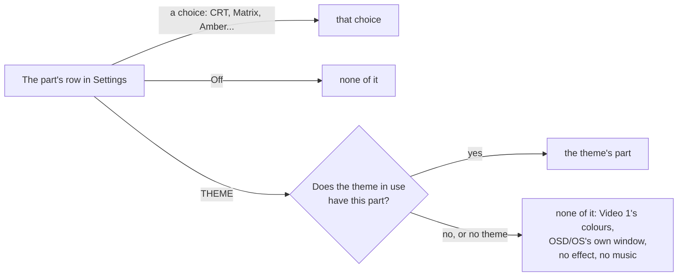

# Themes

A theme is the whole look of OSD/OS in one folder: the two colours everything is drawn in, the [skin](https://github.com/mehmetraif/OSD-OS/wiki/Skins) that dresses the window, the [effects](https://github.com/mehmetraif/OSD-OS/wiki/Effects) (on the text, behind the menus, round the selected line, over the screen and between windows) and the [menu music](https://github.com/mehmetraif/OSD-OS/wiki/Menu-Music). Settings → **Theme** picks one, and each of its parts can then be changed or turned off on a row of its own. This page covers the eight themes that come with OSD/OS and the file each is made of, how a theme and Settings' rows work together, every key of `theme.json`, making a theme of your own step by step, three complete example themes, and what the log says when part of a theme can't be used.

## The eight themes

| Theme | Colors | Skin | Effects | Transition | Music |
|---|---|---|---|---|---|
| **Trinitron** | Video 1 | Rounded | Screen: CRT | Cube | a calm arpeggio |
| **Late Show** | Late Night | DOS | Screen: VHS · Text: Flicker | Fade | a slow, swung tune with a record's crackle |
| **Green Screen** | phosphor green, its own | DOS | Screen: a glowing tube of its own · Text: Glow | Wave | none |
| **Matrix** | green on black, its own | DOS | Background: Matrix · Text: Glow · Selector: Lightning | Ripple | a dark, pulsing tune with bells |
| **Inferno** | amber on brown, its own | Rounded | Background: Fire · Selector: Welding | Cube | a fast, driving tune |
| **Arcade** | Synthwave | Rounded | Background: Stars · Text: Rainbow · Selector: Rainbow | Cube | a bouncy chiptune |
| **Winter** | ice on night blue, its own | Rounded | Background: Snow · Text: Shimmer · Selector: Sparkles | Drop | a music box |
| **Demoscene** | gold on purple, its own | DOS | Background: Stars · Text: Glow · Selector: Sparkles | Cube | a tracker's XM |

<table>
<tr><th width="50%">Trinitron</th><th width="50%">Late Show</th></tr>
<tr><td></td><td></td></tr>
<tr><td>Video 1 in Rounded windows on a tube's curved face: scanlines, glow and darker corners. Windows turn over like a cube.</td><td>Late Night's white on black in DOS windows, with a tape's color bleed and noise and text flickering like a neon sign. Windows fade.</td></tr>
</table>

<table>
<tr><th width="50%">Green Screen</th><th width="50%">Matrix</th></tr>
<tr><td></td><td></td></tr>
<tr><td>A phosphor green of its own, DOS windows, a glowing tube and glowing text. Windows come in on a wave from a corner.</td><td>Green on black: Matrix rain behind the menus, glowing text, and lightning crackling out of the selected line. Windows ripple.</td></tr>
</table>

<table>
<tr><th width="50%">Inferno</th><th width="50%">Arcade</th></tr>
<tr><td></td><td></td></tr>
<tr><td>Amber on brown: pixel flames burning up from the window's foot, inside its frame, and a welder's sparks bursting from the selected line's corners.</td><td>Synthwave's colors: a starfield, text running through the rainbow, and a pixel rainbow dripping from under the selected line.</td></tr>
</table>

<table>
<tr><th width="50%">Winter</th><th width="50%">Demoscene</th></tr>
<tr><td></td><td></td></tr>
<tr><td>Ice on night blue: snow falling, a glint sweeping across the text, and sparkles flying off the selected line. Windows spread from a drop.</td><td>Gold on purple: a starfield, glowing text and sparkles, windows turning left like a demo's cube, and a tracker's XM for its music.</td></tr>
</table>

Without a theme (Theme: None), OSD/OS is plain on purpose: Video 1's two colours, OSD/OS's own window, nothing moving but the cursor, and no music.

<p align="center"></p>

## What each theme is made of

Each of the eight is a folder in [assets/themes](https://github.com/mehmetraif/OSD-OS/tree/main/assets/themes): its `theme.json` and, for all but Green Screen, its music. Here they are as they come. Every key is explained in the [theme.json reference](#themejson-reference) below. The tunes are made by [make-menu-music.py](https://github.com/mehmetraif/OSD-OS/blob/main/scripts/make-menu-music.py) ([Menu music](https://github.com/mehmetraif/OSD-OS/wiki/Menu-Music#making-tunes-with-make-menu-musicpy)).

### Trinitron

A tube's face over the whole screen: the CRT preset is `scanlines` 0.35, `curvature` 0.6, `glow` 0.35 and `vignette` 0.5. Its tune is calm and warm, in A minor: an arpeggio, a soft bass and a gentle melody, 21 seconds at 92 beats a minute.

```json
{
    "name": "Trinitron",
    "colors": "Video 1",
    "skin": "rounded",
    "effects": {
        "screen": "CRT",
        "transition": "Cube"
    },
    "music": "trinitron.ogg"
}
```

### Late Show

A tape's look: the VHS preset is `bleed` 0.6, `noise` 0.5, `glow` 0.25 and `scanlines` 0.15, and Flicker (`flicker` 0.8) makes the text fail now and then like a neon sign. Its tune is after hours and swung: an electric piano's chords, a walking bass, brushes, a muted melody and a worn record's crackle, 27 seconds at 72 beats a minute.

```json
{
    "name": "Late Show",
    "colors": "Late Night",
    "skin": "dos",
    "effects": {
        "screen": "VHS",
        "text": "Flicker",
        "transition": "Fade"
    },
    "music": "late-show.ogg"
}
```

### Green Screen

Its own two colours, Terminal's green on a green-black, and its own screen numbers instead of a preset's name: CRT's tube with stronger scanlines and glow (0.6 each, against CRT's 0.35) and half its curve (0.3). It has no music.

```json
{
    "name": "Green Screen",
    "colors": { "primary": "#4AF626", "surface": "#001A00" },
    "skin": "dos",
    "effects": {
        "screen": { "scanlines": 0.6, "glow": 0.6, "curvature": 0.3, "vignette": 0.5 },
        "text": "Glow",
        "transition": "Wave"
    }
}
```

### Matrix

Matrix rain behind the menus, glowing text (`glow` 0.8) and lightning out of the selected line. Its tune is dark and driving, in E Phrygian: a pulsing bass, a cold pad and bells, 17 seconds at 112 beats a minute.

```json
{
    "name": "Matrix",
    "colors": { "primary": "#5CFF5C", "surface": "#000000" },
    "skin": "dos",
    "effects": {
        "background": "Matrix",
        "text": "Glow",
        "selector": "Lightning",
        "transition": "Ripple"
    },
    "music": "matrix.ogg"
}
```

### Inferno

Fire burns along the window's foot (the Fire preset's `area` is `foot`), and a welder's sparks burst from the selected line. Its tune is fast and fiery, in D minor: a galloping bass, power chords and a riff, 14 seconds at 140 beats a minute.

```json
{
    "name": "Inferno",
    "colors": { "primary": "#FFC860", "surface": "#1C0500" },
    "skin": "rounded",
    "effects": {
        "background": "Fire",
        "selector": "Welding",
        "transition": "Cube"
    },
    "music": "inferno.ogg"
}
```

### Arcade

Rainbow twice: the text's (`rainbow` 1.0, the ink running through the hues) and the selector's (a pixel rainbow running down from under the selected line). Its tune is bright and bouncy, in C major: arpeggios, an octave bass and a catchy melody, 15 seconds at 128 beats a minute.

```json
{
    "name": "Arcade",
    "colors": "Synthwave",
    "skin": "rounded",
    "effects": {
        "background": "Stars",
        "text": "Rainbow",
        "selector": "Rainbow",
        "transition": "Cube"
    },
    "music": "arcade.ogg"
}
```

### Winter

Snow falling in the window, a glint sweeping across the text every three and a half seconds (`shimmer` 1.0), and sparkles. Its tune is gentle, in F major: a music box over a soft pad, with sleigh bells, 23 seconds at 84 beats a minute.

```json
{
    "name": "Winter",
    "colors": { "primary": "#EAF4FF", "surface": "#0B1E3A" },
    "skin": "rounded",
    "effects": {
        "background": "Snow",
        "text": "Shimmer",
        "selector": "Sparkles",
        "transition": "Drop"
    },
    "music": "winter.ogg"
}
```

### Demoscene

The one theme whose music is a tracker's module: a four-channel FastTracker 2 XM in A minor, with a lead with vibrato, a chord arpeggio, an octave bass and drums, 31 seconds, 7 KB.

```json
{
    "name": "Demoscene",
    "colors": { "primary": "#FFD84A", "surface": "#120024" },
    "skin": "dos",
    "effects": {
        "background": "Stars",
        "text": "Glow",
        "selector": "Sparkles",
        "transition": "Cube"
    },
    "music": "demoscene.xm"
}
```

## How a theme is applied

### Theme and the rows under it


Settings → **Theme** lists None and every theme by name ([Settings](https://github.com/mehmetraif/OSD-OS/wiki/Settings#the-look)):

| Setting | Values | Default | What it does | Config key |
|---|---|---|---|---|
| Theme | None, then every theme by name: OSD/OS's eight and those in the data folder's `themes` | None | The whole look in one: the color scheme, the skin, the effects and the menu music. Choosing one sets every row below back to THEME | `app.osd_theme`: the theme's folder name, `""` for None |

Under it comes a row for each part of a theme:

| Row | The theme's part | Config key | Off | Choices of its own |
|---|---|---|---|---|
| Color Scheme | `colors` | `app.color_scheme` | — (no Off: everything is drawn in two colours) | the color schemes, by name |
| Skin | `skin` | `app.skin` | **None** (saved as `"Off"`): OSD/OS's own window | the skins, by name (saved by folder name) |
| Text Effect | `effects.text` | `app.text_effect` | Off | Rainbow, Shimmer, Glow, Flicker |
| Background Effect | `effects.background` | `app.background_effect` | Off | Matrix, Fire, Stars, Snow |
| Selector Effect | `effects.selector` | `app.selector_effect` | Off | Sparkles, Welding, Lightning, Rainbow, Snow |
| Screen Effect | `effects.screen` | `app.screen_effect` | Off | Scanlines, CRT, VHS |
| Transition | `effects.transition` | `app.transition` | Off | Fade, Cube, Ripple, Wave, Drop |
| Menu Music | `music` | `app.menu_music` | Off | File: the file chosen on the Music File row |

- **Choosing a theme** with ◄ ► sets every one of these rows back to **THEME** (saved as `""`), the rows hidden at the time too. Music File and Music Volume keep what they were.
- **THEME** is the part as the theme has it. **Off** is none of it, whatever the theme says. **A choice of its own** replaces the theme's part. Off and a choice stay as you set them until the next theme is chosen.
- **Without a theme** the rows have no THEME, and `""` shows as what the part then is: Video 1, None or Off.
- **Only what can run is offered.** Text Effect, Background Effect and Screen Effect are rows only where OSD/OS was built with Qt Shader Tools and Qt draws with a GPU; elsewhere Transition leaves out Ripple, Wave and Drop as well ([Effects](https://github.com/mehmetraif/OSD-OS/wiki/Effects#what-needs-a-gpu-and-qt-shader-tools)).

### What is in force

Each part is worked out on its own, the same way:



- **A part the theme leaves out is none.** A theme without `skin` has OSD/OS's own window, one without `music` no music, one without `colors` Video 1's colours. Nothing else fills the gap.
- **A row's choice replaces the theme's part whole.** Screen Effect: CRT puts OSD/OS's CRT in place of a theme's own screen shader; Text Effect: Glow replaces a theme's own text numbers with Glow's.
- **Menu Music: File** plays the Music File instead of the theme's tune ([Menu music](https://github.com/mehmetraif/OSD-OS/wiki/Menu-Music)).

### In config.json

What Settings saves, in `config.json` in the data folder ([Configuration files](https://github.com/mehmetraif/OSD-OS/wiki/Configuration-Files)): here, Matrix chosen and then its selector effect turned off.

```json
{
    "app": {
        "osd_theme": "matrix",
        "color_scheme": "",
        "skin": "",
        "text_effect": "",
        "background_effect": "",
        "selector_effect": "Off",
        "screen_effect": "",
        "transition": "",
        "menu_music": ""
    }
}
```

- `osd_theme` is the theme's folder name, `""` for None.
- To let a theme's part apply when you edit the file by hand, set its key to `""` or take it out. A key left at a value of its own overrides the theme: a `config.json` made before any theme was chosen may hold `"color_scheme": "Video 1"`, and the theme's colours then don't show. Choosing the theme in Settings sets them all to `""` for you.
- OSD/OS reads the look at start and at each change made in Settings. Edit the file with OSD/OS stopped, or restart it afterwards.
- A skin chosen before skins had their own row was saved as `app.theme`. It is read as the skin while `app.skin` is unset.

## Where themes live

| What | Where |
|---|---|
| OSD/OS's eight | The app's `assets/themes`: `/opt/osdos/share/osdos/assets/themes/` on Raspberry Pi OS and the OSD/OS image, `/Applications/osdos.app/Contents/Resources/assets/themes/` on a Mac, [assets/themes](https://github.com/mehmetraif/OSD-OS/tree/main/assets/themes) in the repository |
| Yours | The data folder's `themes`: `~/.local/share/OSD-OS/themes/` on Linux (on the OSD/OS image, `/home/pi/.local/share/OSD-OS/themes/`), `~/Library/Application Support/OSD-OS/themes/` on a Mac, or `themes` in the folder `DATA_ROOT` names ([the data folder](https://github.com/mehmetraif/OSD-OS/wiki/Configuration-Files#the-data-folder)) |

- **A theme is a folder with a `theme.json`.** The folder's name is the theme's id: it is what Settings saves, so keep it short and plain (`my-theme`). Everything else the theme uses goes in that folder.
- **Yours replaces OSD/OS's of the same folder name.** A `themes/matrix/` of your own is used in place of Matrix. If its `theme.json` isn't JSON, OSD/OS's Matrix is used after all.
- **Settings lists the themes by name**, OSD/OS's and yours together, sorted without regard to case. Of two with the same name, the second shows as `Name (folder)`. A name longer than 28 characters, or none, shows as the folder's name.
- **When it is read.** Settings reads the list each time it opens, so a new folder is listed the next time you open Settings. The theme in use is read at start and each time it is chosen.
- **A `theme.json` of window pictures only** (`window`, `titleBar`, `hintBar`, `selection`, and none of `colors`, `skin`, `effects` and `music`) is a skin made before skins had their own folder. It is listed under Skin, not Theme ([Skins](https://github.com/mehmetraif/OSD-OS/wiki/Skins#early-skins-themejson-in-themes)).

## theme.json reference

```json
{
    "name": "Template",
    "colors": { "primary": "#F2E6C9", "surface": "#1B2A4A" },
    "skin": {
        "window":    { "image": "window.png", "border": 4 },
        "titleBar":  { "image": "titlebar.png", "border": [2, 2, 5, 2] },
        "hintBar":   { "image": "hintbar.png", "border": 3, "tile": "repeat" },
        "selection": { "image": "selection.png", "border": 3 },
        "icons":     { "logo": "logo.png" }
    },
    "effects": {
        "text":       { "shimmer": 0.6, "glow": 0.4 },
        "background": { "shader": "plasma.frag.qsb" },
        "selector":   "Sparkles",
        "screen":     { "shader": "tube.frag.qsb", "animate": true, "scanlines": 0.4 },
        "transition": "Drop"
    },
    "music": "tune.mid"
}
```

That is the [theme template](https://github.com/mehmetraif/OSD-OS/tree/main/docs/theme-template)'s, which uses every kind of value there is. The keys:

| Key | Type | What it takes | Left out |
|---|---|---|---|
| `name` | string | What Settings → Theme shows, 28 characters at most | The folder's name |
| `colors` | string or object | A color scheme's name, or `{ "primary": "#rrggbb", "surface": "#rrggbb" }` | Video 1's colours |
| `skin` | string or object | A skin's folder name, or a skin's parts as in a `skin.json` | OSD/OS's own window |
| `effects` | object | Any of `text`, `background`, `selector`, `screen` and `transition` | No effects |
| `music` | string | A sound file in the theme's folder | No music |

Every key is optional, and `null` is the same as leaving it out. Keys OSD/OS doesn't know are ignored.

### name

What Settings → Theme shows. Runs of spaces count as one. Longer than 28 characters, or empty, and the folder's name is shown instead.

### colors

The two colours everything is drawn in: `primary`, the text, the lines and the selection, and `surface`, the background. OSD/OS draws in those two only, like a deck's on-screen display. Either:

- **A color scheme's name**, exactly as Settings → Color Scheme lists it: `"Video 1"`, `"Late Night"`, `"Synthwave"`, `"Terminal"`, `"T-120"`, `"Amber"`, `"Kinescope"`, `"SMPTE ECR 1-1978"` (their colours are in [Settings](https://github.com/mehmetraif/OSD-OS/wiki/Settings#the-look)), or one of your own from `custom_color_schemes.json` or `custom_color_scheme.json` (`"Custom"`) ([Configuration files](https://github.com/mehmetraif/OSD-OS/wiki/Configuration-Files#custom-color-schemes)). Names are matched exactly, capitals and all; a name that isn't a scheme is drawn as Video 1, without a line in the log.
- **Two colours of its own**: `{ "primary": "#FFD84A", "surface": "#120024" }`, each `#` and exactly six hex digits. A scheme's other three keys (`secondary`, `tertiary`, `accent`) may be there too; they aren't used. If either colour is missing or isn't `#rrggbb` (`"black"`, `"#000"`), the theme is drawn in Video 1's colours and the log says so.

Settings → OSD Background: Off draws the menus on black in the lighter of the two colours, whichever that is, so a theme with dark text on a light background stays readable there.

### skin

How the window is dressed: the shapes of its frame, the title and hint bars and the selected line, and icons of its own, all drawn in the theme's two colours. Either:

- **A skin's folder name**: `"dos"`, `"rounded"`, or one in the data folder's `skins` (or an early skin in its `themes`). One that isn't there is logged (`skin <name>: not found, none used`) and the window is OSD/OS's own. To have OSD/OS's own window, leave `skin` out: `"Off"` isn't a skin, and is logged like any other missing one.
- **A skin of its own**: an object with the parts of a `skin.json` (`window`, `titleBar`, `hintBar`, `selection`, `icons`), its pictures in the theme's folder. The template's above is one. Every part and option is in the [skin.json reference](https://github.com/mehmetraif/OSD-OS/wiki/Skins#skinjson-reference).

Anything else (a number, a list) is logged, and the window is OSD/OS's own.

### effects

An object with any of five keys. Each takes the name of one of OSD/OS's effects, `"Off"` for none, or, for three of them, an object of its own:

| Key | Names | An object of its own |
|---|---|---|
| `text` | `Rainbow`, `Shimmer`, `Glow`, `Flicker` | Any of `rainbow`, `shimmer`, `glow`, `flicker`: numbers from 0 (none) to 1 |
| `background` | `Matrix`, `Fire`, `Stars`, `Snow` | `shader`: a compiled shader (`.qsb`) in the theme's folder; `area`: `"window"` (when left out) or `"foot"` |
| `selector` | `Sparkles`, `Welding`, `Lightning`, `Rainbow`, `Snow` | None: a name only |
| `screen` | `Scanlines`, `CRT`, `VHS` | Any of `scanlines`, `curvature`, `glow`, `bleed`, `noise`, `vignette`: numbers from 0 to 1; `shader`: a `.qsb` in the theme's folder; `animate`: `true` for a shader that moves |
| `transition` | `Fade`, `Cube`, `Ripple`, `Wave`, `Drop` | None: a name only |

What each effect looks like, and the numbers behind each name, are in [Effects](https://github.com/mehmetraif/OSD-OS/wiki/Effects).

- **Names are matched exactly**, capitals included: `"CRT"`, not `"crt"`. `Cube Left`, `Cube Right`, `Cube Up` and `Cube Down`, from before the cube turned only at random, are read as `Cube`. A name that isn't one is drawn as none, and nothing in the log says so. `effects` that isn't an object is ignored the same way.
- **Numbers are held to 0 to 1**: 2 counts as 1, -1 as 0. A value that isn't a number (`"lots"`) is logged and left out. A number of another kind (`scanlines` in `text`) is ignored.
- **An effect that is neither a name nor an object** (`"screen": 0.5`) is logged, and drawn as none. An object for `selector` or `transition` is drawn as none, without a line in the log.
- **`text`** is drawn by the screen's shader. A theme with a screen shader of its own has to draw the text effects itself, or they don't show ([Shaders](https://github.com/mehmetraif/OSD-OS/wiki/Shaders#4-keeping-the-text-effects)).
- **`background`** without a `shader` that loads draws nothing. `"area": "foot"` draws it from the window's top down to the screen's foot, rising into the window from below; any other `area` is logged and the window is used.
- **`screen`** with a `shader` runs that shader instead of OSD/OS's, with the numbers given to it. Without one, the numbers drive OSD/OS's own. `"animate": true` keeps the shader's clock, `time`, running; without it `time` counts only while something else moves (a background effect, `noise`, or a moving text effect).

```json
{
    "effects": {
        "text":       { "glow": 0.5, "flicker": 0.2 },
        "background": { "shader": "rain.frag.qsb", "area": "foot" },
        "selector":   "Welding",
        "screen":     { "scanlines": 0.4, "noise": 0.2, "vignette": 0.6 },
        "transition": "Off"
    }
}
```

Writing a `shader` of your own: [Shaders](https://github.com/mehmetraif/OSD-OS/wiki/Shaders).

### music

A sound file in the theme's folder, played over and over under the menus: OGG, Opus, MP3, FLAC, WAV, M4A or AAC; a tracker's module, XM, MOD, S3M or IT; or a MIDI file, MID or MIDI, with a SoundFont (`tune.sf2` beside `tune.mid` is the theme's own). The extension says which, in capitals or not. How each plays, and what a MIDI file or a module needs installed, is in [Menu music](https://github.com/mehmetraif/OSD-OS/wiki/Menu-Music).

For no music, leave `music` out: any string is read as a file name.

### Files a theme names

The pictures of its skin, its shaders and its music:

- are named relative to the theme's folder, in a folder inside it if you like (`"music": "sounds/menu.ogg"`);
- must be inside the theme's folder: an absolute path, a `../` out of it, or a link pointing out of it is refused, logged, and that part is drawn without the file;
- are told apart by their extension: `.png`, `.gif` or `.bmp` for a skin's pictures, also `.svg`, `.jpg` and `.jpeg` for an icon, `.qsb` for a shader, the types above for music.

### What the log says

Each time a theme is read, the log has a line saying which and from where, and one for each thing in it that couldn't be used. These are the lines, as OSD/OS writes them, for a theme in the folder `my-theme`:

| Line | What happened | What is drawn |
|---|---|---|
| `[AppCore] theme my-theme: /home/pi/.local/share/OSD-OS/themes/my-theme` | The theme was read, from there; this line comes after the others | The theme, with all of it that could be used |
| `[AppCore] theme my-theme: not found, none used` | The saved theme has no folder with a `theme.json` (taken away, or renamed) | No theme |
| `[AppCore] /home/pi/.local/share/OSD-OS/themes/my-theme/theme.json: object is missing after a comma` | The file isn't JSON; the reason follows the colon | Not listed in Settings (OSD/OS's own of that folder name in its place, if there is one) |
| `[AppCore] theme my-theme: its colors are not a color scheme's name or a #rrggbb primary and surface: drawn in Video 1's` | `colors` is neither a name nor an object with two `#rrggbb` colours | Video 1's colours |
| `[AppCore] skin doss: not found, none used` | `skin` names a skin that isn't there | OSD/OS's own window |
| `[AppCore] theme my-theme: its skin is not a skin's name or an object: none` | `skin` is a number or a list | OSD/OS's own window |
| `[AppCore] theme my-theme: its screen effect is not a name or an object: none` | An effect is a number, a list or `true` | That effect: none |
| `[AppCore] theme my-theme: its text effect's glow is not a number from 0 to 1: none` | One of an effect's numbers isn't a number (`"lots"`) | That number left out |
| `[AppCore] theme my-theme: its background effect's area is not "window" or "foot": the window` | `area` is something else | The window |
| `[AppCore] theme my-theme: its background shader, "../rain.frag.qsb", is not a qsb file in its folder` | The shader file is missing, out of the folder, or not `.qsb` | That effect without a shader |
| `[AppCore] theme my-theme: its music, "tune.wma", is not a ogg/opus/mp3/flac/wav/m4a/aac/mid/midi/xm/mod/s3m/it file in its folder` | The music file is missing, out of the folder, or of another type | No music |
| `[AppCore] theme my-theme: its window, "frame.jpg", is not a png/gif/bmp file in its folder` | A picture of its own skin can't be used (the [Skins](https://github.com/mehmetraif/OSD-OS/wiki/Skins#what-the-log-says) page has every skin line) | That part as OSD/OS draws it |
| `qml: [Effect] file:///…/tube.frag.qsb can't be used, OSD/OS's own in its place` | The screen shader didn't load | OSD/OS's screen shader, with the theme's numbers |
| `qml: [Effect] file:///…/plasma.frag.qsb can't be used` | The background shader didn't load | No background effect |
| `[MenuMusic] …` | The music couldn't play; the line says why | No music ([Menu music](https://github.com/mehmetraif/OSD-OS/wiki/Menu-Music#troubleshooting)) |

## Make your own theme

The quickest way in is the [theme template](https://github.com/mehmetraif/OSD-OS/tree/main/docs/theme-template): a theme with every part of its own (a skin, a background and a screen shader, a MIDI tune), to see each at work and change it.


### 1. Get the template

The template isn't installed with OSD/OS: take it from the repository. On the Pi (over SSH), on Linux or on a Mac:

```sh
curl -L https://github.com/mehmetraif/OSD-OS/archive/refs/heads/main.tar.gz | tar -xz -C /tmp
ls /tmp/OSD-OS-main/docs/theme-template
```

| File | What it is |
|---|---|
| `theme.json` | The theme |
| `window.png`, `titlebar.png`, `hintbar.png`, `selection.png`, `logo.png` | Its skin's pictures and its icon, the [skin template](https://github.com/mehmetraif/OSD-OS/tree/main/docs/skin-template)'s |
| `plasma.frag`, `plasma.frag.qsb` | Its background effect: the shader's source, and compiled, which is what OSD/OS reads |
| `tube.frag`, `tube.frag.qsb` | Its screen effect, the same way |
| `tune.mid` | Its music, a MIDI file |
| `README.md` | Its notes, not needed to run it |

### 2. Copy it into the themes folder

Under a folder name of your own. On Raspberry Pi OS, the OSD/OS image and other Linux:

```sh
mkdir -p ~/.local/share/OSD-OS/themes
cp -r /tmp/OSD-OS-main/docs/theme-template ~/.local/share/OSD-OS/themes/my-theme
```

On a Mac:

```sh
mkdir -p ~/Library/Application\ Support/OSD-OS/themes
cp -R /tmp/OSD-OS-main/docs/theme-template ~/Library/Application\ Support/OSD-OS/themes/my-theme
```

On the OSD/OS image, work as the user the app runs as, `pi` (over SSH, or from Settings → Quit → Exit to Terminal; see [The OSD/OS image](https://github.com/mehmetraif/OSD-OS/wiki/The-OSD-OS-Image)). Without a network, copy the theme's folder from your computer onto the card's **OSD-OS** partition, which Windows and macOS open, then copy it across on the Pi: `cp -r /media/OSD-OS/my-theme ~/.local/share/OSD-OS/themes/`. A USB drive's files are under `/media/usb/<its label>/` the same way.

### 3. Name it

Open `theme.json` and give it a `name` of its own, 28 characters at most:

```json
{ "name": "My Theme" }
```

### 4. Choose it

Open Settings (a new folder is listed the next time Settings opens) and set **Theme** to My Theme with ◄ ►. To see its skin's window frame, set **OSD Background** to Window, with **Window Frame** On or Shadow. In the template, notice what each part does: the plasma behind the menus, the stripes and the slow hum bar over the screen, the sparkles, the drop between windows, and the tune.

The template's text numbers (`shimmer`, `glow`) don't show: its screen shader, `tube.frag`, takes the place of OSD/OS's own, which is the one that draws the text effects. Take its `screen` line out, or give it a screen shader that draws them ([Shaders](https://github.com/mehmetraif/OSD-OS/wiki/Shaders#4-keeping-the-text-effects)), to see them.

### 5. Make it yours

Change one thing at a time, and look.

- **Colours.** Two of your own, or a scheme's name:

  ```json
  { "colors": { "primary": "#FFE6A8", "surface": "#2A1006" } }
  ```

- **Skin.** Keep the template's pictures and redraw them ([Skins](https://github.com/mehmetraif/OSD-OS/wiki/Skins#drawing-the-pictures)), or name a skin and delete the pictures:

  ```json
  { "skin": "rounded" }
  ```

- **Effects.** Names first; numbers once you know what you want; a shader of your own last ([Shaders](https://github.com/mehmetraif/OSD-OS/wiki/Shaders)):

  ```json
  {
      "effects": {
          "text": "Glow",
          "background": "Snow",
          "selector": "Lightning",
          "screen": { "scanlines": 0.5, "vignette": 0.4 },
          "transition": "Cube"
      }
  }
  ```

- **Music.** Put a file in the folder and name it, or take the `music` line out:

  ```json
  { "music": "menu.ogg" }
  ```

A part you don't want at all: take its key out. Delete what the theme no longer uses (the template's pictures, `.frag` and `.qsb` files, `tune.mid`); nothing reads a file `theme.json` doesn't name.

### 6. See your changes

- **A change to `theme.json`**: choose another theme in Settings and then yours again. Choosing it reads it again.
- **A picture or a shader changed under the same file name**: restart OSD/OS (Settings → Quit). One already shown stays in memory until then. Or save it under a new file name, change `theme.json` to match, and choose the theme again.
- **The log** says what was read and what couldn't be used ([below](#when-something-is-wrong)).

### Starting from one of OSD/OS's themes

Copy one of the eight into your themes folder. Under its own folder name it replaces it; under another it is a theme beside it:

```sh
# Arcade, changed in place: your copy is used instead of OSD/OS's
cp -r /opt/osdos/share/osdos/assets/themes/arcade ~/.local/share/OSD-OS/themes/arcade

# A theme of your own, starting from Winter
cp -r /opt/osdos/share/osdos/assets/themes/winter ~/.local/share/OSD-OS/themes/blizzard
```

On a Mac, the eight are in `/Applications/osdos.app/Contents/Resources/assets/themes/`. Give a copy under another folder a `name` of its own, or Settings lists two of the same name, the second told apart by its folder: `Winter` and `Winter (winter)`.

## Three example themes

Each is complete: make its folder in the data folder's `themes`, put the files in it, and choose it in Settings.

### Amber Terminal

An amber monochrome terminal: amber text on a near-black brown, DOS's double-lined window, the text glowing a little into the dark, scanlines, and windows that fade. Nothing to install: every part is OSD/OS's own.

```text
themes/amber-terminal/
└── theme.json
```

```json
{
    "name": "Amber Terminal",
    "colors": { "primary": "#FFB000", "surface": "#140C00" },
    "skin": "dos",
    "effects": {
        "text": "Glow",
        "screen": "Scanlines",
        "transition": "Fade"
    }
}
```

- `#FFB000` is the Amber scheme's colour. `"colors": "Amber"` would draw it on pure black instead.
- Scanlines is `{ "scanlines": 0.5 }`. For a curved tube too, write the numbers: `"screen": { "scanlines": 0.6, "curvature": 0.4, "vignette": 0.4 }`.
- No music. Add a `music` line and a file to have some.

### Sunday Morning

Saturday-morning cartoons on a Sunday: cream on a deep purple-blue, Rounded windows, text running through the rainbow, sparkles off the selected line, windows turning over like a cube, and a theme song of your own as an MP3.

```text
themes/sunday-morning/
├── theme.json
└── theme-song.mp3
```

```json
{
    "name": "Sunday Morning",
    "colors": { "primary": "#FFF4D6", "surface": "#2E1A8C" },
    "skin": "rounded",
    "effects": {
        "text": "Rainbow",
        "selector": "Sparkles",
        "transition": "Cube"
    },
    "music": "theme-song.mp3"
}
```

- `theme-song.mp3` is any MP3 you put there under that name. mpv plays it as it is, over and over; a song that fades out at its end pauses before it starts again, so a loop made for it sounds best ([Menu music](https://github.com/mehmetraif/OSD-OS/wiki/Menu-Music#making-tunes-with-make-menu-musicpy)).
- Rainbow is `{ "rainbow": 1.0 }`. `{ "rainbow": 0.5 }` mixes the rainbow halfway with the cream.
- The rainbow is drawn by the GPU. Where there is none, or OSD/OS was built without Qt Shader Tools, the theme is drawn without it ([Effects](https://github.com/mehmetraif/OSD-OS/wiki/Effects#what-needs-a-gpu-and-qt-shader-tools)).

### Copperlist

A demo of the late eighties: copper bars, shaded bands of colour swinging up and down behind the menus, drawn by a background shader of the theme's own. Ice blue on midnight, DOS windows, glowing text, lightning, windows turning over like a cube, and a tracker's module for music.

```text
themes/copperlist/
├── theme.json
├── copper.frag        the shader's source (not read by OSD/OS)
├── copper.frag.qsb    the shader compiled with qsb (what OSD/OS reads)
└── copperlist.xm      a module of your own
```

```json
{
    "name": "Copperlist",
    "colors": { "primary": "#8FE3FF", "surface": "#0A0730" },
    "skin": "dos",
    "effects": {
        "text": { "glow": 0.5 },
        "background": { "shader": "copper.frag.qsb" },
        "selector": "Lightning",
        "transition": "Cube"
    },
    "music": "copperlist.xm"
}
```

`copper.frag`:

```glsl
#version 440
// Copper bars: three bands of the scheme's colour swinging up and down behind
// the menus, as an old demo's raster bars did, shaded with a dither on art
// pixels: a pixel is lit or not, more of them towards a bar's middle.

layout(location = 0) in vec2 qt_TexCoord0;
layout(location = 0) out vec4 fragColor;

layout(std140, binding = 0) uniform buf {
    mat4 qt_Matrix;
    float qt_Opacity;
    vec2 size;    // the area, in art pixels
    vec2 origin;  // where that is on the screen, in art pixels
    float time;   // seconds
    vec4 ink;     // the colour scheme's colour
};

// A 2×2 ordered dither's threshold for an art pixel: 0, 0.25, 0.5 or 0.75.
float bayer2(vec2 a)
{
    a = floor(a);
    return fract(dot(a, vec2(0.5, a.y * 0.75)));
}

void main()
{
    vec2 p = floor(qt_TexCoord0 * size) + origin;
    float level = 0.0;
    for (int i = 0; i < 3; ++i) {
        float k = float(i);
        // Each bar on a course of its own, from the area's top to its foot.
        float middle = origin.y + size.y * (0.5 + 0.4 * sin(time * (0.6 + 0.25 * k) + k * 2.1));
        // 16 art pixels tall: brightest in the middle, nothing at its edges.
        level = max(level, 1.0 - abs(p.y - middle) / 8.0);
    }
    float lit = step(bayer2(p) + 0.125, level);
    float alpha = 0.35 * lit;
    fragColor = vec4(ink.rgb * alpha, alpha) * qt_Opacity;
}
```

Compile it in the theme's folder, on any computer with Qt Shader Tools ([Shaders](https://github.com/mehmetraif/OSD-OS/wiki/Shaders#compiling-with-qsb)):

```sh
qsb --glsl "100 es,120,150" --hlsl 50 --msl 12 -o copper.frag.qsb copper.frag
```

- The bars are drawn in the window, inside its frame, at an art pixel a pixel (a pixel of a 240-line picture, scaled up without smoothing), so they are as blocky as the menus. A dialog's ground draws the same bars where the window's would be.
- `0.35` keeps them faint behind the text. A pixel is lit only where the bar is brighter than its place in the dither, four shades with one colour.
- `copperlist.xm` is any XM of your own (a MOD, S3M or IT works too, named in `music`). Without one, take the `music` line out.

## When something is wrong

### Reading the log

| Where OSD/OS runs | Its log |
|---|---|
| The OSD/OS image, or Raspberry Pi OS with the autostart service | `journalctl -u osdos -b` |
| Started by hand (`osdos`, or `./build/osdos` from source) | The terminal it was started in |
| A Mac | Start it from Terminal to see its log there: `/Applications/osdos.app/Contents/MacOS/osdos` |

Only what concerns the look:

```sh
journalctl -u osdos -b | grep -E '\[(AppCore|Effect|MenuMusic)\]'
```

More on the logs in [Configuration files](https://github.com/mehmetraif/OSD-OS/wiki/Configuration-Files#logs-and-temporary-files) and [Troubleshooting](https://github.com/mehmetraif/OSD-OS/wiki/Troubleshooting).

### Symptoms

| What you see | Why | What to do |
|---|---|---|
| The theme isn't in Settings → Theme | Settings was open when you made the folder; or its `theme.json` isn't JSON (a line with the reason is in the log); or it isn't in the data folder's `themes`, or the file isn't named `theme.json`; or it holds only window pictures, and is listed under Skin | Open Settings again; fix the JSON (a trailing comma is the usual cause) |
| It is listed by its folder's name | Its `name` is missing, empty or over 28 characters | Shorten it |
| Its colours don't show: Video 1 instead | Color Scheme isn't THEME (choose the theme again to reset it); or `colors` isn't two `#rrggbb` (logged), or names no scheme (a typo, or a custom scheme added without a restart) | Choose the theme again; check the spelling |
| One part doesn't show | Its row in Settings isn't THEME; a name is misspelt (nothing is logged for that); a file is out of the folder or of the wrong type (logged) | Check the row, the spelling, the log |
| The window's frame doesn't show | OSD Background isn't Window, or Window Frame is Off | Settings → OSD Background: Window, Window Frame: On or Shadow |
| No Text, Background or Screen Effect row, and no Ripple, Wave or Drop | This build has no Qt Shader Tools, or Qt draws without a GPU. The theme's colours, skin, selector effect, other transitions and music work all the same | See [Effects](https://github.com/mehmetraif/OSD-OS/wiki/Effects#what-needs-a-gpu-and-qt-shader-tools) |
| Its text effect doesn't show, with a screen shader of its own | That shader replaces the one that draws the text effects | Draw them in it ([Shaders](https://github.com/mehmetraif/OSD-OS/wiki/Shaders#4-keeping-the-text-effects)) |
| `[Effect] … can't be used` | The `.qsb` isn't a compiled shader, or was compiled by a newer Qt than the one OSD/OS runs on | Compile it again with qsb ([Shaders](https://github.com/mehmetraif/OSD-OS/wiki/Shaders#loading-fallback-and-the-log)) |
| The menus vanish with a theme's screen shader, and the log has `Failed to build graphics pipeline state` (after `No GLSL shader code found` with OpenGL) | The `.qsb` was compiled without the variant for this graphics API (OpenGL on the Pi and Linux, Metal on a Mac) | Take the theme out ([below](#getting-back-from-a-theme-that-hides-the-menus)), then compile it with the full command |
| A changed picture or shader looks as it did | One already shown stays in memory | Restart OSD/OS, or use a new file name |
| No music | Menu Music isn't THEME; or the theme has none; or it couldn't play (a `[MenuMusic]` line says why) | [Menu music](https://github.com/mehmetraif/OSD-OS/wiki/Menu-Music#troubleshooting) |
| No effects or music while a video plays | That is by design: they rest while a video plays, loads or has its menu open | [Effects](https://github.com/mehmetraif/OSD-OS/wiki/Effects#never-over-a-video) |

### Getting back from a theme that hides the menus

A screen shader that draws nothing, or nothing readable, takes the menus with it, Settings included. From a shell over SSH, move the theme out of `themes` and restart OSD/OS: the saved theme is then not found, and none is used.

```sh
mv ~/.local/share/OSD-OS/themes/my-theme ~/my-theme.off
sudo systemctl restart osdos     # under the autostart service, which leaves the Pi on
```

Started by hand instead, stop it in its terminal (Ctrl+C) and start it again. To keep the rest of the theme and lose only its screen effect, stop OSD/OS (`sudo systemctl stop osdos`), set `"screen_effect": "Off"` under `app` in `config.json`, and start it again (`sudo systemctl start osdos`).

## See also

- [Skins](https://github.com/mehmetraif/OSD-OS/wiki/Skins): the window's shapes and icons, and drawing your own
- [Effects](https://github.com/mehmetraif/OSD-OS/wiki/Effects): every effect, its numbers, and what it needs
- [Shaders](https://github.com/mehmetraif/OSD-OS/wiki/Shaders): a background or screen effect of your own
- [Menu music](https://github.com/mehmetraif/OSD-OS/wiki/Menu-Music): the tune under the menus
- [Settings](https://github.com/mehmetraif/OSD-OS/wiki/Settings#the-look): the look's rows, and the color schemes
- [Configuration files](https://github.com/mehmetraif/OSD-OS/wiki/Configuration-Files): the data folder, `config.json` and the logs
- [Troubleshooting](https://github.com/mehmetraif/OSD-OS/wiki/Troubleshooting)
