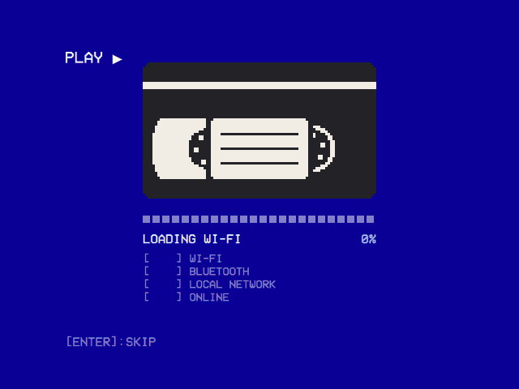

# 240-MP OS

A Raspberry Pi OS Lite (64-bit, Trixie) image that boots straight into 240-MP: flash it, plug the Pi into the TV, and the first thing on screen is the app. It is built with Raspberry Pi's own image builder, [pi-gen](https://github.com/RPi-Distro/pi-gen), so the kernel, firmware, Wi-Fi/Bluetooth drivers and the patched FFmpeg that mpv's Pi 4 HEVC decoding relies on are exactly Raspberry Pi OS's. This directory only adds one stage on top of Raspberry Pi OS Lite.



## What is different from a manual install

Compared with flashing Raspberry Pi OS Lite and running `scripts/install.sh` ([INSTALL.md](../INSTALL.md)):

- **The app comes first.** `240mp.service` starts as soon as the display driver is up (after `basic.target`), not after every other service (`multi-user.target`).
- **The rest waits for it.** Wi-Fi (NetworkManager), Bluetooth, mDNS (`avahi-daemon`) and, if enabled, SSH hold back until the app has drawn its first frame. Then they start one after another, in that order.
- **The boot screen.** While those services start, the app shows a pixel-art VHS cassette: its reels turn, and the tape winds off the left reel onto the right one as the progress bar fills, plus a line per service (`[ OK ] WI-FI`, …). It ends with a check that the network is actually online. The startup module opens once it is done, so modules that need the network find it ready. Keys do nothing while it is up.
- **A quiet boot.** There is no rainbow splash, no one-second firmware delay (`boot_delay=0`), no kernel text, logo or cursor on `tty1`, and no login prompt on `tty1`.
- **Less running.** The image has:
  - no apt, man-db, e2scrub or dpkg-backup timers (they wake the SD card at random times, mid-movie included);
  - no cron;
  - no Raspberry Pi Connect agent.

  cloud-init applies Raspberry Pi Imager's settings on the first boot and is then switched off, because otherwise its stages delay every boot.
- **The streaming modules' browser is included.** Chromium with Widevine and the `cage` kiosk compositor, for the Netflix and Prime Video modules, which open each service's own player full screen, and for YouTube's sign-in; `wtype` closes the browser cleanly when BACK is held. They add about 400 MB; build with `MP240_STREAMING=0` to leave them out.
- **YouTube works out of the box.** The image has yt-dlp and Deno, the JavaScript runtime yt-dlp needs to play YouTube's videos ([its EJS notes](https://github.com/yt-dlp/yt-dlp/wiki/EJS)).
  - yt-dlp is its latest nightly build, the channel its own README recommends: YouTube changes often, and a yt-dlp a few weeks old soon stops finding videos.
  - It lives in the app's data directory (`~/.local/share/240-MP/bin/yt-dlp`), where the app looks first, and replaces itself with the newest build two minutes after each boot and once a day (`240mp-yt-dlp-update.timer`). A check is one small request to GitHub. Without a connection within five minutes, it waits for the next run.
  - ffmpeg comes with them, for the Playlists module's offline playlists: above 360p YouTube sends a video's picture and sound apart, and ffmpeg puts a download back together.
  - They add about 90 MB; build with `MP240_YOUTUBE=0` to leave them out.
- **Films go on the card.** On the first boot the system keeps 8 GiB of the card, and the rest becomes a partition of its own in exFAT, labelled **240-MP**, which Windows and macOS open too. Local Files opens it, and offline playlists download into it. See [Films on the card](#films-on-the-card).
- **Stopping isn't powering off.** `systemctl stop` and `systemctl restart` leave the Pi on. Quit in the app still powers it off, Restart reboots it, and Exit to Terminal still drops to a login shell, as with `install.sh`.
- **Bluetooth from the app.** The user the app runs as is in the `bluetooth` group, so Settings → Bluetooth can search for and pair a keyboard, gamepad or remote through BlueZ.
  - Bluetooth is unblocked (`rfkill unblock bluetooth`) as bluetoothd starts, so the app's switch is the only one.
  - Raspberry Pi OS starts every radio blocked, so that Wi-Fi stays off until its country is set (`rfkill.default_state=0`), and then unblocks Bluetooth only on the adapters pi-gen knows by device path. The Pi 4 this was found on wasn't one of them: its adapter stayed blocked, and BlueZ couldn't turn it on.

Everything else (the launcher, in-app updates, Exit to Terminal, the data directory in `~/.local/share/240-MP`) is the same as a manual install. The launcher, stop helper and terminal unit are taken from `scripts/install.sh` at build time.

## Flashing

1. In Raspberry Pi Imager, choose **Use custom** and pick the `.img.xz` (take it out of the zip GitHub's artifact comes in first).
2. Raspberry Pi Imager 2 skips OS customisation for an image chosen with **Use custom**: it can't tell which kind the image takes. For Wi-Fi, a user, SSH, the locale and the keyboard, open the image through a local manifest instead, one that gives it `"init_format": "cloudinit-rpi"` ([Imager's notes on it](https://github.com/raspberrypi/rpi-imager/tree/main/doc/local_json)). Imager 1 seems to apply it, but on Trixie its settings never take effect. Without one, Wi-Fi can be set up by hand: before the first boot, add it to `network-config` on the boot partition, following the example in that file. With Ethernet there is nothing to do.
3. The image's own user is `pi` (or whatever `FIRST_USER_NAME` was at build time), and the app runs as that user. Logging in is only needed for Exit to Terminal or SSH:
   - If the image was built with a password (`FIRST_USER_PASS`), you can log in as `pi`. The OS image workflow takes it from the repository secret `OS_FIRST_USER_PASS`, if there is one.
   - If it was built without one, the `pi` account has no password to log in with. Exit to Terminal then logs `pi` in by itself: whoever is at the keyboard could take the card out anyway. That shell has no root, though: `sudo` asks for the password `pi` doesn't have. For `sudo`, build the image with a password. SSH needs a key (`PUBKEY_SSH_FIRST_USER`) or the user Imager's customisation creates.

### Films on the card

The first boot splits the card: the system keeps 8 GiB (`MP240_ROOT_SIZE`), and the rest becomes a partition of its own in exFAT, labelled **240-MP**. Windows and macOS open exFAT, so:

1. Quit 240-MP (it powers the Pi off) and take the card out.
2. In the computer's card reader the card shows up as two drives, **bootfs** and **240-MP**. Copy films onto **240-MP**, in folders if you like.
3. Windows also offers to format the system's partition, which it can't read. Always say no (**Cancel**): formatting it erases the system.
4. Put the card back in the Pi. Local Files opens **240-MP** (`/media/240-MP`) until its Media Directory setting names another folder.

The Pi writes to it too: the Playlists module downloads its offline playlists' videos into a **Playlists** folder there (its Download Folder setting can name another), each video once, flushed to the card as it completes. Switching the Pi off at the wall in the middle of a download can still leave the partition untidy, so it is checked (`fsck.exfat`) at every boot before it is mounted. Nothing on it can run (it is mounted `noexec`): it only ever holds media, and anyone with the card can write it. A card flashed with an earlier image mounts it read-only (`ro` in `/etc/fstab`), where offline playlists' downloads fail with the folder named as the reason: flash the new image, or change `ro` to `rw,noexec,nosuid,nodev` (and the last `0` to `2`) on the `/media/240-MP` line.

A card with less than 2 GiB to spare past the system gets no film partition, and the system takes all of it, as Raspberry Pi OS does. The split replaces Raspberry Pi OS's first-boot resize (`raspberrypi-sys-mods`' `resize_early`, overridden in `/etc/initramfs-tools/scripts`), so it happens once, on a freshly flashed card.

### HDMI or a CRT

The display output is set in `240mp-display.txt` on the boot partition (the FAT one any computer can open). To switch, copy one of the presets next to it over that file:

| Preset | Output |
|---|---|
| `240mp-display-hdmi.txt` | HDMI, resolution auto-detected (the default) |
| `240mp-display-crt-ntsc.txt` | Composite, NTSC, 4:3 |
| `240mp-display-crt-pal.txt` | Composite, PAL, 4:3 |

The rest of `config.txt` matches the settings [INSTALL.md](../INSTALL.md) documents, including the per-model drivers and overclocking.

## Building

The image needs a 240-MP arm64 tarball (`240-MP-<version>-linux-arm64.tar.gz`, as the release workflow builds it).

**On GitHub:**

1. Run the **OS image** workflow from the Actions tab (on a fork, enable Actions first). It builds the app from the chosen branch, then the image, on an arm64 runner. It also runs on pull requests that touch the image or the boot screen.
2. The image is the run's `240mp-os-image` artifact.

The run gives the `pi` user the repository secret `OS_FIRST_USER_PASS` as its password. Without that secret the account is locked.

The app in these images is built as `dev`, which turns its self-update off. That way a branch image can't swap itself for a release that doesn't have its changes.

**Locally:** with Docker on an arm64 Linux host (an x86 host works too, through QEMU emulation, but takes hours), run:

```bash
FIRST_USER_PASS='…' os/build.sh path/to/240-MP-<version>-linux-arm64.tar.gz
```

The image lands in `os/work/pi-gen/deploy/`. `os/build.sh` fetches pi-gen at a pinned commit of its `arm64` branch and builds stages 0–2 (Raspberry Pi OS Lite), then `stage-240mp`. Settings, all through the environment:

| Variable | Default | |
|---|---|---|
| `FIRST_USER_PASS` | — | Password of the first user. Without one, the account is locked. |
| `FIRST_USER_NAME` | `pi` | The first user; the app runs as this user. |
| `MP240_DISPLAY` | `hdmi` | Initial display preset: `hdmi`, `crt-ntsc` or `crt-pal`. |
| `MP240_STREAMING` | `1` | `0` leaves out the Netflix and Prime Video modules' browser (Chromium, Widevine, cage, wtype), which YouTube's sign-in uses too. |
| `MP240_YOUTUBE` | `1` | `0` leaves out the YouTube module's yt-dlp, Deno and ffmpeg; the module then says yt-dlp is missing. |
| `MP240_ROOT_SIZE` | `8` | GiB the system keeps of the card; the rest becomes the film partition on the first boot. `0`: no film partition, the system takes the whole card. |
| `ENABLE_SSH` | `0` | `1` enables SSH (it then also waits for the app, after mDNS). |
| `TARGET_HOSTNAME` | `240mp` | |
| `IMG_NAME` | `240mp-os` | |
| `WPA_COUNTRY`, `LOCALE_DEFAULT`, `KEYBOARD_KEYMAP`, `KEYBOARD_LAYOUT`, `TIMEZONE_DEFAULT`, `PUBKEY_SSH_FIRST_USER`, `PUBKEY_ONLY_SSH`, `DEPLOY_COMPRESSION` | pi-gen's | Passed through to pi-gen. |
| `MP240_NATIVE` | `0` | `1` runs pi-gen's `build.sh` directly (a Debian host, as root) instead of in Docker. |
| `MP240_PREPARE_ONLY` | `0` | `1` sets up the pi-gen tree and its config, then stops. |
| `PI_GEN_REF` | pinned | pi-gen commit to build from. |

## How the boot works

1. **Firmware.** It loads the kernel with no splash and no delay.
2. **Kernel.** It boots quietly and logs to `tty3`, so `tty1` stays black.
3. **systemd reaches `basic.target`.** `240mp.service` starts: `wait-for-display` holds it (at most five seconds) until the KMS driver has a display connector, then the launcher runs as in a manual install.
4. **The first frame is on screen.** The app writes `/run/240mp/ready` (`MP240_READY_FILE`).
5. **The held-back units start.** These are the ones listed in `/etc/240mp/boot-units`. Each has a `240mp-defer.conf` drop-in that runs `/usr/lib/240mp/wait-for-app` before it starts and orders it after the unit before it.
   - `wait-for-app` returns as soon as the ready file exists, or after 20 seconds whatever happens.
   - It returns at once when the app isn't starting this boot at all.
   - It is a wait, not an `After=240mp.service` ordering, on purpose: the worst a wait can cost is its timeout, while an ordering cycle with an early-boot unit could stall the whole boot.
6. **The boot screen follows them.** `BootProgress` (`src/boot/`) polls `systemctl` for the units in `MP240_BOOT_UNITS_FILE`. It closes once every one has settled (started, failed, or skipped because its condition failed), or after a minute. Keys don't close it.

Outside this image neither environment variable is set, so `BootProgress` does nothing and a normal install is unaffected. It also stays out of the way when the app restarts after the boot has finished.

`/etc/240mp/boot-units` lists `unit|LABEL` pairs. You can change a label there. To hold back another service, give it the same drop-in and add it to the list.

### Measuring

The app logs when its first frame appeared and when each service settled, relative to the app's start:

```bash
journalctl -b -u 240mp | grep '\[boot\]'
systemd-analyze critical-chain 240mp.service
systemd-analyze blame
```

## Notes

- An image built from a release tarball keeps in-app updates, which install releases from [anthonycaccese/240-mp](https://github.com/anthonycaccese/240-mp). A release without `BootProgress` still runs on this image. It just never writes the ready file, so the held-back services start after their 20-second timeout instead of right away.
